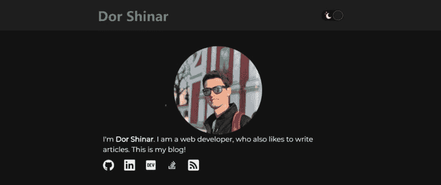
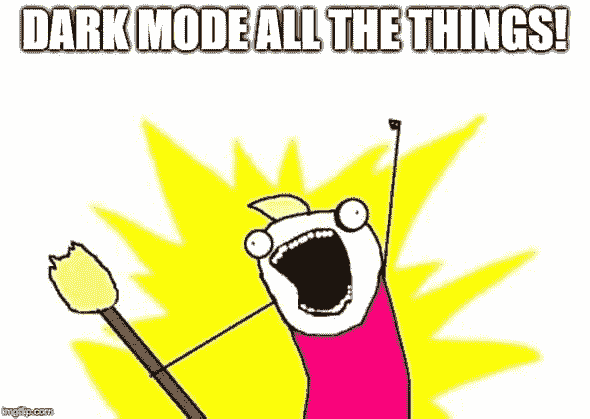
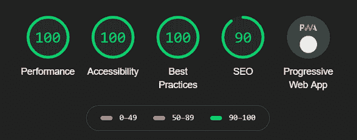

# 建立个人博客

> 原文：<https://dev.to/dorshinar/building-a-personal-blog-1kcd>

这一切都是从 2019 年初开始的。这是办公室里令人沮丧的一天，因为我正在努力让 ESLint 和 React 更好地与 React 和 Typescript 一起工作。在与它斗争了几个小时后，我决定写一篇关于它的文章。

随着时间的推移，我又写了几本书(尽管我想它们都没有第一本《初学者的运气》那么好)。我已经开始真正喜欢上写文章这个概念了。我开始更多地涉足科技文章的出版领域。很多流行词汇被抛到了空中——交叉发布、搜索引擎优化、规范链接等等。我注意到大多数发表文章的严肃的人都有自己的博客，他们通过博客分享(或者像行话一样交叉发布)到其他平台。

我在想-为什么我不能有一个？你可以说这真的不值得争论，因为我对自己打算写多少文章没有一个清晰的愿景，我当然没有时间每周写一次，但我认为这将是一个有趣的项目，我希望能从中学习一些东西。

提示——这就是最终结果: 

我在 web 开发方面有不错的经验，主要是在 [React](https://reactjs.org/) 方面，我想我可以在我的博客中利用它。大约在那个时候，我偶然发现了这个帖子:

 [## 你有自己的盖茨比网站吗？让我们集思广益，设计一个交叉海报

### Mike Bifulco 6 月 22 日 192 分钟阅读

#react #discuss #opensource #productivity](/irreverentmike/do-you-have-your-own-gatsby-site-let-s-brainstorm-a-dev-to-cross-poster-1g79)
where the author suggested using [Gatsby.js](https://www.gatsbyjs.org/) for such things. I’ve never worked with Gatsby before, and most of my experience in web development comes from the component age (quite a noob, I know), but after a quick look through the documentation (which is superb!) I figured it would be a perfect solution for my blog.

## 让我们建一个博客

我不打算解释每一个小的实现细节(这不是一个 Gatsby 教程)——主要是因为我觉得我能写的东西不会像官方文档那样清晰。

我从浏览盖茨比的[循序渐进教程](https://www.gatsbyjs.org/tutorial/)开始。在对这件事有了足够的了解之后，我决定直接投入进去。我用的是盖茨比为博客建的启动器([就在这里！](https://github.com/gatsbyjs/gatsby-starter-blog))，这给了我一个坚实的骨架。我知道我可以自己完成它，但我对 gatsby 没有足够的信心，所以我认为它是一个模板——就像用 [Create React App](https://facebook.github.io/create-react-app/) 启动的项目一样，我知道对于这些启动器是否是最好的方式有很大的争论，但这不是本文的范围。

### 生成一条基线

首先，我已经删除了一些我不需要的臃肿，并用我自己的文章和个人资料图片取而代之。我做的下一件事是格式化我的帖子。现在我使用了一个启动器(它依赖于良好的降价实践)，我发现我的文章不符合标准——例如——缺少副标题、描述等等。frontmatter 的整个观点对我来说都是全新的- [Medium](https://medium.com/) 和[dev to](https://dev.to/)在帮助你避免这种情况方面做了大量的工作。

我添加的另一件事是阅读时间测量(难道你不喜欢看到你阅读一篇文章需要多长时间的估计吗？).

#### 准备推送和部署

开个玩笑，显然它还没有完成(对于我这样的人来说，其他人在这个阶段可能会觉得满意)，但我真的没费什么力气就用我自己的数据使它非常实用。

还做了一些小的修改——我添加了指向我的 GitHub 和 Linkedin 个人资料的链接(后来又添加了一些)。我也已经开始写这篇文章了，因为我想把它写成一篇描述这个过程的博客文章，而不是一篇关于建立一个 gatsby 站点的技术文章。

我已经将所有的内联 CSS 转换成了[样式的组件](https://www.styled-components.com/)，因为我非常喜欢 SC 让你以一种适合你代码中每一个组件的方式编写语义 HTML。[ESLint](https://eslint.org/)+[pretty](https://prettier.io/)+[Husky](https://github.com/typicode/husky)+[Lint Staged](https://github.com/okonet/lint-staged)在这个阶段也是一个受欢迎的补充，因为它迫使我手动修复代码和样式错误。自定义滚动指示器和较短的后 URIs(或 slugs)是这一阶段的最后一项添加。

### CSS 微调 FTW

我的旅程继续进行许多小的调整，主要是围绕 CSS 和可见性——使用 google 字体、文章之间的换行符，以及将标题提取到新组件。没什么大不了的，但是这些调整帮助了我，让网站看起来稍微好了一点。

我是黑暗模式的超级粉丝。我的议程是“黑暗模式所有的事情！”，所以我自然不能让我的网站只有白色背景。我开始实现一个主题切换器(使用上下文和样式组件'`ThemeProvider`)。开始时，它只是一个简单的按钮来切换黑白背景，当我开始运行时，我为我的网站创建了一个完整的配色方案，包括浅色主题和深色主题。(喊出谷歌的[材质设计黑暗主题文档](https://material.io/design/color/dark-theme.html))。我所有的推荐图标都必须根据主题进行转换，所以这也发生了，我的主题也差不多完成了(它后来经历了一些小的色调调整，但无论如何)。

下一步是让我的网站在移动设备上看起来更好——因为我习惯于主要为桌面开发企业应用程序，所以我忘记了今天的大部分流量来自移动设备。W3C 的响应式网页设计-媒体查询教程

> 始终首先为移动设备设计

所以直到现在我都失败了，但我渴望改变这一切。使用谷歌 Chrome 令人敬畏的开发工具可以很容易地模拟不同尺寸和分辨率的不同设备，因此进行了更多的 CSS 调整。

为了让网站准备好上线，我添加了一个生成的 RSS 提要的链接(我使用的 starter 已经处理好了)。

### 就像你不在乎一样部署

现在我真的有信心把它上传到云端让全世界看到。知道一开始不会有流量，知道设置好之后可以实验，所以留了一些东西以后。我选择的云提供商是[现在的](https://zeit.co/now)，因为我看到了这个帖子:

 [## Heroku，Now.sh，Netlify。你在用什么，为什么？

### 丹尼尔·克鲁德森 7 月 24 日 191 分钟阅读

#javascript #node #cloud](/crumb1e/heroku-now-sh-netlify-what-are-you-using-and-why-14m4)
where quite a lot of people recommended it, so I figured I’d take a look at their offers. My blog is strictly a hobby, and I don’t plan on monetizing it, so I was looking for something with a free tier that would fit my needs, and after comparing the offerings of [Netlify](https://www.netlify.com) and Now, I’ve decided to go with Now.

用我的 Github 帐户设置它非常简单，一切都如我所料。我买了一个域名并在那里注册了，我要去参加比赛了。Now.sh 与 Github 集成得非常好，所以它在每次推送时都会重新部署，节省了我几次点击的时间，整体 UI 感觉非常直观，使我可以在不到一个小时的时间内启动并运行。

我不得不做的最后几件事是建立分析(对我来说也是第一次)，调整链接指向我华丽的新领域，并修复一些小的 a11y 东西(我不想阻止任何人阅读我的博客)，让我在灯塔测试中获得令人敬畏的分数(耶！).

现在，我的网站已经建立并运行，剩下的就是确保它出现在搜索结果中(规范的 URL 和所有这些)，并惊叹于近 2 个月的工作。这听起来很多，但我只有几个小时的时间来做这件事。如果我全职做，可能需要 2-3 周，甚至更短。

对我来说，这是一次真正的学习经历，来自企业背景(出于安全原因，我们在封闭的内部网中运行)。我尝试了一些很酷的东西，做了一些我觉得很棒的东西。现在我的计划是一有机会就继续写，这样会有更多的人接触到我的文章。

博客显然不完整。我想我会在不久的将来添加集成的评论机制，以及一些其他的东西，比如 github 上的编辑链接，但是现在我想说这已经足够好了。

感谢您的阅读！