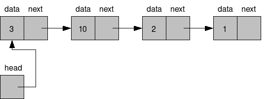
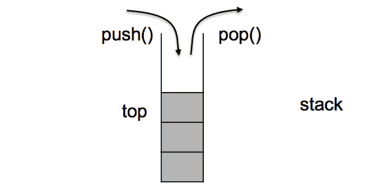
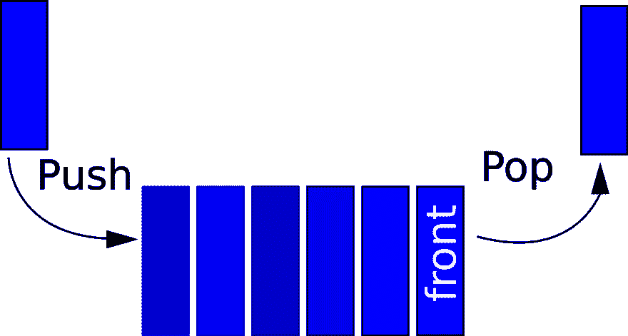
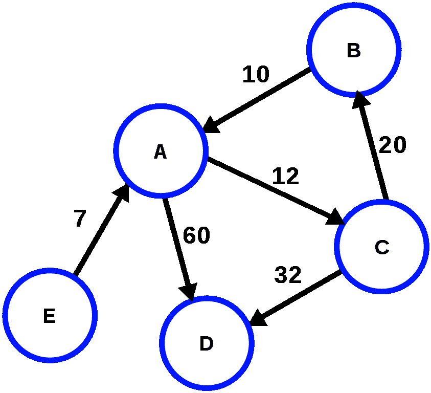
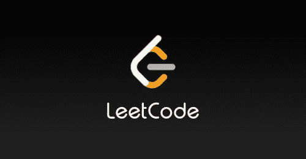

# 想在技术面试中胜出？竞争编程入门！

> 原文：<https://dev.to/adityarohilla94/want-to-ace-technical-interviews-get-started-with-competitive-programming-42ig>

如果你正在准备软件开发人员/工程师的工作，你必须准备好通过严格的技术面试。所有这些面试都需要良好的编程技能。

除了令人印象深刻的副业项目和相关经验，数据结构(DS)和算法设计与分析(ADA)的知识以及良好的解决问题的技能是你赢得面试的最重要的东西。

那么，你如何在这两方面都成为专家呢？

答案是竞技编程！那么什么是竞争性编程呢？

竞争性编程是一项脑力运动，通常在互联网或本地网络上进行，参与者试图根据提供的规范进行编程。参赛者被称为体育节目主持人。竞争性编程得到了几家跨国软件和互联网公司的认可和支持，比如谷歌和脸书——维基百科

它是这样工作的:在编程网站上，在一次练习过程中，你会得到一个你必须解决的编程问题。你可以用任何你熟悉的编程语言来编写你的解决方案。您的解决方案将由在线评委进行评判。此外，您的解决方案应该在特定的时间和空间限制下工作。

它应该通过所有的测试用例(给定的和隐藏的)才能被接受。在现场编码比赛中，一切都是一样的，除了提交解决方案也有时间限制。如前所述，许多大型科技公司，如脸书和谷歌，都是通过竞争性编程竞赛来招聘员工的。

潜水的另一个原因(如果你需要的话)是，它将真正帮助你提高解决问题的技能，这是每个领域都需要的，包括软件开发。

除此之外，竞争性编程(或算法编程)帮助你理解编程问题的复杂性和性能，从而给你一个更好的项目实施的想法。

当在开发的任何方面工作时，你总是必须做出关于手头问题的解决方案的选择。

*   选择哪个数据库？*   如何减少数据的存储容量？*   Which data structure will be best for decreasing the retrieval time?

    竞争性编程会让你更擅长做这样的决定。

    如何入门？

    ## 第一步:选择编程语言

    选择一种你最熟悉的编程语言。可以是 Python 这样的高级语言，也可以是 c 这样的中级语言。

    选择你至少有 3-4 个月经验的工作。我个人更喜欢 C++，因为我有多年用它编码的经验。

    如果你是编程新手，我会推荐 Python，因为它有简单的语法和预定义的库函数。点击查看 Python 教程[。](https://www.learnpython.org/)

    ## 第二步:了解时间和空间的复杂性

    大多数情况下，一个问题有不止一个解决方案。我们如何排列哪一个是最优解？

    在线评委根据他们的表现对他们进行排名。

    绩效通过以下方式衡量:

    *   时间复杂度*   Space complexity

    时间复杂度是指一个程序中所有操作的执行时间。计算机的所有操作都需要恒定的时间。执行时间还取决于硬件等外部因素，但这些因素被在线法官忽略了。

    执行时间分为三种情况:

    1.  最好的情况
    2.  一般情况
    3.  最坏情况

    最坏情况被认为是大多数时候判断代码性能的执行时间。
    让我们看一个简单的例子:

    int sum = 0；
    for(int I = 0；I<n；i++){
    sum+= I；
    }

    这段代码的时间复杂度是多少？
    在这种情况下，执行时间将是 for 循环完成所需的时间。如果其他操作花费的时间为常数 c。

    那么执行时间将取决于变量“n”，总执行时间将为:

    (c + n*c)

    如果 n 增加，总执行时间也会增加。我们用 Big-O (O)术语来判断时间复杂度。对于上面的代码片段，复杂度将是 O(n ),因为它完全取决于 n 的大小。

    空间复杂度和时间复杂度类似，也用来判断运行程序的性能。

    它是一个算法需要的工作存储(或内存)量的度量。在为特定问题选择数据结构时，空间复杂性起着很大的作用。

    与时间复杂性一样，我们最关心的是随着输入问题的大小 n 的增长，空间需求如何增长。

    int sum(int a[]，int n){
    int r = 0；
    for(int I = 0；I<n；++ I){
    r+= a[I]；
    }
    返回 r；
    }

    这段代码片段需要数组 a 的 n 个单位的空间和 r 的 1 个单位的空间，即 O(n + 1)等价于 O(n)
    查看这篇文章以了解更多关于空间复杂性的信息。

    ## 步骤 3:学习基本的数据结构和算法概念

    几乎每个编码问题都需要使用特定的数据结构或算法来获得最佳解决方案。

    在开始之前，了解基本的数据结构和算法技术是必须的。正如面试的数据结构演示中所列，这里有一个需要学习的数据结构列表。

    我将简要介绍以下内容:

    *   排列*   链接列表*   堆*   长队*   树*   特里*   Graph

    **数组**

    数组是一种数据结构，由元素(值或变量)的集合组成，每个元素至少由一个数组索引或键标识。

    int[] array = {1，3，5，2，6，9 }；

    *   指数:0 1 2 3 4 5
    *   数值:1 3 5 2 6 9

    最简单的数据结构是线性数组，也称为一维数组。数组元素可以是 int、long 或任何其他数据类型，具体取决于初始化。

    **链表**

    

    链表是由链接在一起的节点组成的数据结构。这些节点在内存中不是相邻存储的。相反，每个节点指向下一个节点。

    在最简单的形式下，每个节点由数据和对序列中下一个节点的引用(换句话说，链接)组成。这种结构允许在迭代期间从序列中的任何位置高效地插入或移除元素。

    链表的许多变体，如双向链表和循环链表，用于不同的问题。

    **堆栈**

    

    堆栈是一种线性数据结构，遵循后进先出(LIFO)原则。

    堆栈有两个主要操作:
    Push——向堆栈中添加元素
    Pull——从堆栈中移除元素

    **队列**

    

    像现实生活中的队列一样，队列数据结构也遵循 FIFO(先进先出)原则。前面是指队列的开始，后面是指队列的结束。

    在后面添加元素的过程称为入队，而从前面移除元素的过程称为出列。根据问题的不同，也可以使用不同的队列实现(除了线性单向队列),如循环队列、双端队列和优先级队列。

    **树**

    

    树是一种数据结构，它从根节点开始，然后递归地乘以子节点，没有子节点指向根节点。

    该树可以是有向的或无向的、加权的或未加权的，并且类似地，具有许多其他变化。对于编程竞赛，最常用的树变体是二叉树、二叉查找树、N 叉树、分段树、红黑树和堆。

    二叉树会在很多问题中用到。点击了解更多信息[。](https://www.geeksforgeeks.org/applications-of-tree-data-structure/)

    排序

    Trie(或基数树)是检索数据的有效树变体。使用它，搜索操作的时间复杂度可以降低到 O(n ),其中 n 是字符串的长度。点击此处了解更多关于 Trie 的信息。

    **图形**

    

    图由相互连接(部分或完全)的节点组成。这些节点之间的连接称为边或弧。

    图形可以是加权的、未加权的、无方向的、有方向的，并且可以采取许多其他形式。树也是一种图形。通过邻接矩阵的邻接表来实现。单击此处了解有关图表的更多信息。

    还有许多其他高级数据结构。点击这里查看完整列表。

    一些重要的算法方法:

    我们将在下面介绍一些重要的算法方法:

    *   整理*   动态规划*   贪婪的方法*   递归*   Divide and Conquer (D&C)

    **排序** —排序算法用于对线性数据结构的元素进行排序。基于不同时间和空间复杂度的排序算法有很多。冒泡排序、快速排序、合并排序是最著名的。

    **动态编程(DP)** —动态编程是一种解决复杂问题的方法，它将复杂问题分解为一系列更简单的子问题，每个子问题只解决一次，然后存储它们的解。

    动态编程在找到最佳选项之前会彻底检查所有选项。这是一种非常流行的算法技术，用于解决许多问题，例如:

    *   最长增长子序列*   盒子堆叠*   Building Bridges

    这也是求职面试者的最爱，在 Adobe、Google 和 Amazon 等公司都会被问到。查看本教程了解更多信息。

    **贪婪方法** —贪婪是一种算法范式，它在每个阶段选择一个局部最优的选择，而不是在最后选择时遍历所有选项(不像动态规划)。
    它可能不会在所有情况下都给出最佳解决方案。吉克斯特拉的算法是贪婪技术的一个流行例子。

    **递归** —当一个事物根据其自身或其类型被定义时，递归就发生了。斐波那契数列是递归的一个经典例子，其中函数调用自己，直到满足 n < 2 的基本条件。

    **分而治之(D & C)** —分而治之算法的工作方式是递归地将一个问题分解成两个或更多相同或相关类型的子问题，直到这些子问题变得足够简单，可以直接解决。

    然后将子问题的解决方案组合起来，给出原问题的解决方案。

    它类似于动态编程，但有一点不同:
    Divide and concurve 彻底检查所有选项(甚至重新计算之前计算的值)

    动态编程存储子问题的解，以避免重新计算。合并排序是 D&C 的一个例子。

    这只是一个让你开始的粗略列表。一路上你会学到更多。

    ## 步骤 4:参加在线编码挑战

    以下是一些最受欢迎的在线评委，你可以用它们来练习你的编程技能:

    **黑客排名**

    

    这是一个编程挑战网站，在这里你可以申请工作，也可以通过解决挑战来竞争招聘。该平台支持多种编程语言，包括 Java、C++、PHP 和 Python。此外，它还有数据结构和算法之外的实践领域，如 Regex 和 SQL。

    **项目欧拉**

    欧拉项目侧重于对编程和解决问题重要的数学概念。它有助于开发高级编程竞赛所需的计算技能。

    这些问题从基础到困难各不相同。以有趣的方式学习新概念真的很好。

    **LeetCode**

    

    Leetcode 是一个顶级的编程平台，支持多种编程语言(超过 32 种！).

    除了它的编码竞赛，它还因其涵盖各种主题的教程而闻名。它也是经验丰富的开发人员使用最多的平台。你会发现问题标签的主题和公司的智慧。我强烈推荐使用这个。

    **主厨**

    [Codechef](https://codechef.com/) 是 Directi 集团旗下知名的竞技编码平台。

    它的程序，如 Go for Gold，因激励程序员在 ACM 国际大学生编程竞赛中取得好成绩而闻名，ACM 国际大学生编程竞赛是一年一度的多层次竞争性编程竞赛。此外，它出色的编程教程和激烈的竞赛使它成为程序员的最爱。

    **SPOJ**

    [Sphere Online Judge (SPOJ)](https://spoj.com/) 与其他编码平台略有不同。这个平台上的问题用简单直接的语言陈述(因此也是我最喜欢的)，这使它成为初学者的好去处。

    任务由问题设置者社区准备，或者取自以前的编程竞赛。选择 SPOJ 的另一个重要因素是，除了英语，它还提供波兰语、葡萄牙语和越南语的内容。

    **Topcoder**

    最著名的(也是最好的！)世界上的编程网站， [Topcoder](https://topcoder.com/) 举办了一些世界上最好、最激烈的编程竞赛。

    它吸引了来自世界各地的著名编码员，包括流行的算法编码员 Petr Mitrichev。Topcoder 教程是花时间在这个平台上的另一个好理由。

    ## 第五步:练习，练习，再练习！

    没日没夜的练习。参加比赛。向有经验的编码员学习。你编写的代码越多，你就越能找到适合特定问题的数据结构和/或算法(这对软件开发来说是一项非常重要的技能)。

    *提示*:不参加比赛时，在白板上练习解决方案和不同的方法，同时大声思考。这将在求职面试中对你有所帮助。

    经过几个月的练习，你将能够在大多数公司的编程面试中胜出，并获得你梦想中的工作。

    ### 万事如意！