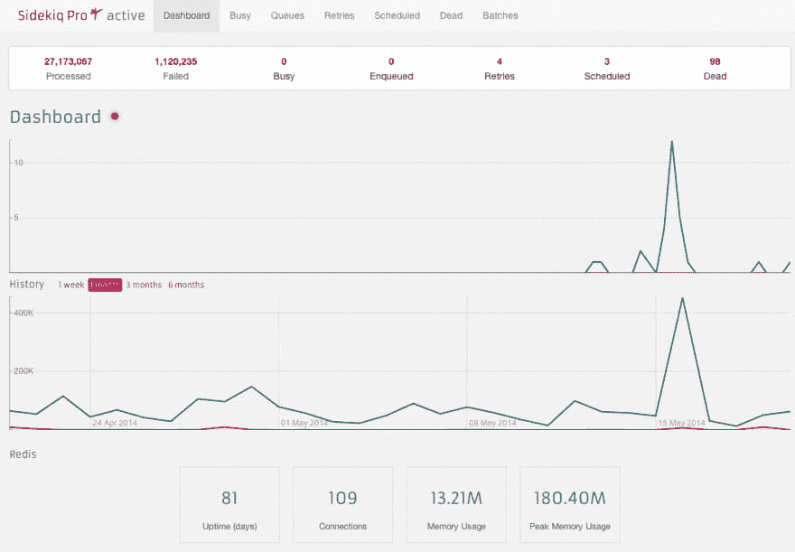

# 从 Resque 切换到 Sidekiq

> 原文：<https://dev.to/molly/switching-from-resque-to-sidekiq-3b04>

如果你在 Twitter 上关注我，那么你可能会发现我最近的一个项目是将我们在肯纳的所有后台处理工作从 [Resque](https://github.com/resque/resque) 迁移到 [Sidekiq](https://github.com/mperham/sidekiq) 。我不止一次被问到为什么我们选择这样做，所以我决定写一篇关于它的帖子！

# 1 年前

一年前，在 Kenna，我们的后台处理工作由 Sidekiq 和 Resque 分担。我们在 Resque 中有长期运行的作业，它可以在每次部署时处理滚动重启，因此我们不必担心长期运行的作业被终止。我们在 Sidekiq 中有快速、高质量的工作，因为它在处理小型、快速运行的工作时更好、更快。

然后 [Sidekiq Enterprise 1.7.0](https://github.com/mperham/sidekiq/blob/master/Ent-Changes.md#170) 发生了。Sidekiq Enterprise 1.7 于 2018 年 1 月发布，并支持引起我们注意的[滚动重启](https://github.com/mperham/sidekiq/wiki/Ent-Rolling-Restarts)。从那时起，我们开始考虑是否可以使用 Sidekiq 来处理我们所有的工作，而不仅仅是其中的一部分。

# 我们为什么要转行

### 提高了处理速度

Sidekiq 在排队和运行任务方面比 Resque 更快，因为它具有多线程的特性。

Resque 是一个基于进程的后台作业框架，这意味着它为它的每个工作进程启动一个应用程序代码的副本。这会消耗大量的内存资源，并且每次你必须启动一个新的进程时会非常慢。然而，Sidekiq 是基于线程的。这意味着 Sidekiq 将启动您的应用程序代码一次，然后使用多线程来处理多个作业。

我真的希望能够与您分享我们的作业现在运行的速度到底有多快，但是我还没有真正挖掘这些统计数据，因为一般来说，一切都“感觉”更快(我知道作为 SRE 来说这很可怕，但是有时知道这些数字并不值得花费额外的时间，因为您只是直觉地知道这样会更好)。我可以告诉你的是，我们的 75 个 Sidekiq 工作进程可以处理它们所有的原始作业，以及所有由 100 个 Resque 工作进程处理的作业。不用说，将所有东西都转移到 Sidekiq 为我们节省了一笔钱。

### 维护者和插件支持

Sidekiq 和它的插件比 Resque 更新更好维护。它们还针对更大的工作量进行了调整，在我们的用例中表现更好。我们不得不多次修补 Resque 插件，因为他们使用的 Redis 命令在规模上非常低效。

为了让你客观地看待这个问题，当我升级到 Resque 2.0 时，我发现我们正在使用的 4 个插件目前没有维护，只支持 Resque 1.2。如果我们坚持使用 Resque，我们将不得不自己派生并更新所有这些插件。

### 更好的特性

仅 Sidekiq Enterprise 就有许多我们必须包含多个 Resque 插件才能获得的功能。像可配置的重试逻辑这样简单的东西对我们来说是巨大的，Sidekiq 支持开箱即用。Sidekiq Enterprise 的另一个功能是[独特的工作](https://github.com/mperham/sidekiq/wiki/Ent-Unique-Jobs)。为了在 Resque 中实现这一点，我们必须安装一个非常强大的插件。

对我们来说，能够赋予队列优先/重要性，而不必为特定队列划分工作人员也很重要。我们经常有许多 Resque 工作人员整天无所事事，因为他们只能从一个通宵大量使用的队列中提取数据。

Sidekiq Enterprise 为我们赢得的另一个重大胜利是[定期工作](https://github.com/mperham/sidekiq/wiki/Ent-Periodic-Jobs)。要在 Resque 中调度作业，您必须安装另一个 gem，并且必须启动一个单独的进程来运行调度程序。Sidekiq 的调度程序运行在一个 worker 上，因此您的应用程序不需要跟踪另一个进程。

[批处理](https://github.com/mperham/sidekiq/wiki/Batches)是我们从 Sidekiq 获得的另一个功能，它允许我们处理一些更复杂的工作流程。为了在 Resque 中处理这些问题，我不骗你，我们运行了一些循环来低效地检查一个任务是否还在运行，并等待它结束。我们还有一些作业会一遍又一遍地重新排队，等待另一个作业完成。当我们进行切换时，删除所有这些睡眠语句和循环确实令人兴奋。

Sidekiq 插件也有一些我们在 Resque 或其任何插件中找不到的特性。队列平衡是我们在任何 Resque 插件中都找不到的特性之一。例如，由于 Resque 处理其队列的方式，我们在 Resque 中没有找到解决方案，因为它不能基于客户端 ID 等参数来限制所有作业。

### 仪表盘和命令行界面

为了给 Resque 提供一个好的仪表板，如果我们想知道为什么作业失败，我们必须包括像 resque-cleaner gem 这样的插件(还有一个插件没有维护)。开箱即用的 Sidekiq 有一个很棒的用户界面，可以很容易地浏览作业并解决浏览器中出现的问题。下面是用户界面的外观:

因为 Sidekiq API 是为处理 UI 而构建的，所以从 Rails 控制台与 Sidekiq 对话非常容易，并且比 Resque 更加健壮和高效。像从队列中删除特定的类这样的事情很容易。有了 Sidekiq Pro，你还可以[暂停队列](https://github.com/mperham/sidekiq/wiki/Pro-API#pausing-queues)，这在事情失控时会派上用场。

### 操作

我们的运营团队也全力以赴，从 Resque 转向 Sidekiq。Resque 没有内置的内存限制，这意味着当乔布斯失控时，他们会拖垮整个服务器。最终，我们的运营团队使用 [`systemd`](https://www.freedesktop.org/software/systemd/man/systemd.resource-control.html) 实现了资源限制，为处理这个问题的进程设置了内存限制。另一方面，Sidekiq Enterprise 让我们能够[限制每个进程的内存使用](https://github.com/mperham/sidekiq/wiki/Ent-Multi-Process#memory-monitoring),以确保它们都不会关闭我们的服务器。

### 客户支持

因为 Sidekiq 目前正在开发和维护中，当您遇到问题或疑问时，我们会非常快速地给予您支持和回复。由于 Resque 插件维护不佳或完全不活动，当你遇到问题时，你找到帮助的机会不大。

### 简朴

当你可以用一个工具完成所有你想做的事情时，为什么要有两个工具呢？鉴于 Sidekiq 现在可以满足我们的所有需求，并且由于上述原因，它可以更好地完成工作，因此整合似乎是理所当然的。这也意味着现在我们只有一个开发人员需要熟悉的后台处理工具，而不是两个。这可能看起来很小，但我无法告诉你有多少次我不得不解释 Sidekiq 和 Resque 之间的区别，并帮助人们找到工作。现在很简单，我们有一个框架，如果你想在后台处理一些事情，你可以在这个框架中工作。

这也极大地改善了我们运营团队的生活，因为他们不再需要跟踪多种不同类型的员工。在我们所有不同的环境中，我们少了一件需要部署和跟踪的事情。

# 制作开关

实际实现这一转变花了几个月的时间，因为我们是缓慢而有条不紊地进行的。我们分小组或一个接一个地将大约 50 份工作从 Resque 转移到 Sidekiq。大量使用的作业被给予一些时间来“烘烤”,以确保我们的队列在所有作业之间得到适当的平衡。当我们第一次在 Sidekiq 上运行时，我们有几个任务立即崩溃了。这迫使我们彻底检查这些作业使用内存的方式，最终，我们能够显著提高它们的性能。

决定从 Resque 转向 Sidekiq 是我作为 SRE 领导的第一个大项目之一。在项目开始的时候，老实说，我并不是 100%确定这对我们来说是不是一个正确的决定。我们已经如此习惯于 Resque，以至于改变它是一项巨大的事业。然而，随着我一个接一个地发布公关，将工作转移到 Sidekiq，我开始对这个决定感到非常满意。我发布的 90%的 PRs 都是净代码删除。代码的复杂性就在我眼前降低了。

当然，这种转变并非没有挑战。有时队列平衡不正确，我们需要备份作业。但是，即使当这些事件发生时，帮助我处理和修复它们的随叫随到的开发人员也一直在称赞 Sidekiq API 在 Rails 控制台上的使用是多么简单。

回顾这个决定和整个过程，我很高兴地说我们没有遗憾。就在几天前，我们不得不重新启动我们的一些私有云环境，运营部门大赞只需担心一种类型的员工有多好。对于任何在 Resque 上运行后台工作的人来说，希望这篇文章给了你一些思考的东西，你正在考虑改变你的框架。

一如既往，如果有人有任何问题，请告诉我！