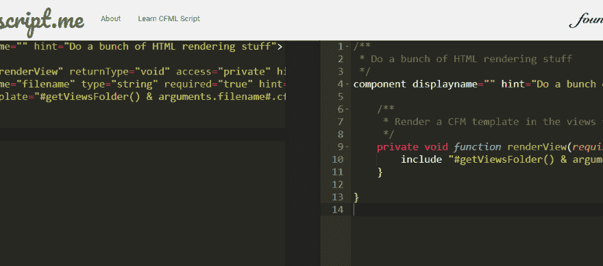

# 从标签切换到脚本

> 原文：<https://dev.to/mikeborn/switching-from-tag-to-script-1p2h>

# 从标签切换到脚本

看，我是用 CFScript 写的。我查找的大多数 CF devs 都是用 CFScript 编写的。但也许你不知道。这就是我让你相信 CFScript 值得一跳的地方，就此而言，只是*如何*跳到 CFScript。

## 为什么切换到 CFScript

你到底为什么要把你的应用程序转换成脚本语法？我能想到三个主要原因:

1.  脚本语法更加简洁，因此读写速度更快
2.  大多数 CF 开源包都是脚本语法，这使得找到有用的标记语法片段变得更加困难
3.  范式转变为逻辑和表示的适当分离

## 脚本语法更加精简

在标签语法中比较这个简单的 UDF:

```
<cffunction name="renderView" returnType="void" access="private" hint="Render a CFM template in the views folder.">
    <cfargument name="filename" type="string" required="true" hint="the name of the file to execute with NO .cfm on the end.">
    <cfinclude template="#getViewsFolder() & arguments.filename#.cfm">
</cffunction> 
```

vs .脚本语法:

```
/**
 * Render a CFM template in the views folder.
 * @filename the name of the file to execute with NO .cfm on the end.
*/
private void function renderView( required string filename ) {
    include "#getViewsFolder() & arguments.filename#.cfm";
} 
```

区别很明显:脚本语法更短、更清晰、更易读。我知道在某些情况下标签语法会更加清晰明了，但是...良好的...我想不出任何！

## 更多开源包和脚本语法片段

除了语法上的差异，脚本语法是当今大多数现代 CF 开发人员和开源软件包的首选。因此，如果你不知道脚本语法或者你的应用程序还在标签中，你就很难找到新的工具或代码片段。

## 范式转变:逻辑与呈现的分离

CF 一直被一个[“legacy of legacy”](https://michaelborn.me/entry/cf-a-legacy-of-legacy)所困扰，其中大部分与将查询、业务逻辑和 HTML(表示)嵌入到一个单一的。cfm 文件。这种糟糕的编程实践很大程度上取决于牛仔编码员的头脑，但我认为这种意大利面条般的混乱完全是由于 CFML 标签语法的存在而造成的。因为*看起来*像 HTML，开发人员倾向于将他们的查询、if 和循环*与*他们的 HTML 保留在一起，于是类似“剩菜锅”的编程范例诞生了。

今天，开发人员可以通过切换到 CFScript 来改变这种模式。用脚本语法编写迫使开发人员改变他们输出 HTML 的方式。相信我，这一周:

```
function renderEmail( string args ) {
    writeOutput(' <html>
        <head>
          <title>#args.title#</title>
        </head>
        <body>
        <ul> ');
    for( var person in args.people ) {
        writeOutput('#person.name# did something');
    }
    writeOutput('</ul></body></html>');
} 
```

您很快就会将 HTML 转储到一个`.cfm`文件中，并改为编写这个:

```
function renderEmail( string args ) {
    include "views/email.cfm";
} 
```

哒哒！你立刻就开始走上了正确的 MVC 之路。

## 转换为脚本

因此，如果你想“跳跃”一下，把你现有的应用程序转换成 CFscript，我会这么做:

1.  不要盲目地将所有东西转换成脚本语法，除非你有一个非常可靠的测试套件，并且你愿意打破常规。
2.  从转换 CFC 中的单个函数开始。在那里放一个大的 ole `<cfscript></cfscript>`,每次你编辑或重构一个函数时，简单地把它转换成脚本语法并放到脚本块中。你可以使用 cfscript.me(见下文)或者手工重写。
3.  不要把你的 HTML 模板转换成脚本！相反，用脚本语法将逻辑分离到一个单独的文件(最好是一个类)中。将所有 HTML 生成代码(在一个`.cfm`文件中)保留在标签语法中。
4.  一旦应用程序的大部分被转换，考虑使用 [cfscript.me 命令](https://www.forgebox.io/view/cfscriptme-command)将应用程序的其余部分转换为脚本语法。

### CFScript.me

CFScript.me 是一个很棒的工具，可以手动将单个文件和较小的代码片段从标签转换为脚本语法。

[](https://res.cloudinary.com/practicaldev/image/fetch/s--iJPAY9Dt--/c_limit%2Cf_auto%2Cfl_progressive%2Cq_auto%2Cw_880/https://thepracticaldev.s3.amazonaws.com/i/k20ucmcqsa2pwqzkm8k5.png)

CFSript.me 适用于较小的代码块，尽管它的功能并不完整(有许多未解决的问题[不支持标签语法](https://github.com/foundeo/toscript/issues))。

### CFScriptMe 命令

如果您有一个完整的项目需要转换成脚本语法，我会使用 [CFScriptMe](https://www.forgebox.io/view/cfscriptme-command) CLI 命令。**请**不要在没有(Git 备份和(2)测试套件来验证代码实际上*工作*的情况下运行这个。作为第三项健全性检查，在完成后使用 CFLint 对脚本语法进行 Lint。

```
box install cfscriptme-command
box cfscriptme <path> 
```

您可以对单个文件运行 cfscript me-command:

```
box cfscriptme cfc/myFile.cfc 
```

或整个文件夹:

```
box cfscriptme models 
```

## 结论

您没有**切换到 CFScript 的**。但是我**高度**推荐它，原因在这篇文章中概述。如果您在切换到 CFScript 时需要帮助，请联系我。如果你对这篇文章有其他想法，底部有一个评论表。感谢阅读！