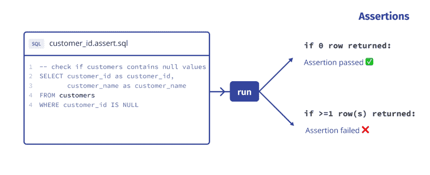
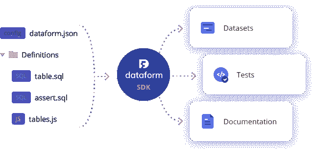

# 用 SQL 断言测试数据质量

> 原文：<https://dev.to/dataform/testing-data-quality-with-sql-assertions-248g>

对于任何数据分析团队来说，确保数据消费者能够使用他们的数据可靠地回答问题都是至关重要的。因此，对于这些团队来说，拥有一种跨数据集强制实施高数据质量的机制是一项关键要求。

通常，**输入数据源缺少行，包含重复项，或者只包含简单的无效数据**。随着时间的推移，对业务定义或产生输入数据的底层软件的更改会导致列的含义发生变化，甚至会导致表的整体结构发生变化。解决这些问题对于创建成功的数据团队和产生有价值的正确见解至关重要。

在本文中，我们将解释 SQL 数据断言的概念，了解一些常见的数据质量问题，如何检测它们，以及最重要的是如何以一种对所有数据消费者都适用的方式修复它们。

这篇文章中的 SQL 片段适用于 Google BigQuery，但可以很容易地移植到 Redshift、Postgres 或雪花数据仓库。

### 什么是数据断言？

**数据断言是在数据集**中寻找问题的查询。如果查询返回任何行，则断言失败。

<center>

</center>

数据断言是这样定义的，因为寻找问题要比没有问题容易得多。这也意味着断言查询本身可以用来快速检查导致断言失败的数据——这使得诊断和修复问题变得容易。

#### 检查字段值

让我们看一个简单的例子。

假设数据库中有一个包含客户信息的`database.customers`表。
我们可能希望对表格内容进行的一些检查包括:

*   字段`email_address`总是被设置
*   字段`customer_type`是`“business”`或`“individual”`中的一个

下面的简单查询将返回任何违反这些规则的行:

```
SELECT customer_id
FROM database.customers
WHERE  email_address IS NULL
OR NOT customer_type IN (“business”, “individual”) 
```

#### 检查唯一字段

我们可能还想对多行进行检查。例如，我们可能想要验证`customer_id`字段是唯一的。类似下面的查询将返回任何重复的`customer_id`值:

```
SELECT
    customer_id,
    SUM(1) AS count
FROM database.customers
GROUP BY 1
HAVING count > 1 
```

#### 将多个断言组合成一个查询

我们可以将上述所有内容合并到一个查询中，使用`UNION ALL` :
快速找到任何违反规则的`customer_id`值

```
SELECT customer_id, “missing_email” AS reason
FROM database.customers
WHERE email_address IS NULL

UNION ALL

SELECT customer_id, “invalid_customer_type” AS reason
WHERE not customer_type in (“business”, “individual”)
FROM database.customers

UNION ALL

SELECT customer_id, “duplicate_id” AS reason
FROM (
    SELECT customer_id, SUM(1) AS count
    FROM database.customers
    GROUP BY 1
)
WHERE count > 1 
```

我们现在有一个可以运行的查询来检测表中的任何问题，如果我们将来想要添加新的条件，我们可以很容易地添加另一个 unioned】语句。

### 创建干净数据集

现在我们已经发现了数据中的问题，我们需要清理它们。最终选择如何处理数据质量问题取决于您的业务用例。

在本例中，我们将:

*   删除任何缺少`email_address`字段的行
*   如果无效，设置默认客户类型
*   删除有重复`customer_id`字段的行，保留每个`customer_id`值的一行(我们不关心是哪一行)

**我们可以创建数据集**的新的干净副本，而不是直接编辑数据集——这使我们可以在未来自由地更改或添加规则，并避免删除任何数据。

下面的 SQL 查询定义了我们的`database.customers`表的视图，其中删除了无效的行，设置了默认的客户类型，并且删除了同一个`customer_id`的重复行:

```
SELECT
    customer_id,
    ANY_VALUE(email_address) AS email_address,
    ANY_VALUE(
        CASE customer_type
        WHEN “individual” THEN “individual”
        WHEN “business”   THEN “business”
        ELSE “unknown”
    END) AS customer_type
FROM database.customers
WHERE NOT email_address IS NULL
GROUP BY 1 
```

这个查询可以用来在我们的云数据仓库中创建一个视图或一个表，这个数据仓库可能叫做`database_clean.customers`，可以在仪表板中使用，或者由想要查询数据的分析师使用。

现在我们已经解决了这个问题，我们可以通过在新数据集上重新运行原始断言来检查上面的查询是否正确地解决了问题。

### 连续数据质量测试

断言应该作为任何数据管道的一部分运行，以确保突破性的变化在它们发生的时候被发现。

如果断言返回任何行，管道中的后续步骤要么失败，要么向数据所有者发送通知。

Dataform 内置了对数据断言的支持，并提供了一种将它们作为更大的 SQL 管道的一部分来运行的方式。

这些可以以任何频率运行，如果断言失败，将会发送电子邮件通知您问题。Dataform 还提供了一种在数据仓库中轻松创建新数据集的方法，使得清理和测试数据的过程变得非常简单。

<center>

</center>

有关如何开始用 Dataform 编写数据断言的更多信息，请查看 Dataform 的[开源框架](https://docs.dataform.co/)的[断言文档](https://docs.dataform.co/guides/assertions?utm_medium=organic&utm_source=dev_to&utm_campaign=sql_assertions)指南，或者[免费创建一个帐户](https://dataform.co/signup?utm_medium=organic&utm_source=dev_to&utm_campaign=sql_assertions)并开始使用 Dataform 的完全托管 Web 平台。