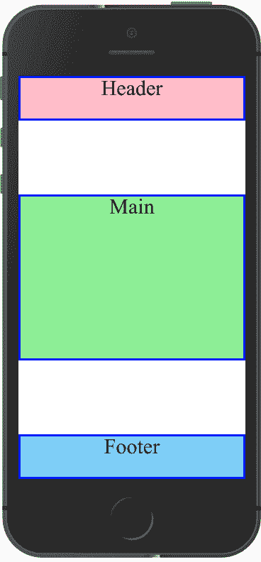
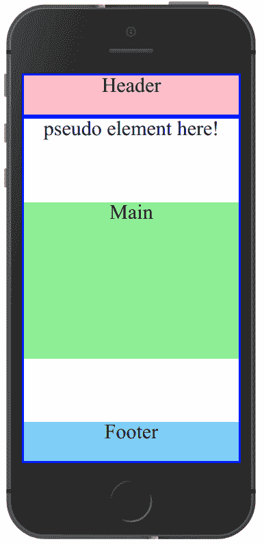
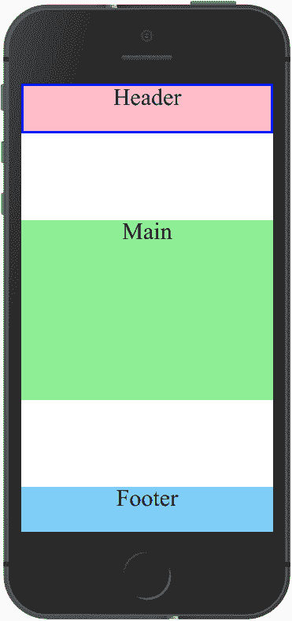
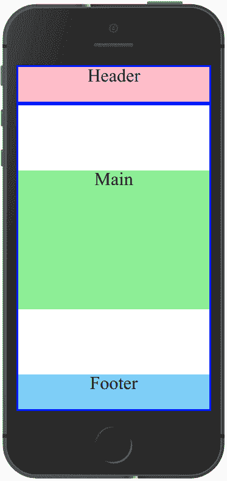

# CSS 布局:使用包装组件的框架

> 原文：<https://dev.to/bcalou/css-layout-get-around-frameworks-wrapping-your-components-2hgm>

他们说 CSS 很难。但是你有没有尝试过在使用一个会弄乱你的 DOM 的框架的时候使用 CSS 呢？因为那才是真正的乐趣所在。

## 问题

所以我在做一个简单的移动界面:页眉、内容、页脚。页眉和页脚有固定的大小，我希望内容放在剩余空间的中心。

> “啊，flexbox，我亲爱的老朋友，我们又见面了！” <cite>―我自己(不完全是，只是为了讲故事)</cite>

所以我想出了这个简单的实现:

```
<body>
  <header></header>
  <main></main>
  <footer></footer>
</body> 
```

```
body {
  display: flex;
  flex-direction: column;
  justify-content: space-between;
} 
```

<figure>

[](https://res.cloudinary.com/practicaldev/image/fetch/s--twz0nQGu--/c_limit%2Cf_auto%2Cfl_progressive%2Cq_auto%2Cw_880/https://thepracticaldev.s3.amazonaws.com/i/e29aq9rtgh3ddxv4qzvr.png)

<figcaption>Each direct descendent of the body has a blue border. So far so good.</figcaption>

</figure>

所以我很高兴，就像任何前端开发人员在事情进展顺利时一样。

但是随着应用程序的增长，我意识到由于应用程序固有的结构原因，我需要将`main`和`footer`元素包装在一个角度组件中。

这就是我漂亮的页面崩溃的时候，通过查看考虑到我的新组件而生成的标记，您就会明白为什么了:

```
<body>
  <header></header>
  <my-component>
    <main></main>
    <footer></footer>
  </my-component>
</body> 
```

唉！Flexbox 不关心任何人，除了它自己的直接孩子，现在是`header`和`my-component`。

<figure>

[](https://res.cloudinary.com/practicaldev/image/fetch/s--DTDF6gf2--/c_limit%2Cf_auto%2Cfl_progressive%2Cq_auto%2Cw_880/https://thepracticaldev.s3.amazonaws.com/i/5i24mnc7iot8fmlzgfx1.png)

<figcaption>Look at the blue borders: the body now has only two direct children.</figcaption>

</figure>

我的第一个想法是让我的组件本身成为一个 flex 容器，但是这个想法我没有走多远。

```
my-component {
  flex-grow: 1;
  display: flex;
  flex-direction: column;
  justify-content: space-between;
} 
```

<figure>

[](https://res.cloudinary.com/practicaldev/image/fetch/s--R-xsZW1F--/c_limit%2Cf_auto%2Cfl_progressive%2Cq_auto%2Cw_880/https://thepracticaldev.s3.amazonaws.com/i/cfai6f431uj6hv2fmscj.png)

<figcaption>my-component is a flex container itself, with "justify-content: space-between". But of course that doesn't make the `main` bloc vertically centered.</figcaption>

</figure>

现在，花点时间:你会怎么做？

## 肮脏的方式

我知道你没有花一点时间马上读这封信。没事的。

写这篇文章之前我没有想到的一个方法是给`my-container` :
添加一个伪元素

```
my-component::before {
  content: '';
} 
```

`my-container`现在有三个子元素:伪元素`before`、T2 集团和 T3 集团。

你可以在这里看到它的作用[！](https://codepen.io/bcalou/pen/GaJyXZ)

<figure>

[](https://res.cloudinary.com/practicaldev/image/fetch/s--C-XG0sfa--/c_limit%2Cf_auto%2Cfl_progressive%2Cq_auto%2Cw_880/https://thepracticaldev.s3.amazonaws.com/i/ifkhjrc7p5kve913m15u.png)

<figcaption>Just set the pseudo element's content to an empty string instead, and voilà!</figcaption>

</figure>

就是这样！有时候，像这样的肮脏的修复是如此简单，以至于它变得相当有吸引力…

## 一个清洁工道

但是添加一个伪元素来欺骗 flexbox 系统感觉不是很干净。

几周前，我读了 Rachel Andrews 的一篇很棒的文章:[挖掘显示属性:盒子一代](https://www.smashingmagazine.com/2019/05/display-box-generation/)。

在阅读关于`display: contents`地产的文章时，我有两个矛盾的想法:

*   “嗯，这很有趣”
*   “是啊，但永远不会使用它”

但是在解决我的布局问题时，我又想了想。来自文章:

> 值 display: contents 将以与 display: none 相同的方式从框树中删除它所应用到的框，但将子项留在原处

换句话说，这将导致类似于(在我们的例子中*)注释掉元素(而不是其子元素)的情况:

```
<body>
  <header></header>
  <!-- <my-component> -->
    <main></main>
    <footer></footer>
  <!-- </my-component> -->
</body> 
```

你实际上是这样做的:

```
my-component {
  display: contents;
} 
```

*实际上，应用于`my-component`的 CSS 属性仍然会影响其子级(`font-size`、`color`...).所以不完全像注释掉元素，但是你明白了。

那么…这是否意味着 flexbox-wise、`main`和`footer`再次成为 body 的直接子体？是啊！`my-component`不再需要一个 flex 容器本身。应用于`body`的`justify-content: space-between`现在又可以工作了。

这是本文给出的最短的解决方案:一个选择器和一个属性。[近乎神奇的](https://codepen.io/bcalou/pen/xNJVWG)。

<figure>

[](https://res.cloudinary.com/practicaldev/image/fetch/s--brNWxvpF--/c_limit%2Cf_auto%2Cfl_progressive%2Cq_auto%2Cw_880/https://thepracticaldev.s3.amazonaws.com/i/1ozaauzxfmq8zdxjioay.png)

<figcaption>The blue border wrapping my-component disappeared: indeed, the box is not rendered anymore, so box properties (margin, padding, border…) are not rendered either.</figcaption>

</figure>

虽然我喜欢这个解决方案的简洁，但它也有缺点。

`display: contents`可能存在**可访问性**问题，因为它从可访问性树中隐藏了元素。如果为了实现某种布局而在一个`ul`元素上使用它，那么这是一个列表的信息将在许多浏览器中丢失。

不过在我们的例子中这不是问题，因为`my-component`没有特定的语义含义。但是人们可能会担心浏览器支持 T2，这是一个灰色区域，我称之为“meh”区域。

## 清洁工清洁工的方式？

进入`margin: auto`技术。

在写这篇文章的时候，我想起了另一篇文章，这是我读过的关于这个主题的最棒的文章之一: [Flexbox 的最佳秘密](https://hackernoon.com/flexbox-s-best-kept-secret-bd3d892826b6)，作者 Sam Provenza。这是 2015 年的，从那以后我无数次使用这个“秘密”。

4 年后，我不确定这是一个众所周知的事实。但是你可以使用`margin-left: auto`，例如，为了尽可能向右“推”一个 flexbox 项目。

<figure>

[https://codepen.io/samserif/embed/GpwyOg?height=600&default-tab=result&embed-version=2](https://codepen.io/samserif/embed/GpwyOg?height=600&default-tab=result&embed-version=2)

<figcaption>A pen that saved me many headaches. The price element has its margin-left set to auto.</figcaption>

</figure>

那超级有用！使用这种技术，您可以在任何方向(水平或垂直)推动伸缩项。

但是这篇文章有一部分我已经忘记了:

> 如果不指定方向，只需应用 margin: auto，flex 项将在自身两侧平均分配任何额外的空间

所以“秘密”也适用于多页边空白。

这就是我们问题的完美解决方案:再次将`my-component`变成 flex 容器，并在`main`元素上使用`margin: auto 0`。

```
my-component {
  flex-grow: 1;
  display: flex;
  flex-direction: column;
  justify-content: space-between;
}

main {
  margin: auto 0; 
} 
```

<figure>

[](https://res.cloudinary.com/practicaldev/image/fetch/s--LH9P-bbL--/c_limit%2Cf_auto%2Cfl_progressive%2Cq_auto%2Cw_880/https://thepracticaldev.s3.amazonaws.com/i/vy32ob6se2idyw64ewn4.png)

<figcaption>The empty space is evenly distributed between the margin-top and the margin-bottom of the main element.</figcaption>

</figure>

看这里！

没有神奇的伪元素。更少的可访问性和兼容性风险。美好而荣耀的 flexpower。

垂直居中的旅程从未停止。