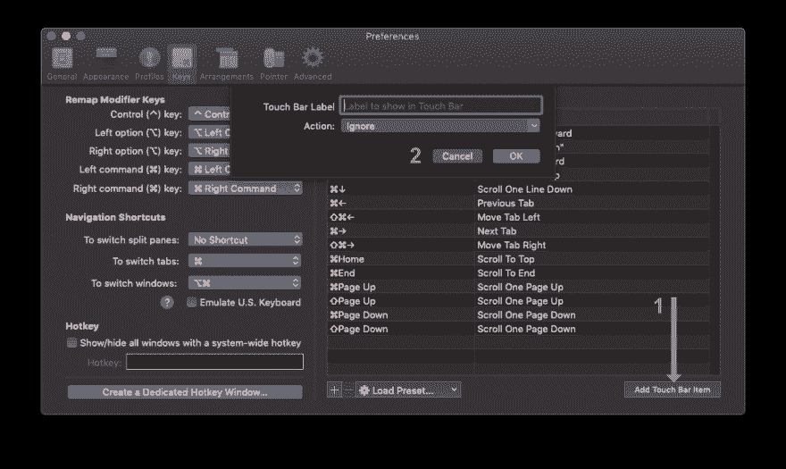

# 使用 iTerm2 充分利用 Macbook Touchbar。

> 原文：<https://dev.to/yoanmalie/get-the-best-out-of-the-macbook-touchbar-with-iterm2-1001>

Macbook 上的 Touchbar 很棒。我使用它是因为它给了我一些有用的快捷方式，我可以根据应用程序来配置它。

我们希望有一天，我们能够轻松地用我们自己的按钮制作一个完全定制的 Touchbar。但不幸的是，我不认为这个功能是计划中的(继续希望🤞).

因此，在本文中，让我们看看在 iTerm2 中可以做些什么来获得更好的 Touchbar 体验。

起初，我只是试图做一些简单的快捷按钮来启动 Git 或 NPM 命令。
所以在`iTerm2` > `Preferences…` > `Keys`中，右下角有一个按钮为`Add Touch Bar Item`。这将打开一个小弹出窗口。
[T8】](https://res.cloudinary.com/practicaldev/image/fetch/s--2K84706k--/c_limit%2Cf_auto%2Cfl_progressive%2Cq_auto%2Cw_880/https://thepracticaldev.s3.amazonaws.com/i/10t8a5jbamuxnrmmt6hq.png)

在 Touchbar 中输入你想要的按钮标签，你可以添加一个带有`⌘ Command` + `^ Control` + `Space`的表情符号。
对于操作，向下滚动并选择“发送文本”选项。你现在可以输入你的命令了，你必须添加一个结尾的`\n`来告诉 iTerm 在发送命令后回到新的一行，这将避免你的主题看起来有些怪异。
对于一个简单的`git status`，动作应该是`git status\n`。

重复此步骤，根据需要创建任意多个按钮。

现在，我们需要将它们添加到 Touchbar 中，只需转到`View` > `Customize Touch Bar`并将按钮拖放到 Touchbar 中。
如果你看不到它们，你可能需要退出并重新加载 iTerm。

就在那里！
 
很酷吧😎？