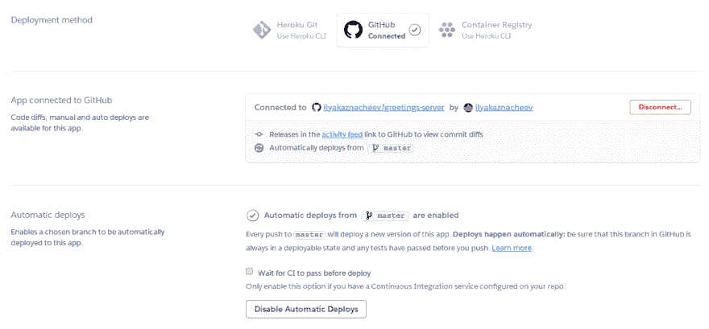
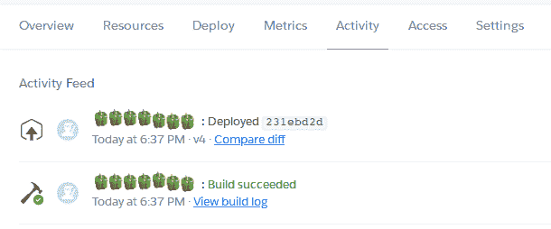

# 设置、构建、自动化:将 dockerized 应用程序快速部署到 Heroku！

> 原文：<https://dev.to/ilyakaznacheev/setup-build-automate-deploy-a-dockerized-app-to-heroku-fast-167>

Heroku 是一个美丽的服务。虽然它不支持 Kubernetes，也没有提供如此丰富的云基础设施选项，但它仍然通过托管小型应用程序(甚至是免费的)做得很好。

但是远程云配置可能是痛苦的。在出问题之前，这很容易，也很好。钻研手册和文档，花几个小时去理解事物是如何工作的等等都是可以的。你毕竟是开发商。

但有时你不想知道。你只是想部署你的嘶嘶作响的区块链服务，并让它活起来。您可能不想在配置和故障排除上花费时间，不想建立大量适合云环境的构建依赖关系。您只是想让一些奇迹发生，并在您的服务响应中获得一个`200`状态代码。那么，让我告诉你如何快速做到这一点。

## 申请

不是关于你要部署的应用，而是比如说，假设它将是一个用 Go ( `server.go`)编写的简单的 greetings 服务器。

```
 package main

import (
    "fmt"
    "net/http"
    "os"
)

func main() {
    // setup port
    port := os.Getenv("PORT")
    if port == "" {
        port = "8000"
    }
    // handle home page requests
    http.HandleFunc("/", func(w http.ResponseWriter, _ *http.Request) {
        fmt.Fprint(w, "Hi internet rando!")
    })
    // serve
    err := http.ListenAndServe(":"+port, nil)
    if err != nil {
        fmt.Println(err)
        os.Exit(2)
    }
} 
```

<svg width="20px" height="20px" viewBox="0 0 24 24" class="highlight-action crayons-icon highlight-action--fullscreen-on"><title>Enter fullscreen mode</title></svg> <svg width="20px" height="20px" viewBox="0 0 24 24" class="highlight-action crayons-icon highlight-action--fullscreen-off"><title>Exit fullscreen mode</title></svg>

它只是开始在`$PORT`环境变量中指定的端口或默认的 8000 上提供简单的问候。注意，Heroku [将为您](https://devcenter.heroku.com/articles/runtime-principles#web-servers)提供一个服务端口来绑定到`$PORT`环境变量。

> **注意:**如果你将选择 go，不要忘记用`go mod init <module_name>`初始化一个 Go 模块，否则你将不得不在 Docker 中为`GOPATH`设置一个构建环境。

那就是，我们来建吧。

## 容器

在当今程序员的世界里，容器化是一件非常好的事情。你不想再依赖任何基础设施环境，当你试图在异国他乡运行你的脚本时，不必感到痛苦。您可以一次设置好一切，然后部署到任何地方。

在托管平台上没有一个合适的语言版本——没什么大不了的，只需要一个合适的 Docker 镜像。

害怕在未知环境中运行部署——不要害怕，只需在您的容器中配置您需要的一切。

即使你不想把应用程序放在一个巨大的操作系统包装器中，你也可以使用多阶段构建，比如在 Debian 中构建，在 Alpine 中运行，等等。

所以，让我们配置容器(`Dockerfile` ):

```
FROM golang:1.12-alpine

WORKDIR /opt/code/

ADD ./ /opt/code/

RUN go build -o greetings server.go

ENTRYPOINT ["./greetings"] 
```

<svg width="20px" height="20px" viewBox="0 0 24 24" class="highlight-action crayons-icon highlight-action--fullscreen-on"><title>Enter fullscreen mode</title></svg> <svg width="20px" height="20px" viewBox="0 0 24 24" class="highlight-action crayons-icon highlight-action--fullscreen-off"><title>Exit fullscreen mode</title></svg>

它将构建应用程序，并在您启动容器时运行它。

## 部署

要部署到 Heroku，您需要配置部署(`heroku.yml` ):

```
build:
  docker:
    web: Dockerfile 
```

<svg width="20px" height="20px" viewBox="0 0 24 24" class="highlight-action crayons-icon highlight-action--fullscreen-on"><title>Enter fullscreen mode</title></svg> <svg width="20px" height="20px" viewBox="0 0 24 24" class="highlight-action crayons-icon highlight-action--fullscreen-off"><title>Exit fullscreen mode</title></svg>

假设您已经创建了一个 Heroku 应用程序，我们将部署它。最简单的方法是使用 CLI 直接部署。

### 手动部署

首先安装 [Heroku CLI](https://devcenter.heroku.com/articles/heroku-cli#download-and-install) 并登录:

```
heroku login 
```

<svg width="20px" height="20px" viewBox="0 0 24 24" class="highlight-action crayons-icon highlight-action--fullscreen-on"><title>Enter fullscreen mode</title></svg> <svg width="20px" height="20px" viewBox="0 0 24 24" class="highlight-action crayons-icon highlight-action--fullscreen-off"><title>Exit fullscreen mode</title></svg>

然后您需要将 Heroku remote 添加到您的 Git repo 中。如果您还没有 Git repo，请创建它:

```
git init 
```

<svg width="20px" height="20px" viewBox="0 0 24 24" class="highlight-action crayons-icon highlight-action--fullscreen-on"><title>Enter fullscreen mode</title></svg> <svg width="20px" height="20px" viewBox="0 0 24 24" class="highlight-action crayons-icon highlight-action--fullscreen-off"><title>Exit fullscreen mode</title></svg>

然后设置 Heroku:

```
# greetings-server-example is my app name. Please use yours 
heroku git:remote -a greetings-server-example 
```

<svg width="20px" height="20px" viewBox="0 0 24 24" class="highlight-action crayons-icon highlight-action--fullscreen-on"><title>Enter fullscreen mode</title></svg> <svg width="20px" height="20px" viewBox="0 0 24 24" class="highlight-action crayons-icon highlight-action--fullscreen-off"><title>Exit fullscreen mode</title></svg>

然后提交更改并将它们推送到 Heroku:

```
git add --all 
git commit -m "initial commit"
git push heroku master 
```

<svg width="20px" height="20px" viewBox="0 0 24 24" class="highlight-action crayons-icon highlight-action--fullscreen-on"><title>Enter fullscreen mode</title></svg> <svg width="20px" height="20px" viewBox="0 0 24 24" class="highlight-action crayons-icon highlight-action--fullscreen-off"><title>Exit fullscreen mode</title></svg>

现在您将看到部署日志。如果成功，您可以使用
调用服务

```
heroku open 
```

<svg width="20px" height="20px" viewBox="0 0 24 24" class="highlight-action crayons-icon highlight-action--fullscreen-on"><title>Enter fullscreen mode</title></svg> <svg width="20px" height="20px" viewBox="0 0 24 24" class="highlight-action crayons-icon highlight-action--fullscreen-off"><title>Exit fullscreen mode</title></svg>

这将在浏览器中打开您的服务。在那里你会看到:

> 嗨，互联网，兰多！

### 使用 GitHub 自动部署

您可以进一步自动化这个过程。比方说，你在 GitHub 上托管代码。因此，您可以将 Heroku 应用程序连接到您的 GitHub repo，并在每次向主分支推送内容时自动部署。

打开 Heroku Dashboard 并转到“部署”。点击“部署方法”下的 GitHub。进入连接到 GitHub 的应用程序，选择您的回购，然后按“连接”。然后转到“自动部署”并按“启用自动部署”。默认情况下，您将连接到主分支，但您可以更改它。

[](https://res.cloudinary.com/practicaldev/image/fetch/s--Yvh7Dn81--/c_limit%2Cf_auto%2Cfl_progressive%2Cq_auto%2Cw_880/https://thepracticaldev.s3.amazonaws.com/i/klil3ku1e2hcgl766qqr.png)

现在你完成了。另外，如果你在 GitHub 上使用 CI，你可以设置一个复选框“在部署前等待 CI 通过”。

推入 GitHub master 后，您会在“环境”选项卡上看到一个新的部署:

[](https://res.cloudinary.com/practicaldev/image/fetch/s--GEvrCcNN--/c_limit%2Cf_auto%2Cfl_progressive%2Cq_auto%2Cw_880/https://thepracticaldev.s3.amazonaws.com/i/ftezsfunkjfe6gh6kdb3.png)

您可以在 Heroku dashboard 的“Activity”选项卡中查看部署日志。

[](https://res.cloudinary.com/practicaldev/image/fetch/s--_Rr-nZoQ--/c_limit%2Cf_auto%2Cfl_progressive%2Cq_auto%2Cw_880/https://thepracticaldev.s3.amazonaws.com/i/b3399etjdwmjwiwdavm6.png)

享受快速部署的乐趣！