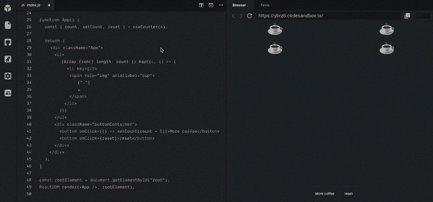

# 用 React 钩子简化状态初始化器

> 原文：<https://dev.to/bnevilleoneill/simplifying-state-initializers-with-react-hooks-5g49>

[](https://res.cloudinary.com/practicaldev/image/fetch/s--NpMMREUW--/c_limit%2Cf_auto%2Cfl_progressive%2Cq_auto%2Cw_880/https://thepracticaldev.s3.amazonaws.com/i/80ptnflz0bo8ordlmzxc.jpg)

随着钩子的出现，在组件之间共享逻辑的首选方式是通过可重用的定制钩子。要创建真正可重用的定制挂钩，您应该采用久经考验的高级 React 组件模式。其中一种模式叫做状态初始化模式。

什么是状态初始化器模式？它是如何工作的？为什么重要，更重要的是，模式是如何用钩子实现的？我希望在这篇文章中为这些问题提供答案。

如果你对用钩子实现每一个高级的 React 模式感兴趣，你应该去看看我的书，“重新引入 React”我仔细而详细地讨论了这个问题。

请注意，文章的以下部分假设[在钩子](https://medium.com/free-code-camp/learn-the-basics-of-react-hooks-in-10-minutes-b2898287fe5d)上基本流畅。

## [T4】](https://logrocket.com/signup/)

## 初始化状态是什么意思？

一般来说，初始化意味着设置某物的值。根据这个定义，状态初始化器模式的存在是为了让定制钩子的消费者能够更容易地设置“状态值”

注意，状态初始化模式并不每次都完全控制状态的设置值；它主要允许在您的自定义钩子中设置初始状态，并将状态重置为初始默认值。

虽然这并不等同于在自定义钩子中完全控制状态值的设置，但是它提供了很大的好处，您很快就会看到。

## 演示应用程序

我将务实地讨论这个主题，所以这是我们将使用的[演示应用程序](https://codesandbox.io/s/stateinitializer-g5kuu)。

这有点做作，但我保证这不会影响对带钩子的状态初始化模式的理解。

[](https://res.cloudinary.com/practicaldev/image/fetch/s--h-kgyO20--/c_limit%2Cf_auto%2Cfl_progressive%2Cq_66%2Cw_880/https://i0.wp.com/blog.logrocket.com/wp-content/uploads/2019/06/state-initializer-demo-app.gif%3Fssl%3D1)

我们这里有一个美化了的计数器应用程序。你点击**更多咖啡**按钮，咖啡杯的数量增加。

主要的`App`组件利用一个定制的钩子来管理咖啡杯的数量。下面是自定义钩子的实现，`useCounter`，看起来像:

```
// the App uses this custom hook to track the count of coffee cups 

function useCounter() {
  const [count, setCount] = useState(1);

  return {
    count,
    setCount
  };
} 
```

Enter fullscreen mode Exit fullscreen mode

上面自定义钩子的一个更谨慎的实现是记忆自定义钩子返回的对象值。

```
// good 
return {
   count,
   setCount
};

// better 
return useMemo(() => ({
  count, 
  setCount 
})) 
```

Enter fullscreen mode Exit fullscreen mode

我们继续吧。

## 向一个 5 岁的孩子解释状态初始化模式

就我所知，每个人都是从婴儿开始生命的。几年后，它们会长大成人，直到变老。

用“反应性”的术语来说，人类最初的状态是婴儿。此状态是预定义的，无法更改；没有人是作为一个没有童年的成年人来到这个世界的。

考虑到可重用的定制钩子，这将是一个有严重缺陷的设计。你的可重用定制钩子的初始状态不应该是一成不变的。您应该让您的可重用定制钩子的消费者能够决定钩子的初始状态。

有趣的是，设置自定义可重用钩子的初始状态并不是状态初始化器模式提出的唯一要求。

考虑以下情况:随着人类的成长，没有办法将一个完全成熟的成年人重置回婴儿状态(即初始状态)。我知道这听起来很荒谬，但是这个确切的特性是在状态初始化模式中实现的。

在任何时候，实现状态初始化器模式意味着暴露一个重置回调，钩子的消费者可以在他们认为合适的时候将状态重置为初始状态。

我现在已经强调了两个需求，但是还有一个需求需要解决:您还必须使消费者能够在执行重置后立即执行任何副作用。

例如，如果您成功地将一个人从成人重置为婴儿(初始状态)，您需要执行清理，如出售成人的财产，向他们的工作地点发送终止电子邮件，向他们的配偶发出离婚等。

一个婴儿不需要这些！所以，清理他们的成年生活吧！

同样，当您将组件重置为初始状态时，在某些用例中，消费者需要执行清理。您需要使该功能可用。

这就对了。现在推理状态初始化器模式应该更容易了。

## 重申要求

为了确保您没有被上一节的解释冲昏头脑，下面是状态初始化器模式满足的需求:

1.  允许可配置的初始状态
2.  向使用者公开重置函数处理程序
3.  允许在重置后立即执行任何副作用

### 1。可配置初始状态

模式的第一个需求恰好是最容易解决的。考虑定制钩子的初始实现:

```
function useCounter () {
  const [count, setCount] = useState(1);

  return {
    count,
    setCount
  };
} 
```

Enter fullscreen mode Exit fullscreen mode

在第 2 行，钩子内的初始状态被设置。

```
const [count, setCount] = useState(1) 
```

Enter fullscreen mode Exit fullscreen mode

不要硬编码初始状态，而是编辑钩子来期待一个名为`initialCount`的参数，并将这个值传递给`useState`调用。

```
function useCounter (initialCount) {
  const [count, setCount] = useState(initialCount);

  return {
    count,
    setCount
  };
} 
```

Enter fullscreen mode Exit fullscreen mode

为了更具防御性，可以通过默认的参数语法设置一个回退。这将迎合不通过这个`initialCount`参数的用户。

```
function useCounter (initialCount = 1) {
  const [count, setCount] = useState(initialCount);

  return {
    count,
    setCount
  };
} 
```

Enter fullscreen mode Exit fullscreen mode

现在自定义钩子应该像以前一样工作，但是在初始化初始状态时更加灵活。我将把初始咖啡杯数初始化为 10，如下所示:

[](https://res.cloudinary.com/practicaldev/image/fetch/s--04z7mDh0--/c_limit%2Cf_auto%2Cfl_progressive%2Cq_66%2Cw_880/https://i1.wp.com/blog.logrocket.com/wp-content/uploads/2019/06/configurable-initial-state-example-1024x484.gif%3Fresize%3D1024%252C484%26ssl%3D1)

这正是消费者使用实现的功能初始化状态的方式。让我们继续满足其他要求。

### 2。处理复位

为了处理重置，我们需要公开一个回调，消费者可以在任何时间点调用它。以下是方法。首先，在自定义钩子中创建一个执行实际复位的函数:

```
function useCounter (initialCount = 1) {
  const [count, setCount] = useState(initialCount);
  // look here 👇
  const reset = useCallback(() => {
        setCount(initialCount)
  }, [initialCount])

  return {
    count,
    setCount
  };
} 
```

Enter fullscreen mode Exit fullscreen mode

我们通过利用`useCallback`钩子来优化复位回调。注意，在重置回调中有一个简单的状态更新器调用，`setCount` :

```
setCount(initialCount) 
```

Enter fullscreen mode Exit fullscreen mode

它负责将状态设置为用户传入的初始值，或者您通过默认参数语法提供的默认值。现在，在返回的对象值中公开这个 reset 回调，如下:

```
... 
return {
  count, 
  setCount, 
  reset 
} 
```

Enter fullscreen mode Exit fullscreen mode

现在，这个定制钩子的任何消费者都可以检索复位回调，并在需要时执行复位。下面是一个例子:

[](https://res.cloudinary.com/practicaldev/image/fetch/s--GLwU2f8U--/c_limit%2Cf_auto%2Cfl_progressive%2Cq_66%2Cw_880/https://i0.wp.com/blog.logrocket.com/wp-content/uploads/2019/06/handling-resets-example-1024x478.gif%3Fresize%3D1024%252C478%26ssl%3D1)

### 3。重置后触发副作用

最后，我们讨论状态初始化模式的最后一个需求。你知道如何做到这一点吗(例如，引发副作用)？这有点棘手，但很容易满足。首先，考虑如何在典型的功能组件中触发副作用:

```
useEffect(() => {
 // perform side effect here
}, [dependency]) 
```

Enter fullscreen mode Exit fullscreen mode

我们可以有把握地假设这个组件的消费者会做类似的事情。为了实现这一点，需要从定制钩子中暴露出什么呢？

好吧，看看传递给`useEffect`数组依赖项的值。

您需要公开一个依赖项——一个只有在内部触发重置时才会改变的依赖项，例如，在使用者调用重置回调后。

有两种不同的方法来解决这个问题。我冒昧地在“[重新引入 React](https://leanpub.com/reintroducing-react) ”中解释了这两者。

然而，以下是我认为的首选解决方案:

```
function useCounter(initialCount = 1) {
  const [count, setCount] = useState(initialCount);
  // 1\. look here 👇
  const resetRef = useRef(0);

  const reset = useCallback(() => {
    setCount(initialCount);
    // 2\. 👇 update reset count
    ++resetRef.current;
  }, [initialCount]);

  return {
    count,
    setCount,
    reset,
    resetDep: resetRef.current // 3\. 👈 expose this dependency
  };
} 
```

Enter fullscreen mode Exit fullscreen mode

如果您查看上面的代码，您会发现三行注释。

首先，创建一个`ref`来保存已经触发的复位次数。这是通过`useRef`挂钩完成的。

```
...
// 1\. look here 👇
const resetRef = useRef(0);
... 
```

Enter fullscreen mode Exit fullscreen mode

每当用户调用 reset 回调函数时，都需要更新 reset ref 计数。

```
...
const reset = useCallback(() => {
    setCount(initialCount);

    // 2\. 👇 update reset count
    ++resetRef.current;

  }, [initialCount]);
... 
```

Enter fullscreen mode Exit fullscreen mode

最后，将这个重置计数公开为`resetDep`，重置依赖。

```
...
return {
    count,
    setCount,
    reset,
    resetDep: resetRef.current // 3\. 👈 expose this dependency
  };
... 
```

Enter fullscreen mode Exit fullscreen mode

然后，用户可以检索该重置相关性`resetDep`，并且当该值改变时，仅执行副作用*。*

 *这就引出了一个问题，消费者将如何使用这个暴露的`resetDep`？我将进一步解释定制钩子的消费者如何使用这种重置依赖。

快速问答:你认为下面的解决方案可行吗？

```
// consumer's app 
const { resetDep } = useCounter() 

useEffect(() => {
  // side effect after reset
}, [resetDep]) 
```

Enter fullscreen mode Exit fullscreen mode

不幸的是，这不会像预期的那样起作用。那么，上面的解决方案有什么问题呢？

这里的问题是`useEffect`总是在组件第一次挂载的时候被第一个触发！因此，复位副作用将在挂载时触发，随后，每当`resetDep`改变时触发。

这不是我们寻求的行为；我们不希望在挂载时触发重置副作用。为了解决这个问题，用户可以检查组件何时安装，然后才触发效果函数。

这里有一个解决方案:

```
// consumer's app 
const {resetDep} = useCounter() 

// boolean ref. default to true
const componentJustMounted = useRef(true) 

useEffect(() => {
    if(!componentJustMounted) {
       // perform side effect 
       //only when the component isn't just mounted 
     }
  // if not set boolean ref to false. 
  componentJustMounted.current = false; 
}, [resetDep]) 
```

Enter fullscreen mode Exit fullscreen mode

这不是一个困难的实现。

然而，如果您已经创建了一个流行的可重用钩子，或者只是想为钩子的消费者公开一个更简单的 API，那么您可以将上面的所有功能包装并公开在另一个定制钩子中，供消费者使用——类似于`useEffectAfterMount`。

无论如何，重置依赖项的实现仍然有效。不需要在内部进行任何更改。

## 结论

设计模式的存在是为了给常见问题提供一致的解决方案。高级的 React 设计模式也可以为构建真正可重用的组件提供一致的解决方案。

想了解更多关于构建真正可重用钩子的知识吗？看看我的新书，《重新引入反应》

回头见！

* * *

## Plug: [LogRocket](https://logrocket.com/signup/) ，一款适用于网络应用的 DVR

[](https://logrocket.com/signup/)

LogRocket 是一个前端日志工具，可以让你回放问题，就像它们发生在你自己的浏览器中一样。LogRocket 不需要猜测错误发生的原因，也不需要向用户询问截图和日志转储，而是让您重放会话以快速了解哪里出错了。它可以与任何应用程序完美配合，不管是什么框架，并且有插件可以记录来自 Redux、Vuex 和@ngrx/store 的额外上下文。

除了记录 Redux 操作和状态，LogRocket 还记录控制台日志、JavaScript 错误、堆栈跟踪、带有头+正文的网络请求/响应、浏览器元数据和自定义日志。它还使用 DOM 来记录页面上的 HTML 和 CSS，甚至为最复杂的单页面应用程序重新创建像素级完美视频。

[免费试用](https://logrocket.com/signup/)。

* * *

帖子[用 React 钩子](https://blog.logrocket.com/simplifying-state-initializers-with-react-hooks/)简化状态初始化器最先出现在[博客](https://blog.logrocket.com)上。*