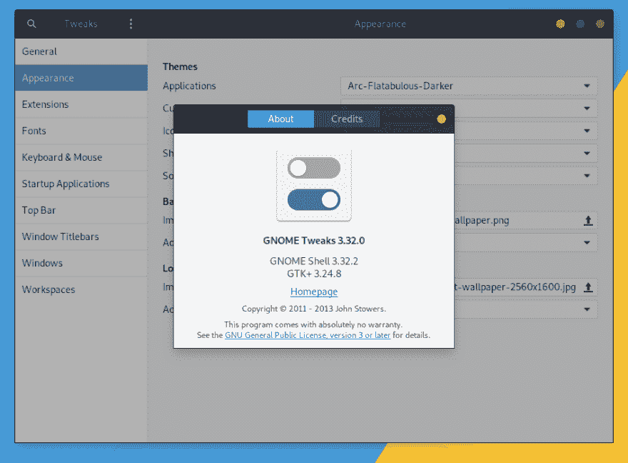
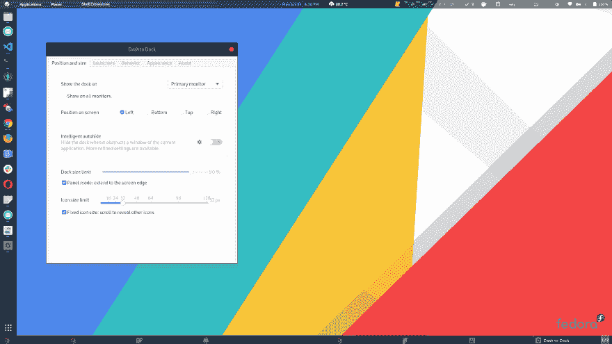
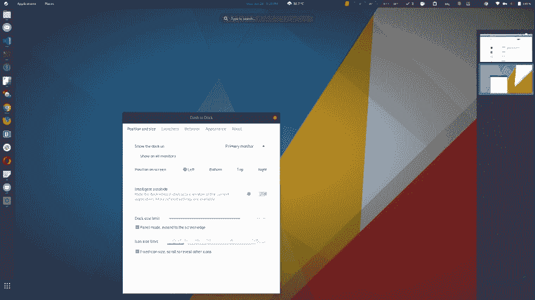
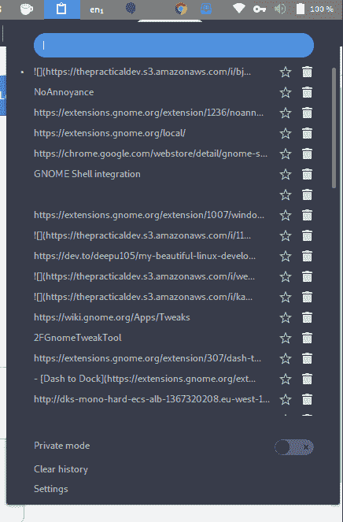
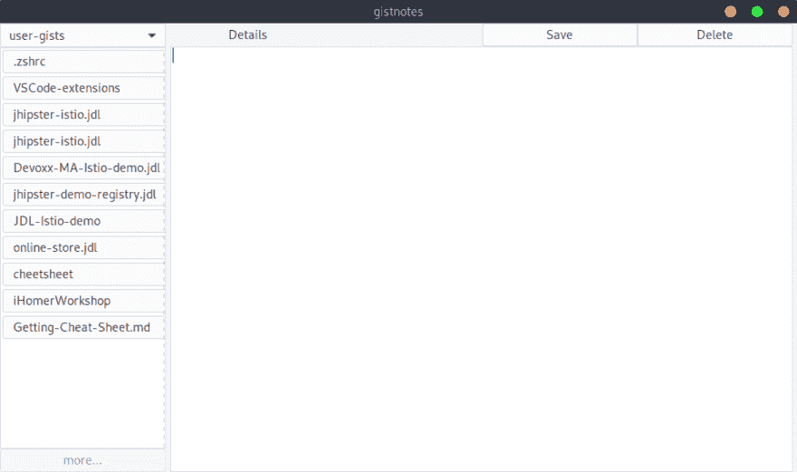
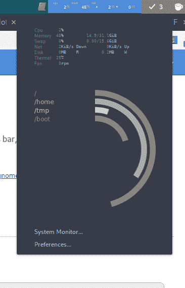

# 必须有 GNOME 扩展

> 原文：<https://dev.to/deepu105/must-have-gnome-extensions-31e3>

*最初发布于[deepu . tech](https://deepu.tech/must-have-gnome-plugins/)T3。*

我是一个漂亮的抛光用户界面和伟大的 UX 吸盘。虽然有很多 Linux 桌面环境提供了很棒的 ux 和 UI，但我发现 [GNOME](https://www.gnome.org/) 是我最喜欢的一个。是的，我看过/试过其他几个。我还发现了一些比 GNOME 更好的默认 UX，比如 [Deepin](https://www.deepin.org/en/dde/) 和 [Elementary](https://elementary.io/) 。但是下面的插件弥补了这个差距，因此我选择坚持使用 GNOME，这是 Fedora 的默认设置，因此非常稳定，除非我有令人信服的理由更换。

所以如果你和我一样是 GNOME 迷，那么下面是一些你必须尝试的 GNOME 插件。我已经列出了我在这个系列的早期[帖子](https://deepu.tech/my-beautiful-linux-development-environment)中使用的插件。在这里，我详细介绍了必须具备的功能。

#### [gnome tweak](https://wiki.gnome.org/Apps/Tweaks)

这个漂亮的工具可以让你调整/配置很多 GNOME 配置，并且应该默认包含在每个 GNOME 发行版中。你可以自定义外观，安装扩展，配置鼠标和键盘等等。它可以在您的发行版的软件中心找到。搜索“调整”。

## Gnome 扩展

您可以通过访问下面扩展标题中的链接并点击右上角开关上的**来安装下面的扩展。在 Chrome 上，你需要 [GNOME Shell integration](https://chrome.google.com/webstore/detail/gnome-shell-integration/gphhapmejobijbbhgpjhcjognlahblep) 插件来启用这个开关。在 Firefox 上，如果插件不存在，它会提示你安装插件。**

#### [突进码头](https://extensions.gnome.org/extension/307/dash-to-dock/)

没有这个插件的 GNOME 几乎感觉很烦。IMO 这个插件也应该是默认的 GNOME 设置。这个可以将你的 GNOME dash 移动到一个高度可配置的 dock 中，这个 dock 可以放在屏幕的两侧或顶部/底部。我发现它在 GNOME 的屏幕左侧非常完美。它可以是一个浮动码头或固定看起来像薄荷或 KDE。

#### [总是缩放工作区](https://extensions.gnome.org/extension/503/always-zoom-workspaces/)

默认情况下，GNOME 启动器不显示工作区，你必须将鼠标悬停在右边才能看到它。我发现这是不必要的，因为你在全屏启动器上有足够的空间，而工作区视图只占一点点。这个插件默认保持缩放。

#### [抢走我的焦点](https://extensions.gnome.org/extension/234/steal-my-focus/) / [无异议](https://extensions.gnome.org/extension/1236/noannoyance/)

这是 GNOME 中另一个令人讨厌的默认。当某些东西需要关注时，这些插件会弹出窗口，而不是默认的通知。你可以使用任何一个插件，因为两者都做同样的事情。

#### [可选标签](https://extensions.gnome.org/extension/15/alternatetab/)

这用一个更经典的基于窗口的切换器取代了默认的 Alt+Tab，IMO 更用户友好，因为默认需要更多的使用箭头键的键盘导航。

#### [窗口列表](https://extensions.gnome.org/extension/602/window-list/)

这是一个经典的插件，将窗口列表添加到屏幕的底部，如果你使用多个显示器，这是必须的，因为窗口被分组并放置在正确的显示器屏幕上。

#### [咖啡因](https://extensions.gnome.org/extension/517/caffeine/)

这个增加了暂时禁用屏保/自动暂停的功能，当你全屏时会自动激活。如果您使用计算机观看视频、演示文稿、截屏等，这是一款必备软件。

#### [剪贴板指示器](https://extensions.gnome.org/extension/779/clipboard-indicator/)

这是我最喜欢的一个。它在顶栏上添加了一个漂亮的剪贴板管理器，并提供了循环浏览剪贴板条目的快捷方式。真正节省时间的人。

#### [t1](#gistnotes)[密码句](https://extensions.gnome.org/extension/917/gistnotes/)

作为一个经常使用 GitHub gist 的开发者，这是一个非常有用的插件。它可以让你直接从桌面上管理你的 Gists，你可以像一个 notes 应用程序一样使用它。

#### [系统监控](https://extensions.gnome.org/extension/120/system-monitor/)

一个很好的系统监视器插件，位于顶栏上，有一个弹出的详细视图。

#### [小鼠加](https://extensions.gnome.org/extension/1031/topicons/)

这会将应用程序中的传统图标移到顶部栏，以保持一致的 UX。

我希望你觉得这是有用的。如果你有任何问题，或者如果你认为我错过了什么，请添加评论。

如果你喜欢这篇文章，请留下赞或评论。

你可以在 [Twitter](https://twitter.com/deepu105) 和 [LinkedIn](https://www.linkedin.com/in/deepu05/) 上关注我。

[布里吉塔·施奈特](https://unsplash.com/@brisch27?utm_source=unsplash&utm_medium=referral&utm_content=creditCopyText)在 [Unsplash](https://unsplash.com/search/photos/gnome?utm_source=unsplash&utm_medium=referral&utm_content=creditCopyText) 上拍摄的封面图片