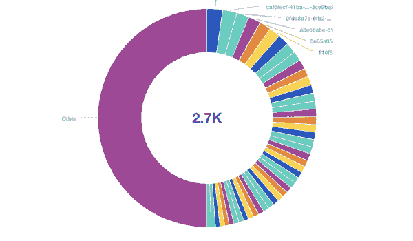
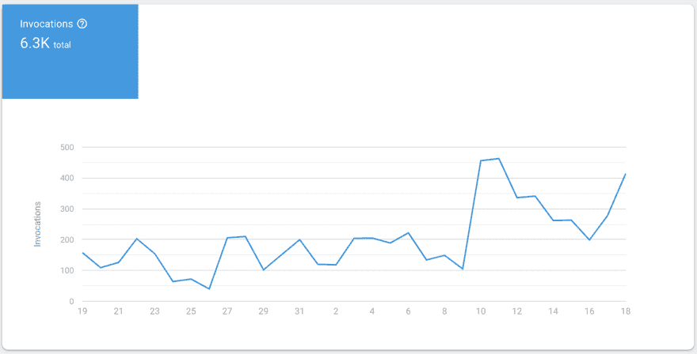
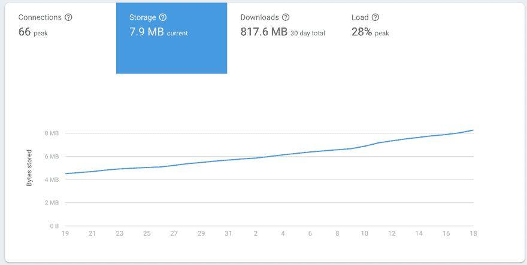
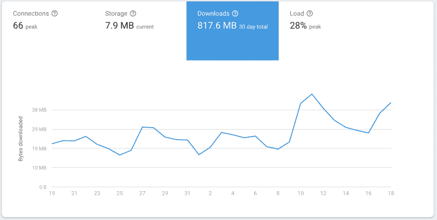

# Playtomic 的聊天解决方案与 Firebase 实时数据库

> 原文：<https://dev.to/playtomic/playtomic-s-chat-solution-with-firebase-realtime-db-e8p>

几周前，我们在 Playtomic dev 博客和开发者网络上发布了一个问题，询问聊天解决方案。意见很广泛，我们最终选择了[Firebase](https://firebase.google.com)+[message kit](https://github.com/MessageKit/MessageKit)/[chat kit](https://github.com/stfalcon-studio/ChatKit)的组合。但是让我快速回顾一下每个组件(后端+应用程序)可用的不同解决方案:

## 已有解决方案

### 后端

#### 聊天专用后台

像 [Twilio](https://www.twilio.com/chat) 、 [Sendbird](https://sendbird.com/) 或 [Pusher](https://pusher.com/chatkit) 这样的产品提供了一个基于聊天的 API 和一组库来处理聊天连接、消息、在线状态等。

#### 同步云数据库

在聊天后端解决方案的同时，还有一些实时同步的通用在线数据库，允许您使用自己的数据模型实现任何功能，包括聊天。一些例子是 [Firebase 实时数据库](https://firebase.google.com/products/realtime-database)、 [Firestore](https://firebase.google.com/products/firestore) 、[领域平台](https://realm.io/products/realm-platform)或 [AppSync](https://aws.amazon.com/appsync/)

#### 自有服务

你可以使用一些实时传输技术，比如 WebSockets 或者 XMPP，来创建你自己的聊天服务器基础设施。

### 前端/移动应用:

#### 开源 UI 组件

你可以为你的 UI 使用现有的聊天库，而不是实现你自己的。两个最流行和最成熟的选项是 iOS 版的 [MessageKit](https://github.com/MessageKit/MessageKit) 和 Android 版的 [ChatKit](https://github.com/stfalcon-studio/ChatKit) 。它们提供了你期望从聊天中得到的大多数 UI 组件。

#### 自己的 UI

从 UI 的角度来看，聊天屏幕通常并不复杂。因此，您可以决定实现自己的视图并处理文本消息、图像、位置，...你自己。

### 满品

最后，还有一些产品，如 [ChatSDK](https://chatsdk.co/) 、 [Cometchat](https://www.cometchat.com/) 、 [Chat21](http://www.chat21.org/) 或 [Chatcamp.io](https://chatcamp.io/) 提供了从后端到前端的全功能解决方案。他们通常会提供一个带有完整 UI 的移动 SDK，可以非常快速简单地添加到您的项目中，并提供一定程度的 UI 定制和公共 API 来管理数据。

## 解决方案选择为 Playtomic

对于 [Playtomic](https://playtomic.io) ，我们想要一个满足我们需求的解决方案:

*   **定价**:由于我们应用的性质，我们有成千上万的“联网”用户，但他们中的大多数人只是出于聊天以外的其他目的使用应用。然而，由于每个应用程序用户都可能有未读邮件，他们都需要连接来检查未读邮件，即使绝大多数人都没有未读邮件。因此，我们需要一个解决方案，以一种价格高效的方式，最好是在一个免费层内，每个月有数千个读者和非常少量的作者。

*   定制(Customization):我们开始将聊天作为一项实验，但我们预见到未来聊天可以实现更复杂的交互，而不仅仅是写/读信息。例如，在一场比赛后，我们可以使用聊天来建议用户重新比赛，给其他球员评分，填写结果，建议类似的公开比赛……如果实验成功，选择一个使我们能够定制消息和编程丰富的机器人交互的解决方案将是非常重要的

*   **复杂性**:如前所述，我们的聊天功能是一项实验，是玩家在应用程序内相互交流的新渠道，但它远不是我们产品的核心。因此，在合理的开发时间内(1 sprint / 2 weeks)和低运营成本的情况下拥有一个 MVP 是非常重要的。

我们开始探索 ChatSDK，因为它似乎在**定价** (Firebase Realtime DB 用作支持，它有一个不错的免费层)**定制**(开源和后端通用数据库允许任何需要的更改)和**复杂性**(完整的产品，后端和前端，应该可以快速集成)。然而，在将它集成到我们现有的应用程序中几天后，我们发现了一些问题(崩溃，糟糕的设计代码，定制外观的困难，平台差异，...)这让我们转到了目前的设置: [Firebase 实时数据库](https://firebase.google.com/products/realtime-database) + [消息包](https://github.com/MessageKit/MessageKit) / [聊天包](https://github.com/stfalcon-studio/ChatKit)

### 数据模型+ Firebase 函数

使用 Firebase RealtimeDB (RTDB)时，您必须记住一些约束条件来建模您的数据:

*   **访问控制** : RTDB 提供了一些细粒度的访问控制规则，你可以使用用户的授权信息、访问子节点、父节点或兄弟节点上的字段等来指定限制。但是，请注意，它不是从`bottom -> top`开始工作，而是以另一种方式`top -> bottom`开始工作。这意味着，如果您有一个规则授予用户 A 对`/threads/`的访问权，即使您在`/thread/thread-1`中制定了另一个规则拒绝它，用户 A 仍然能够获取它，因为它可以访问父节点。当您考虑数据模型时，这种限制尤其重要，因为如果您想提供细粒度的访问控制(如私人聊天),同时仍然能够获取所有公共线程，那么它会迫使您将数据拆分到不同的集合中。

*   **查询** : RTDB 有一些基本的排序和过滤功能，但与任何人对数据库的期望相差甚远。特别是，您可以对具体值进行筛选或排序，并使用 limit 选项对结果进行分页，但是您不能进行组合多个字段或表达式的复杂查询。与访问控制类似，这种限制可以通过将您的模型反规范化为已经适合您的过滤的模型来最小化，例如，创建用户索引、公共索引，...

*   **数据传输**:使用 RTDB 时最大的错误之一就是不关心传输。请记住，您不能进行复杂的查询、聚合、检索部分文档或在子级别上限制访问。因此，如果您访问类似于`/threads`的东西来计算现有线程的数量，您将下载整个树的内容，并因此在您的客户端上消耗大量的数据(这将随后由 Firebase 相应地收费)。同样，反规范化通常是创建部分文档、预先计算的聚合、用户索引等的方法。

我们基于由 [ChatSDK](https://chatsdk.co/) 提供的数据模型，做了一些修改来解决上面提到的限制。我们最终的数据模型看起来像这样:

*   这里，我们存储每个设备和每个用户的推送通知令牌的信息
*   我们将我们的消息放在自己的索引中，以允许每个线程的低级访问控制，并允许在不下载所有消息列表的情况下消耗线程(以显示用户的线程列表 UI)
*   这里我们存储了线程元数据，比如名字，用户，最后一条消息，...它是我们线程的“主要”文档，由反规范化过程使用。它对每个线程的访问控制是受限的，当有新玩家加入比赛等聊天更新发生时，它会被我们的后端修改。
*   这是我们所有用户的主要入口。它由/threads 集合的非规范化索引组成，仅包含用户“可查看”的内容。每次在/threads 下有一个新线程或对现有线程的更新时，都会有一个反规范化函数对所有参与者索引进行“复制”。
*   与 user-threads 类似，这个非规范化的索引包含未读计数或用户在线状态等信息。同样，当/messages 集合中有新消息时，受影响线程中的所有用户的未读计数都会增加(除非他们在线并正在查看该线程)。这使得我们可以在应用程序启动时读取这个唯一的文档来获取聊天状态，并在应用程序标签栏上用正确的数字配置未读标记，而无需咨询整个用户线程列表。

对于上面提到的所有非规范化的记账， **Firebase 提供了函数**，这些函数基本上是 javascript 函数，可以在不同的情况下被触发(如 RTDB 节点的插入/删除/更新)，并执行如发送推送通知、修改数据、....特别是，我们有以下功能:

*   **创建`/messages/{threadId}/{messageId}`** :写新消息时触发，此函数负责发送推送通知，将此最后一条消息复制到线程的最后一条消息中去规范化，在用户线程索引上做去规范化的复制，增加未读计数的用户聚合。
*   **创建`/threads/{threadId}/users/{userId}`** :当一个新用户加入一个线程时触发，它在用户线程索引上创建一个反规范化的副本
*   **删除`/threads/{threadId}/users/{userId}`** :当用户离开线程时触发，它从用户线程索引中删除任何非规范化的副本，并相应地刷新用户未读计数。

### 分析学

聊天上线几周后，让我们快速了解一下过去 30 天的一些使用分析:

#### 用户数量

*   大约 3000 个来自比赛细节的聊天窗口，其中大约 30%不是玩家(访客)
*   来自个人资料的约 2400 条聊天记录

#### 消息数量:

*   总共约 2700 条消息，
*   平均每天约 90 条消息
*   每天近 250 条消息的峰值。
*   增长趋势

#### 聊天次数:

*   436 聊天带消息。
*   至少有 10 条消息的 70 次聊天
*   45 次聊天，约占发送邮件总数的一半。

### 消耗火基

在解释了当前的聊天使用情况和用于减少 Firebase 账单的非规范化数据模型之后，让我们来看看过去 30 天的一些[最关键配额](https://firebase.google.com/pricing)，看看我们到目前为止是如何实现的:

#### 函数调用

每月 12.5 万的免费配额和每百万 0.4 美元的价格，我们使用了大约 5%的配额，远远没有从这个概念中支付任何明显的成本。

#### RTDB 储

这可能是最关键的问题之一，因为使用的空间量只会随着时间的推移而增长(除非我们删除旧的聊天记录)，并且由于非规范化，它的增长速度比聊天使用量的增长速度更快。我们目前的使用量约为 8MB，免费层为 1GB，每 GB 额外收费 1 美元。因此，现在我们的使用率不到 1%,每月增长约 5MB，目前还远远没有超过配额，但如果聊天使用率继续增长，可能在不久的将来就会超过配额。

#### RTDB 转移

下载流量是最令人担忧的配额，也是迄今为止被其他项目滥用最多的一个，在某些情况下，每月导致数千美元的账单。但是，在我们的案例中，通过我们进行的所有反规范化，我们已经使用了 10Gb/月可用层中的 800Mb。这为我们在免费配额内留出了大约 10 倍的增长空间，超过该限制后，每 GB 的潜在成本为 1 美元。我们预计未来会超过配额，但希望保持相对较低的成本。

## 结论

到目前为止，我们对结果非常满意。Firebase RTDB +开源 UI 套件的组合，允许我们在我们的 **2 周开发**时间内构建一个**可定制的解决方案**。此外，聊天到目前为止表现良好，具有**低延迟**和**离线支持**，而我们离离开**自由层**还相当远。当然，我们没有实现其他聊天工具提供的许多高级选项，比如阅读检查、静音聊天、输入指示器，...将不得不等待，但我们有基础准备继续发展，如果想要的。

由于非规范化，将来我们可能会遇到其他问题，但是到目前为止，在我们探索该实验是否值得继续投资时，我们的用户手中已经有了一个不错的解决方案(根据目前的使用情况看起来是这样)。