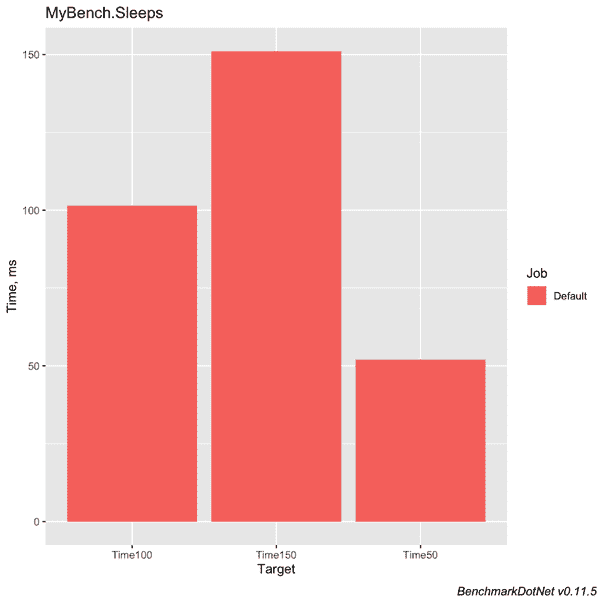
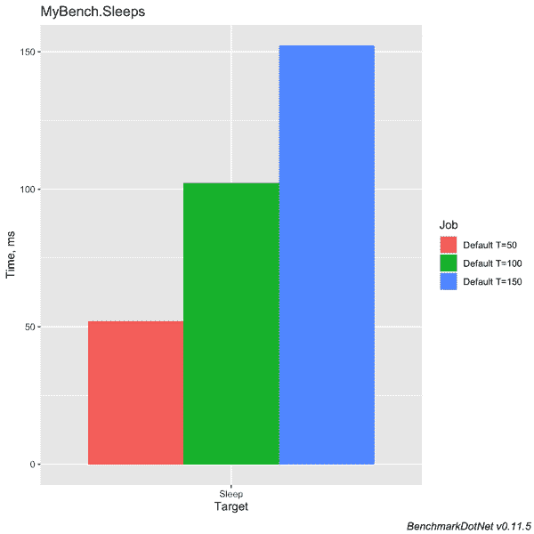
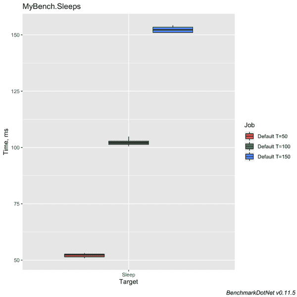
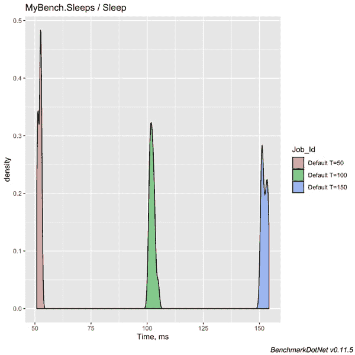

# 如何使用 BenchmarkDotNet 运行微基准测试——来自 Ray Tracer 挑战系列的奖金帖子

> 原文：<https://dev.to/simonech/how-to-run-micro-benchamarking-with-benchmarkdotnet-bonus-post-from-the-ray-tracer-challenge-series-4eic>

在我的[射线追踪挑战](http://codeclimber.net.nz/archive/2019/05/22/raytracer-challenge-netcore-intro/)的背景下，我想对我的基本操作和数据结构进行一些性能分析。为此安装并使用了 [BenchmarkDotNet](https://benchmarkdotnet.org) ，这是微软用于性能测试的 OSS 基准测试工具。NET 核心运行时和类库。

在这篇文章中，我将分享我对这个强大工具的了解。

## 如何安装 BenchmarkDotNet

BenchmarkDotNet 不是一个必须安装的应用程序。它是一个. NET 库。要安装它，创建一个控制台应用程序并安装 NuGet 包。

```
dotnet new console
dotnet add package BenchmarkDotNet 
```

就这么简单。

## 写作基准

现在您已经有了项目，您需要用您想要运行的基准创建一个类，最后，在`Program`的`Main`中添加一行来开始基准的执行。

这里有一个简单的例子，展示了如何测试`Sleep`方法的“性能”。

```
using System;
using System.Threading;
using BenchmarkDotNet.Attributes;
using BenchmarkDotNet.Running;

namespace MyBench
{
    public class Sleeps
    {
        [Benchmark]
        public void Time50() => Thread.Sleep(50);

        [Benchmark(Baseline = true)]
        public void Time100() => Thread.Sleep(100);

        [Benchmark]
        public void Time150() => Thread.Sleep(150);
    }

    class Program
    {
        static void Main(string[] args)
        {
            var summary = BenchmarkRunner.Run<Sleeps>();
        }
    }
} 
```

注意，每个方法都有`[Benchmark]`属性。

## 运行基准

现在是运行基准的时候了。为此，只需运行控制台应用程序:`dotnet run`。

不幸的是，这里您遇到了第一个问题，由终端中的红线表示:您不能在调试模式下运行基准测试。

> 定义基准的程序集 MyBench 是非优化的基准是在未启用优化的情况下生成的(很可能是调试配置)。请在发布时构建它。如果您想调试基准，请参阅 https://benchmarkdotnet . org/articles/guides/trouble shooting . html # debugging-benchmarks。

除非您想在调试模式下运行基准，否则您必须在发布模式下运行它:`dotnet run -c Release`。

此时，您会在终端中看到一条或两条红色消息，但是执行会继续并成功完成。

第一个抱怨没有解决方案文件。由于您只创建了一个项目，这是正常的。所以跳过它。

第二个选项可能不会出现，具体取决于操作系统和登录用户的权限，它也不会影响执行的成功，但可能会影响结果。

> 未能设置高优先级。确保您有正确的权限。消息:权限被拒绝

该消息意味着基准运行程序无法将执行设置为高 CPU 优先级，因此基准运行速度会变慢，尤其是在其他应用程序同时运行的情况下。

如果您遇到这个问题，要么在 Windows 上以管理员身份运行该命令，要么在 Mac 或 Linux 上运行该命令。

解决了这两个问题，基准开始的正确方式是`sudo dotnet run -c Release`。

## 分析结果

过了一会儿(这篇文章的例子花了 45 秒完成)，您会得到一个摘要，其中包含所有基准的平均执行时间。默认情况下，您会得到:

*   Markdown (Github 方言)
*   HTML 报告
*   您可以在 Excel 中导入 CSV 进行额外分析

作为例子，这是我从我的机器上得到的:

| 方法 | 平均 | 错误 | StdDev | 比例 |
| --- | --- | --- | --- | --- |
| 时间 50 | 52.28 毫秒 | 0.4682 毫秒 | 0.4380 毫秒 | Zero point five one |
| 时间 100 | 101.99 毫秒 | 0.9778 毫秒 | 0.9146 毫秒 | One |
| 时间 150 | 151.74 毫秒 | 0.9426 毫秒 | 0.8817 毫秒 | One point four nine |

通常，您只能得到 Mean、Error 和 StdDev 列，但是因为其中一个基准被标记为 baseline(使用属性`[Benchmark(Baseline = true)]`)，所以还有 Ratio 列，它告诉您性能的相对差异。

BenchmarkDotNet 还可以生成带有结果摘要和每次执行的详细分析的图表。它依赖于 [R](https://www.r-project.org/) (一个统计分析框架)来执行，所以你需要安装它。在 Mac 上，就像`brew install r`一样简单。

[ ](https://res.cloudinary.com/practicaldev/image/fetch/s--1dCYnLIV--/c_limit%2Cf_auto%2Cfl_progressive%2Cq_auto%2Cw_880/http://codeclimber.net.nz/media/1067/5-barplot.png) [ ](https://res.cloudinary.com/practicaldev/image/fetch/s--5Y9GRI4P--/c_limit%2Cf_auto%2Cfl_progressive%2Cq_auto%2Cw_880/http://codeclimber.net.nz/media/1069/5-boxplot.png)

## BenchmarkDotNet 的附加特性

我们只是触及了 BenchmarkDotNet 的皮毛。它有更多的特性，允许您在不同的条件下运行基准测试。

### 环境

例如，您可以要求在不同的框架上运行相同的基准，比如。NET Core、Mono、x86 或 x64，然后比较结果。这通过属性`[CoreJob, ClrJob, MonoJob]`或通过提供配置对象来配置。

### 参数

另一个有趣的特性是可以用不同的参数执行相同的基准测试，例如，查看当迭代次数增加时，某个操作是否会降级。这也是通过属性[Params]完成的。

例如，相同的`Sleep`测试可以使用参数来完成，而不是创建三个不同的基准。

```
public class Sleeps
{
    [Params(50, 100, 150)]
    public int T { get; set; }

    [Benchmark]
    public void Sleep() => Thread.Sleep(T);
} 
```

结果略有不同:

| 方法 | T | 平均 | 错误 | StdDev |
| --- | --- | --- | --- | --- |
| 睡眠 | Fifty | 52.09 毫秒 | 0.7825 毫秒 | 0.7319 毫秒 |
| 睡眠 | One hundred | 102.21 毫秒 | 1.2101 毫秒 | 1.1319 毫秒 |
| 睡眠 | One hundred and fifty | 152.25 毫秒 | 1.3064 毫秒 | 1.2220 毫秒 |

这种方法也使得使用 R 生成的默认图来比较结果更加方便，因为一些图表变得更加有用。

[](https://res.cloudinary.com/practicaldev/image/fetch/s--oPkC1brv--/c_limit%2Cf_auto%2Cfl_progressive%2Cq_auto%2Cw_880/http://codeclimber.net.nz/media/1066/5-barplot-params.png)[](https://res.cloudinary.com/practicaldev/image/fetch/s--wst5wR86--/c_limit%2Cf_auto%2Cfl_progressive%2Cq_auto%2Cw_880/http://codeclimber.net.nz/media/1068/5-boxplot-params.png)[](https://res.cloudinary.com/practicaldev/image/fetch/s--JJvZCNX3--/c_limit%2Cf_auto%2Cfl_progressive%2Cq_auto%2Cw_880/http://codeclimber.net.nz/media/1070/5-density-params.png)

## 运行基准

您已经看到了通过运行项目来运行基准测试的最直接的方法。

遗憾的是，这种方法非常有限。

### 指定控制台参数

更好的方法是将`Main`改为使用`BenchmarkSwitcher`。

```
static void Main(string[] args)
            => BenchmarkSwitcher.FromAssembly(typeof(Program).Assembly).Run(args); 
```

这允许将许多参数传递给基准执行。您可以过滤要运行的基准，更改要运行的运行时，并指定其他配置参数，否则这些参数必须在代码中指定，或者直接在基准中用属性指定。

### 使用全局点网工具

运行基准测试的最后一种方法是通过 global dotnet 工具。

可以通过`dotnet tool install -g BenchmarkDotNet.Tool`安装。

安装后，您可以通过指定 dll 的名称(`dotnet benchmark MyBench.dll`)来运行基准，然后使用与`BenchmarkSwitcher`相同的控制台参数。

## 结论

我希望我给了你一个很好的概述这个神奇的工具。你可以在官方网站[https://benchmarkdotnet.org](https://benchmarkdotnet.org/articles/overview.html)上了解更多信息。

在探索这个工具时，我尝试测试了连接字符串的各种方法的性能。`StringBuilder`比`String.Join`快还是慢？在 DEV.to 上关注我的，在 Twitter 上关注我的，当我的分析发表时，你会收到通知。