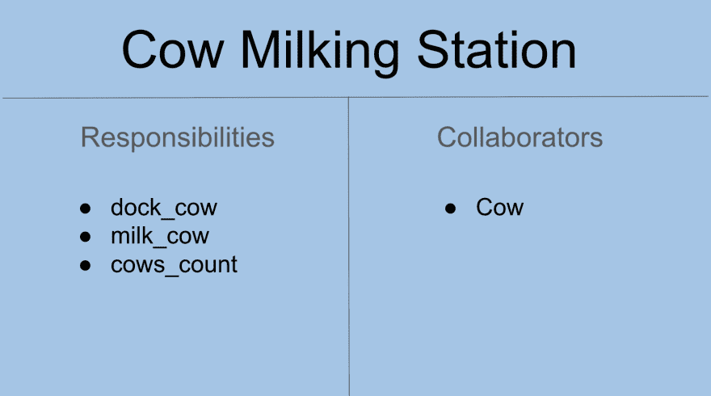
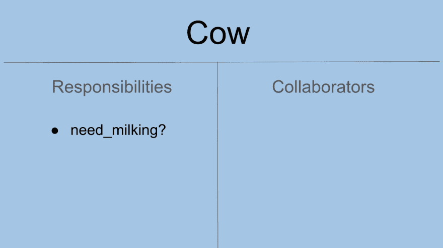

# 每周笔记- 04 制造商

> 原文：<https://dev.to/ruthmoog/weeknotes-04-makers-5epn>

# 周记- 04 庄家

本周是关于展示对数据库内容的完全控制，以及扩展我们的 webapp 知识以包括数据存储。通常，如果您想存储数据，您会使用一个数据库，其中的数据在关机和重启后仍然存在。这些数据如此持久，以至于我梦见了数据库。

## 类责任协作者卡(CRCs)

CRCs 的目的是帮助程序员集思广益设计他们的软件。在一次研讨会上，我们得到了一个用户故事，将对象解释成卡片，左边列出了责任，右边列出了合作者类别。随着我们得到更多的项目用户故事，我们创造了更多的卡片/责任/合作。

> 作为牛奶女仆(？！这样我就可以卖牛奶了。我想看看奶牛是否可以挤奶了
> 
> ...我想在挤奶站停靠一头奶牛
> 
> ...我想挤牛奶
> 
> ...我想知道我有多少头牛

以下是以 CRC 卡表示的用户案例:

[](https://res.cloudinary.com/practicaldev/image/fetch/s--1ffQHe3l--/c_limit%2Cf_auto%2Cfl_progressive%2Cq_auto%2Cw_880/https://thepracticaldev.s3.amazonaws.com/i/0caplt3tyffbxuxn1esi.png)
[T6】](https://res.cloudinary.com/practicaldev/image/fetch/s---1YWZBKp--/c_limit%2Cf_auto%2Cfl_progressive%2Cq_auto%2Cw_880/https://thepracticaldev.s3.amazonaws.com/i/qdi7h85z2y2iz41ybfdr.png)

CRC 卡中明确的链接有助于设计数据库表，并在对数据建模时避免[多对多](https://en.wikipedia.org/wiki/Many-to-many_(data_model))关系(避免相互依赖的卡，即。如果`cow milking station`有`cow`作为合作者，并且`cow`也有`cow milking station`作为合作者)。

以下是这些奶牛相关场景的数据库模型:

#### 表:奶牛🐮

| 身份证明（identification） | 需要挤奶 | 挤奶站 id |
| --- | --- | --- |
| one | 真实的 | one |

#### 表:奶牛挤奶站🍼

| 身份证明（identification） |
| --- |
| one |

> 💡如果存在多对多关系，请使用连接表在两个一对多关系之间创建连接。

保持 CRC 卡小(想想索引卡)有助于你保持班级责任小，并抑制过度设计。

## 测试关系

其中一位教练和我分享了一些线索，告诉我何时划分职责(并使用依赖注入)。

*   如果你用“和”这个词来描述一个方法或者一个类，这就暗示了不止一个责任
*   另一种情况是，如果您注意到一个方法或类管理多个状态。例如，Ruby 的`String`类有许多方法来改变它的字符，但总是用字符串字符。将 fixnum 添加到字符串`"sting" + 2`将会处理多个状态(如果您在 repl 中尝试这样做，将会得到一个错误...)

```
 TypeError (no implicit conversion of Integer into String) 
```

<svg width="20px" height="20px" viewBox="0 0 24 24" class="highlight-action crayons-icon highlight-action--fullscreen-on"><title>Enter fullscreen mode</title></svg> <svg width="20px" height="20px" viewBox="0 0 24 24" class="highlight-action crayons-icon highlight-action--fullscreen-off"><title>Exit fullscreen mode</title></svg>

## 杂项

🏆我遇到了第一个堆栈溢出错误！
🌊SQL: s-q-l 或者 sequel 怎么发音？当有人提到“海鸥”时，我笑得停不下来！<sup id="fnref1">[1](#fn1)</sup>T9】🌽听到 Sainsbury's 谈论他们的数字团队很有趣:他们如何处理数据、发电和卷心菜跟踪。
当我重启终端时，⚠️I 总是忘记如何从命令行运行 VSC:`Command`+`Shift`+`P`然后选择`Shell Command : Install 'code' in PATH`
📝一切都回到数组的散列或散列的数组...

* * *

1.  sequal 或者 s-q-l 都*完全*好！