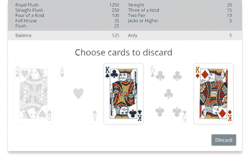

# 地鼠抽五张牌

> 原文：<https://dev.to/kevburnsjr/five-card-draw-for-gophers-l7g>

所以，我在这架飞机上。

[](https://res.cloudinary.com/practicaldev/image/fetch/s--xrtIUjlb--/c_limit%2Cf_auto%2Cfl_progressive%2Cq_auto%2Cw_880/https://thepracticaldev.s3.amazonaws.com/i/fkg3bmkof7ooag2te07p.jpg)

从洛杉矶国际机场到利马要飞 8 个小时，有一个娱乐系统让我...娱乐。在看电影之前，我会去游戏区看看，然后看到这个扑克游戏。

[](https://res.cloudinary.com/practicaldev/image/fetch/s--6TYamwSI--/c_limit%2Cf_auto%2Cfl_progressive%2Cq_auto%2Cw_880/https://thepracticaldev.s3.amazonaws.com/i/rc56r44djcp1r4rz6yrg.jpg)

这是五张牌。一个玩家。用西班牙语。买入费是 200 美元假币，30 分钟后我的余额是 1，585 美元。这不是一场艰苦的比赛。

其实这个游戏太容易了。非常简单。好像它让我赢了。有没有可能这个游戏实际上是随机的而我只是某个天才扑克之神？还是游戏喂我卡让我赢？

这个问题困扰着我。深深地。

[](https://res.cloudinary.com/practicaldev/image/fetch/s--XxRy3KUE--/c_limit%2Cf_auto%2Cfl_progressive%2Cq_66%2Cw_880/https://dev-to-uploads.s3.amazonaws.com/uploads/articles/1f6mwkhlp3ce37e408fc.gif)

嘿，等一下。我是一名软件工程师。我可以克隆这个游戏，摆弄它的内部结构来确定为什么这个实现看起来如此不平衡。

[](https://res.cloudinary.com/practicaldev/image/fetch/s--TcNi49UN--/c_limit%2Cf_auto%2Cfl_progressive%2Cq_auto%2Cw_880/https://dev-to-uploads.s3.amazonaws.com/uploads/articles/xiy92b85fuwc8b2bdky6.jpg)

我们开始吧！

* * *

游戏是这样的:[https://github.com/KevBurnsJr/stupid-poker](https://github.com/KevBurnsJr/stupid-poker)

[](http://stupid-poker.kevburnsjr.com)

* * *

从一副牌开始

```
package poker

type deck [52]string

var suits = []string{"S", "H", "D", "C"}
var cards = []string{"A", "2", "3", "4", "5", "6", "7", "8", "9", "T", "J", "Q", "K"}

func newDeck() *deck {
    d := &deck{}
    for i, s := range suits {
        for j, c := range cards {
            d[i*13+j] = c + s
        }
    }
    return d
} 
```

<svg width="20px" height="20px" viewBox="0 0 24 24" class="highlight-action crayons-icon highlight-action--fullscreen-on"><title>Enter fullscreen mode</title></svg> <svg width="20px" height="20px" viewBox="0 0 24 24" class="highlight-action crayons-icon highlight-action--fullscreen-off"><title>Exit fullscreen mode</title></svg>

有序的牌不是很有用，所以让我们洗牌吧。

```
// shuffles the deck in place
func (d *deck) shuffle() {
    for i := len(d) - 1; i > 0; i-- {
        j := rand.Intn(i + 1)
        d[i], d[j] = d[j], d[i]
    }
} 
```

<svg width="20px" height="20px" viewBox="0 0 24 24" class="highlight-action crayons-icon highlight-action--fullscreen-on"><title>Enter fullscreen mode</title></svg> <svg width="20px" height="20px" viewBox="0 0 24 24" class="highlight-action crayons-icon highlight-action--fullscreen-off"><title>Exit fullscreen mode</title></svg>

现在我们有了一副牌，让我们创建游戏

```
const (
    stateReady = iota
    stateDealt
)

type Game interface {
    // Deal initializes the game, returning the player's initial hand and new balance
    Deal() (Hand, int, error)

    // Exchange accepts a slice of integers corresponding to indicies for cards in the given hand
    // It discards those cards from the hand and replaces them with new cards from the deck
    // It returns the final hand and the new balance
    Exchange([]int) (Hand, int)
} 
```

<svg width="20px" height="20px" viewBox="0 0 24 24" class="highlight-action crayons-icon highlight-action--fullscreen-on"><title>Enter fullscreen mode</title></svg> <svg width="20px" height="20px" viewBox="0 0 24 24" class="highlight-action crayons-icon highlight-action--fullscreen-off"><title>Exit fullscreen mode</title></svg>

这个游戏只有两种状态。要么你在发牌，要么你在抽牌，这手牌就结束了。

```
type game struct {
    deck    *deck
    state   int
    anty    int
    balance int
    hand    Hand
    mutex   *sync.Mutex
}

func NewGame(anty int, balance int) Game {
    return &game{
        deck:    newDeck(),
        state:   stateReady,
        anty:    anty,
        balance: balance,
        mutex:   &sync.Mutex{},
    }
}

func (g *game) Deal() (Hand, int, error) {
    g.mutex.Lock()
    defer g.mutex.Unlock()
    if g.balance < g.anty {
        return Hand{}, g.balance, ErrNoBalance
    }
    g.deck.shuffle()
    g.balance -= g.anty
    g.hand = newHand(g.deck[0:5])
    g.state = stateDealt
    return g.hand, g.balance, nil
}

func (g *game) Exchange(cards []int) (Hand, int) {
    g.mutex.Lock()
    defer g.mutex.Unlock()
    if g.state != stateDealt {
        return g.hand, g.balance
    }
    hand := g.hand
    for i, n := range cards {
        if n >= len(hand) {
            continue
        }
        hand[n] = g.deck[i+5]
    }
    res := hand.Score()
    g.balance += payout[res]
    if payout[res] > 0 {
        g.balance += g.anty
    }
    g.state = stateReady
    return hand, g.balance
} 
```

<svg width="20px" height="20px" viewBox="0 0 24 24" class="highlight-action crayons-icon highlight-action--fullscreen-on"><title>Enter fullscreen mode</title></svg> <svg width="20px" height="20px" viewBox="0 0 24 24" class="highlight-action crayons-icon highlight-action--fullscreen-off"><title>Exit fullscreen mode</title></svg>

手也是一串弦。

```
const (
    Hand_RoyalFlush    = "Royal Flush"
    Hand_StraightFlush = "Straight Flush"
    Hand_Quads         = "Four of a Kind"
    Hand_FullHouse     = "Full House"
    Hand_Flush         = "Flush"
    Hand_Straight      = "Straight"
    Hand_Trips         = "Three of a Kind"
    Hand_TwoPair       = "Two Pair"
    Hand_Jacks         = "Jacks or Higher"
    Hand_Nothing       = "Nothing"
)

type Hand [5]string

// Score scores the hand
func (h Hand) Score() string {
    if len(h[0]) < 1 {
        return Hand_Nothing
    }
    if h.isFlush() {
        if h.isRoyal() {
            return Hand_RoyalFlush
        }
        if h.isStraight() {
            return Hand_StraightFlush
        }
        return Hand_Flush
    }
    if h.isStraight() {
        return Hand_Straight
    }
    pairs, trips, quads, highPair := h.detectDupes()
    if quads > 0 {
        return Hand_Quads
    }
    if trips > 0 {
        if pairs > 0 {
            return Hand_FullHouse
        }
        return Hand_Trips
    }
    if pairs > 1 {
        return Hand_TwoPair
    }
    if pairs == 1 && highPair {
        return Hand_Jacks
    }
    return Hand_Nothing
} 
```

<svg width="20px" height="20px" viewBox="0 0 24 24" class="highlight-action crayons-icon highlight-action--fullscreen-on"><title>Enter fullscreen mode</title></svg> <svg width="20px" height="20px" viewBox="0 0 24 24" class="highlight-action crayons-icon highlight-action--fullscreen-off"><title>Exit fullscreen mode</title></svg>

我们将需要一些测试来确保手动评分方法继续按预期工作。

```
// Table based test to ensure correct scoring of hands
func TestScoreHand(t *testing.T) {
    var tests = map[string]string{
        "AS KS QS JS TS": Hand_RoyalFlush,
        "JD TD AD QD KD": Hand_RoyalFlush,
        "KS QS JS TS 9S": Hand_StraightFlush,
        "KS KH KD KC 9S": Hand_Quads,
        "KS 9S KH KD KC": Hand_Quads,
        "KS 9S KH KD 9C": Hand_FullHouse,
        "TS 8S QS JS 4S": Hand_Flush,
        "AS KD QS JS TS": Hand_Straight,
        "AS AH AD JS TS": Hand_Trips,
        "AS AH JS AD 4S": Hand_Trips,
        "AS AH JS JD 4S": Hand_TwoPair,
        "AS JD 4S AH JS": Hand_TwoPair,
        "AS JD AH JS 4S": Hand_TwoPair,
        "AS AD 8H JS 4S": Hand_Jacks,
        "JS JD 8H 9S 4S": Hand_Jacks,
        "TS TD 8H 9S 4S": Hand_Nothing,
    }
    for c, exp := range tests {
        h := newHand(strings.Split(c, " "))
        res := h.Score()
        if exp != res {
            t.Log("Unexpected Result", h, res, "!=", exp)
            t.Fail()
        }
    }
} 
```

<svg width="20px" height="20px" viewBox="0 0 24 24" class="highlight-action crayons-icon highlight-action--fullscreen-on"><title>Enter fullscreen mode</title></svg> <svg width="20px" height="20px" viewBox="0 0 24 24" class="highlight-action crayons-icon highlight-action--fullscreen-off"><title>Exit fullscreen mode</title></svg>

之后，我们只需在它上面加上一个界面，就称它为游戏:)
[http://stupid-poker.kevburnsjr.com](http://stupid-poker.kevburnsjr.com)

你可以在 Github
[上找到完整代码 https://Github . com/KevBurnsJr/stupid-poker/tree/master/internal/poker](https://github.com/KevBurnsJr/stupid-poker/tree/master/internal/poker)

* * *

因此...最终结果？

还是挺容易赢的。这可能意味着平衡问题与随机数发生器无关，更多的是与赔率相关的支出过高有关。

我们玩得很开心，还做了一个游戏。这不太可能为我们赢得图灵奖。