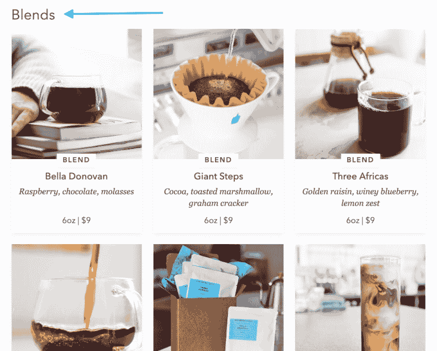
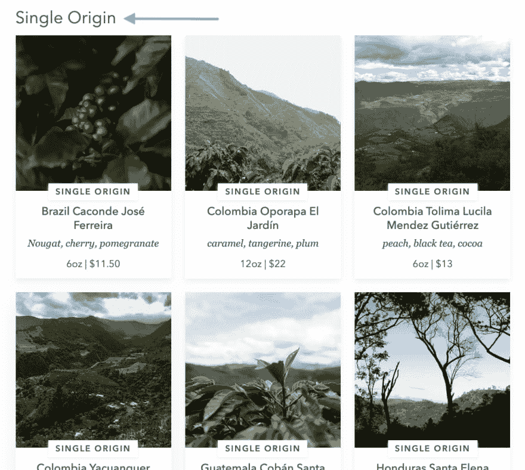
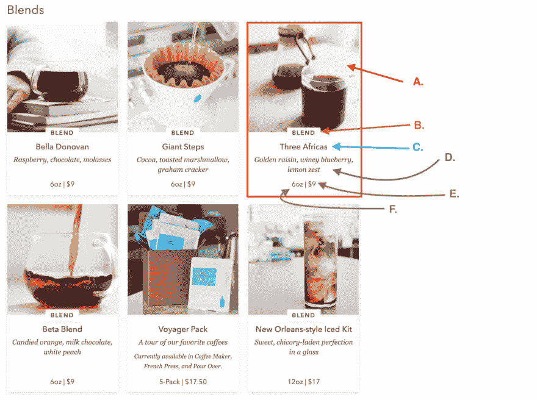
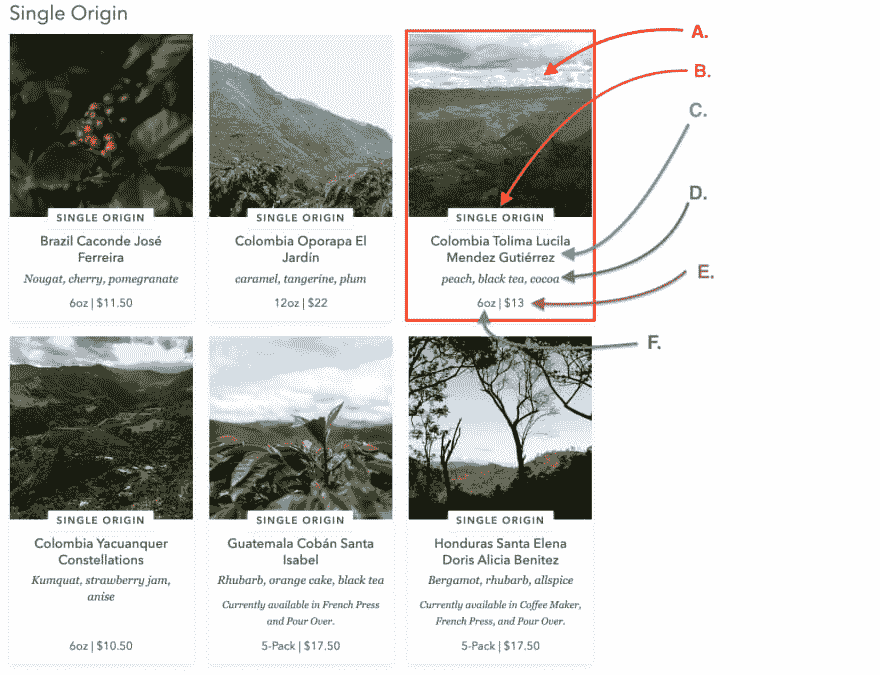
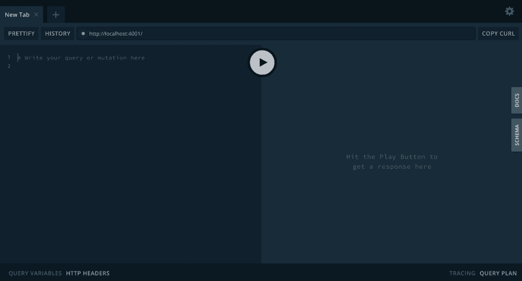
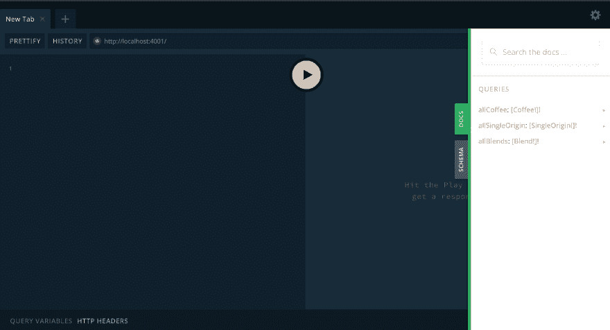
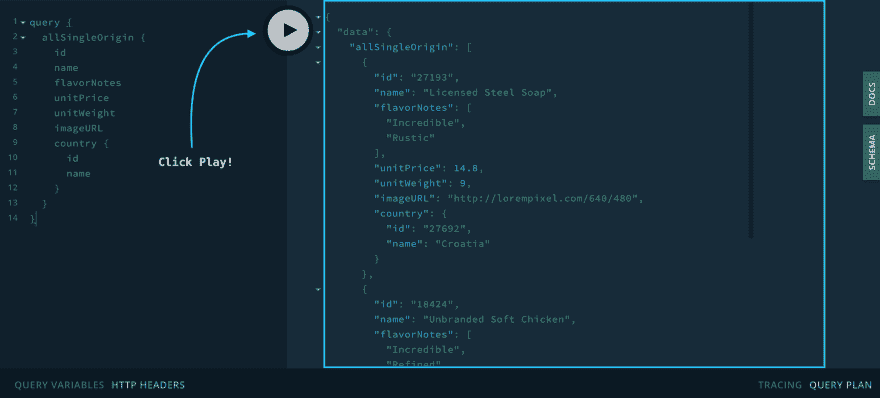
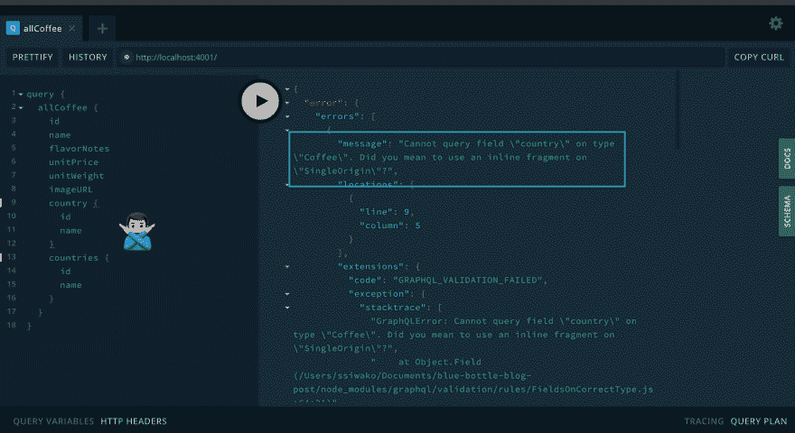

# 构建一个模拟蓝瓶 GraphQL API

> 原文：<https://dev.to/theisomorphic/building-a-mock-blue-bottle-graphql-api-2mme>

*格尔森·希福恩特斯在 Unsplash 上拍摄的封面照片*

## TL；博士；医生

*   在伊夫·波尔切洛和亚历克斯·班克的 GraphQL 研讨会上，我使用`apollo-server`和`faker`构建了一个模拟蓝瓶 GraphQL API。
*   允许您为 GraphQL 模式中的所有类型添加模拟解析器。
*   通过在相似的 GraphQL 类型之间创建关系，GraphQL 中的帮助您使您的 GraphQL API 更有组织性/可伸缩性。
*   你可以在 GraphQL 的操场上玩我的最后一个例子:[https://codesandbox.io/embed/blue-bottle-blog-post-9xrk7](https://codesandbox.io/embed/blue-bottle-blog-post-9xrk7)
*   在这里查看我的 Github 库:

    ## [iwakoscott](https://github.com/iwakoscott)/[模拟蓝瓶图 QL-API](https://github.com/iwakoscott/mock-blue-bottle-graphql-api)T13

    ### T15

    T17T19

    # 构建一个模拟蓝瓶 graph QL API

    [`npm install`](https://camo.githubusercontent.com/171cec4da7994e343c703cab3b9d284f1a7c8906/68747470733a2f2f696d616765732e756e73706c6173682e636f6d2f70686f746f2d313439363337343230303539342d3231386439333032316338633f69786c69623d72622d312e322e3126697869643d65794a6863484266615751694f6a45794d446439266175746f3d666f726d6174266669743d63726f7026773d3135303026713d3830)

    ## 目录

    1.  [从这里开始](https://github.com/iwakoscott/mock-blue-bottle-graphql-api/tree/START)
    2.  [添加模拟预解析器](https://github.com/iwakoscott/mock-blue-bottle-graphql-api/tree/add-mock-resolvers)
    3.  [修复 _ _ 预解析类型警告](https://github.com/iwakoscott/mock-blue-bottle-graphql-api/tree/fix-warnings)
    4.  [完成版本](https://github.com/iwakoscott/mock-blue-bottle-graphql-api/tree/master)

    ## 入门指南

    1.  通过运行

    ```
    git clone https://github.com/iwakoscott/mock-blue-bottle-graphql-api.git 
    ```

    开始克隆这个库在你的终端里

    2.  `cd mock-blue-bottle-graphql-api`
    3.  运行`npm install`下载依赖项。
    4.  运行`npm run start`启动服务器`http://localhost:4001`

    [查看 GitHub 上的](https://github.com/iwakoscott/mock-blue-bottle-graphql-api)

## 简介

我最近有机会参加了伊夫·波尔切洛和 T2·亚历克斯·班克斯举办的 GraphQL 研讨会。在其中一个实验室中，我们的任务是创建自己的 GraphQL 模式来模拟我们最喜欢的 web 应用程序之一。(如果您不熟悉 GraphQL 模式，模式定义了来自 GraphQL 端点的所有可能的操作(突变和查询)和类型。它几乎是你的 GraphQL API 的蓝图。)我决定试着模仿我最喜欢的电子商务网站之一:【bluebottlecoffee.com】。

免责声明:我不为蓝瓶工作。我只是喜欢他们的网站(和他们的一些咖啡。)

## 我的过程💭

我首先浏览了[咖啡](https://bluebottlecoffee.com/store/coffee)路线，然后开始工作:

[](https://res.cloudinary.com/practicaldev/image/fetch/s--FOkAR-_4--/c_limit%2Cf_auto%2Cfl_progressive%2Cq_auto%2Cw_880/https://thepracticaldev.s3.amazonaws.com/i/fnsqpcmcknkyl4qkjs0c.png)

[](https://res.cloudinary.com/practicaldev/image/fetch/s--cnNkN-7J--/c_limit%2Cf_auto%2Cfl_progressive%2Cq_auto%2Cw_880/https://thepracticaldev.s3.amazonaws.com/i/1116u0gbihcy84mi7jsi.png)

我立刻注意到他们把咖啡分为两类:混合咖啡和单一产地咖啡。(对于任何非咖啡鉴赏家来说，混合咖啡由来自多个国家的咖啡组成，而单一产地的咖啡来自一个农场、相似地区的多个农场，或者来自同一个国家的多个农场。)这听起来是一个使用`enum`类型的好地方。一个`enum`或“枚举”类型是命名值的集合(在许多不同的编程语言中使用)。)这就是如何在 GraphQL:
中定义一个`enum`类型

```
enum  SourcingType  {  BLEND  SINGLE_ORIGIN  } 
```

让我们将`SourcingType`包含在我们的`Coffee`类型中:

```
type  Coffee  {  id:  ID!  sourcingType:  SourcingType!  } 
```

我还为每种咖啡添加了独特的`id`。(`ID`和`SourcingType`末尾的`!`定义了一个不可为空的字段。)太好了，让我们给一个`Coffee`类型添加更多的属性。单一产地咖啡和混合咖啡都有一些共同的特性，我在下面的图表中标出来了:

[](https://res.cloudinary.com/practicaldev/image/fetch/s--OabYomF3--/c_limit%2Cf_auto%2Cfl_progressive%2Cq_auto%2Cw_880/https://thepracticaldev.s3.amazonaws.com/i/eorovpuyuc6r6c30xgv5.png)

[](https://res.cloudinary.com/practicaldev/image/fetch/s--_0M-etWH--/c_limit%2Cf_auto%2Cfl_progressive%2Cq_auto%2Cw_880/https://thepracticaldev.s3.amazonaws.com/i/tb34cbw2ebolbxfres71.png)

A.图片 URL
B .采购类型(单一产地或混合产地)
C .咖啡名称
D .风味简介/注释
E .单价
F .单位重量

让我们将这些添加到我们的模式中:

```
 type Coffee {
     id: ID!
     sourcingType: SourcingType!
+    name: String!
+    flavorNotes: [String!]!
+    unitPrice: Float!
+    unitWeight: Float!
+    imageURL: String!
   } 
```

*   `String`和`Float`是 GraphQL 中的原始标量。
*   看起来有点恐怖👻首先，但这意味着`flavorNotes`属性需要一个不可空的字符串数组。我们期望至少有一个空数组。

我们的模式看起来很棒，但是，让我们让它更 Robusta(这不是一个错别字，这是一个可怕的咖啡爸爸笑话。)我们将:

*   定义一个`Coffee`接口并创建一个`SingleOrigin`和`Blend`类型和
*   向我们的模式添加查询。

## `Coffee`界面☕️

回忆一下，咖啡有两种类型:混合咖啡和单一产地咖啡。它们共享完全相同的属性，但是，如果我们想要包含每种咖啡的原产地信息，该怎么办呢？一种混合咖啡会包含许多不同的国家，而单一产地的咖啡只会有一个国家。如果能够抽象出`Coffee`类型并创建两个新的类型——`SingleOrigin`和`Blend`，并将`Coffee`类型作为基础，那就太好了。

*   一个`SingleOrigin`类型将有一个名为`country`的属性，
*   `Blend`类型将包括一个属性- `countries`。

`countries`和`country`将返回类型`Country`(我们将在后面构造)。)唯一的区别是，`Blend`上的`countries`属性将是`[Country!]!`(国家数组)，而`SingleOrigin`上的`country`属性将是`Country!`(一个国家。)

这听起来很棒，但是，我们如何将它实现到我们的模式中呢？在 GraphQL 中，有一种特殊的`interface`类型，它定义了用于实现其他类似类型的基本数据类型。让我们用它来创建一个`Coffee`基本类型。

```
-  enum SourcingType {
-    BLEND
-    SINGLE_ORIGIN
-  }
-
-  type Coffee { +  interface Coffee {
     id: ID!
-    sourcingType: SourcingType!
     name: String!
     flavorNotes: [String!]!
     unitPrice: Float!
   } 
```

请注意，`interface`包含了先前`Coffee`类型的所有属性，但是`sourcingType`被移除了。我们不再需要这个属性，因为我们将把我们的咖啡组织成`Blend`和`SingleOrigin`类型，所以这个属性可以被推断出来。为了创建`Blend`和`SingleOrigin`，我们需要使用一个特殊的关键字:`implements`来定义我们的新类型和基本`Coffee`接口之间的关系。

```
type  Blend  implements  Coffee  {  # ...  }  type  SingleOrigin  implements  Coffee  {  # ...  } 
```

现在让我们给我们的新类型一些属性！您可能认为这样做就足够了:

```
type  Country  {  id:  ID!  name:  String!  }  type  Blend  implements  Coffee  {  countries:  [Country!]!  }  type  SingleOrigin  implements  Coffee  {  country:  Country!  } 
```

这也是我最初的想法。由于我们使用`implements`关键字显式定义了新类型和基本`Coffee`接口之间的关系，您可能会认为可以推断这些新类型将从`Coffee`接口继承一切。然而，我们的模式需要尽可能的清晰。这意味着我们必须将所有属性从`Coffee`接口重新定义为我们各自的类型。

```
 type Country {
    id: ID!
    name: String!
  }

   type Blend implements Coffee {
+    id: ID!
+    name: String!
+    flavorNotes: [String!]!
+    unitPrice: Float!
+    unitWeight: Float!
+    imageURL: String!
     countries: [Country!]!
   }

   type SingleOrigin implements Coffee {
+    id: ID!
+    name: String!
+    flavorNotes: [String!]!
+    unitPrice: Float!
+    unitWeight: Float!
+    imageURL: String!
     country: Country!
   } 
```

## 为咖啡添加查询！🌱

我们的模式看起来很棒，但是我们还没有在模式中定义任何查询。为此，我们将定义一个`type Query`来保存来自 GraphQL API 的所有查询。

```
type  Query  {  allCoffee:  [Coffee!]!  allSingleOrigin:  [SingleOrigin!]!  allBlends:  [Blend!]!  } 
```

我们定义了三种不同的查询:

1.  `allCoffee`将返回我们数据库中的所有咖啡:`Blend`和`SingleOrigin`，
2.  `allSingleOrigin`将退回所有的`SingleOrigin`咖啡，并且
3.  `allBlends`将退回所有`Blend`咖啡。

## 将我们的模式添加到`apollo-server`🚀

让我们通过运行:
来克隆我为您创建的存储库

```
git clone https://github.com/iwakoscott/mock-blue-bottle-graphql-api.git 
```

克隆我的存储库之后，运行`cd mock-blue-bottle-graphql-api`和`npm install`来下载依赖项。开始编码吧！我们将通过编写
来要求`apollo-server`开始

```
const { ApolloServer } = require("apollo-server"); 
```

在同一个文件中，让我们创建另一个变量- `typeDefs`,它将保存我们作为字符串模板构建的模式。

```
// ...
+const typeDefs = `
+  interface Coffee {
+    id: ID!
+    name: String!
+    flavorNotes: [String!]!
+    unitPrice: Float!
+    unitWeight: Float!
+    imageURL: String!
+  }
+
+  type Country {
+    id: ID!
+    name: String!
+  }
+
+  type Blend implements Coffee {
+    id: ID!
+    name: String!
+    flavorNotes: [String!]!
+    unitPrice: Float!
+    unitWeight: Float!
+    imageURL: String!
+    countries: [Country!]!
+  }
+
+  type SingleOrigin implements Coffee {
+    id: ID!
+    name: String!
+    flavorNotes: [String!]!
+    unitPrice: Float!
+    unitWeight: Float!
+    imageURL: String!
+    country: Country!
+  }
+
+  type Query {
+    allCoffee: [Coffee!]!
+    allSingleOrigin: [SingleOrigin!]!
+    allBlends: [Blend!]!
+  }
+`; 
```

现在让我们创建一个新的`ApolloServer`实例，并传入我们的模式。

```
// ...
+  const server = new ApolloServer({
+    typeDefs,
+  }); 
```

我们现在有了一个带有我们模式的`ApolloServer`实例。您可能想知道:“这很好，但是，我们如何解析模式中指定的查询呢？”我们没有任何[解析器功能](https://graphql.org/learn/execution/#root-fields-resolvers)，更不用说数据库或任何微服务来获取数据。我们肯定得不到真实的数据，但我们可以接近！我想在`apollo-server`中向你展示被嘲笑的解析器的力量。

## 建造模拟解析器🦜

让我们从安装我最喜欢的创建假数据的包开始: [faker](https://www.npmjs.com/package/faker)

```
npm install --save-dev faker 
```

我们将创建一个对象文字，并将其保存在一个名为`mocks` :
的新变量中

```
+  const mocks = {
+
+  }; 
```

现在我们要做的是模拟出我们在模式中定义的所有自定义类型:

*   `Blend`，
*   `SingleOrigin`，以及
*   `Country`

我将演示如何模拟出一个`Blend`类型(*我将* `Country` *和* `SingleOrigin` *留给好奇的读者作为练习。查看我的 [Github 库](https://github.com/iwakoscott/mock-blue-bottle-graphql-api/tree/master)以了解我的实现。* )

```
+  const faker = require('faker');
+
+  function getRandomPrice() {
+    const randomPrice = Number(faker.finance.amount(12, 22, 2));
+    return Math.round(randomPrice * 10) / 10;
+  }
+ const mocks = { +  Blend: () => ({
+    id: faker.random.number(),
+    name: faker.commerce.productName(),
+    flavorNotes: [
+      faker.commerce.productAdjective(),
+      faker.commerce.productAdjective()
+    ],
+    unitPrice: getRandomPrice(),
+    unitWeight: faker.random.number({ min: 8, max: 12 }),
+    imageURL: faker.image.imageUrl()
+  }) }; 
```

*   “那`Coffee`界面呢？”这个接口不再被当作一个`type`来对待，取而代之的是`Coffee`定义了这个接口的所有类型之间的关系。
*   `Query`型怎么样？不需要模拟`Query`类型，因为所有的查询:`allCoffee`、`allSingleOrigin`和`allBlends`将使用我们已经模拟出来的自定义`types`进行解析。

### 首发我们的`apollo-server` ▶️

在模拟出其余的定制类型后，我们现在准备好看到我们所有的努力工作变成现实。让我们将我们的`mocks`添加到我们的服务器实例中，启动我们的服务器，并监听对☕️咖啡的请求:

```
 const server = new ApolloServer({
   typeDefs,
+  mocks
 });
+
+  server
+    .listen(4001)
+    .then(({ url }) =>
+      console.log(`Listening for coffee orders on ${url}... ☕️`); 
```

在您的终端中运行`npm run start`,等待直到您看到

> “在 [http://localhost:4001/](http://localhost:4001/) 上收听咖啡订单...☕️"

现在打开你最喜欢的浏览器，导航到:[http://localhost:4001/](http://localhost:4001/)
你应该会看到 GraphQL 游乐场。

[](https://res.cloudinary.com/practicaldev/image/fetch/s--LwQ3TvAg--/c_limit%2Cf_auto%2Cfl_progressive%2Cq_auto%2Cw_880/https://thepracticaldev.s3.amazonaws.com/i/4ffemr485r4yyqk1he4u.png)

这是我们将~~订购~~咖啡的地方。左边的面板是我们写问题的地方，我们的回答会在点击 play 按钮后出现在右边的面板上。在浏览器的最右边，您可能已经注意到了两个选项卡——DOCS 和 SCHEMA。SCHEMA 将向您显示您已经定义并传递给 Apollo 服务器实例的原始模式，文档将以一种良好的、人类可读的方式呈现您的模式。

[](https://res.cloudinary.com/practicaldev/image/fetch/s--EwksB2lm--/c_limit%2Cf_auto%2Cfl_progressive%2Cq_auto%2Cw_880/https://thepracticaldev.s3.amazonaws.com/i/0l6tp1mua022uk4cixl4.png)

让我们编写第一个查询！在左侧面板中键入以下查询，然后单击“play”按钮。

```
query  {  allSingleOrigin  {  id  name  flavorNotes  unitPrice  unitWeight  imageURL  country  {  id  name  }  }  } 
```

如果一切正常，您应该会在右边的面板中看到一个响应:

[](https://res.cloudinary.com/practicaldev/image/fetch/s--uPv8y12d--/c_limit%2Cf_auto%2Cfl_progressive%2Cq_auto%2Cw_880/https://thepracticaldev.s3.amazonaws.com/i/jpltklkeczdgduykk3zp.png)

现在让我们尝试查询`allCoffee`。这是事情变得更有趣的地方。回想一下，`allCoffee`查询将返回`SingleOrigin`和`Blend`。

如何编写一个针对`allCoffee`的查询，并包含每种咖啡独有的属性？在我们的例子中，`SingleOrigin`拥有属性`country`，而`Blend`拥有属性`countries`。不幸的是，您不能只在查询中包含这两个属性，否则，您将得到一个错误:

[](https://res.cloudinary.com/practicaldev/image/fetch/s--nEsva_XM--/c_limit%2Cf_auto%2Cfl_progressive%2Cq_auto%2Cw_880/https://thepracticaldev.s3.amazonaws.com/i/bygfq9a3ko5cicc9sa52.png)

然而，这个错误给了我们一个有用的提示:

> 你是想在“SingleOrigin”上使用内联片段吗？

一个[内联片段](https://graphql.org/learn/queries/#inline-fragments)呈现出一种有趣的语法，看起来类似于 [ES6 扩展操作符](https://developer.mozilla.org/en-US/docs/Web/JavaScript/Reference/Operators/Spread_syntax) :

```
query  {  allCoffee  {  id  name  flavorNotes  unitPrice  unitWeight  imageURL  ...  on  SingleOrigin  {  country  {  id  name  }  }  ...  on  Blend  {  countries  {  id  name  }  }  }  } 
```

我们使用`...`和`on`关键字来指定片段来自哪种类型。然后，我们从特定类型中提供我们想要的属性。继续在操场上运行更新的查询！由于数据是随机生成的，您可能会得到只有`Blend`、只有`SingleOrigin`或者两者都有的响应！超级爽！😎

### 最后一个细节

您可能已经注意到控制台中的警告:

> “Coffee”类型缺少“__resolveType”解析程序。将
> false 传递给“resolvervalidationoptions . requiresolversfo
> rResolveType”以禁用此警告。

每当你在使用一个接口时，我们的解析器都需要一点帮助来识别哪种类型是什么(我不知道你是怎么想的，但是，即使像我这样的行家也不能品尝混合咖啡和单一产地咖啡之间的区别。)我们只包含了模拟解析器，因此，要修复这个错误，我们需要创建一个名为`resolvers`的新对象文字，并在其上添加一个属性`Coffee`，以及这个`__resolveType`函数。

```
+  const resolvers = {
+    Coffee: {
+      __resolveType: coffee => (coffee.countries ? 'Blend' : 'SingleOrigin')
+    }
+  }
+
 const server = new ApolloServer({
   typeDefs,
   mocks,
+  resolvers
 }); 
```

第一个参数，`__resolveType`的`coffee`指的是当前正在解决的 coffee。如果`coffee`有属性`countries`，我们可以假设它是一个`Blend`，否则，它是一个`SingleOrigin`。现在，如果您重新运行服务器，警告应该会消失！🚀

## 最后的话

使用`apollo-server`，启动并运行 GraphQL 服务器是如此简单。您甚至不需要编写解析器，更不用说使用数据库或微服务来获取数据。您可以定义一个模式并模拟所有数据，直到您准备好连接到实际的数据源。最后，我想特别感谢[伊夫·波尔切洛](https://twitter.com/eveporcello)和[亚历克斯·班克斯](https://twitter.com/MoonTahoe)给我机会参加他们的 [GraphQL 研讨会](https://www.graphqlworkshop.com/)。留意你所在地区的任何车间。我强烈推荐！另外，看看他们的 [Learning GraphQL](http://shop.oreilly.com/product/0636920137269.do) O'Reily 的书——这是开始学习构建全栈 GraphQL 应用程序的基础的好地方。✌️