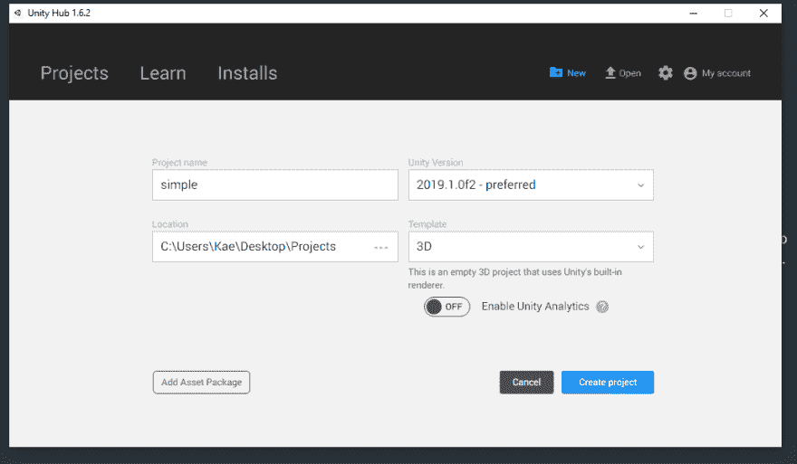
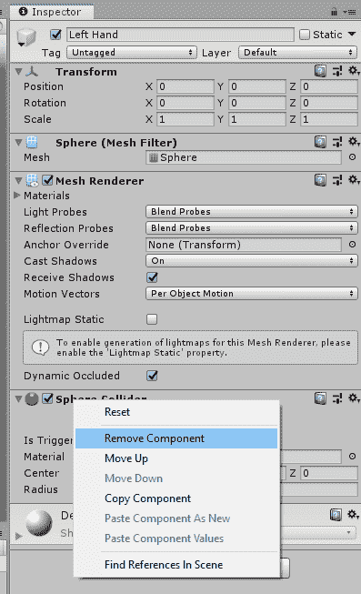
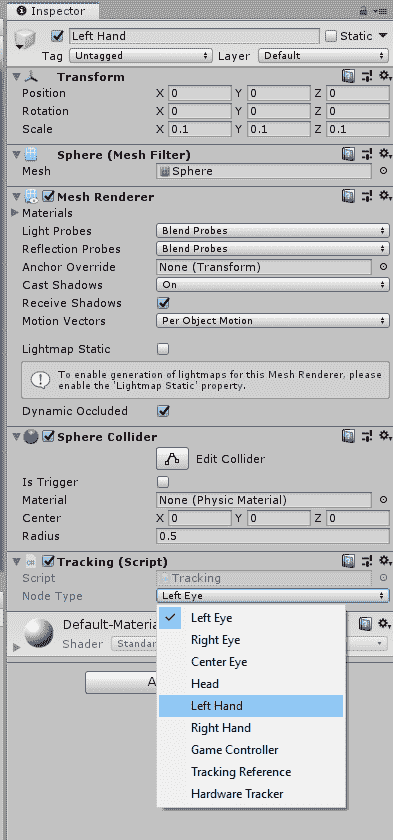

# 简单的 Unity VR 项目

> 原文：<https://dev.to/thereexistsx/simple-unity-vr-project-1lld>

*(交叉贴自我的[个人博客](https://expletive-deleted.com/simple-unity-vr-project/) )*

几个月来，我把所有的注意力都放在我的*秘密写作项目*上 <sup id="fnref1">[1](#fn1)</sup> 之后，我一直在滑回编码，并且在指南方面没有太多的分享。但是前几天我开始了一个小型的虚拟现实实验，想要建立一个只有 HMD 和简单的手部跟踪的东西，而不包括一大堆 Oculus 的东西。这是一个相当小的初级教程，但是关于用最基本的工具建立一个项目的大部分信息都藏在 YouTube 教程中，虽然我知道很多人发现在视频中学习一些东西是最容易的，但是我非常喜欢书面文字。

如果你只是想要代码，我把它们都放在这里的版本中，这样我就可以继续搞那个项目了。

这里有一个小的迷你指南来代替像注释代码这样负责任的事情。目标是避免使用任何耳机特定代码，但因为我只有一个裂缝，我只能确认它与裂缝。

首先，我用 3D 模板创建一个新项目:
[](https://res.cloudinary.com/practicaldev/image/fetch/s--mr1NlXm9--/c_limit%2Cf_auto%2Cfl_progressive%2Cq_auto%2Cw_880/https://expletive-deleted.com/conteimg/2019/05/simple01.PNG)

接下来，我进入“编辑”菜单，选择“项目设置”。我选择“玩家”标签，并勾选“支持虚拟现实”:
[](https://res.cloudinary.com/practicaldev/image/fetch/s--KwT7I7TI--/c_limit%2Cf_auto%2Cfl_progressive%2Cq_auto%2Cw_880/https://expletive-deleted.com/conteimg/2019/05/simple02.png)

在这一点上，如果我的裂缝是连接和功能正常，当我点击预览在 Unity 按钮主相机应该连接到我的 HMD，我可以看看这个项目。

对于手，我将首先创建一个空的，并使相机成为一个孩子和一个球体网格，我将命名为“左手”:
[](https://res.cloudinary.com/practicaldev/image/fetch/s--5CKjCn6v--/c_limit%2Cf_auto%2Cfl_progressive%2Cq_auto%2Cw_880/https://expletive-deleted.com/conteimg/2019/05/simple03.png)

然后我从左手拿走了碰撞器——你也可以选择缩小游戏物体，我发现`0.1`对于手来说是个很好的尺寸:
[](https://res.cloudinary.com/practicaldev/image/fetch/s--6VFdTxhm--/c_limit%2Cf_auto%2Cfl_progressive%2Cq_auto%2Cw_880/https://expletive-deleted.com/conteimg/2019/05/simple04.png)

现在，你会想要做一个新的剧本，我把我的叫做`Tracking.cs`。确保`using UnityEngine.XR;`中包含了 Unity 的 XR 工具，然后可以删除“`Start()`”方法，因为我们不需要它。整个脚本看起来是这样的:

```
using System.Collections;
using System.Collections.Generic;
using UnityEngine;
using UnityEngine.XR;

public class Tracking : MonoBehaviour {
    // Unity has some built in means to detect what sort of input device you're using
    public XRNode NodeType;

    void Update() {
        // Set the Transform's position and rotation based on the orientation of the motion controller
        transform.localPosition = InputTracking.GetLocalPosition(NodeType);
        transform.localRotation = InputTracking.GetLocalRotation(NodeType);
    }
} 
```

点击并拖动刚刚写好的脚本到左手网格上，将脚本上的公共`NodeType`设置为`Left Hand` :
[](https://res.cloudinary.com/practicaldev/image/fetch/s--0PGuiPLM--/c_limit%2Cf_auto%2Cfl_progressive%2Cq_auto%2Cw_880/https://expletive-deleted.com/conteimg/2019/05/simple06.png)

如果你复制我们已经做好的“左手”,重命名为“右手”,并将`NodeType`设置为“右手”。当你点击 play 时，你应该会看到两个球体跟踪到你的手上。

如果事情看起来或轨迹怪异，无论出于什么原因，尝试重置游戏对象的变换，如果手开始离你的脸很远，改变相机上的剪切平面。

这就是怎么做的。我稍后会回来修改这个，因为这是一个“边写边做”的项目，但希望有一些有用的信息。

* * *

1.  还在进行中。 [↩](#fnref1)