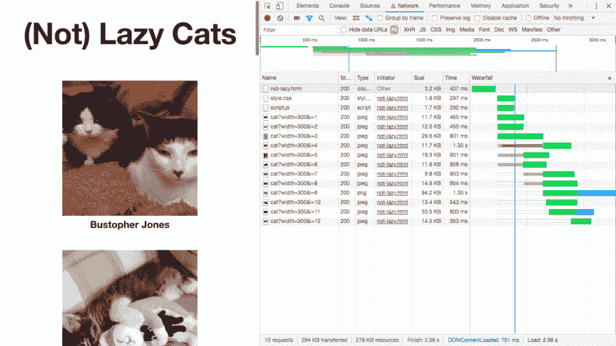
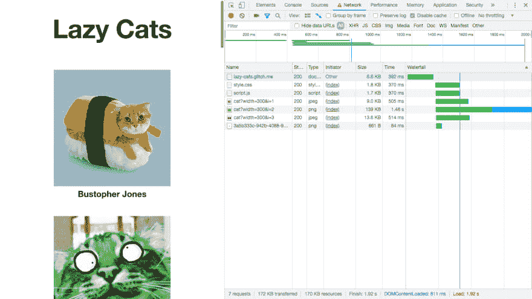
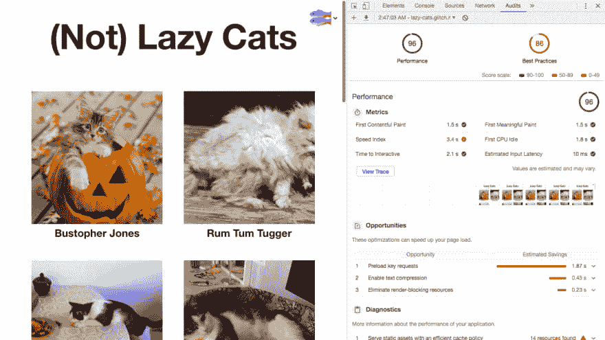

# 用普通 JavaScript 延迟加载图像

> 原文：<https://dev.to/ekafyi/lazy-loading-images-with-vanilla-javascript-2fbj>

*只需几行普通的 JavaScript 代码，通过交叉点观察器 API“延迟加载”图片，提高网站的速度和性能。*

**“懒加载”是一种技术，只在需要的时候——也就是当图像或视频出现在屏幕上的时候*才加载它们。如果你的页面包含 20 张图片，总大小为 5MB，但是你的用户只滚动到第三张图片，那么就没有必要立即请求并加载*所有的* 20 张图片。***

 **不偷懒加载你的图片就像点了菜单上的所有东西，却不知道你能吃多少。这可能会浪费时间、资源，以及用户的带宽(对移动数据用户来说，这相当于金钱)。

<figure>

[](https://res.cloudinary.com/practicaldev/image/fetch/s--xwzkL1wm--/c_limit%2Cf_auto%2Cfl_progressive%2Cq_auto%2Cw_880/https://thepracticaldev.s3.amazonaws.com/i/rllvlqv7mgxzoeij83hx.jpg)

<figcaption>Image from the film “Spirited Away” (2001)</figcaption>

</figure>

这曾经是一项麻烦的工作，包括添加/删除多个事件监听器以及比较大小和位置。但是多亏了[交集观察者 API](https://developer.mozilla.org/en-US/docs/Web/API/Intersection_Observer_API) ，它已经被[大多数现代浏览器](https://caniuse.com/#feat=intersectionobserver)支持，我们现在可以用不到 20 行 JavaScript 实现延迟加载！

在这篇文章中，我们正在构建一个实现延迟加载的图库。我们将用普通的 HTML、CSS 和 JS 来做这件事——没有库或依赖。有大量的延迟加载库和插件(我在这篇文章的最后包括了它们)，但是这是一种有趣的方式来理解交叉点观察器 API 是如何工作的，以及延迟加载是如何在最基础的层面上工作的。

你可以运行并“重新组合”下面 Glitch 上的代码。

[https://glitch.com/embed/#!/embed/lazy-cats?previewSize=100&path=index.html](https://glitch.com/embed/#!/embed/lazy-cats?previewSize=100&path=index.html)

***注意:**延迟加载也适用于视频，但这里我们关注的是图像。你可以在这篇文章的末尾找到更多的参考资料。*

* * *

## 实现延迟加载

简而言之，当我们加载图库页面时会发生以下情况:

1.  浏览器解析页面的 HTML 和 CSS，将它们结合起来构建一个渲染树。
2.  浏览器计算空间(元素大小、位置)并将像素绘制(呈现)到屏幕上。在此过程中，浏览器通常会请求并加载“折叠上方”的图像，并加载剩余图像的*占位符图像*。
3.  交叉点观察器 API 观察延迟加载的图像。当用户向每个图像滚动/跳转时，它会请求实际的图像并将占位符与实际的图像交换。

我们将使用以下文件:

*   `index.html` — HTML markup
*   `script.js`—JavaScript 代码
*   `style.css` —基本 CSS 样式

### `index.html`

#### 1。准备 HTML 标记

让我们从基本的 HTML 和 CSS 标记开始。我们正在制作一份猫的清单。每个`<li>`列表项包含猫的名字和图像。

```
<ul class="cats">
  <li class="cat">
    
    <strong class="cat__name">Bustopher Jones</strong>
  </li>
  <!-- etc -->
</ul> 
```

#### 1b。准备`<noscript>`回退

现在让我们*将每个``的*复制到一个`<noscript>`标签中，用于我们想要延迟加载的图像。因为我们希望正常加载前三个图像，所以我们从第五个项目开始加载。

```
<ul class="cats">
  <!-- cats #1 to 4 -->
  <!-- start lazy loading cat #5 onwards -->
  <li class="cat">
    
    <noscript>
      
    </noscript>
    <strong class="cat__name">Growltiger</strong>
  </li>
  <!-- etc -->
</ul> 
```

##### 🧐 *折？什么折叠？*

随着设备尺寸的不断变化，我们*实际上没有*像印刷一样“在折叠线以上”。想法是像往常一样加载第一个 x 图像(即立即)，因此将它们作为页面的“关键资产”包括在内，并将其余的作为非关键资产延迟加载。

使用您自己的判断力来决定哪些图像正常加载到您的页面上！

#### 2。制作图像`.lazy`

此时，我们已经有了没有延迟加载的常规图像。接下来，我们对我们想要惰性加载的每个``元素做三件事:

1.  添加一个额外的类，`.lazy`(随意使用任何名称)
2.  用占位符图像替换`src`属性值
3.  用图像源值添加一个`data-src`属性(即。猫的形象)

占位符图像可以是任何东西，只要它足够小。这里我用的是普通的 1x1px 灰色 PNG 图像。

```
<li class="cat">
  
  <noscript>
    
  </noscript>
  <strong class="cat__name">Growltiger</strong>
</li> 
```

💡 ***提示:**添加空的`alt`属性，这样屏幕阅读器就不会公布图像文件名。*

在页面底部关闭`</body>`之前，如果不支持或禁用 JavaScript，添加以下样式来隐藏`<noscript>`视图的重复图像。

```
<noscript>
  <style>.lazy { display: none; }</style>
</noscript> 
```

我们完成了 HTML 标记。确保我们在我们的`<head>`元素中调用我们的 JS 文件，例如`<script src="/script.js" defer></script>`，并进入下一步。

### `script.js`

#### 3。准备将运行交叉点观察器的函数

JS 文件的第一步是准备运行交叉点观察器的函数。

```
// Run after the HTML document has finished loading
document.addEventListener("DOMContentLoaded", function() {
  // Get our lazy-loaded images
  var lazyImages = [].slice.call(document.querySelectorAll("img.lazy"));

  // Do this only if IntersectionObserver is supported
  if ("IntersectionObserver" in window) {
    // ... write the code here
  }
}); 
```

这里发生了什么:

*   我们添加了一个事件监听器，用于检测 HTML 文档何时完成加载和解析。
*   然后，我们将图像定义为延迟加载——也就是说，使用类`.lazy`加载`img`个元素。
*   为了防止错误，设置一个条件，仅当浏览器支持交叉点观察器时才运行我们的函数。

#### 4。创建交叉点观察点

**交集观察者**是一个 JavaScript web API，顾名思义，当目标元素*与根/容器元素*相交时，*观察*(观察)。

交叉点观察器由以下部分组成:

*   *目标元素*——在这种情况下，我们的图像
*   *根/容器元素* —默认为 viewport(我们可以选择定义*目标*的任何父元素，这里不需要)
*   *回调函数*，当*目标*与*根*相交时运行——在这种情况下，我们用来自`data-src`的实际图像交换`src`值

创建新交叉点观察器对象的 API 是`new IntersectionObserver(callback, options)`。

*   `callback`是一个带两个参数的函数，`entries`和`observer`
*   `options`是包含选项的可选对象

现在我们创建一个名为`lazyImageObserver`的新观察者对象，并传递给它一个回调函数。我们在这里没有使用自定义选项。

```
if ("IntersectionObserver" in window) {
  // Create new observer object
  let lazyImageObserver = new IntersectionObserver(function(entries, observer) {
    // ... callback function content here
  });
} 
```

#### 5。观察目标元素

接下来，我们在刚刚创建的`lazyImageObserver`上调用`.observe()`方法来观察目标元素，即我们的每个`.lazy`图像。

```
if ("IntersectionObserver" in window) {
  // Create new observer object
  let lazyImageObserver = new IntersectionObserver(function(entries, observer) {
    // ... callback function content here
  });

  // Loop through and observe each image
  lazyImages.forEach(function(lazyImage) {
    lazyImageObserver.observe(lazyImage);
  });
} 
```

#### 6。用实际图像源替换占位符

现在我们要编写在第 4 步中留空的*回调函数*。当目标(我们的每个`.lazy`图像)通过根元素(即进入视口)。

回调接收一组`IntersectionObserverEntry`对象。每个`IntersectionObserverEntry`对象都有[几个属性](https://developer.mozilla.org/en-US/docs/Web/API/IntersectionObserverEntry)——为了我们的目的，当每个图像进入视口时，我们使用`.isIntersecting`将占位符图像替换为实际的图像源*。* 

```
if ("IntersectionObserver" in window) {
  // Create new observer object
  let lazyImageObserver = new IntersectionObserver(function(entries, observer) {
      // Loop through IntersectionObserverEntry objects
      entries.forEach(function(entry) {
        // Do these if the target intersects with the root
        if (entry.isIntersecting) {
          let lazyImage = entry.target;
          lazyImage.src = lazyImage.dataset.src;
          lazyImage.classList.remove("lazy");
          lazyImageObserver.unobserve(lazyImage);
        }
      });
  });

  // Loop through and observe each image
  lazyImages.forEach(function(lazyImage) {
    lazyImageObserver.observe(lazyImage);
  });
} 
```

当每个图像进入视区时会发生什么:

*   用`data-src`值(猫图像)替换`src`值(占位符图像)
*   移除`.lazy`类
*   任务完成，停止观察这个图像

#### 7。奖励:Opera Mini“极限模式”回退

手机浏览器 Opera Mini 有一个名为“极限模式”的浏览模式，它使用一个“代理”服务器来压缩*和*将所有数据转换为 Opera 自己的格式，称为 OBML，然后发送到浏览器。

该模式*在某种程度上不支持 JS，因此`<noscript>`不适用。但是，我们的外部 JS 文件在这里不起作用，所以我在这里使用了一个基本的后备方法，用实际的图像替换占位符图像。如果你的用户中有相当比例的人使用 Opera Mini，请注意这一点。* 

```
<script>
  (function() {
    "use strict";
    if ("IntersectionObserver" in window) {
    } else {
      // `document.querySelectorAll` does not work in Opera Mini
      var lazyImages = document.getElementsByClassName("lazy");
      // https://stackoverflow.com/questions/3871547/js-iterating-over-result-of-getelementsbyclassname-using-array-foreach
      [].forEach.call(lazyImages, function (lazyImage) {
        lazyImage.src = lazyImage.dataset.src;
        lazyImage.classList.remove("lazy");
        lazyImage.height = 'auto';
      });
    }
  })();
</script> 
```

#### 8。就是这样！

除非您的图像异常沉重和/或您的用户的互联网连接太慢，否则用户可能甚至不会注意到这种差异。🤷🏽‍♀️:也就是说，他们很可能会更快地找到你的网站，花费也更少。

* * *

## 结果

我们将使用 Chrome DevTools(如果您喜欢，Firefox 和 Safari 中也有类似的工具)来检查带有惰性加载图像的页面和普通图像之间的差异，特别是*网络*和*审计*面板。

### 网络

[](https://res.cloudinary.com/practicaldev/image/fetch/s--u9ulBPIZ--/c_limit%2Cf_auto%2Cfl_progressive%2Cq_auto%2Cw_880/https://thepracticaldev.s3.amazonaws.com/i/6328rllrmxtzifw40psx.png)

无延迟加载:

*   15 个请求
*   **已转移 284 KB**
*   完成(负载): **2.56 秒**
*   HTML 文件大小: **3.2 KB**

[](https://res.cloudinary.com/practicaldev/image/fetch/s--itUB2ok5--/c_limit%2Cf_auto%2Cfl_progressive%2Cq_auto%2Cw_880/https://thepracticaldev.s3.amazonaws.com/i/688zncwb66234rca9gj3.png)

延迟加载:

*   **7** 请求➡️ 8 请求更少
*   **172 KB** 被转移的➡️小了 112 KB
*   完赛(加载): **1.92 秒** ➡️快了 0.64 秒
*   HTML 文件大小: **6.6 KB** ➡️ 3.4 KB *更大*(由于更多的标记)

💡请记住，*加载*时间受多种因素影响，而不仅仅是图像内容。

当我们向下滚动时，浏览器对剩余的图像进行后续请求。

[](https://res.cloudinary.com/practicaldev/image/fetch/s--4ByaseoR--/c_limit%2Cf_auto%2Cfl_progressive%2Cq_auto%2Cw_880/https://thepracticaldev.s3.amazonaws.com/i/cq87b3heox0rit3zv6ls.png)

### 审计(灯塔)

[](https://res.cloudinary.com/practicaldev/image/fetch/s--T1MxNEIo--/c_limit%2Cf_auto%2Cfl_progressive%2Cq_auto%2Cw_880/https://thepracticaldev.s3.amazonaws.com/i/5j6dfl184n5k7dmpij6d.png)

无延迟加载:

*   性能: **96**
*   互动时间: **2.1 秒**
*   第一次有意义的绘画: **1.5 s**

[](https://res.cloudinary.com/practicaldev/image/fetch/s--Hg8Kpooa--/c_limit%2Cf_auto%2Cfl_progressive%2Cq_auto%2Cw_880/https://thepracticaldev.s3.amazonaws.com/i/zbjaxpz7ndszgvpimblh.png)

延迟加载:

*   性能: **100**
*   互动时间: **1.9 秒**
*   第一次有意义的绘画: **0.6 秒**

总之，用 Intersection Observer API 延迟加载图像通常会提高页面速度和性能，但会使 HTML 代码稍微变大。这篇文章旨在展示最基本的实现；请务必查看下一部分，了解更多想法和参考资料。

感谢阅读！

* * *

## 参考文献

*   延迟加载库
    *   [懒惰](https://github.com/aFarkas/lazysizes)
    *   [易化](https://github.com/verlok/lazyload)易化
    *   特定平台的插件:
        *   6 个惰性加载插件让你的 WordPress 站点更快
        *   [盖茨比形象](https://www.gatsbyjs.org/packages/gatsby-image)和[盖茨比评论形象](https://www.gatsbyjs.org/packages/gatsby-image)
*   惰性加载增强
    *   [intersect observer poly fill](https://github.com/w3c/IntersectionObserver/tree/master/polyfill)—W3C
    *   [偷懒加载图片和视频](https://developers.google.com/web/fundamentals/performance/lazy-loading-guidance/images-and-video) —杰里米·瓦格纳
    *   [如何使用 SVG 作为占位符，以及其他图像加载技术](https://jmperezperez.com/svg-placeholders/) — José M. Pérez
    *   面向 web 的本地映像延迟加载！ —艾迪·奥斯马尼
        *   🚧发展中；仅在 Chrome 75 中可用，必须在`chrome://flags`下手动启用
*   其他图像优化策略
    *   [响应图像](https://developer.mozilla.org/en-US/docs/Learn/HTML/Multimedia_and_embedding/Responsive_images) — MDN
    *   [优化您的图像](https://web.dev/fast#optimize-your-images) — wev.dev
*   关于交叉点观察器
    *   [路口观察器 API](https://developer.mozilla.org/en-US/docs/Web/API/Intersection_Observer_API) — MDN
    *   [信任很好，观察更好—路口观察者 v2](https://developers.google.com/web/updates/2019/02/intersectionobserver-v2) —托马斯·斯坦纳**