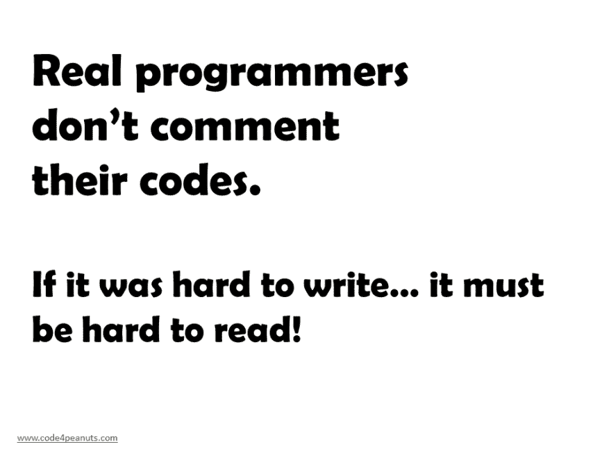
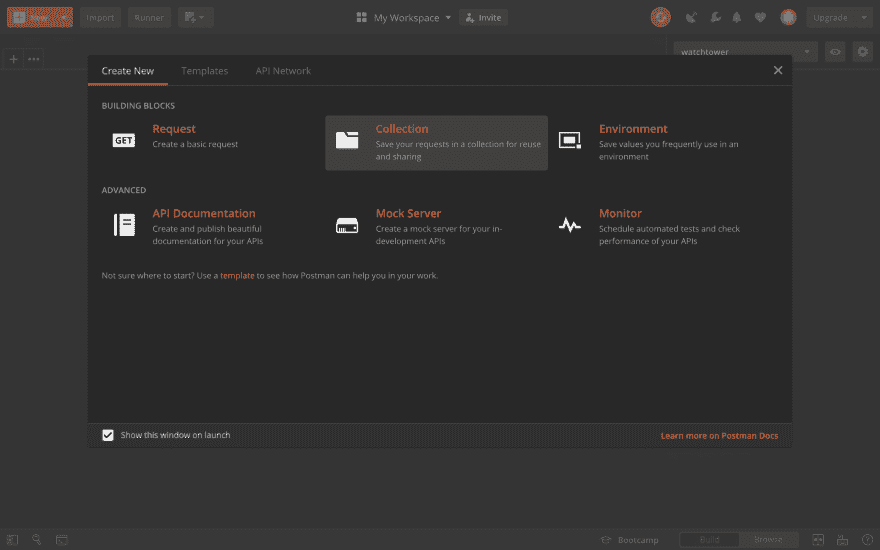
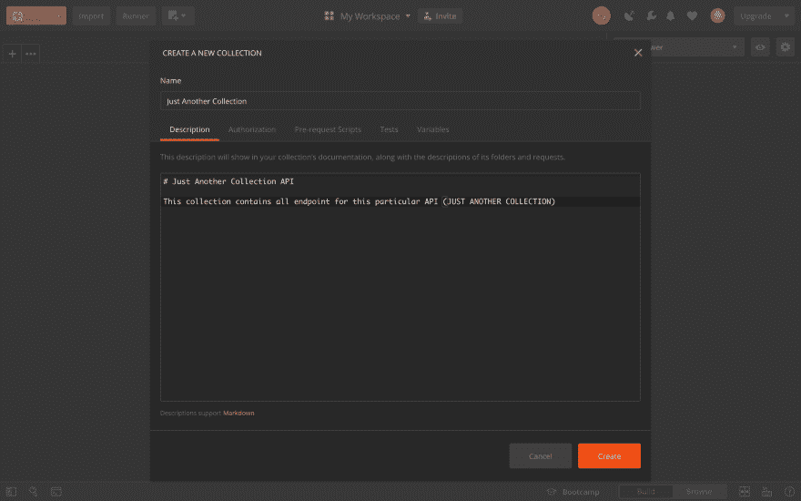
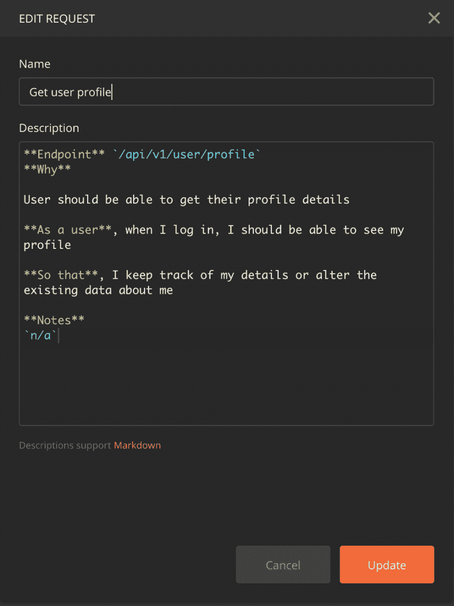
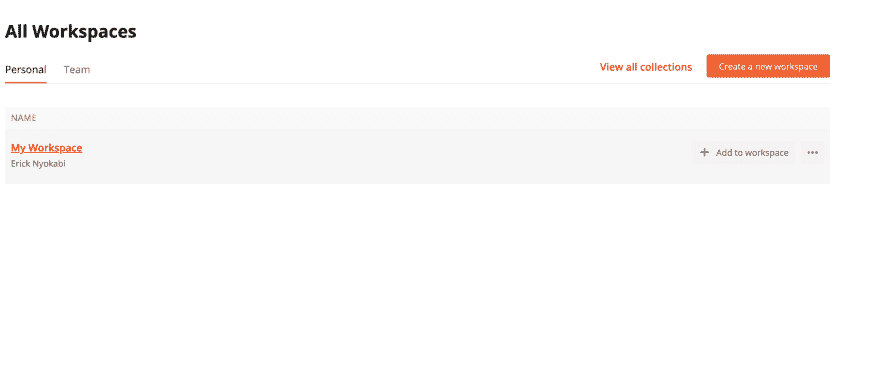
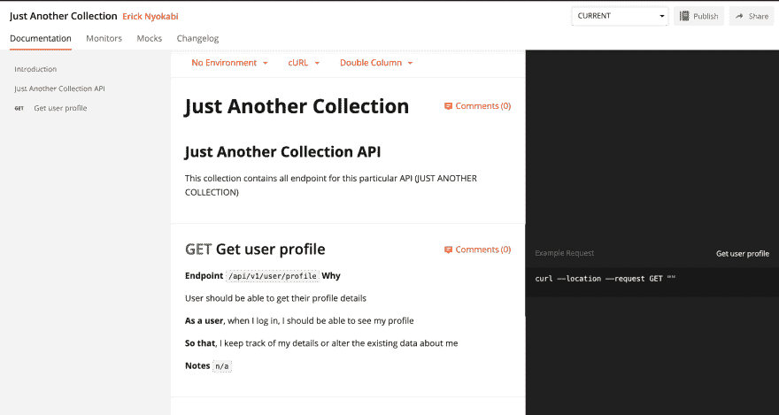
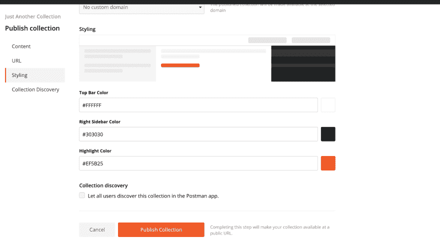
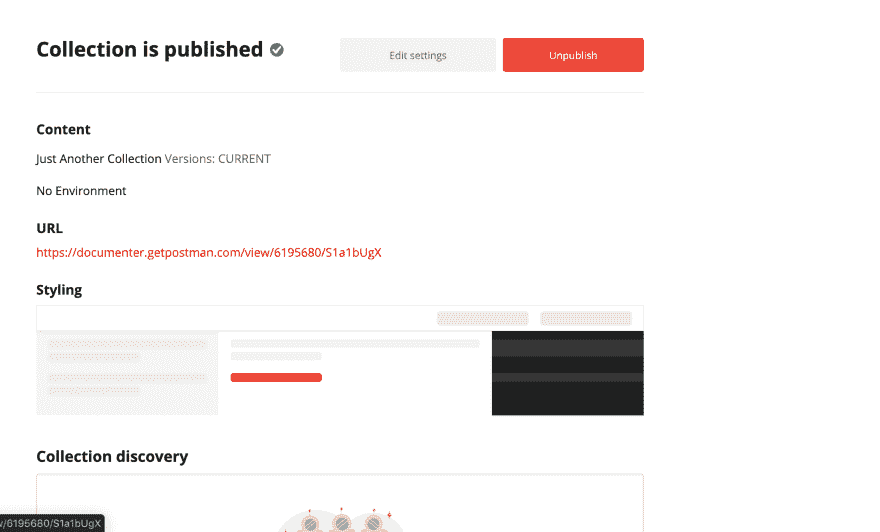

# 为什么您应该记录您的代码。

> 原文：<https://dev.to/wchr/why-you-should-document-your-code-280o>

## 简史

一年前，我用 Flask 构建了一个电子商务 API，并在前端用 React 使用它。这是我第一次构建一个前端和后端非常分离的 web 应用程序，因为之前我会使用模板引擎，如 Flask 的`Jinja`和 Express 的`Handlebars`。那是我刚开始编程的时候，我精力充沛，有时很无知。我记得看到过这样一个迷因或陈述:

[](https://res.cloudinary.com/practicaldev/image/fetch/s--28V9bJOx--/c_limit%2Cf_auto%2Cfl_progressive%2Cq_auto%2Cw_880/https://cdn.hashnode.com/res/hashnode/image/upload/v1561277377793/xZ28rZnzi.png)

那时候，我习惯于遵循这一声明的核心。如果有人后来问我某一行代码是做什么的，我会完全说出其中的逻辑，因为代码仍然新鲜，并且在我的脑细胞网络中流动。

## 余波

后来大约 8 个月，我开始对用 express 构建 API 感兴趣，所以我做的第一件事就是尝试用`express`而不是`Flask`构建一个类似的`e-commerce` `API`。我并排打开了两个编辑器。一个装有烧瓶，另一个装有空的 express API。这背后的想法是提高我的 express API 技能，如果我能翻译一个 Flask API 来表达，那么我就是黄金。

花了一个小时看完 Flask API 代码，我就想**这是什么魔法**:

[](https://i.giphy.com/media/B0RIXzGCT32Xm/giphy.gif)

所以我休息了一下，然后我想我大概在`Postman`上写了一些关于这些端点的东西。这绝对是我脸上的表情:

[](https://i.giphy.com/media/oYtVHSxngR3lC/giphy.gif)

我曾经保存了一个只有简单端点的邮递员集合，没有说明他们做什么或者需要什么。我不知道哪些端点需要认证，而且从变量名到类名，浏览 Flask API 简直是一团糟。有一个我命名为`c`的变量，我在做什么？我赶紧关闭了 Flask API 编辑器和邮差。

[](https://i.giphy.com/media/R6qJk6EilMJUI/giphy.gif)

我再也没有打开 API，原因是缺乏文档。

## 你如何记录你的代码？

这其实很简单，你可以用各种方式记录你的代码:

*   *写评论*:我确实把我的口头禅从*真正的程序员不评论他们的代码*改成了*快速描述不会伤害*。注释你的代码不仅会使你的开发更快更容易，还会让你对代码的逻辑记忆犹新。

```
// @route: Gets all profiles
route.get("/profiles", (req, res, next) => {
// ...
} 
```

<svg width="20px" height="20px" viewBox="0 0 24 24" class="highlight-action crayons-icon highlight-action--fullscreen-on"><title>Enter fullscreen mode</title></svg> <svg width="20px" height="20px" viewBox="0 0 24 24" class="highlight-action crayons-icon highlight-action--fullscreen-off"><title>Exit fullscreen mode</title></svg>

*   描述性的变量、函数和类名:如果你在代码中命名了任何东西，让它成为描述性的，即使你缺少注释，这个名字仍然可以让你知道发生了什么

```
 let c; // ❌This is wrong as we don't know what is c. Is it the cart, checkout

 let cart; // ✅Now this is more descriptive

 const fetchData = () => {} // ❌ This function name does not say anything at all

 const fetchProfileData = () => {} // ✅ This function here tells as that this method fetches profile data 
```

<svg width="20px" height="20px" viewBox="0 0 24 24" class="highlight-action crayons-icon highlight-action--fullscreen-on"><title>Enter fullscreen mode</title></svg> <svg width="20px" height="20px" viewBox="0 0 24 24" class="highlight-action crayons-icon highlight-action--fullscreen-off"><title>Exit fullscreen mode</title></svg>

*   *记录你的 API* :如果你有一个 API，也许你正在使用像`Postman`或`Insomnia`这样的工具来测试你的端点，给它描述性的文档可能不会伤害你。

    ##### 如何用 Postman 记录你的代码

    *   总是创建一个集合来存放所有的 API 端点

    [](https://res.cloudinary.com/practicaldev/image/fetch/s--Cwj9xyFJ--/c_limit%2Cf_auto%2Cfl_progressive%2Cq_auto%2Cw_880/https://cdn.hashnode.com/res/hashnode/image/upload/v1561280120457/DOQdu6_87.png)

    [](https://res.cloudinary.com/practicaldev/image/fetch/s--eW90QmbV--/c_limit%2Cf_auto%2Cfl_progressive%2Cq_auto%2Cw_880/https://cdn.hashnode.com/res/hashnode/image/upload/v1561280128881/7hRFGFcyz.png)

    [](https://res.cloudinary.com/practicaldev/image/fetch/s--hRguyu6P--/c_limit%2Cf_auto%2Cfl_progressive%2Cq_auto%2Cw_880/https://cdn.hashnode.com/res/hashnode/image/upload/v1561280134599/1sc8zxa-X.png)

    *   始终记录您添加到集合中的每个请求

    [](https://res.cloudinary.com/practicaldev/image/fetch/s--BlQ7nIx---/c_limit%2Cf_auto%2Cfl_progressive%2Cq_auto%2Cw_880/https://cdn.hashnode.com/res/hashnode/image/upload/v1561280531716/93Xg0hqr4.png)

    [](https://res.cloudinary.com/practicaldev/image/fetch/s--VvVJ365j--/c_limit%2Cf_auto%2Cfl_progressive%2Cq_auto%2Cw_880/https://cdn.hashnode.com/res/hashnode/image/upload/v1561280537187/d8fiF7gaZ.png)

## 记录代码的优势

*   *更快的开发*:记录你的代码和 API 端点将会节省你大量的时间来进行更新，轻松地填充和修复 bug，还可以让你见到你的女朋友或男朋友，或者和家人一起放松😁。
*   *更轻松的协作*:假设你对你的项目进行开源，你希望开发者社区帮助你构建和发布你的项目，你不想用不可读的代码吓跑他们。
*   快速获得反馈:如果你使用像 Postman 这样的工具，你可以在网上分享你的文档，这样人们可以测试它并立即给你反馈。

    ##### 如何共享邮递员文档

    *   你必须首先在你的电脑上注册/登录到 postman
    *   访问他们的官方网站，登录
    *   点击您的工作区

    [](https://res.cloudinary.com/practicaldev/image/fetch/s--EWKhdUx4--/c_limit%2Cf_auto%2Cfl_progressive%2Cq_auto%2Cw_880/https://cdn.hashnode.com/res/hashnode/image/upload/v1561281710079/z15ceu2Rk.png)

    *   点击收藏选项卡
    *   点击你的收藏，如果你可能会注意到有一个收藏说明，解释它包含什么。
    *   您将被重定向到一个包含所有端点的页面，在这里您可以测试您的功能。
    *   从那里，您可以选择发布您的文档或邀请用户到您的工作区。如果您点击`Publish`，您将获得一个公共链接，您可以在其中与您的朋友分享来测试它。如果您选择`Share`，您将可以访问您的所有收藏，甚至那些您可能不想公开的收藏。

    [](https://res.cloudinary.com/practicaldev/image/fetch/s--1cVzzt0u--/c_limit%2Cf_auto%2Cfl_progressive%2Cq_auto%2Cw_880/https://cdn.hashnode.com/res/hashnode/image/upload/v1561282219679/cDLJsEo7q.png) 
    [](https://res.cloudinary.com/practicaldev/image/fetch/s--lmHfFZnI--/c_limit%2Cf_auto%2Cfl_progressive%2Cq_auto%2Cw_880/https://cdn.hashnode.com/res/hashnode/image/upload/v1561282224995/uF3jYo6-5.png) 
    这里是我们刚刚创建的集合的[链接](https://documenter.getpostman.com/view/6195680/S1a1bUgX)。

Postman 不是唯一可以用来记录 API 的工具，还有:

*   [大摇大摆](https://swagger.io/)
*   [养蜂场](https://apiary.io/)
*   ApiBlueprint 等等。

## 总结

在本文中，我们能够:

*   了解为什么文档很重要
*   列出如何记录代码的技巧
*   列出如何用 Postman 之类的工具记录 API 端点的技巧。

## 接下来

在下一篇文章中，我将重点介绍从 PR 到 commits 的 Github 文档。