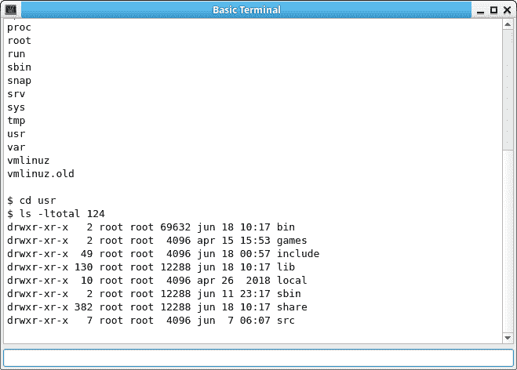

# 编写终端模拟器(用 Python)

> 原文：<https://dev.to/petercour/writing-a-terminal-emulator-in-python-38d2>

编写一个终端模拟器是相当具有挑战性的。现代终端模拟器有许多功能，像标签或多个窗口，缩放和其他。

但是，有许多功能可以添加到终端模拟器中。例如图像查看功能、播放视频等等。

为了好玩，我创建了自己的终端模拟器。从某种意义上说，它是非常基本的，它只获取和输入命令输出。

此时，它无法运行一些编辑器，如 nano、emacs。这是因为它只使用命令输出。为了实现这一点，我认为它需要 stdout/stdin。

因为使用一个 QTextBrowser，它支持在终端中添加 html。

这是非常实验性的，但只是为了好玩:)

资源:

*   [https://github.com/petercour/terminal-emulator-example-pyqt](https://github.com/petercour/terminal-emulator-example-pyqt)
*   [https://pythonbasics.org/pyqt/](https://pythonbasics.org/pyqt/)
*   [https://pythonprogramminglanguage.com/pyqt/](https://pythonprogramminglanguage.com/pyqt/)