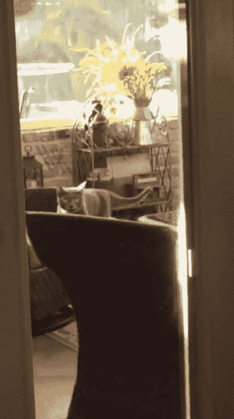
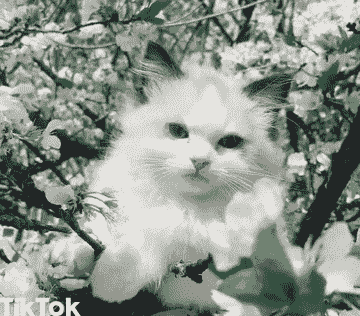
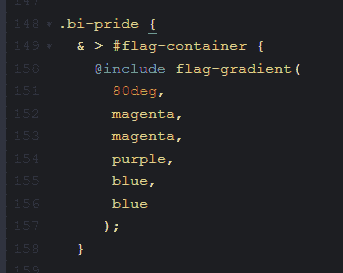
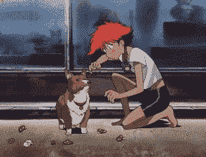
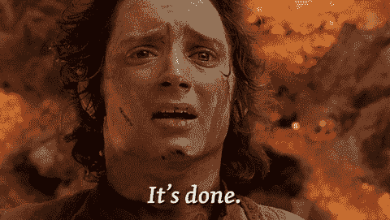

# 如何在 CSS 中制作文本渐变动画

> 原文：<https://dev.to/tchaflich/how-to-actually-animate-a-text-gradient-in-css-3a33>

*克里斯多佛罗拉通过 Unsplash 拍摄的封面照片。*

既然你们都喜欢我的[彩虹色蹒跚怪物](https://dev.to/tchaflich/today-i-learned-how-to-animate-a-text-gradient-in-css-and-javascript-2ehp)，我认为它值得第二次摇摆。感谢 [@erinjzimmer](https://dev.to/erinjzimmer) 让我知道可以通过动画`background-position`来制作渐变背景。

因此，与其写一篇幽默的文章，让我尽可能地做出技术上最糟糕的功能性 CSS，不如让它变得不那么糟糕。我发誓，这次我用的唯一的 JavaScript 是按钮。

我没有问题，我可以随时停下来。

[https://codepen.io/tchaflich/embed/mZWoOe?height=600&default-tab=result&embed-version=2](https://codepen.io/tchaflich/embed/mZWoOe?height=600&default-tab=result&embed-version=2)

既然上次我们弄清楚了彩虹文字的获取方法，那就跳到好的部分吧。

## 动画背景位置

为了使用这种过渡，我很可能不得不采取与上一篇文章类似的策略( *yikes* )来确保渐变持续向一个方向移动。但是我决定使用`@keyframes`，而不是经历所有这些努力，结果证明这就像在提交之前忘记添加文件一样简单。

```
@keyframes whoosh {
  0% { background-position-x: 0 }
  100% { background-position-x: 100% }
}

.animated-thing {
  animation-name: whoosh; // references @keyframes name
  animation-duration: 2000ms; // or whatever
  animation-timing-function: linear;
  animation-iteration-count: infinite;
} 
```

<svg width="20px" height="20px" viewBox="0 0 24 24" class="highlight-action crayons-icon highlight-action--fullscreen-on"><title>Enter fullscreen mode</title></svg> <svg width="20px" height="20px" viewBox="0 0 24 24" class="highlight-action crayons-icon highlight-action--fullscreen-off"><title>Exit fullscreen mode</title></svg>

不过，为了让这个看起来更好，需要提到一个重要的注意事项。

[https://codepen.io/tchaflich/embed/QXvwJR?height=600&default-tab=result&embed-version=2](https://codepen.io/tchaflich/embed/QXvwJR?height=600&default-tab=result&embed-version=2)
*A-我...。卡维特？是吗？*

猫图像宽 200px，窗口宽要么 400px，要么 500px。(点击切换。)当容器为 400px 宽时，动画是平滑的，你不会注意到它在循环时突然重置到开头。当宽度为 500 像素时，动画的结尾偏移 100 像素，跳跃*非常*明显。

使用 gif 进行说明:

[](https://i.giphy.com/media/82CItLnbSh8hzsXK3H/giphy.gif)

当循环复位时，它处于开始时的相同位置，使得循环不太明显。(可能还会有*一跳*，但应该很小。)

[](https://i.giphy.com/media/U7P0B9vQmKNZFzDr6e/giphy.gif)

尽管这个毛茸茸的云朋友很可爱，但由于镜头在最后一刻急剧向下，跳跃非常明显。会拍猫，不会流畅动画。

另一个问题是，在这种情况下，将背景的宽度设置为与容器的宽度完全相同会导致背景没有动画效果。我猜 CSS 认为自己无路可走了！所以它需要是某个确切的分数或确切的倍数，但不能是等于 T3 的 T2。它需要重新设置到它开始的位置。

## 动画背景位置*带渐变*

[https://codepen.io/tchaflich/embed/qzmdOV?height=600&default-tab=result&embed-version=2](https://codepen.io/tchaflich/embed/qzmdOV?height=600&default-tab=result&embed-version=2)

为了让 CSS 实际上动画它，我设置`background-size`为 200%宽度(和 100%高度)。那是容易的部分。

为了让渐变平滑的动画*更棘手。* 

 *```
 $first-color: #996699;
  $second-color:  #B39500;
  $third-color:  #009980;
  $fourth-color: #006699;
  $angle: 75deg;

  background-image: linear-gradient(
    $angle,
    // so you can see the repetition of colors easily
    $first-color,
    $second-color,
    $third-color,
    $fourth-color,
    // repeat a second time
    $first-color,
    $second-color,
    $third-color,
    $fourth-color,
    // back to the first color
    $first-color
  );
} 
```

<svg width="20px" height="20px" viewBox="0 0 24 24" class="highlight-action crayons-icon highlight-action--fullscreen-on"><title>Enter fullscreen mode</title></svg> <svg width="20px" height="20px" viewBox="0 0 24 24" class="highlight-action crayons-icon highlight-action--fullscreen-off"><title>Exit fullscreen mode</title></svg>

这就是渐变的设置方式，这样当循环复位时就不会出现“跳跃”。它需要重复两次，而且还要重复循环的第一位。在最后的笔中，这变成了一个 mixin。

```
@mixin flag-gradient($direction: null, $color-stops...) {
  $grads: $color-stops;
  @each $stop in $color-stops {
    $grads: append($grads, $stop);
  }
  $grads: append($grads, nth(nth($grads, 1), 1));

  // [ clipped ]

  background-image: linear-gradient($direction, $grads);
} 
```

<svg width="20px" height="20px" viewBox="0 0 24 24" class="highlight-action crayons-icon highlight-action--fullscreen-on"><title>Enter fullscreen mode</title></svg> <svg width="20px" height="20px" viewBox="0 0 24 24" class="highlight-action crayons-icon highlight-action--fullscreen-off"><title>Exit fullscreen mode</title></svg>

这为你做了所有的重复工作。它复制传入的 arg 列表，然后循环遍历该列表以追加每个新的色标(如果您知道更好的方法来完成这一部分的话，hmu)，然后挑选出第一个色标的颜色部分并将其附加到末尾。这样你只需要指定你实际的旗帜颜色。

还要注意你设置坡度的角度——坡度越陡，跳跃就越明显。75 度到 90 度之间的某个角度几乎看不见，但看起来仍然足够倾斜，具有美感。宽度越小，这个角度也需要越大。90 安全！

如果你在 dev.to 上查看内嵌笔，你会看到 90 度的变体，因为这个位:

```
@mixin flag-gradient($direction: null, $color-stops...) {
  // [ clipped ]

  @if $direction == null {
    $direction: 75deg;
    @media only screen and  (max-width : 800px) {
      $direction: 80deg;
    }
    @media only screen and  (max-width : 500px) {
      $direction: 90deg;
    }
  }

  // [ clipped ]
} 
```

<svg width="20px" height="20px" viewBox="0 0 24 24" class="highlight-action crayons-icon highlight-action--fullscreen-on"><title>Enter fullscreen mode</title></svg> <svg width="20px" height="20px" viewBox="0 0 24 24" class="highlight-action crayons-icon highlight-action--fullscreen-off"><title>Exit fullscreen mode</title></svg>

由于动画质量根据角度和宽度变化很大，如果你不发送覆盖，我会自动调整。

## 添加更多旗帜🏳️‍🌈(重构)

在我制作了最初的彩虹动画后，看起来...太容易了。在与 CSS 的永恒斗争中，我需要更加努力。我想知道，这能被推广吗？我能表现出更多的骄傲吗？

[](https://res.cloudinary.com/practicaldev/image/fetch/s--CZgbKk3A--/c_limit%2Cf_auto%2Cfl_progressive%2Cq_auto%2Cw_880/https://thepracticaldev.s3.amazonaws.com/i/wq4lbxq9kusqsbl8wleh.PNG)

在 bi pride flag 中，我发现了另一个有趣的警告。为了使跳跃不那么明显，渐变应该尽可能平滑。使用基于百分比的色标通常效果不佳；简单地复制颜色会有更好的效果。

[](https://res.cloudinary.com/practicaldev/image/fetch/s--RoMa92UC--/c_limit%2Cf_auto%2Cfl_progressive%2Cq_auto%2Cw_880/https://thepracticaldev.s3.amazonaws.com/i/bt2jyk8b1wd14h8c2866.png)

嗯，我真的想在那里看到一个文本阴影，使白色部分不要融入背景太多。白色出现在一些不同的旗帜上，所以这肯定是一个普遍问题。

[](https://res.cloudinary.com/practicaldev/image/fetch/s--_I830Oj2--/c_limit%2Cf_auto%2Cfl_progressive%2Cq_auto%2Cw_880/https://thepracticaldev.s3.amazonaws.com/i/x6hu8uw9c1rn821x0qlh.png) 
*进展顺利。*

如果你仔细想想，这实际上是完全符合逻辑的。渐变文本技巧工作的全部原因首先是使文本本身透明，并剪切背景；而不是通过对文本应用背景。

我确实想解决这个问题。 [StackOverflow](https://stackoverflow.com/a/28750655) 建议:

> 基本上，这个想法是让 2 个 div 互相重叠。下面一个提供背景和阴影。上面的 div 只是使用一个遮罩从背景图像中剪切出完全相同的文本，以便它覆盖较低元素的文本，但不覆盖阴影:

#### 2 div 互相过招

### 2 div 互相过招

## 2 div 互相过招

[](https://res.cloudinary.com/practicaldev/image/fetch/s--VTPopjxU--/c_limit%2Cf_auto%2Cfl_progressive%2Cq_auto%2Cw_880/https://media.tenor.img/60d6ac6564c529d7c964aa9e66c62bce/raw)

不要再走那条路了！你不能逼我！

[](https://res.cloudinary.com/practicaldev/image/fetch/s--5R1v86Jt--/c_limit%2Cf_auto%2Cfl_progressive%2Cq_auto%2Cw_880/https://thepracticaldev.s3.amazonaws.com/i/civo96oh90vugll6ajqq.png)

够近了。

在尝试了各种国旗图案和颜色之后，我决定需要四种不同的“主题”，分别是亮/暗和暖/冷。这就是这一切的目的:

```
$background-map: (
    light-cool: #ecf0f1,
    light-warm: #f2eded,
    dark-cool: #10181e,
    dark-warm: #0e070a,
);

@function get-opposite-tone($tone) {
  @if $tone == 'light' {
    @return 'dark';
  }
  @return 'light';
}

@mixin set-background($tone: 'light', $temp: 'cool') {
  $primary: null;
  $secondary: null;

  background-color: map-get($background-map, #{$tone}-#{$temp});
  & > #picker > button {
    background-color: map-get($background-map,
      #{get-opposite-tone($tone)}-#{$temp}
    );
    &.highlight {
      @if $tone == 'light' {
        background-color: lighten(map-get($background-map,
        #{get-opposite-tone($tone)}-#{$temp}
      ), 12);
      } @else {
        background-color: darken(map-get($background-map,
          #{get-opposite-tone($tone)}-#{$temp}
        ), 24);
      }
    }
    color: map-get($background-map, #{$tone}-#{$temp});
  }

  // [ clipped ]
} 
```

<svg width="20px" height="20px" viewBox="0 0 24 24" class="highlight-action crayons-icon highlight-action--fullscreen-on"><title>Enter fullscreen mode</title></svg> <svg width="20px" height="20px" viewBox="0 0 24 24" class="highlight-action crayons-icon highlight-action--fullscreen-off"><title>Exit fullscreen mode</title></svg>

此时，我只需要 8 行 JavaScript(...加上 jQuery)来连接按钮。

[](https://i.giphy.com/media/zCME2Cd20Czvy/giphy.gif)

### 总结有趣的事实

*   侧面的按钮使用 [CSS 网格](https://developer.mozilla.org/en-US/docs/Web/CSS/grid)进行布局，非常简单方便
*   你知道没有一面标准的“拉拉”骄傲旗吗？我选择了口红拉拉旗，因为这很容易找到颜色定义，而且似乎是最受欢迎的
*   SCSS [arglists](https://www.sitepoint.com/sass-multiple-arguments-lists-or-arglist/) 是一个东西
*   你不能把一个`@media`查询语句放在一个`@function`里面(lmao 我只是想看看它*是否能*工作，但是编译器抛出了一个异常)

[](https://res.cloudinary.com/practicaldev/image/fetch/s--4wk8HZMj--/c_limit%2Cf_auto%2Cfl_progressive%2Cq_66%2Cw_880/https://thepracticaldev.s3.amazonaws.com/i/yqjqx5hp8n7oiy2swelh.gif)*