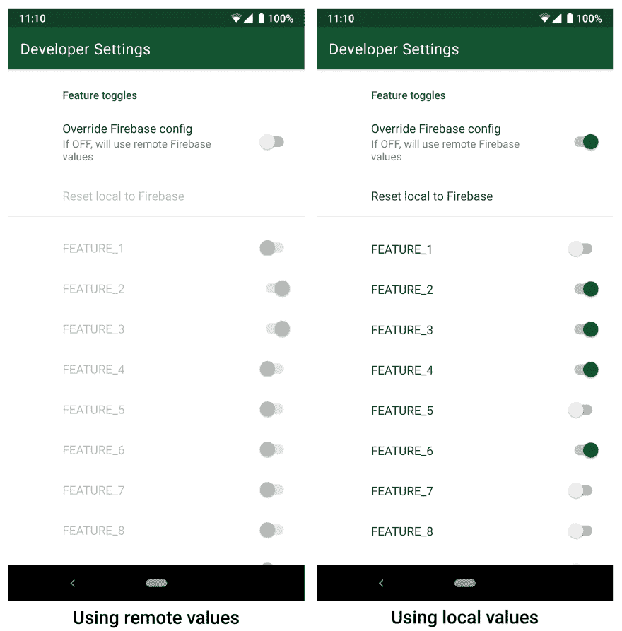

# 设备上调试第一部分:现在打开，现在关闭

> 原文：<https://dev.to/zmdominguez/on-device-debugging-part-i-now-it-s-on-now-it-s-off-2bbe>

在过去的一年里，我的团队一直在为我们的应用程序构建一个开发者选项屏幕。这是一个简单的 [`PreferenceScreen`](https://developer.android.com/reference/androidx/preference/PreferenceScreen.html) ，可以在调试版本中获得，旨在帮助我们:

*   不需要连接到电脑就能知道发生了什么
*   无需重新安装即可测试各种配置
*   主持我们正在尝试探索的各种实验

在这一系列的帖子中，我将分享这些不同的选项是什么，以及我们是如何做出它们的。

(如果你不熟悉 [`PreferenceFragmentCompat`](https://developer.android.com/reference/kotlin/androidx/preference/PreferenceFragmentCompat.html) ，我强烈建议在继续之前先阅读一下。你可以从这个 [AndroidX 指南](https://developer.android.com/guide/topics/ui/settings.html)开始设置。)

* * *

在 Woolworths，我们经常使用[特征标志](https://en.wikipedia.org/wiki/Feature_toggle)。它帮助我们更快地将代码合并到 master，允许我们的 QA 团队更快地提供反馈，并帮助管理重要发布时的风险。

我们使用 [Firebase 远程配置](https://firebase.google.com/docs/remote-config)来管理我们现有的功能标志，这使我们和我们的产品所有者能够非常容易地控制这些标志。

虽然远程配置这些标志非常方便，但对于没有控制台访问权限的人来说，这也使得对功能标志背后的东西进行快速测试变得困难。如果有人在不知情的情况下远程更改了这些标志的值，也可能会中断某人的工作。

正是因为这个原因，我们引入了局部特征切换。这使得任何调试版本的人都能够在不影响其他人的版本的情况下打开或关闭任意多的功能。

<small>Names changed to protect individuals 😅</small>

在全新安装时，应用程序将使用我们设置的[应用程序内默认值](https://firebase.google.com/docs/remote-config/use-config-android#set-in-app-default-parameter-values)，并且覆盖开关关闭。该应用程序将继续使用 Firebase 提供的值，直到覆盖开关被翻转。

当它变得令人困惑并且我们想要重新开始时,“重置本地到 Firebase”按钮会把标志变回 Firebase 所提供的。

此列表中的所有功能都是从保存所有功能标志的枚举中动态添加的: