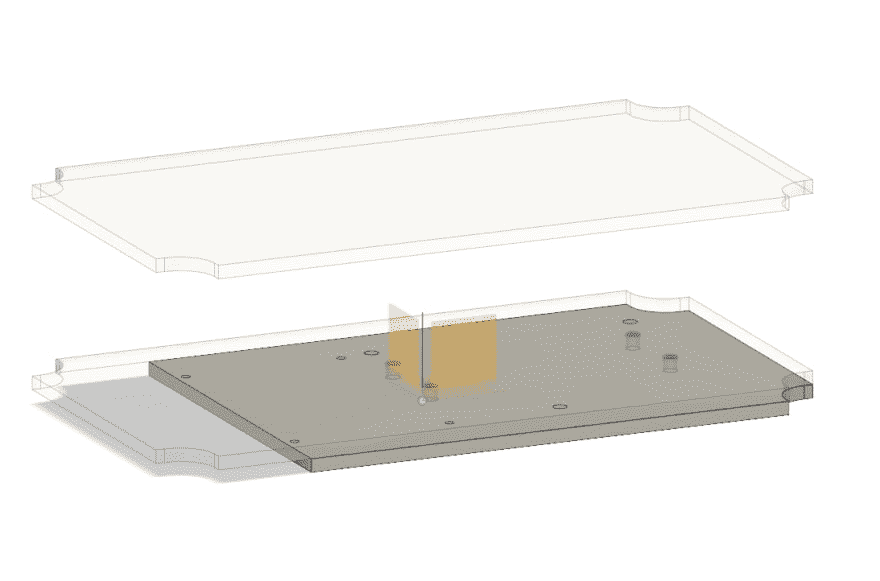
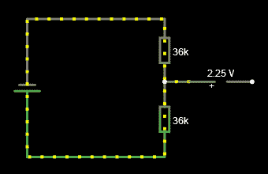
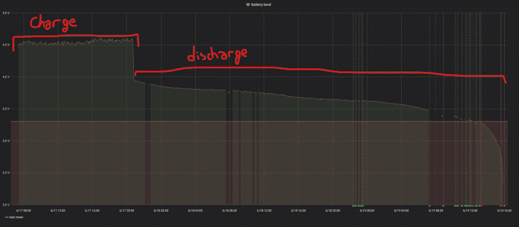
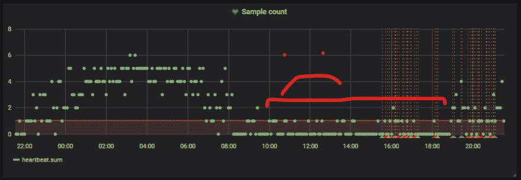
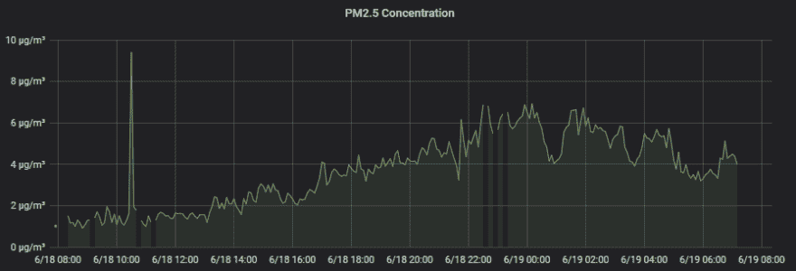

# An Air Quality Update

> 原文：[https://dev.to/minkovsky/an-air-quality-update-47j1](https://dev.to/minkovsky/an-air-quality-update-47j1)

A few weeks back I showed you [my air quality monitoring device](https://dev.to/minkovsky/working-on-my-iot-air-quality-monitoring-setup-40a5). I've since tweaked it, ran into problems and fixed them, and added some functionality. I also gathered some interesting data using the sensor itself - and it might be a little surprising.

Finally, I posted the source code for the program running on the ESP32 as a [GitHub Gist](https://gist.github.com/FLamparski/93af1ac4f49c2fde550a36f14a0d9446) - there's more on it below.

## Adding some stability, of the mechanical kind

To prevent the components from rattling around too much inside the enclosure, I designed a backing board in Fusion 360 and used the laser cutter at the South London Makerspace. This is just a piece of plywood with some holes, allowing me to secure the SDS-011 sensor and the ESP32 breakout board with some nylon screws. I went through a couple of design iterations of these backing boards, trying to fit everything inside the enclosure I had. The final one (highlighted in the screenshot below) packs the components in about 2/3rd of the enclosure, allowing the battery holder to stand on its side as was the case when everything was wibble-wobbling around in the box.

[](https://res.cloudinary.com/practicaldev/image/fetch/s--g374AasF--/c_limit%2Cf_auto%2Cfl_progressive%2Cq_auto%2Cw_880/https://thepracticaldev.s3.amazonaws.com/i/sauohsmzudnuoyh9agni.png)

Needless to say, the wibble-wobbling was reduced and the pieces are now much easier to work with if I ever need to take them out of the box.

## Batteries included

Ah yes, the battery compartment - which I previously used as just a power supply - is now occupied by actual batteries. I sourced those from Poundland power banks, at about £2 per ~2000mAh cells. They are pretty easy to get hold of, although I'm pretty sure one of these came pre-shorted - it started getting a bit smoky whenever I put any load on it. PSA: **If your batteries get smoky, don't use them!** Lithium batteries are usually quite safe, but if you short them out, they can catch fire and/or explode, so it's best to not mess about with them.

I also wanted to be able to measure the level of charge in the batteries. The problem I needed to overcome was that, at full charge, a Li-ion battery (or a couple of them in parallel) has a potential of up to 4.3V - which is a full volt higher than the 3.3V level that the ESP32 operates at. I needed to get the battery voltage coming into an analogue pin of the ESP32 to top out at or below 3.3v in order to measure it without damaging the microcontroller. I can drop the voltage by using a voltage divider. I built an example of the circuit [here](http://tinyurl.com/yxp8ku24) in a simulator where you can play around with the battery voltage and see how the divider circuit:

[](https://res.cloudinary.com/practicaldev/image/fetch/s--0yQFwSn7--/c_limit%2Cf_auto%2Cfl_progressive%2Cq_auto%2Cw_880/https://thepracticaldev.s3.amazonaws.com/i/fl0thmsepdqddn7gvsf6.png)

In the code, I define one of the pins as an analogue pin, and configure the ADC using some ESP32/Arduino functions. I can then read from this pin using the normal `analogRead` function. However, when measuring an analogue value, noise and error creeps in pretty fast - so I decided to measure the battery level several times and average the results:

```
// setup:
  adcAttachPin(BATTERY_PIN);
  analogSetPinAttenuation(BATTERY_PIN, ADC_11db);

// measure:
float get_battery(int n_samples) {
  float sum_reading = 0.0;
  for (int n = 0; n < n_samples; n++) {
    int batteryAdcCount = analogRead(BATTERY_PIN);
    // Battery voltage is given by the ADC as x/4096 * 3.3 for the voltage divider
    // and * 2 for the full voltage.
    sum_reading += ((float) batteryAdcCount) / 4096.0 * 3.3 * 2;
  }

  return sum_reading / ((float) n_samples);
} 
```

There is a certain dialectic when it comes to measuring battery levels. The ADC is not magic, and it requires some current to flow while the measurement is taking place. However, you don't want that current to be too high, otherwise you'd be draining the battery rather quickly. This is where the choice of resistor value in your voltage divider is important - too low and you'll burn through the battery, too high and you might not be able to measure it accurately. I picked 36kOhm for mine at pretty much random, but it's high enough that the total current flowing through the divider is about 60uA. Compared to the SDS-011 and ESP32 running at full tilt (peaking at 270mA), it's not very much. If I was crazy about power efficiency, I would experiment more with higher resistor values, and possibly add a transistor to the circuit, so that I can turn off the current if I'm not currently measuring voltage.

In the end, the battery measurement works pretty well, and the battery itself seems to last at least two full days:

[](https://res.cloudinary.com/practicaldev/image/fetch/s--V_5guEb6--/c_limit%2Cf_auto%2Cfl_progressive%2Cq_auto%2Cw_880/https://thepracticaldev.s3.amazonaws.com/i/11lrqcaz5yuh8aknr4mh.png)

## On plugging in stuff wrong

I semi-broke an ESP32 board during the development of this by accidentally plugging it with one pin shifted down in the socket, causing 5V to be applied to its ground pin. Somehow it survived that, but not unscathed - that particular board will no longer wake up from any form of CPU sleep without an external reset, but does otherwise work. Oops. Luckily, I had a spare that worked.

## How to sleep right

Turns out I was using the sleep modes of the ESP32 wrong. Initially I thought of ESP's light sleep as a special case of the Arduino `delay()` function, except where the processor core powers down for the duration of the delay. It's kind of like that, but with one caveat: this also suspends handling of the WiFi connection, causing some instability.

Furthermore, the ESP also has a deep sleep mode which saves more power, but it actually resets the microcontroller when waking up. I decided that I should use this mode, though - I don't need WiFi between measurements, so I might as well turn everything off. It also simplified the code slightly - I could put everything in `setup()` and rely on the wakeup resets.

This also made the whole system more stable, and allowed me to more easily add retry features - in the version of the gist current at the time of writing ([permalink](https://gist.github.com/FLamparski/93af1ac4f49c2fde550a36f14a0d9446/43b1ba31f619c24c3319f1d5bf3f93049d5d6633)), if I can't connect to WiFi within a few seconds, I turn everything off and sleep for another 15 seconds. Now, this is still a bit buggy - there can be long stretches when the ESP can't connect at all - so I will need to look at the timeout and other causes of connectivity issues. However, the device will *eventually* reconnect without me having to go and reset it.

[](https://res.cloudinary.com/practicaldev/image/fetch/s--xlQyo-az--/c_limit%2Cf_auto%2Cfl_progressive%2Cq_auto%2Cw_880/https://thepracticaldev.s3.amazonaws.com/i/cfvsj91nirc2j9hh152x.png)

## Some actual observations

PM2.5 of the carbon species usually comes from burning stuff, right? Well, how about toast? Or indeed, just cooking lunch?

[](https://res.cloudinary.com/practicaldev/image/fetch/s--KhRoUeg---/c_limit%2Cf_auto%2Cfl_progressive%2Cq_auto%2Cw_880/https://thepracticaldev.s3.amazonaws.com/i/ip1t8u9ve5wugi0z0rmm.png)

Most nights I see a significant increase in presence of PM2.5 species over the night, even though traffic outside my apartment is very light - could this be due to some scattered light affecting the SDS-011 sensor? Or temperatures going down causing dust kicked up high into the atmosphere during the day to settle down?

[](https://res.cloudinary.com/practicaldev/image/fetch/s--PxFmD-UM--/c_limit%2Cf_auto%2Cfl_progressive%2Cq_auto%2Cw_880/https://thepracticaldev.s3.amazonaws.com/i/dyf08orhdvr3xc3mwpzw.png)

## For those playing along

The [gist](https://gist.github.com/FLamparski/93af1ac4f49c2fde550a36f14a0d9446) contains the Arduino sketch running on the ESP32 inside the device. If you want to run it on your own network, you will need to change the WiFi credentials near the top of the file:

```
#define WIFI_SSID "CHANGE ME"
#define WIFI_PASS "CHANGE ME" 
```

## As always, there's more

The most obvious next step will be to figure out why the ESP is not connecting to WiFi - maybe it's the internal antenna not being very good, or the timeout being too short.

Further next steps would be figuring out how to control my measurements for things like cooking - if I am going to use this device to nag my local authority, I should be reasonably sure that the data I get out of it is down to actual traffic related pollution, and not me burning toast. Finally, I should write up that IoT server setup, shouldn't I...

See you then - and as always, let me know what you think about this project. I'm still liking it a lot.