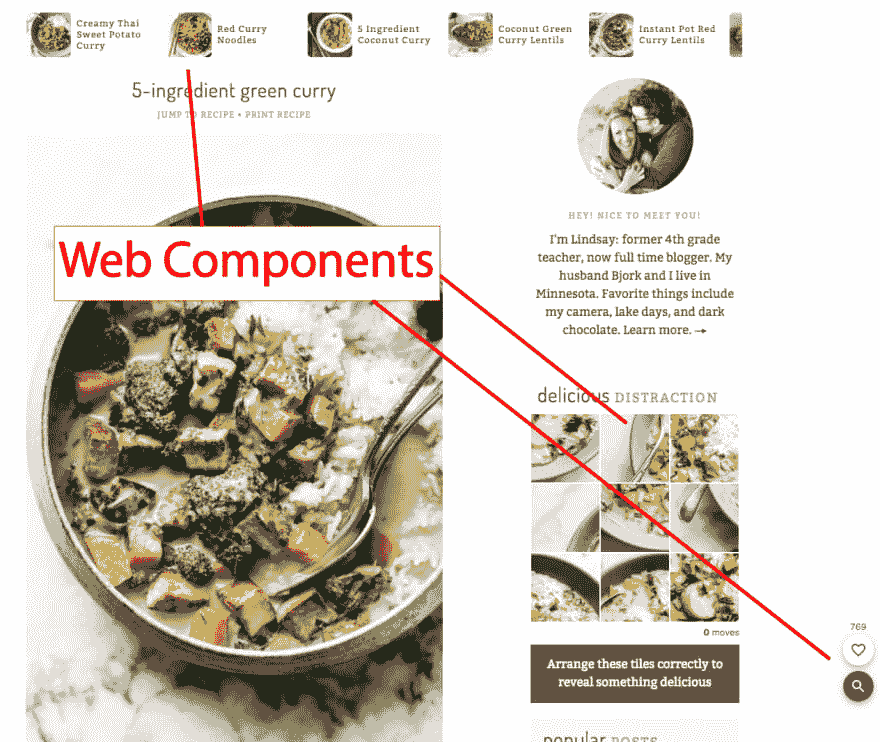
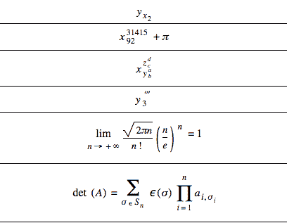

# 我为什么使用 Web 组件-我的用例

> 原文：<https://dev.to/shihn/why-i-use-web-components-my-use-cases-1nip>

首先，我不是任何技术的博主或倡导者，也不在活动/会议上发言。所以请记住我第一次写作的尝试。我希望我表达清楚了。

我想谈谈我发现 Web 组件是可用的最佳解决方案的一些实际使用案例和场景。

每当我看到关于 Web 组件的讨论，通常都是关于 API 设计和框架的比较。我不会为 API 辩护，因为它不是我写的。我不会批评它，因为其他人在这方面做得更好。

## 解决了问题？

人们常说组件是一个已解决的问题——看看所有这些有宗教信仰的框架吧！

现在，如果你正在开发一个应用程序，比方说一个书籍推荐应用程序- **你应该在任何你熟悉的框架**中编写这个程序。或者只用 web 组件写或者用 HTML + Javascript 写 2000 左右。一切都好。你应该使用任何你想要的组件系统，只要它符合你的目标。

但是，如果您想编写一个真正可共享的富组件，没有其他模型可用。您不能在 React 或 Vue 或 Nimbus3000 中的 svelet 或 svelet 模块中使用 React 组件。

## 我的用例

我将谈论我认为使用 WebComponents 似乎是正确选择的真实场景。这里的中心主题是**可共享的**和**跨框架的**。

### 1。嵌入式前端(微前端？)

我帮助很多网站增加参与度和各种各样的附加功能。这些网站不是由花哨的开发者维护的——想想博客作者、艺术家、内容创作者、小企业。其中一些获得了巨大的流量(每月 1 亿页)。我们有一个数据引擎，可以扫描和监控他们网站上的数据，并将其提供给可嵌入的前端，从而增加网站的参与度。一些例子:

*   为用户定制的实时搜索
*   启动与用户感兴趣的内容相关的动态游戏
*   相关内容的无限列表

[](https://res.cloudinary.com/practicaldev/image/fetch/s--tBqevU74--/c_limit%2Cf_auto%2Cfl_progressive%2Cq_auto%2Cw_880/https://thepracticaldev.s3.amazonaws.com/i/8kjif3bhv33c902h17pm.png)

这些网站大部分都在 WordPress，Squarespace，使用 React，Vue 渲染的框架上。我们的前端作为 web 组件被注入。这些发行商可以在任何他们想要的地方添加组件。这里没有 npm 或花哨的构建过程。

web 组件中的内容屏蔽了他们使用的任何主题或系统上运行的任何其他框架。其中一些组件与主页上的其他内容进行交互。它们必须具有高性能和小尺寸。

这些出版商通常有基本的 HTML 知识，他们将这些知识添加到他们的内容中，就像他们添加图像或视频一样。

### 2。复杂的部件

上面的例子是一个非常定制的解决方案，但是也有开发人员创建通用的小部件。

[`<model-viewer>`](https://github.com/GoogleWebComponents/model-viewer) 就是这一个最好的例子。它已经被广泛使用，比如在 NASA 和 Shopify。我不知道 Shopify 使用的是什么框架(可能和 NASA 不一样)，但是有了作为 Web 组件的模型查看器，他们有了一个解决方案。

> <video loop="" controls=""><source src="https://video.twimg.com/ext_tw_video/1141361541012447232/pu/pl/HOGZIyoe2GhmEUtW.m3u8?tag=10" type="application/x-mpegURL"></video>Shopify@ Shopify我们自豪地宣布，我们将成为第一个原生支持 3D 和 AR 购物体验的商务平台。[# ShopifyUnite](https://twitter.com/hashtag/ShopifyUnite)2019 年 6 月 19 日下午 15:12[](https://twitter.com/intent/tweet?in_reply_to=1141363065901977601)[](https://twitter.com/intent/retweet?tweet_id=1141363065901977601)118[](https://twitter.com/intent/like?tweet_id=1141363065901977601)375

这同样适用于所谓的“设计系统”。例如，Ionic 的组件被开发成 Web 组件，然后被包装成不同的框架，如 React、Vue。

### 3。进化的 HTML

HTML5 在规范中加入了各种新标签，比如`<video>`。它永远不会添加任何新标签吗？一种观点认为 DOM 很烂，所有新元素都应该以全新的组件格式定义。或者更现实地说，它可能会添加更多的标签——人们已经知道如何使用标签了。

正在考虑的新标签之一是一个*开关*。为了测试可能的实现，Chrome 将其作为 web 组件`<std-switch>`发布，因为它本质上扩展了内置元素。当不在 Chrome 上时，web 组件可以作为后备模块加载。扩展现有的底层元素模型有其价值。

个人故事:我的一个研究生朋友试图在某个网页上使用 MathML。(他们不是开发商。)Chrome 目前不支持 MathML。他们可以使用某种库来呈现它。作为一个有趣的项目，我将 [MathML 实现为 web 组件](https://github.com/pshihn/math-ml)，他们可以在 chrome 中使用它，只需做很小的改动。

[](https://res.cloudinary.com/practicaldev/image/fetch/s--GAu7MglM--/c_limit%2Cf_auto%2Cfl_progressive%2Cq_auto%2Cw_880/https://thepracticaldev.s3.amazonaws.com/i/old00o1ndd6210pp59ui.png)

## 造型

在某些方面，平台中没有 Web 组件这种东西。有一些独立的规范，像自定义元素和暗影王国，是主要的。更多正在开发中的 CSS，HTML，JSON 的导入。

从开发者的角度来看，所有这些单独的规范都有其自身的优点和设计缺陷。这些可以单独使用，而不是全部的 web 组件。

组件中不在 ShadowDOM 内部的部分可以使用全局样式表进行样式化，ShadowDOM 内部的部分是独立的。这在我关注的可共享组件的情况下特别有用。

[](https://res.cloudinary.com/practicaldev/image/fetch/s--o-Lhv6xu--/c_limit%2Cf_auto%2Cfl_progressive%2Cq_auto%2Cw_880/https://thepracticaldev.s3.amazonaws.com/i/xo1emtnea1grfbfhcjis.jpg)

## 开发者体验

人们对 WCs 的一个常见抱怨是它们太冗长而无法编码。它没有绑定，或什么的。就像我之前说的，我不打算争论现有 API 和 DX 的优缺点。

我确实认为，如果你愿意，使用框架和库是公平的。我的意思是，你已经做了，你甚至有时会编译。有些人认为他们根本不应该使用外部库，这是一个很好的奋斗目标。但事实是，大多数开发人员使用库要容易得多。所以不要再把 DOM api 和一个可以编译成 DOM api 的框架 api 相比较了。我认为助手库非常好。我们已经将它用于许多其他 web 技术，如 Web RTC、Workers 等。

如果你愿意的话，有一些很棒的助手库可以帮助你使用 WCs。几个:[点燃元素](https://lit-element.polymer-project.org/)，[模版](https://stenciljs.com/)，[闹鬼](https://github.com/matthewp/haunted)如果你喜欢钩子的话。

使用 LitElement 的示例:

```
@customElement('my-counter')
class Counter extends LitElement {
  @property({ type: Number }) count = 0;

  render() {
    return html`
      <div>${this.count}</div>
      <button @click="${() => this.count++}">Increment</button>
    `;
  }
} 
```

使用闹鬼的例子:

```
function Counter() {
  const [count, setCount] = useState(0);
  return html`
      <div id="count">${count}</div>
      <button type="button" @click=${() => setCount(count + 1)}>Increment</button>
  `;
}
customElements.define('my-counter', component(Counter)); 
```

## 不是你的用例

我的用例不是你的用例。这可能对你来说毫无意义，但我想你可能有兴趣听听来自不同层面的观点。