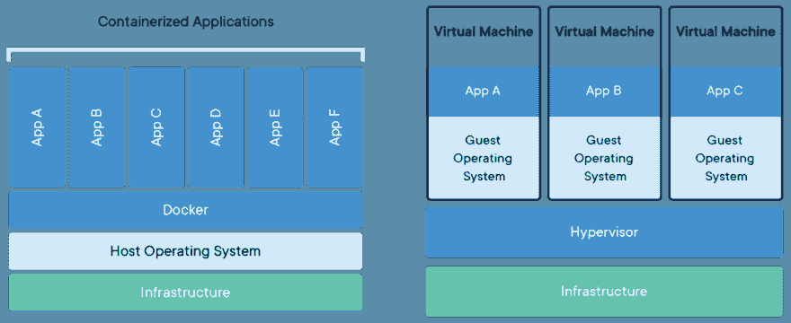
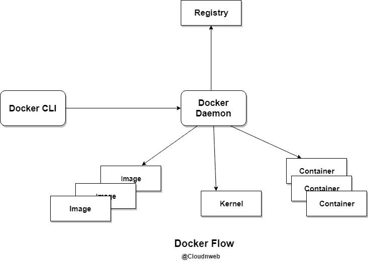
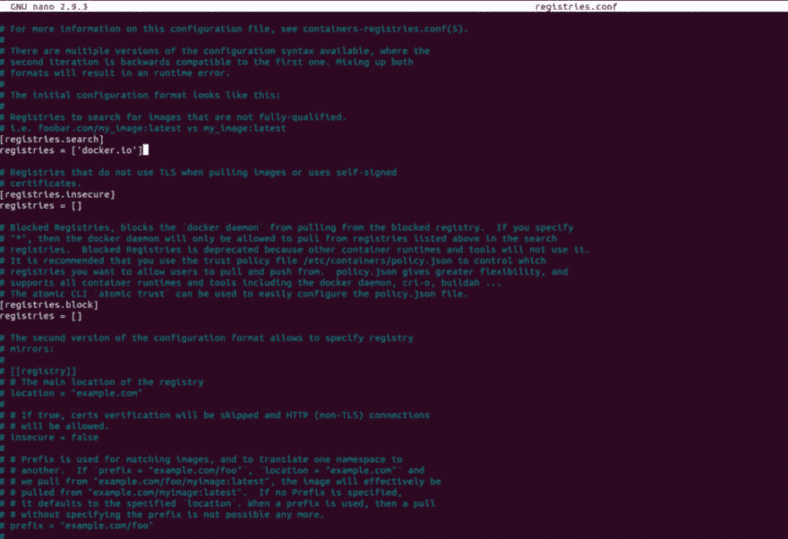
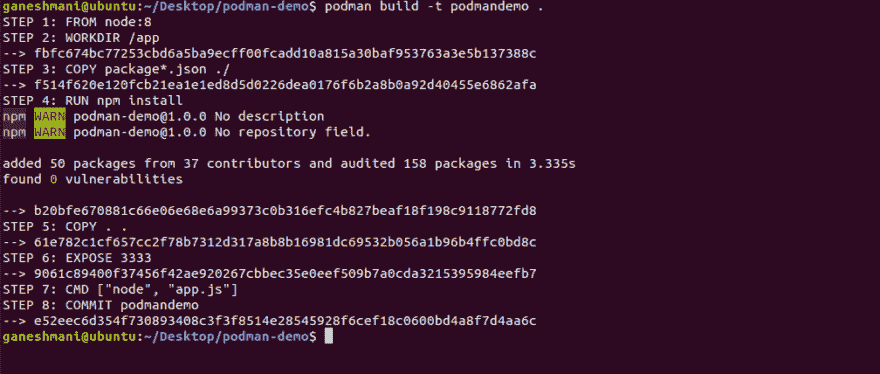

# 用搬运工取代码头工人——搬运工的力量

> 原文：<https://dev.to/ganeshmani/replacing-docker-with-podman-power-of-podman-4b9h>

为了支持我的工作，请阅读我网站上的这篇文章。[https://cloud nweb . dev/2019/06/replacing-docker-with-pod man-power-of-pod man/](https://cloudnweb.dev/2019/06/replacing-docker-with-podman-power-of-podman/)

是的，你没看错...虽然 Docker 现在是科技行业的流行语。我们将看到使用它的后果，以及我们如何解决与波德曼的问题。用搬运工代替码头工人——搬运工的力量

在进入本文之前，我们将看看什么是 Docker 以及 Docker 是如何工作的。

### Docker 是什么？

Docker 是一个容器化平台，我们可以在容器中打包我们的应用程序及其库和依赖项。Docker 容器有点像虚拟机。

与虚拟机不同，Docker 容器与系统共享相同的 Linux 内核。

[](https://res.cloudinary.com/practicaldev/image/fetch/s--ZWotOVsH--/c_limit%2Cf_auto%2Cfl_progressive%2Cq_auto%2Cw_880/https://cloudnweb.dev/wp-content/uploads/2019/06/docker-containerized-and-vm-transparent-bg-1024x419.png)

### Docker 是如何工作的？

让我们首先了解 docker 是如何工作的，我们将看到如何使用 podman 来克服它的问题。

[](https://res.cloudinary.com/practicaldev/image/fetch/s--AZt_NBNf--/c_limit%2Cf_auto%2Cfl_progressive%2Cq_auto%2Cw_880/https://cloudnweb.dev/wp-content/uploads/2019/06/docker_flow-1.png)

docker 的构建模块是 **Docker CLI** 和 **Docker 守护进程**。

**Docker CLI** 向 **Docker 守护进程**发送命令，其中 **Docker 守护进程**从注册表推/拉映像。

守护进程在本地容器中复制图像并维护它。本质上，Docker 守护进程完成了注册表、映像、容器和内核的所有工作。Docker 命令行界面(CLI)要求守护程序代表您完成这项工作。

你可以问我，它有什么问题。实际上很少，

*   单个流程可能是单点故障。
*   这个进程拥有所有的子进程(运行容器)。
*   如果 docker 守护进程出现任何故障，那么每个子进程都会丢失其踪迹。
*   构建容器导致了安全漏洞。
*   所有 Docker 操作都必须由具有相同完全根权限的用户执行。

波德曼的角色解决了大部分问题。波德曼到底是什么？

### BTW，什么是波德曼？

最重要的是，波德曼里没有叫守护进程的概念。podman 直接与图像注册表、容器和图像存储进行交互。用 Linux 内核通过 runC 容器运行时进程(不是守护进程)。

[](https://res.cloudinary.com/practicaldev/image/fetch/s--Z264BCqx--/c_limit%2Cf_auto%2Cfl_progressive%2Cq_auto%2Cw_880/https://cloudnweb.dev/wp-content/uploads/2019/06/podman_flow.png)

你可以问我，什么是 **runC** 容器运行时进程？。

最重要的是， **runC** 是一个轻量级的、可移植的容器运行时。Docker 构建在 **runC** 运行时容器之上。我们没有在 podman 中使用守护进程，而是直接使用了 **runC** 运行时容器。

下图解释了 Docker 如何在 **runC** 容器运行时之上工作。

[](https://res.cloudinary.com/practicaldev/image/fetch/s--EYlSZe02--/c_limit%2Cf_auto%2Cfl_progressive%2Cq_auto%2Cw_880/https://cloudnweb.dev/wp-content/uploads/2019/06/docker_internals.png)

### 从码头工人到搬运工

首先，从 Docker 迁移到 Podman 非常容易。

*   你需要安装 Podman 而不是 Docker。您不需要像 Docker 守护进程那样启动或管理守护进程。
*   您在 Docker 中使用的命令对 Podman 来说是一样的。
*   Docker 的图像与 Podman 兼容。
*   Podman 将其容器和图像存储在与 Docker 不同的地方。

让我们用 node.js 应用程序来看看 Podman 的实现。你可以在这里学习如何用 docker [封装 node.js 应用程序](https://cloudnweb.dev/2019/04/dockerizing-a-node-js-web-app/)

### 用 Podman 容器化 node.js 应用程序

在构建容器映像之前。在您的本地机器上安装 podman ,通过运行以下命令确保您正确安装了 podman。

```
$ podman --version
```

该应用程序的完整源代码可在此[报告](https://github.com/ganeshmani/podman-demo)中找到

一旦您在本地机器上克隆了存储库。运行以下命令

```
$ podman build -t podmandemo .
```

注意:如果您遇到任何错误，如**没有找到注册表**。请执行以下步骤。(只有当你面对这个错误时)

```
$ cd /etc/containers/
$ sudo nano registries.conf
```

在**【注册表.搜索】**中添加 **docker.io** 并保存文件

[](https://res.cloudinary.com/practicaldev/image/fetch/s--dJ_kZBdv--/c_limit%2Cf_auto%2Cfl_progressive%2Cq_auto%2Cw_880/https://cloudnweb.dev/wp-content/uploads/2019/06/Screenshot-from-2019-06-20-11-41-23-1024x701.png)

现在，再次运行**构建**命令

[](https://res.cloudinary.com/practicaldev/image/fetch/s--5dTAlrsM--/c_limit%2Cf_auto%2Cfl_progressive%2Cq_auto%2Cw_880/https://cloudnweb.dev/wp-content/uploads/2019/06/Screenshot-from-2019-06-20-12-00-54.png)

成功构建映像后，使用以下命令运行映像。

[](https://res.cloudinary.com/practicaldev/image/fetch/s--oesw64jB--/c_limit%2Cf_auto%2Cfl_progressive%2Cq_auto%2Cw_880/https://cloudnweb.dev/wp-content/uploads/2019/06/Screenshot-from-2019-06-20-12-02-03.png)

之后访问网址 **http://localhost:3333** 。您将看到类似这样的内容

[](https://res.cloudinary.com/practicaldev/image/fetch/s--eMtft2dx--/c_limit%2Cf_auto%2Cfl_progressive%2Cq_auto%2Cw_880/https://cloudnweb.dev/wp-content/uploads/2019/06/Screenshot-from-2019-06-20-12-02-13-1024x119.png)

就是这样。Podman 在没有任何守护进程的情况下运行映像。

[](https://res.cloudinary.com/practicaldev/image/fetch/s--yhFvVPGM--/c_limit%2Cf_auto%2Cfl_progressive%2Cq_66%2Cw_880/https://cloudnweb.dev/wp-content/uploads/2019/06/clap.gif)