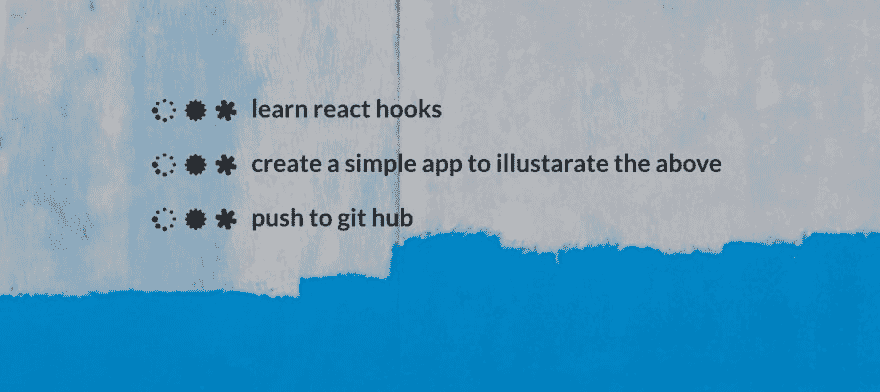
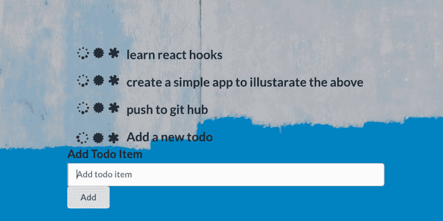
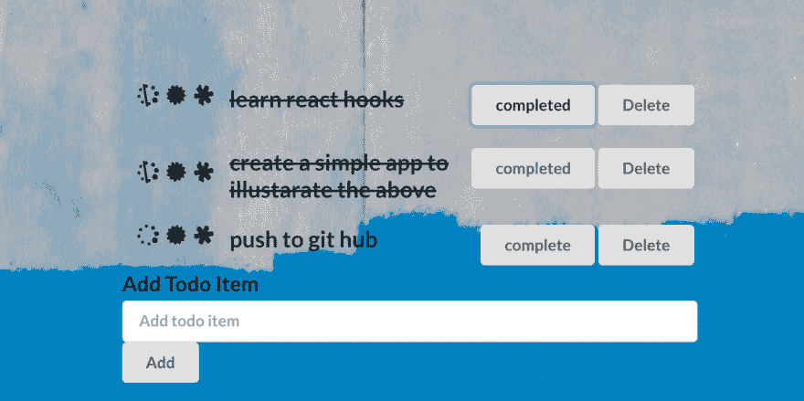

# React Hooks Tutorial

> 原文：[https://dev.to/ruiru11/react-hooks-tutorial-beginner-level-1b7](https://dev.to/ruiru11/react-hooks-tutorial-beginner-level-1b7)

## React Hooks Tutorial `Beginner Level`

**Purpose of this Blog:**

*   To explain how React Hooks work
*   Build a simple Application to help in understanding

## What we are Building

**A simple Todo app where we can add todo items, mark todo items as complete and delete todo item**

## Get started

React Hooks are a new addition in react version 16.8.0, we are going to learn about the 'UseState' Hook. The biggest addition that Hooks add is giving us the ability to use state in function based components we all know this was not possible before. This hook lets you have an internal state inside a functional Component

### Lets create a React app

*   cd into your Preferred directory
*   in the command line run

```
$ npx create-react-app react-hook-tutorial 
```

*   Then we cd into the above

```
cd react-hook-tutorial 
```

*   Open your code editor and let us delete the existing code in App.js and App.css

### lets write code.

In this tutorial, We are going to use mock Data our objective will be to display the data. We will be using semantic UI for styling I am using the CDN

*   In the `index.html` file add

```
 <link rel="stylesheet" href="https://cdnjs.cloudflare.com/ajax/libs/semantic-ui/1.11.8/semantic.min.css"/> 
```

In our `App.js` file Lets add this

```
import React, { useState } from "react";
import "./App.css";

function App() {
 //create your dummy data
 //todos is where we have our data
 //updateTodo is what we use to update 'state' by using the useState method we import from react
  const [todos, updateTodo] = useState([
    {
      item: "learn react hooks",
      completed: false
    },
    {
      item: "create a simple app to illustarate the above",
      completed: false
    },
    {
      item: "push to git hub",
      completed: false
    }
  ]);

//we loop through the todos 
//Notice we have a Todo component in the return statement we will have to create that
  return (
    <div id="role" role="list" className="ui divided relaxed list">
      <div role="listitem" className="item">
        {todos.map((todo, index) => (
          <Todo
            key={index}
            index={index}
            todo={todo}
          />
        ))}
      </div>
    </div>
  );
}

export default App; 
```

Now we create a components folder inside the src folder, create a `todo.js` file

*   add the following

```
import React from "react";

//pass props this are from the App.js file
const Todo = ({ todo, index, }) => {
  return (
    <div
      role="list"
      className="ui divided middle aligned list"
    >
      <div role="listitem" className="item">
        <div className="right floated content">
        </div>
        <i aria-hidden="true" className="spinner loading icon" />
        <i aria-hidden="true" className="certificate loading icon" />
        <i aria-hidden="true" className="asterisk loading icon" />
        <div className="content">{todo.item}</div>
      </div>
    </div>
  );
};

export default Todo; 
```

Now we have our Todo component which we need to use in our App.js file

*   Add this in our `App.js` file

```
import Todo from "./components/todo"; 
```

Open your browser and you should have something similar to what we have. You can use any image for your background image

[](https://res.cloudinary.com/practicaldev/image/fetch/s--9olTHTKP--/c_limit%2Cf_auto%2Cfl_progressive%2Cq_auto%2Cw_880/https://cdn.hashnode.com/res/hashnode/image/upload/v1559551038988/dyX43gqES.png)

We have been able to display our todos. We will now start using the `useState` Hook. We want to be able to add a new todo item. In the components, folder create a file `addTodoForm.js`

*   Add the following code

```
import React, { useState } from "react";

//create a AddTodoForm component
function AddTodoForm({ addTodo }) {
//we useState to set the value on the onchange function
const [value, setValue] = useState("");

  const handleSubmit = e => {
    e.preventDefault();
    if (!value) return;
    addTodo(value);
    setValue("");
  };
// return a form to handle our input
  return (
    <form className="ui success form">
      <div className="field">
        <label>Add Todo Item</label>
        <div className="ui input">
          <input
            type="text"
            placeholder="Add todo item"
            value={value}
            onChange={e => setValue(e.target.value)}
          />
        </div>
        <button onClick={handleSubmit} className="ui button">
          Add
        </button>
      </div>
    </form>
  );
}

export default AddTodoForm; 
```

The above code only gives us a form we are not able to add a todo item yet. So at this point, we need to write the addTodo function that will make this possible. Remember we passed it as a prop in the component we have created above.

*   Add the following in the `App.js` file

```
//the function takes in an item argument
  const addTodo = item => {
  //here we use the spread operator to copy everything we have in the todos array 
 //we can now manipulate the NewTodos variable as it contains data similar to what we have in the todos array
    const newTodos = [...todos, { item }];
   //now we use the updateTodo method to actually update the Todos list
    updateTodo(newTodos);
  }; 
```

We will still not be able to add a todo item, to make this happen we need to import the addTodoForm in our `App.js file`

*   Open `App .js` and lets add

```
import AddTodoForm from "./components/addTodoForm"; 
```

*   lastly add this

```
 <AddTodoForm addTodo={addTodo} /> 
```

**Now our `App.js` file Looks like this**

```
import React, { useState } from "react";
import "./App.css";
import Todo from "./components/todo";
import AddTodoForm from "./components/addTodoForm";

function App() {
 //create your dummy data
 //todos is where we have our data
 //updateTodo is what we use to update 'state' by using the useState method we import from react
  const [todos, updateTodo] = useState([
    {
      item: "learn react hooks",
      completed: false
    },
    {
      item: "create a simple app to illustarate the above",
      completed: false
    },
    {
      item: "push to git hub",
      completed: false
    }
  ]);

//we loop through the todos 
//Notice we have a Todo component in the return statement we will have to create that
  return (
    <div id="role" role="list" className="ui divided relaxed list">
      <div role="listitem" className="item">
        {todos.map((todo, index) => (
          <Todo
            key={index}
            index={index}
            todo={todo}
          />
        ))}
     <AddTodoForm addTodo={addTodo} />
      </div>
    </div>
  );
}

export default App; 
```

At this point, we should have a form to add a new todo item. You should have something similar to what we have below.
[](https://res.cloudinary.com/practicaldev/image/fetch/s--KWfg-k1j--/c_limit%2Cf_auto%2Cfl_progressive%2Cq_auto%2Cw_880/https://cdn.hashnode.com/res/hashnode/image/upload/v1559552519058/Kd-acZOwX.png)

We now need two buttons one to mark a todo as complete and another to delete a todo item

*   Open the `todo.js file` and add the following

```
 <button onClick={() => completTodo(index)} className="ui button">
            Complete
          </button>
          <button onClick={() => deleteTodo(index)} className="ui button">
            Delete
          </button> 
```

The `todo.js` file should now look like this

```
import React from "react";

const Todo = ({ todo, index }) => {
  return (
    <div
      id="main"
      style={{ textDecoration: todo.completed ? "line-through" : "" }}
      role="list"
      className="ui divided middle aligned list"
    >
      <div role="listitem" className="item">
        <div className="right floated content">
          <button onClick={() => completTodo(index)} className="ui button">
            Complete
          </button>
          <button onClick={() => deleteTodo(index)} className="ui button">
            Delete
          </button>
        </div>
        <i aria-hidden="true" className="spinner loading icon" />
        <i aria-hidden="true" className="certificate loading icon" />
        <i aria-hidden="true" className="asterisk loading icon" />
        <div className="content">{todo.item}</div>
      </div>
    </div>
  );
};

export default Todo; 
```

Notice in both the complete button and delete button we called a completeTodo function and a deleteTodo function respectively, these functions don't exist so we have to create them

*   Open `App.js` and add the following block of code

```
//the function takes an index parameter  so that we are able to know the todo we are marking as complete 
const completTodo = index => {
    const NewTodos = [...todos];
    NewTodos[index].completed = true;
    updateTodo(NewTodos);
  };

//the function takes an index parameter so that we know the todo item we are deleting
  const deleteTodo = index => {
    const NewTodos = [...todos];
    NewTodos.splice(index, 1);
    updateTodo(NewTodos);
  }; 
```

Then add this in the `App.js` file

```
 completTodo={completTodo}
   deleteTodo={deleteTodo} 
```

our `App .js` file now looks like this

```
import React, { useState } from "react";
import "./App.css";
import AddTodoForm from "./components/addTodoForm";
import Todo from "./components/todo";
import HeaderDiv from "./components/header";

function App() {
  const [todos, updateTodo] = useState([
    {
      item: "learn react hooks",
      completed: false
    },
    {
      item: "create a simple app to illustarate the above",
      completed: false
    },
    {
      item: "push to git hub",
      completed: false
    }
  ]);

  const addTodo = item => {
    const newTodos = [...todos, { item }];
    updateTodo(newTodos);
  };

  const completTodo = index => {
    const NewTodos = [...todos];
    NewTodos[index].completed = true;
    updateTodo(NewTodos);
  };

  const deleteTodo = index => {
    const NewTodos = [...todos];
    NewTodos.splice(index, 1);
    updateTodo(NewTodos);
  };
  return (
    <div id="role" role="list" className="ui divided relaxed list">
      <HeaderDiv />
      <div role="listitem" className="item">
        {todos.map((todo, index) => (
          <Todo
            key={index}
            index={index}
            todo={todo}
            completTodo={completTodo}
            deleteTodo={deleteTodo}
          />
        ))}
        <AddTodoForm addTodo={addTodo} />
      </div>
    </div>
  );
}

export default App; 
```

Lastly, to be able to use the two functions we need to pass them as props in the `todo.js` file. Open it and add this

```
const Todo = ({ todo, index, completTodo, deleteTodo }) 
```

Now the `todo.js file` looks like this

```
import React from "react";

const Todo = ({ todo, index, completTodo, deleteTodo }) => {
  var buttonText = todo.completed ? "completed" : "complete";
  return (
    <div
      id="main"
      style={{ textDecoration: todo.completed ? "line-through" : "" }}
      role="list"
      className="ui divided middle aligned list"
    >
      <div role="listitem" className="item">
        <div className="right floated content">
          <button onClick={() => completTodo(index)} className="ui button">
            {buttonText}
          </button>
          <button onClick={() => deleteTodo(index)} className="ui button">
            Delete
          </button>
        </div>
        <i aria-hidden="true" className="spinner loading icon" />
        <i aria-hidden="true" className="certificate loading icon" />
        <i aria-hidden="true" className="asterisk loading icon" />
        <div className="content">{todo.item}</div>
      </div>
    </div>
  );
};

export default Todo; 
```

Notice I introduced a buttonText variable this is just to make the text in the button dynamic that is if you click on the button the text becomes `completed`

[](https://res.cloudinary.com/practicaldev/image/fetch/s--iOfgR63X--/c_limit%2Cf_auto%2Cfl_progressive%2Cq_auto%2Cw_880/https://cdn.hashnode.com/res/hashnode/image/upload/v1559560416195/1xPdKdsfR.png)

**Lastly we will add an about section**
In the components, folder create a file `header.js` and add the following block of code

```
import React from "react";

function HeaderDiv() {
  return (
    <div className="ui message">
      <div className="header">About</div>
      <p>
        This is a simple application to help you level up on React Hooks. There is no data persistence as this will be available in the next tutorial.
      </p>
      <p>
        Below are links to the developers LinkedIn and Github accounts
        respectively
      </p>
      <a href="url">
        <button className="ui linkedin button">
          <i aria-hidden="true" className="linkedin icon" /> LinkedIn
        </button>
      </a>
      <a href="url">
        <button className="ui github button">
          <i aria-hidden="true" className="github icon" /> github
        </button>
      </a>
    </div>
  );
}

export default HeaderDiv; 
```

We then bring in the component, open `App.js` and add the following import statement

```
import HeaderDiv from "./components/header"; 
```

Now our `App.js file` should look like this

```
import React, { useState } from "react";
import "./App.css";
import AddTodoForm from "./components/addTodoForm";
import Todo from "./components/todo";
import HeaderDiv from "./components/header";

function App() {
  const [todos, updateTodo] = useState([
    {
      item: "learn react hooks",
      completed: false
    },
    {
      item: "create a simple app to illustarate the above",
      completed: false
    },
    {
      item: "push to git hub",
      completed: false
    }
  ]);

  const addTodo = item => {
    const newTodos = [...todos, { item }];
    updateTodo(newTodos);
  };

  const completTodo = index => {
    const NewTodos = [...todos];
    NewTodos[index].completed = true;
    updateTodo(NewTodos);
  };

  const deleteTodo = index => {
    const NewTodos = [...todos];
    NewTodos.splice(index, 1);
    updateTodo(NewTodos);
  };
  return (
    <div id="role" role="list" className="ui divided relaxed list">
      <HeaderDiv />
      <div role="listitem" className="item">
        {todos.map((todo, index) => (
          <Todo
            key={index}
            index={index}
            todo={todo}
            completTodo={completTodo}
            deleteTodo={deleteTodo}
          />
        ))}
        <AddTodoForm addTodo={addTodo} />
      </div>
    </div>
  );
}

export default App; 
```

*   That brings us to the end of the tutorial
*   [Demo Link](https://ruiru11.github.io/react-hooks-tutorial/)
*   [Full code](https://github.com/Ruiru11/react-hooks-tutorial)
*   For a deeper understanding of `React hooks` [click here](https://reactjs.org/docs/hooks-intro.html)

**This is how the product looks like**

[](https://res.cloudinary.com/practicaldev/image/fetch/s--XaoYde3N--/c_limit%2Cf_auto%2Cfl_progressive%2Cq_auto%2Cw_880/https://cdn.hashnode.com/res/hashnode/image/upload/v1559560654351/GyMGSCvC_.png)