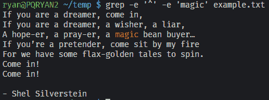
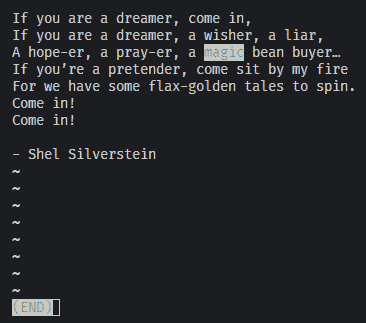

# 用“grep”看上下文

> 原文：<https://dev.to/rpalo/seeing-context-with-grep-39fb>

您是否曾经在命令行上搜索文件中的一些文本，却发现`grep`的输出不足以让您理解文件中发生了什么？有时，您希望看到一些额外的行，甚至是整个文件，并突出显示您的搜索词。

## 看几行

您可以使用-A、-B 和-C 标志来查看几行上下文。`-A <number>`每场比赛后显示“数字”行，`-B <number>`每场比赛前显示“数字”行，`-C <number>`前后都显示“数字”行。这有助于记住**A**after、**B**fore 和**C**context。`grep -C 5 ...`相当于`grep -A 5 -B 5 ...`。我实际上喜欢添加`-n`标志来显示 1 索引的行号，因为它有助于我稍后在文件中找到位置。

下面是他们的行动:

```
# inside example.txt
If you are a dreamer, come in,
If you are a dreamer, a wisher, a liar,
A hope-er, a pray-er, a magic bean buyer…
If you’re a pretender, come sit by my fire
For we have some flax-golden tales to spin.
Come in!
Come in!

- Shel Silverstein 
```

<svg width="20px" height="20px" viewBox="0 0 24 24" class="highlight-action crayons-icon highlight-action--fullscreen-on"><title>Enter fullscreen mode</title></svg> <svg width="20px" height="20px" viewBox="0 0 24 24" class="highlight-action crayons-icon highlight-action--fullscreen-off"><title>Exit fullscreen mode</title></svg>

```
$ grep -A 3 "fire" example.txt
If you’re a pretender, come sit by my fire
For we have some flax-golden tales to spin.
Come in!
Come in!

$ grep -B 2 -n "golden" example.txt
3-A hope-er, a pray-er, a magic bean buyer…
4-If you’re a pretender, come sit by my fire
5:For we have some flax-golden tales to spin.

$ grep -C 1 -n "bean" example.txt
2-If you are a dreamer, a wisher, a liar,
3:A hope-er, a pray-er, a magic bean buyer…
4-If you’re a pretender, come sit by my fire 
```

<svg width="20px" height="20px" viewBox="0 0 24 24" class="highlight-action crayons-icon highlight-action--fullscreen-on"><title>Enter fullscreen mode</title></svg> <svg width="20px" height="20px" viewBox="0 0 24 24" class="highlight-action crayons-icon highlight-action--fullscreen-off"><title>Exit fullscreen mode</title></svg>

## 查看整个文件

查看整个文件的一个技巧是匹配每行中的一个非打印字符，比如行首或行尾。

```
grep -e '^' -e 'magic' example.txt 
```

<svg width="20px" height="20px" viewBox="0 0 24 24" class="highlight-action crayons-icon highlight-action--fullscreen-on"><title>Enter fullscreen mode</title></svg> <svg width="20px" height="20px" viewBox="0 0 24 24" class="highlight-action crayons-icon highlight-action--fullscreen-off"><title>Exit fullscreen mode</title></svg>

[](https://res.cloudinary.com/practicaldev/image/fetch/s--MtkdN7ki--/c_limit%2Cf_auto%2Cfl_progressive%2Cq_auto%2Cw_880/https://assertnotmagic.com/img/grep-whole-file.png)

虽然，这有点滥用`grep`。更好的方法可能是使用`less`简洁的搜索功能。运行`less example.txt`,然后输入`/`,然后输入你的搜索词。如果你输入`/magic<Enter>`，你会看到这样的内容:

[](https://res.cloudinary.com/practicaldev/image/fetch/s--dDpsXjNy--/c_limit%2Cf_auto%2Cfl_progressive%2Cq_auto%2Cw_880/https://assertnotmagic.com/img/less-highlight-search.png)

> 没有人:...
> 
> Vim 用户:你可以在 ViM 中做同样的事情！

*我开玩笑的。我爱 vim，一直在用这个功能。

## 但是我的没有颜色！

grep 有一个`--color`选项。事实上，对于那些有此倾向的人来说，甚至还有一个`--colour`便利选项！它可以取值“从不”、“总是”或“自动”。如果输出到一个终端,“Auto”将会给输出着色，但是如果输出通过管道传输到另一个命令或文件，将会去掉颜色。这是因为颜色是作为字符编码到输出文本中的，它们会出现在明文输出文件和其他程序中，比如`less`。你会看到很多 StackOverflow 的答案推荐`--color=always`，但是那会给你那些怪异的颜色代码字符，可能不是你想要的。

所以试试跑步:

```
grep --color=auto -e '^' -e 'my search term' data.txt 
```

<svg width="20px" height="20px" viewBox="0 0 24 24" class="highlight-action crayons-icon highlight-action--fullscreen-on"><title>Enter fullscreen mode</title></svg> <svg width="20px" height="20px" viewBox="0 0 24 24" class="highlight-action crayons-icon highlight-action--fullscreen-off"><title>Exit fullscreen mode</title></svg>

如果这行得通，您可以考虑将这一行放到您的`.bashrc`文件中:

```
export GREP_COLORS="auto" 
```

<svg width="20px" height="20px" viewBox="0 0 24 24" class="highlight-action crayons-icon highlight-action--fullscreen-on"><title>Enter fullscreen mode</title></svg> <svg width="20px" height="20px" viewBox="0 0 24 24" class="highlight-action crayons-icon highlight-action--fullscreen-off"><title>Exit fullscreen mode</title></svg>

这将使你不必每次都打字。