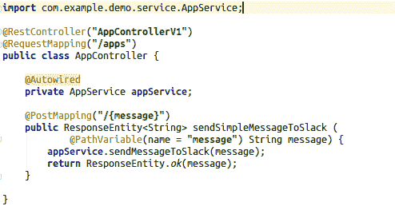
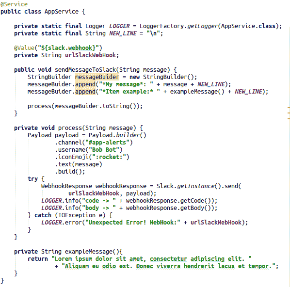
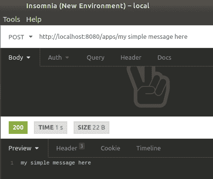

# 用 Java 在 5 分钟内发送松弛消息

> 原文：<https://dev.to/silviobuss/send-slack-messages-with-java-in-5-minutes-2lio>

## 简介

在本教程中，我们将看到使用 [jslack 框架](https://github.com/seratch/jslack)向 Java 应用程序中的 Slack 通道发送消息是多么容易。

## jSlack

jSlack 是一个 Java 库，可以轻松地将您的操作与 Slack 集成在一起。这个库支持在 [Slack 平台特性和 API](https://github.com/slackapi/slack-api-specs)中列出的所有 API。

## 带松弛的传入 Webhook

Webhook 是一种通过普通的 HTTP 请求将消息从外部来源发布到 Slack 的简单方法。更多细节请参见松弛[引入网钩导轨](https://api.slack.com/incoming-webhooks)。

## 入门

### 获取 Webhook URL

我们需要做的第一件事是从 Slack 中找出它将用来发布消息的正确 URL。

*   前往[https://YOUR _ ALIAS _ team . slack . com/apps/manage/custom-integrations](https://YOUR_ALIAS_TEAM.slack.com/apps/manage/custom-integrations)

*   选择 **Incoming WebHooks** 选项。

*   进入**添加配置**并选择想要发送消息的通道，然后**添加传入 WebHooks 集成**。

*   Slack 为您提供了您将发布消息的 URL。
    与此类似:[https://hooks . slack . com/services/t 00000000/b 0000000/XXXXXXXXXXXXXXXXXXXX](https://hooks.slack.com/services/T00000000/B00000000/XXXXXXXXXXXXXXXXXXXX)

### 创建演示应用

去[https://start.spring.io/](https://start.spring.io/)用 **Web** 依赖创建一个演示应用。

在 IDE 中导入应用程序，并遵循以下步骤:

1 -编辑`application.properties`文件。

```
server.servlet.context-path=/
slack.webhook=https://hooks.slack.com/services/T00000000/B00000000/XXXXXXXXXXXXXXXXXXXX 
```

Enter fullscreen mode Exit fullscreen mode

2 -编辑`pom.xml`文件并添加 jslack:

```
<dependency>
    <groupId>com.github.seratch</groupId>
    <artifactId>jslack</artifactId>
    <version>1.5.6</version>
</dependency> 
```

Enter fullscreen mode Exit fullscreen mode

3 -添加控制器和服务类别:

**控制器**
[](https://res.cloudinary.com/practicaldev/image/fetch/s--_Co_H7nZ--/c_limit%2Cf_auto%2Cfl_progressive%2Cq_auto%2Cw_880/https://thepracticaldev.s3.amazonaws.com/i/b4jurbz3tsu4pfr8g22l.png)

**服务**
[](https://res.cloudinary.com/practicaldev/image/fetch/s--Ce2ppvM8--/c_limit%2Cf_auto%2Cfl_progressive%2Cq_auto%2Cw_880/https://thepracticaldev.s3.amazonaws.com/i/cg4qxe3lk2xiakz0dfq2.png)

### 运行演示应用程序

*   启动演示应用程序只是运行一个主类。

*   使用任何 rest 客户端，发出 POST 请求:
    `http://localhost:8080/apps/my simple message here`

[](https://res.cloudinary.com/practicaldev/image/fetch/s--viScV1S1--/c_limit%2Cf_auto%2Cfl_progressive%2Cq_auto%2Cw_880/https://thepracticaldev.s3.amazonaws.com/i/cqq6wqcz1jriwnc7eihp.png)

哇哦！你的信息暴露在松弛。

[](https://res.cloudinary.com/practicaldev/image/fetch/s--PsrARXfJ--/c_limit%2Cf_auto%2Cfl_progressive%2Cq_auto%2Cw_880/https://thepracticaldev.s3.amazonaws.com/i/re7kjogyxc4cmclk3hi5.png)

## 结论

在这篇文章中，我们可以看到它是如何与 jslack 在 Spring Boot 2 中集成的。该框架还提供对实时消息 API、事件 API 以及其他资源的支持。

## 来源

##  [西尔维奥巴斯](https://github.com/silviobuss) / [德莫-杰斯拉克](https://github.com/silviobuss/demo-jslack)

### 用 jslack 发送时差消息

<article class="markdown-body entry-content container-lg" itemprop="text">

# 演示-jslack

用 jslack 发送时差消息

# 这是什么，它是如何工作的？

[https://dev . to/Silvio buss/send-slack-messages-with-Java-in-5-minutes-2lio](https://dev.to/silviobuss/send-slack-messages-with-java-in-5-minutes-2lio)

</article>

[View on GitHub](https://github.com/silviobuss/demo-jslack)