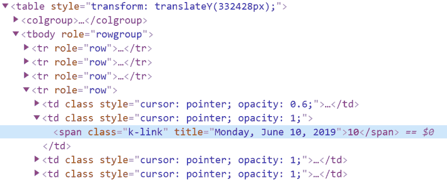
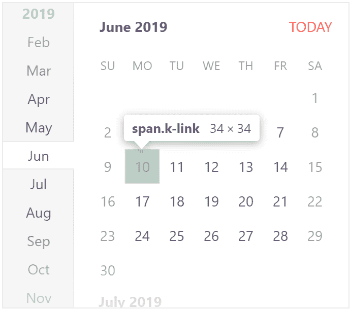
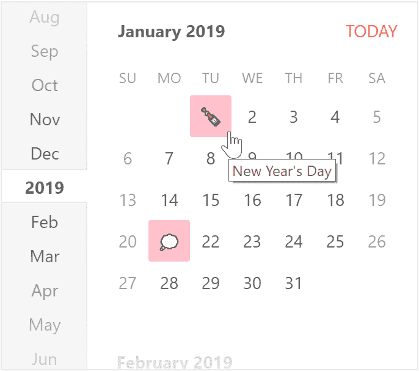
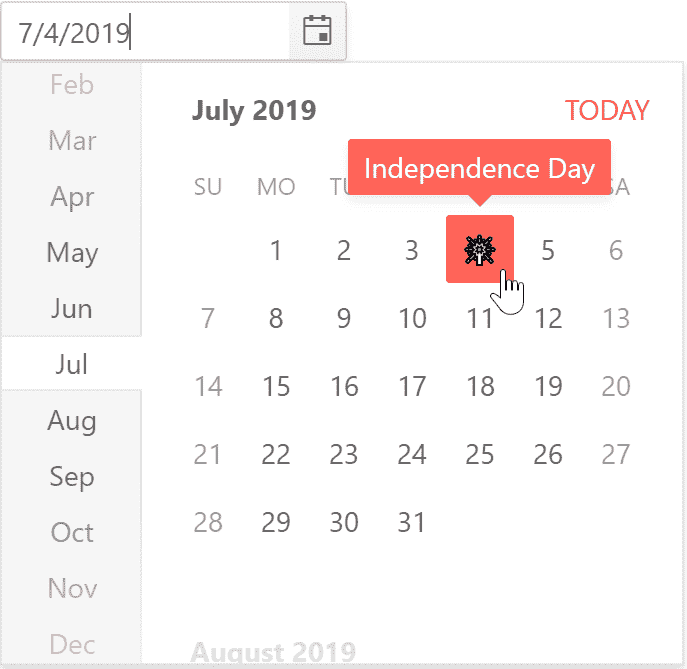

# 释放 KendoReact DatePicker 组件的威力

> 原文：<https://dev.to/telerik/unleash-the-power-of-the-kendoreact-datepicker-component-40c4>

KendoReact DatePicker 是一个灵活的 React UI 组件，允许您使用自定义渲染器自定义它的每个方面。在这篇博文中，我们将介绍如何定制 DatePicker 的日历组件，以突出显示美国联邦假日日程。

让我们谈谈 React 应用程序中的日期。具体来说，让我们谈谈让用户通过日期选择器选择日期。虽然有一些选择，但今天我们将重点关注 [KendoReact](https://www.telerik.com/kendo-react-ui/) 中的可用内容，这是一组为 React 从头开始设计和构建的 UI 组件。在我们将在这个博客中使用的演示中，我们将使用 [KendoReact DatePicker](https://www.telerik.com/kendo-react-ui/components/dateinputs/datepicker/) 作为例子来探索 React DatePicker 组件可以做什么。

通常，该组件显示某种输入元素，当用户与之交互时，会通过弹出窗口显示一个日历，以帮助用户选择特定的日期。顺便提一下，如果您需要包含时间选择，有一个 [DateTimePicker](https://www.telerik.com/kendo-react-ui/components/dateinputs/datetimepicker) 组件，为了处理一个日期范围，有一个 [DateRangePicker](https://www.telerik.com/kendo-react-ui/components/dateinputs/daterangepicker/) 。

除了选择日期，日期选择器也是展示可用和不可用日期的好方法。它还可以突出显示某些日期，让用户知道那天可能会有特别的事情发生。我不知道你是怎么想的，但我经常需要查找某一天是否是美国假日，所以为什么不创建一个 React DatePicker 来展示 2019 年美国假日日程安排呢？既然大家都爱表情符号，为什么不用一个适用的( )来代替渲染的日期呢？

## #1 -了解 KendoReact 日期选择器的灵活性

KendoReact DatePicker 是一个非常可定制的 React UI 组件。它允许 React 开发人员完全控制组件的外观。理解这与传统的配置选项定制有何不同非常重要。该组件的独特之处在于，它由三个部分组成，每个部分都可以被**完全覆盖**并通过自定义渲染器自定义，这意味着开发人员可以完全控制该组件，同时仍然保持底层功能。

这些部分是:

*   **DateInput** -实际的文本框和输入，负责显示所选择的日期，或者在没有输入时显示一个掩码。
*   弹出窗口(Popup)——UI 组件的一部分，允许在点击日期输入或日期选择器图标时显示日历。
*   **日历** -在上述弹出窗口中显示的实际日历。

这意味着 KendoReact DatePicker 的每个元素都可以定制，同时仍然保留组件的强大底层功能！

今天，我们将重点关注 DatePicker 的日历部分，但是我们所学的内容也可以用于使用和定制 DatePicker 的 DateInput 和 Popup 部分。

## #2 -创建我们的自定义日历

### 定义我们的数据

首先，让我们考虑一下我们想要使用的数据。在网上简单搜索就会给我们一个 2019 日历年所有*联邦假日*(在美国)和它们发生的日子的列表。考虑到这一点，创建一个这些天的数组是有意义的，其中包含节日的**名称**、**实际日期**，当然还有我们的**表情符号**！

```
const usHolidays = [
  { name: "New Year's Day", date: new Date("2019-01-01"), emoji: "" },
  { name: "Martin Luther King Day", date: new Date("2019-01-21"), emoji: "" },
  { name: "President's Day", date: new Date("2019-02-18"), emoji: "" },
  { name: "Memorial Day", date: new Date("2019-05-27"), emoji: "" },
  { name: "Independence Day", date: new Date("2019-07-04"), emoji: "" },
  { name: "Labor Day", date: new Date("2019-09-02"), emoji: "️" },
  { name: "Columbus Day", date: new Date("2019-10-14"), emoji: "" },
  { name: "Veterans Day", date: new Date("2019-11-11"), emoji: "️" },
  { name: "Thanksgiving Day", date: new Date("2019-11-28"), emoji: "" },
  { name: "Christmas Day", date: new Date("2019-12-25"), emoji: "" }
]; 
```

### 使用 KendoReact 日历

[KendoReact 日历](https://www.telerik.com/kendo-react-ui/components/dateinputs/calendar/)是 KendoReact `DateInputs` npm 包的一部分，我们将使用该包将日期选择器添加到我们的应用程序中。对于那些担心整体封装大小的人(因为有时多个组件在一个封装中):不要担心，这就是树抖动的由来！

对于这些例子，我们使用 [KendoReact 默认主题](https://www.telerik.com/kendo-react-ui/components/styling/theme-default/)，但是也可以使用 [KendoReact 引导主题](https://www.telerik.com/kendo-react-ui/components/styling/theme-bootstrap/)和 [KendoReact 材料主题](https://www.telerik.com/kendo-react-ui/components/styling/theme-material/)。在这个场景中，我们在我们的`index.html`文件的`head`标签中包含了一个到已编译的 CSS 文件的链接，但是如果您更喜欢这样做，那么跟随任何主题的文档文章会强调如何将它作为我们整个应用程序捆绑过程的一部分。

[KendoReact 日历](https://www.telerik.com/kendo-react-ui/components/dateinputs/calendar/)文档页面提供了日历组件的安装说明。通过这一步，我们可以创建我们的第一个 React 组件，我们将在这个演示应用程序的基础上进行构建。

```
import * as React from 'react';
import { Calendar } from '@progress/kendo-react-dateinputs';

export class CustomCalendar extends React.Component {
  render() {
    return (
      <Calendar />
    );
  }
} 
```

这将在页面上呈现以下内容:

[](https://res.cloudinary.com/practicaldev/image/fetch/s--epRsiyt9--/c_limit%2Cf_auto%2Cfl_progressive%2Cq_auto%2Cw_880/https://d585tldpucybw.cloudfront.net/sfimages/default-source/blogs/2019/2019-06/001-calendar.png%3Fsfvrsn%3D17ecc367_1)

### 在 KendoReact 日历中创建自定义单元格

理解 KendoReact 日历的 HTML 是一个填充了代表每个单元格的`td`元素的`table`元素可能会有所帮助。

[](https://res.cloudinary.com/practicaldev/image/fetch/s--_iITgk-h--/c_limit%2Cf_auto%2Cfl_progressive%2Cq_auto%2Cw_880/https://d585tldpucybw.cloudfront.net/sfimages/default-source/blogs/2019/2019-06/002-calendar-table-layout.png%3Fsfvrsn%3D270daf84_1) 

[](https://res.cloudinary.com/practicaldev/image/fetch/s--s9fDZ6bD--/c_limit%2Cf_auto%2Cfl_progressive%2Cq_auto%2Cw_880/https://d585tldpucybw.cloudfront.net/sfimages/default-source/blogs/2019/2019-06/003-calendar-inspector.png%3Fsfvrsn%3D74c4e45_1)

在 KendoReact 日历中有各种各样的方式来定制单元格，从仅仅为每个单元格添加附加信息到完全接管每个单元格中呈现的内容。后者是我们今天要做的。这意味着为了维护日历的结构，我们返回的任何内容都需要包装在一个`<td></td>`元素中。

为此，我们应该创建一个新的 React 组件，`CustomCalendarCell`,为了让我们的工作更简单，让我们从一些样板代码开始:

```
export class CustomCalendarCell extends React.Component {
  handleClick = () => {
    this.props.onClick(this.props.value);
  }

  render() {
    // make weekends a bit opaque since a holiday calendar mostly focuses on what ADDITIONAL days we have off during the year (weekends are already off!)
    let style = {
        cursor: 'pointer',
        opacity: this.props.isWeekend ? .6 : 1
    };

    const className = classNames({
        'k-state-selected': this.props.isSelected,
        'k-state-focused': this.props.isFocused
    });

    return (
      <td
        onClick={this.handleClick}
        className={className}
        style={style}
      >
        <span className="k-link" title={this.props.isWeekend && this.title}>
          {this.props.children}
        </span>
      </td>
    );
  }
} 
```

我们可以安全地忽略`style`和`className`变量，因为它们只是帮助我们的单元格进行一些样式选择。`style`只是让周末的日子变得更淡一些(因为我们反正都放假)，而`className`对单元格应用了一些特定于 KendoReact 的 CSS 类。

这段代码可能有些突出:

```
handleClick = () => {
  this.props.onClick(this.props.value);
} 
```

我们在这里所做的是处理从日历组件本身传递过来的`onClick()`事件。这确保了选择我们的单元格将在我们的日历中正确地突出显示该单元格，并将日历的值设置为所选的日期。

其他一切都应该很容易理解。这不会改变日历的正常显示方式(除了周末)，所以这是一个很好的起点。

让我们开始制作我们自己的日历吧！

我们已经知道了数据的名称和格式。所以，让我们想一想如何处理这个问题，并检查日历单元格的当前日期是否是我们想要突出显示的假日之一。类似这样的事情将完美地工作:

```
let emoji;

// find our holidays and assign the proper emoji - a simple for loop should do!
for (let i = 0; i < usHolidays.length; i++) {
  if (usHolidays[i].date.getUTCFullYear() == this.props.value.getUTCFullYear() && 
      usHolidays[i].date.getUTCMonth() == this.props.value.getUTCMonth() && 
      usHolidays[i].date.getUTCDate() == this.props.value.getUTCDate()) {
    emoji = usHolidays[i].emoji;
    style.backgroundColor = "rgba(255, 50, 85, 0.3)";
    this.title = usHolidays[i].name;
    break;
  };
} 
```

这里发生的事情是，我们创建一个`emoji`变量，如果我们不在度假，它将是`undefined`,如果我们挖到了金子，在度假时掉了下来，它将被赋值。

在比较日期时，我们将保持简单，只比较每个日期的当前年、月和日。我们单元格的当前日期来自`this.props.value`并且已经在一个日期对象中，所以我们可以调用`getUTCFullYear()`、`getUTCMonth`和`getUTCDate()`来比较我们的两个日期。我们在这里使用 UTC 变量来避免我们的示例中的时区问题。

一旦我们有了匹配，我们就将假日表情符号分配给我们的`emoji`变量，更新`style`变量以具有背景颜色(用`0.3`作为不透明度)，并将当天的`title`定义为假日的名称。在普通的一天，这将被写成类似*“2019 年 6 月 10 日，星期一”*的形式，并且将在悬停在某个项目上时出现，并用于辅助功能目的。

我们还有最后一个需要解决的问题，那就是如何使用这个匹配来更新单元格内容本身。这是在我们调用`return`时在`render()`函数中完成的。现在我们假设我们只有一种类型的单元格，但是如果我们想扩展它来包含我们表情符号的类型呢？嗯，最简单的方法可能是定义一个变量来表示我们在`return`之外的 JSX，它会根据我们是有一个正常的一天还是一个假期而变化。

```
let renderSpan;

if(emoji) {
  renderSpan = <span className="k-link" title={this.title}>{emoji}</span>;
}
else {
  renderSpan = <span className="k-link" title={this.props.title}>{this.props.children}</span>;
}
return (
  <td
    onClick={this.handleClick}
    className={className}
    style={style}
  >
    {renderSpan}
   </td>
); 
```

正如我们在上面看到的，`renderSpan`成为一个重要的变量，以确保我们呈现正确的内容，同时仍然保留了`<td></td>`元素中需要的许多公共属性。

为了利用`CustomCalendarCell`,我们需要将它导入到我们定义日历的第一个组件中，并将其定义为单元格渲染器:

```
import * as React from 'react';
import { Calendar } from '@progress/kendo-react-dateinputs';
import { CustomCalendarCell } from './customCalendarCell.jsx';

export class CustomCalendar extends React.Component {
  render() {
    return (
      <Calendar
        cell={CustomCalendarCell}
        value={this.props.value}
        onChange={this.props.onChange}
      />
    );
  }
} 
```

将所有这些放在一起，我们现在可以导航到任何有假期的月份，并看到我们的劳动成果！以 2019 年 1 月为例:

[](https://res.cloudinary.com/practicaldev/image/fetch/s--wRe00jo8--/c_limit%2Cf_auto%2Cfl_progressive%2Cq_auto%2Cw_880/https://d585tldpucybw.cloudfront.net/sfimages/default-source/blogs/2019/2019-06/004-calendar-january-2019.png%3Fsfvrsn%3Deb8a6c2b_1)

注意悬停在香槟酒瓶表情符号上是如何给我们带来“新年”标题的！

这是到目前为止在一个关于[stack blitz](https://stackblitz.com/)的项目中所有的东西。

## #3 -将我们的自定义日历添加到我们的 React DatePicker

随着日历的定制，最困难的部分已经过去了。此时，我们可以利用 [KendoReact DatePicker 定制选项](https://www.telerik.com/kendo-react-ui/components/dateinputs/datepicker/custom-rendering/#toc-customizing-the-calendar)，并简单地传入我们的`CustomCalendar`组件。

让我们更新我们的`main.jsx`来导入`DatePicker`组件，并更新`render()`函数来包含`DatePicker`。

```
import * as React from 'react';
import * as ReactDOM from 'react-dom';

import { DatePicker } from '@progress/kendo-react-dateinputs';
import { CustomCalendar } from './customCalendar.jsx';

class App extends React.Component {

  render() {
    return (
      <DatePicker
        onBlur={this.handleBlur}
        calendar={CustomCalendar}
      />
    );
  }
}
ReactDOM.render(
  <App />,
  document.querySelector('my-app')
); 
```

这真的很简单:定义`DatePicker`的`calendar`道具等于我们的新`CustomCalendar`，我们已经完成了！

这里需要注意的是，`onBlur`的使用确保了数值变化的正确传播。因此，它只是让组件正确工作，即使是我们的定制部分。

[](https://res.cloudinary.com/practicaldev/image/fetch/s--4vrhcCsh--/c_limit%2Cf_auto%2Cfl_progressive%2Cq_66%2Cw_880/https://d585tldpucybw.cloudfront.net/sfimages/default-source/blogs/2019/2019-06/005-datepicker-calendar.gif%3Fsfvrsn%3D1b5db3b5_1)

像以前一样，这是关于 StackBlitz 的完整项目。

## #4 -用工具提示让东西更漂亮

虽然当前弹出的标题是一个很好的特性，但是它并不适合我们应用程序的其他外观。这就是像 [KendoReact 工具提示](https://www.telerik.com/kendo-react-ui/components/tooltip/)这样的东西来拯救我们的地方！我们可以用它来获得相同的标题，但是让它们出现在一个适合我们整体主题的工具提示中。

正如 KendoReact 工具提示演示所展示的，通常这是通过用`<Tooltip></Tooltip>`标签包装我们想要工具化的元素来完成的，但是因为我们处理的是一个在弹出窗口之上的弹出窗口，所以我们需要对添加组件的方式做一些细微的调整。

```
import * as React from 'react';
import * as ReactDOM from 'react-dom';

import { DatePicker } from '@progress/kendo-react-dateinputs';
import { Tooltip } from '@progress/kendo-react-tooltip';

import { CustomCalendar } from './customCalendar.jsx';

class App extends React.Component {
  tooltip = null;

  //we need to handle the blur event to ensure that mouseout causes tooltips to disappear
  handleBlur = (e) => {
    this.tooltip.handleMouseOut({clientX: 0, clientY: 0})
  }

  render() {
    return (
      <div
        onMouseOver={event => this.tooltip && this.tooltip.handleMouseOver(event)}
        onMouseOut={event => this.tooltip && this.tooltip.handleMouseOut(event)}
      >
        <DatePicker
          onBlur={this.handleBlur}
          calendar={CustomCalendar}
        />
        <Tooltip ref={(tooltip) => this.tooltip = tooltip} anchorElement="target" position="top" openDelay={300} />
      </div>
    );
  }
}
ReactDOM.render(
  <App />,
  document.querySelector('my-app')
); 
```

这里不涉及具体的细节，我们在`onMouseOver`和`onMouseOut`周围的额外代码有助于解决工具提示在与日历交互时可能会停留的情况，并涵盖选择日期后工具提示可能不会消失的情况。

通过简单地包含工具提示和几行代码，我们现在可以在自定义日期选择器组件中突出显示日期时获得以下视图。

[](https://res.cloudinary.com/practicaldev/image/fetch/s--BoRodzIO--/c_limit%2Cf_auto%2Cfl_progressive%2Cq_auto%2Cw_880/https://d585tldpucybw.cloudfront.net/sfimages/default-source/blogs/2019/2019-06/006-datepicker-custom-calendar-tooltips.png%3Fsfvrsn%3D19297b52_1)

完整的项目可以在这里找到。

## 这只是开始

正如我们在文章开头强调的，这只是可以定制的 KendoReact DatePicker 组件的一个部分。我们还坚持使用 KendoReact 系列 UI 组件，而不是添加任何其他定制组件或其他第三方库，这当然是可能的。如果你觉得上面的深入研究很有用，或者如果你在应用程序的某个地方定制了一个日期选择器，请在下面的评论区随意评论和分享你的经验！

[](https://www.telerik.com/kendo-react-ui/)