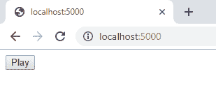

# 制作 Node.js SoundCloud 音乐播放器

> 原文：<https://dev.to/ryhenness/making-a-node-js-soundcloud-music-player-315d>

怎么了，好久没发帖了！我对此很兴奋，也很高兴你在这里。:)我将使用 Node.js 构建一个 SoundCloud 音乐播放器。这个项目的代码可以在我的 [SweetCode 存储库](https://github.com/henness17/SweetCode)中找到，旁边还有其他代码。

* * *

# 目录

这篇文章有三个主要部分。这篇文章将带你了解构建 SoundCloud 音乐播放器的整个过程——从设置“Hello，world”服务器到改变播放器的音量:

*   你好，音乐云播放器
*   播放音乐
*   添加功能

* * *

# 你好，音云播放器

### 创建应用程序

让我们从制作我们的 *server.js* 文件开始。这将是我们的 Node.js 服务器，对于这个项目来说，它可以保持简单，因为大量的工作将在客户端完成。对于这个应用程序，我将使用 Express 作为我们的极简服务器框架，EJS 作为我们的视图引擎。如果你不熟悉设置/运行 Node.js 服务器，看看[这篇文章](https://dev.to/ryhenness/nodejs--express-server-setup-6ch)。

#### *server.js*

```
var express = require('express');
var app = require('express')();

app.set('views', __dirname + '/views');
app.set('view engine', 'ejs');
app.use(express.static('public'));

app.get('/', function (req, res) {
  res.render("client");
});

app.listen(5000, function () {
  console.log('listening on *:5000');
}); 
```

### 构建应用程序

正如你在我们的第一条路线中看到的，我们将渲染客户端。“客户”其实就是我们的*。ejs* 文件将被放在一个名为*的文件夹中查看*。我们还得到了一个*公共*文件夹，这是我们大部分 JavaScript 将会存在的地方。以下是当前文件夹结构的外观:

[](https://res.cloudinary.com/practicaldev/image/fetch/s--7-3Fs5I8--/c_limit%2Cf_auto%2Cfl_progressive%2Cq_auto%2Cw_880/https://thepracticaldev.s3.amazonaws.com/i/2ok6g2952la5oiuvles2.png)

每当我开始一个新项目的工作时，我喜欢从简单的开始，并弄清楚首先应该关注什么。这个项目主要是让浏览器播放来自 SoundCloud 的音乐，所以我想保持视图尽可能简单。让我们用一个简单的 play 按钮来设置我们的 *client.ejs* 文件(这将给我们一个按钮来设置我们的音乐播放器，它现在什么也不做！).

#### *client.ejs* -

```
<body>
  <button>Play</button>
</body> 
```

不错，应用程序正在运行。
[T3】](https://res.cloudinary.com/practicaldev/image/fetch/s--lW3wSqg6--/c_limit%2Cf_auto%2Cfl_progressive%2Cq_auto%2Cw_880/https://thepracticaldev.s3.amazonaws.com/i/jww7ou2n4b9mdktykajy.png)

* * *

# 播放音乐

### 了解 NPM 套餐和捆绑

好了，我们到了最酷的部分了！但是我们要怎么做呢，我们要用什么呢？嗯，我们可以使用普通的 SoundCloud API，或者我们可以搜索一些有人为 SoundCloud API 制作的包装包。我想我会使用这个由 Dmitri Voronianski 编写的 [soundcloud-audio](https://www.npmjs.com/package/soundcloud-audio) npm 包，它看起来很可靠，并且它有很好的文档来帮助我们进行。

因为这个 npm 包是为服务器端编写的，所以我们必须使用某种捆绑器来允许我们在客户端(浏览器)使用它。你可以在这里找到这个[的解释。我要用的捆绑器是](https://stackoverflow.com/questions/32126003/node-js-document-is-not-defined)[浏览器](http://browserify.org/)。

### 书写播放器

让我们编写我们的 *player.js* 文件，然后我将向您展示如何捆绑它并通过您的播放按钮使用它。在我们的*公共*文件夹中，让我们创建我们的 *player.js* 。在这个例子中，我将使用 Biskwiq 的混音。
[https://w.soundcloud.com/player/?url=https://soundcloud.com/biskwiq/dawntheopus&auto_play=false&color=%23000000&hide_related=false&show_comments=true&show_user=true&show_reposts=false&show_teaser=true](https://w.soundcloud.com/player/?url=https://soundcloud.com/biskwiq/dawntheopus&auto_play=false&color=%23000000&hide_related=false&show_comments=true&show_user=true&show_reposts=false&show_teaser=true)

在 *player.js* 中，让我们首先需要我们的 soundcloud-audio 包并创建我们的播放器。创建播放器需要你使用自己的客户端 id(我从网上搜集了一个你可以用的！)

> 编辑:这把钥匙不能用了，你需要另找一把！

我们可以给*窗口*一个名为 *play* 的函数，在这个函数中，播放器将调用它的 resolve 函数，并链接到想要的 SoundCloud 歌曲。

#### *player.js* -

```
const SoundCloudAudio = require('soundcloud-audio');
const player = new SoundCloudAudio('95f22ed54a5c297b1c41f72d713623ef');

window.play = function () {
    player.resolve("https://soundcloud.com/biskwiq/dawntheopus", function (track) {
        player.play();
    });
} 
```

很好，现在我们要做的就是将这个脚本包含到我们的 *client.ejs* 文件中，并将其分配给播放按钮，如下所示:

```
<script src="player-bundle.js"></script>
<body>
  <button onclick="play()">Play</button>
</body> 
```

哦等等！那是 *player-bundle.js* ，不是 *player.js* 。我们需要制作这个包文件，这样我们就可以在客户端使用这个播放器。在你的项目根目录下运行这个命令来下载浏览器:

```
npm install --save browserify 
```

> 不要忘记使用 **-保存**和你的安装！您的包需要与本地节点模块一起保存，而不是全局保存，以便进行捆绑。

现在我们可以通过运行下面的命令来捆绑*player . js*:

```
browserify public/player.js -o public/player-bundle.js 
```

这将告诉 *browserify* 获取 *player.js* 文件并将其打包，然后将其输出放入同一个名为 *player-bundle.js* 的文件夹中。每当我们对 *player.js* 进行更改时，我们都需要用这个命令重新捆绑它。再次运行此命令将会覆盖包文件，而不会给出提示。

太棒了。播放按钮现在播放歌曲！注意:音量会很高，因为我们还没有触及那个设置。:)

* * *

# 添加功能

所以它可以播放音乐，但还不能做太多其他的事情。我当然希望音乐播放器有暂停按钮，并能改变音量。我们开始吧！我首先要给我的 *client.ejs* 按钮:

#### *client.ejs* -

```
<script src="player-bundle.js"></script>
<body>
  <button onclick="play()">Play</button>
  <button onclick="pause()">Pause</button>
  Volume: <input type="range" min="0" max="100" value="80" class="slider" id="volume-range">
</body> 
```

首先，让我们为播放器实现*暂停*功能，因为我们在 onclick 中引用了它，但它实际上还没有定义。这很简单，我们想要使用的函数已经在我们制作的播放器常量中了:

#### *player.js* -

```
const SoundCloudAudio = require('soundcloud-audio');
const player = new SoundCloudAudio('95f22ed54a5c297b1c41f72d713623ef');

window.play = function () {
    player.resolve("https://soundcloud.com/biskwiq/dawntheopus", function (track) {
        player.play();
    });
}

window.pause = function () {
    player.pause();
} 
```

> 别忘了重新打包你的 *player.js* 文件！！

嘭，歌曲暂停了！现在让我们把音量控制器打开，这样我们就不会再把耳朵吹掉了。我们的播放器需要知道音量设置到什么水平，所以让我们创建一个函数。请注意，这个级别需要是一个小数，我们将传入一个整数，然后除以 100，因此它是十进制形式的播放器的 setVolume 函数。

#### *player.js* -

```
const SoundCloudAudio = require('soundcloud-audio');
const player = new SoundCloudAudio('95f22ed54a5c297b1c41f72d713623ef');

window.play = function () {
    player.resolve("https://soundcloud.com/biskwiq/dawntheopus", function (track) {
        player.play();
    });
}

window.pause = function () {
    player.pause();
}

window.setVolume = function (level) {
    level = level / 100;
    player.setVolume(level);
} 
```

因为我们没有使用音量按钮，所以我们不能使用 onclick。我们能做的是获得“音量范围”控件，并在控件获得输入时调用 *setVolume* 函数。

#### *client.ejs* -

```
<script src="player-bundle.js"></script>
<body>
  <button onclick="play()">Play</button>
  <button onclick="pause()">Pause</button>
  Volume: <input type="range" min="0" max="100" value="80" class="slider" id="volume-range">
</body>
<script>
    var volume = document.getElementById("volume-range");
    volume.oninput = function () {
        setVolume(this.value);
    }
</script> 
```

* * *

# 回顾

如果你跟着我，恭喜你！你刚刚做了一个 SoundCloud 音乐播放器。您使用了一个 Express Node.js 服务器来提供一个捆绑的 npm 包，该包包装了 SoundCloud API 的功能。如果你想继续开发这个项目，我有一些建议:

*   为歌曲添加时间线，以便用户可以更改歌曲的时间。
*   增加一些造型，让玩家看起来更好！
*   添加一个队列，以便用户可以添加接下来要播放的歌曲(也添加一个下一步按钮)。
*   显示当前播放歌曲的封面、标题和艺术家姓名。
*   使播放器在网络浏览器间共享(如果一个用户播放，跳过，等等。那么该功能也适用于该站点上的其他用户)。查看 [socket.io](https://socket.io/) 。

谢谢你坚持到最后。如果你有任何问题，请直接在这里或我的社交网站@rhenness & [@ryhenness](https://dev.to/ryhenness) 上给我留言。:)

如果你喜欢这篇文章，你可能也会喜欢[制作一个 Node.js Twitter Bot:假定义](https://dev.to/ryhenness/nodejs-twitter-bot-bogus-definition-dmm)。