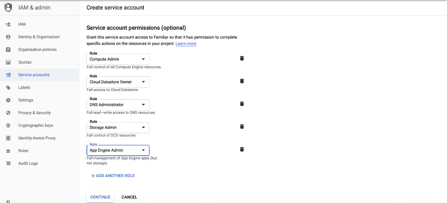
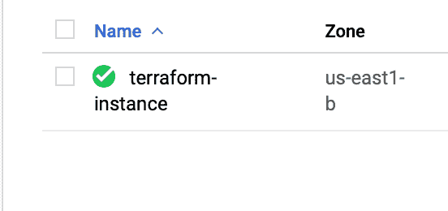

# 熟悉的第二天:地球化火星

> 原文：<https://dev.to/nickblow/familiar-day-2-terraforming-mars-17ma>

*图片来自知识共享用户 [Kimika Ying](https://www.flickr.com/photos/48054321@N05) 根据[CC BY-NC-SA 2.0](https://creativecommons.org/licenses/by-nc-sa/2.0/?ref=ccsearch&atype=rich)T5】授权*

欢迎回到我关于从头开始构建我的[开源桌面 RPG 助手](https://github.com/NickBlow/familiar)的系列。以防你还没看过[这是](https://dev.to/nickblow/familiar-day-1-4nkm)第一部分，我为我的项目列出了一系列高水平的目标。

今天我实际上要写一些代码(🎉🎉🎉🎉🎉).[确切地说是地形](https://www.terraform.io)配置。《Terraform 入门指南》仅涵盖 AWS，因此这可能会成为 GCP 用户的有用指南。也许吧。我用的是最新版本的 Terraform(撰写本文时，Terraform v0.12.2)。

我不会讲解如何安装 Terraform，但在我的 Mac 上，它就像`brew install terraform`一样简单。

### 为什么要 Google 云平台？

我用 AWS 很多，真的很好。他们总是以极快的速度增加改进。Azure，我还没有真正使用过，但似乎也是一个不错的云平台。然而，对于一个对价格敏感的个人项目，谷歌云拥有最慷慨的免费层，只有*永远免费*计算资源(不包括 FaaS，这将在以后出现)。

#### 关于本人知识水平的免责声明

我绝不是地形或 GCP 专家，也不自称是——我这个项目的部分目的是学习更多关于这些工具的知识。我将努力提供准确和详细的信息，并明确指出我对最佳实践不确定的地方。如果有什么我可以改进的地方，或者我做错了什么，请告诉我！犯错误是最好的学习方式。

## 让我们来看代码

### 设置提供商

首先，我们需要一个供应商。提供者让 Terraform 知道使用哪组 API，以及如何创建资源。在 [Terraform 网站](https://www.terraform.io/docs/providers/google/getting_started.html)上有一个有用的 GCP 入门指南。

我们使用的是[谷歌云](https://cloud.google.com/)，所以首先让我们在那里建立一个账户，并下载 [GCloud SDK](https://cloud.google.com/sdk/) 。一旦我们下载了，我们需要用`gcloud init`初始化它。

#### 创建服务账户

遵循此处的说明[。我们在控制台上这样做，因为它的 CLI 界面还在测试阶段。对于角色，我们真的应该使用最小特权](https://cloud.google.com/iam/docs/creating-managing-service-accounts#iam-service-accounts-create-console)的[原则，只给我们的服务角色访问它需要做的事情。我们可能会在角色上比我们需要的更宽泛一点，因为我们不完全确定我们需要什么，但我们可以在以后削减它。](https://en.wikipedia.org/wiki/Principle_of_least_privilege)

现在让我们添加以下权限:`Compute Engine > Compute Admin`、`DNS > DNS Administrator`、`Datastore > Cloud Datastore Owner`、`Storage > Storage Admin`和`App Engine > App Engine Admin`，因为我们几乎肯定会需要这些权限。让我们暂时离开 Kubernetes。

以下是这些角色的样子: [](https://res.cloudinary.com/practicaldev/image/fetch/s--ArvaUfuU--/c_limit%2Cf_auto%2Cfl_progressive%2Cq_auto%2Cw_880/https://thepracticaldev.s3.amazonaws.com/i/q4xwfcopoebmze167cy4.png)

我创建了一个 key，下载到 JSON 里，保存到`~/.gcp/terraform-sa.json`。

理想情况下，从现在开始，我们将不会接触 GCP 控制台。实际上，检查资源等是有用的。但是除了更改服务角色的权限之外，我们应该从 CLI 和 terraform 做所有的事情。

#### 我们的地形配置

Terraform 确实是可组合的，可以让你很容易地把东西分成多个文件，但是现在让我们把它们都放在一个文件里。我非常喜欢让事情运转起来，然后尽早地、经常地重构。

首先，让我们创建一些[变量](https://www.terraform.io/docs/configuration/variables.html)，这样所有的配置都是通用的。我已经将它们添加到一个`variables.tf`文件中，我还不确定我是否会提交给源代码控制——我只是不提交它，如果我决定要做什么，我会把它放入. gitignore 中。

```
variable "region" {
  type = string
  default ="YOUR_REGION_HERE"
}

variable "project_id" {
    type = string
    default = "YOUR_PROJECT_ID_HERE"
}

variable "service_account_location" {
    type = string
    default = "YOUR_SERVICE_ACCOUNT_LOCATION_HERE"
}

variable "zone" {
  type = string
  default = "YOUR_ZONE_HERE"
} 
```

填写上面的默认值，保存文件，然后让我们进入我们的 main.tf 文件。服务帐户位置是指您在上面存储服务帐户 JSON 文件的位置。

**⚠️WARNING⚠️:谷歌计算引擎免费等级仅适用于美国西部 1、美国中部 1、美国东部 1 地区**。地区和区域的完整列表可以在[这里](https://cloud.google.com/compute/docs/regions-zones/)找到。

我们将使用“谷歌”提供商，但我们可能会在以后升级到“谷歌测试版”提供商，因为我关注一些测试版功能，如[从 Firestore 更改中触发云功能](https://firebase.google.com/docs/firestore/extend-with-functions)。

现在，让我们以[入门指南](https://www.terraform.io/docs/providers/google/getting_started.html)中的计算实例配置为例。

我的`main.tf`现在看起来是这样的:

```
provider "google" {
  credentials = "${file(var.service_account_location)}"
  project     = var.project_id
  region      = var.region
  zone = var.zone
}

resource "google_compute_instance" "vm_instance" {
  name         = "terraform-instance"
  machine_type = "f1-micro"

  boot_disk {
    initialize_params {
      image = "debian-cloud/debian-9"
    }
  }

  network_interface {
    # A default network is created for all GCP projects
    network       = "default"
    access_config {
    }
  }
} 
```

*注意:语法高亮不起作用，因为他们改变了在 Terraform 0.12 中[表达式](https://www.terraform.io/docs/configuration/expressions.html)的工作方式。它编译正确，我保证！*

让我们`cd`进入有 terraform 文件的文件夹，在*熟悉的*它被创造性地称为‘terra form’。它应该有两个文件`variables.tf`和`main.tf`。

运行`terraform init`来初始化一切，然后运行`terraform apply`来显示执行计划。检查这一切看起来正常，然后键入`yes`。

几秒钟后:
[](https://res.cloudinary.com/practicaldev/image/fetch/s--K4CIy_St--/c_limit%2Cf_auto%2Cfl_progressive%2Cq_auto%2Cw_880/https://thepracticaldev.s3.amazonaws.com/i/eskqdokw0tl6lcvwb0d1.png)

让我们进入谷歌云控制台-
[](https://res.cloudinary.com/practicaldev/image/fetch/s--g0w_6UmZ--/c_limit%2Cf_auto%2Cfl_progressive%2Cq_auto%2Cw_880/https://thepracticaldev.s3.amazonaws.com/i/rodd70f6hbloijaau5i5.png)

真棒🥳！我们已经建立了一些基础设施。它还没有做太多，但我们会及时实现的。

## 下次:

(可能会更改)我们将使用 terraform 做一些实际的事情，设置一些存储，并设置一个 [Terraform 后端](https://www.terraform.io/docs/backends/)来存储我们的配置，因为这将使多人管理变得更容易，并且通常是一种好的做法。