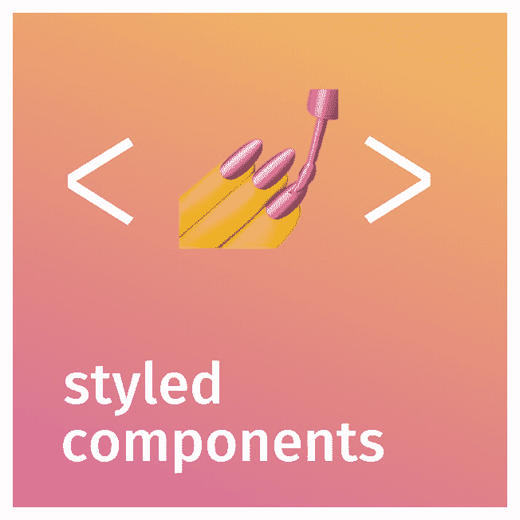
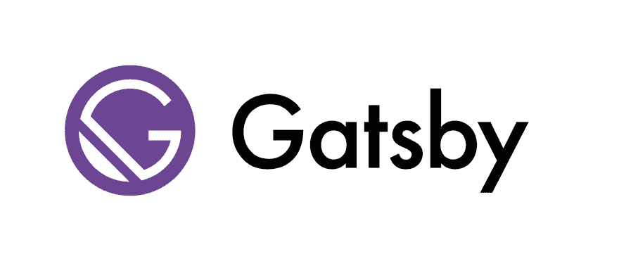
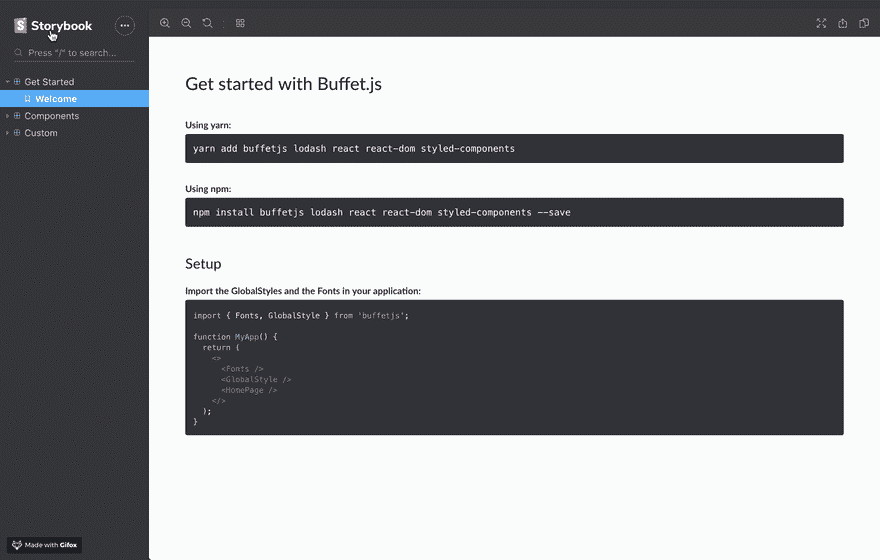
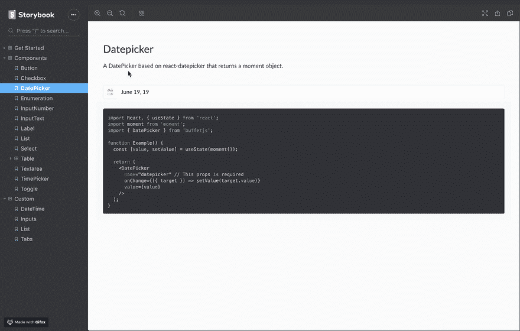

# 🍱 🍲为你们所有人开放自助餐

> 原文：<https://dev.to/strapi/open-buffet-for-you-all-4jb8>

用样式化组件制作的 React 组件库。

🚨我们非常兴奋地宣布发布新的组件库 Buffet.js。

虽然这个项目刚刚出炉，但你已经可以[尝试一下](https://github.com/strapi/buffet)。
这项工作是我们为 2019 年 Q2 举办的[路线图](https://portal.productboard.com/strapi/1-public-roadmap/c/50-components-library-release)的一部分。

buffet . js——一个吃到饱的组件库——的目的是为社区提供一个更快、更容易和更好的方法来开发他们的私有和公共插件，并且允许我们建立一个更强大的设计系统，可以很容易地更新。

如果你想试一试，这里有[如何](https://buffetjs.io)。

### 为什么要开发组件库

我们将 Strapi 设计成一个单独的应用程序，其中每个特性(插件)都是完全独立的。他们可以互相交流，但主要的想法是保持他们都是独立的。

由于您的项目管理是一个“简单”的 React 应用程序，它封装了位于完全不同的包中的较小的应用程序，因此它的结构不是单一的，为了有一个一致的设计系统，我们需要一个包含插件接口所需的所有组件的全局包。

如果你关注了 Strapi 的开发，你会意识到我们是从一个小团队开始的(现在也是...)并选择为 v3 采用单存储库结构。这些可重用的组件被放在`strapi-helper-plugin`包中，这个模块对于社区来说是非常不透明的。

在 Strapi beta 发布之前，这个包有点乱:它包含了共享的`webpack`配置、入口点、组件、文件生成器、eslint 等等...从技术上来说，它引发了一些问题:

*   这个包不是不可知的，所以我们不能开发不在 monorepository 里面的插件。
*   这个包是为每个插件而不是单个插件构建的。
*   没有代码完成，所以开发对新的贡献者来说是沉重和痛苦的。
*   沉重的建设主要是由于我们的风格系统，使用 SaaS 和 PostCSS。

这份不完整的缺点清单让我们想到，*是时候更新一下`strapi-helper-plugin`计划了。*

### 增强功能

因此，几个月前， [Aurélien Georget](https://twitter.com/aureliengeorget) 要求 [Virginie Ky](https://github.com/virginieky) 领导创建一个名为 Buffet.js 的组件库的雄心勃勃的任务。Buffet.js 的目标是解决上面列出的在社区指导、开发人员体验、代码优化和维护方面长期存在的问题。

##### 开源贡献者需要一致性

外部组件库促进了贡献，但它也确保了组件不会在代码库中重复，并使 Strapi 插件的开发更容易。

作为 Strapi 开源项目的主要贡献者，核心产品团队还负责创造最佳的开发人员体验，不管项目的贡献者有多少。我们的最终用户必须总是喜欢使用 Strapi，我们到目前为止收到的反馈表明，易用性和直观的管理面板是 Strapi 被选为 CMS 的主要原因之一。

> js 允许团队为社区提供一组视觉上和功能上一致的 UI 和 UX 指南。

##### 开发者设计思维的核心

我们希望 Buffet.js 不仅对 Strapi 社区有用，而且对每个需要 UI 组件库的人都有用。我们知道，良好的开发者体验将允许社区更好地采用，并增加对改进项目的贡献，使其成长。

对以下几点给予了特别关注:

*   **CSS-in-JS** 。我们查看了不同的类库，决定使用[风格的组件](https://www.styled-components.com)来利用 JS 的能力，同时仍然使用 CSS 语法。

*   **DOM** 。我们通过确保所提供的组件尽可能接近底层 DOM 结构并且尽可能无状态，来专注于提供最佳的可读性。

*   **隔离**。Buffet.js 中的组件是独立工作的。您可以在代码库中使用任何 Buffet.js 组件，而不会有任何副作用。

*   **文档**。该网站是使用 [Gatsby.js](https://www.gatsbyjs.org) 开发的，以获得超快的导航体验。所有组件都用[故事书](https://storybook.js.org/)渲染。

 
多亏了 Storybook，组件可以按照一定的顺序显示，或者显示在不同的页面上，以获得更好的可读性。我们还通过旋钮使演示更具互动性，使组件的不同状态可视化。

##### 代码优化

*   **代码质量**。多亏了样式化组件，为样式生成了唯一的类名，所以忘掉类名错误吧。只有呈现的组件样式被注入到页面上。结合代码分割，这意味着您的用户加载最少的必要代码。

*   **性能**。管理面板的建造尺寸和时间都减少了。

*   **维护**。组件库的开发还将允许无缝维护的进一步可伸缩性。所有基于 Buffet.js 组件的插件开发都会通过更新 Buffet.js 本身来更新。

#### 一些很酷的东西

如果你习惯了管理面板，你会认识到大多数开发的组件，虽然我们有点自豪地介绍我们新的日期选择器，可以与时间选择器结合使用...

我们目前的日期选择器，我们完全意识到它“有点过时和不可用”，所以我们决定使用 Airbnb 的日期选择器开发一个新的。

另一方面，对于时间选择者来说...这是另一个故事:我们找不到一个符合我们需要的 React，所以我们着手开发一个新的，主要是受你在谷歌日历中看到和使用的那个的启发...[来看看吧](https://buffetjs.io/storybook/?path=/story/custom--datetime)

### 谢谢

最后但同样重要的是，感谢所有为 Buffet.js 做出贡献的人。
我们将继续努力提供最好的组件，以减轻社区贡献。

js 是一个麻省理工学院许可的开源项目。这是一个由 Strapi 团队发起的独立项目，但欢迎任何希望做出贡献的人！
在 Github 上查看我们:[https://github.com/strapi/buffet](https://github.com/strapi/buffet)