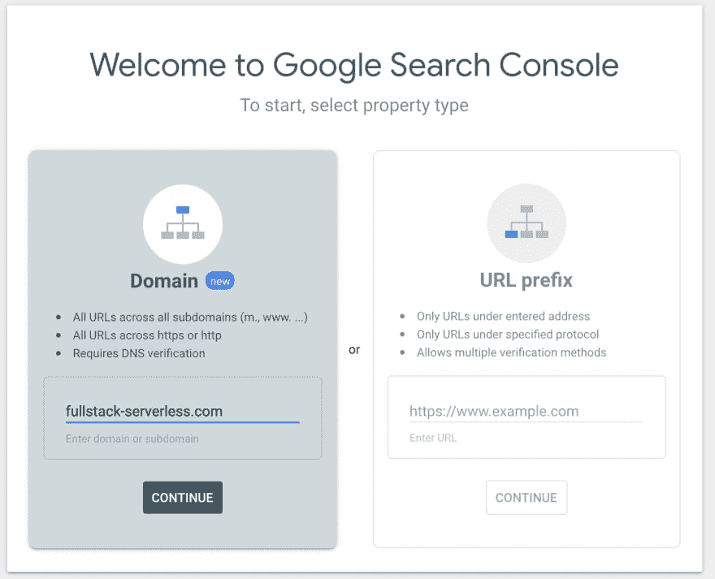
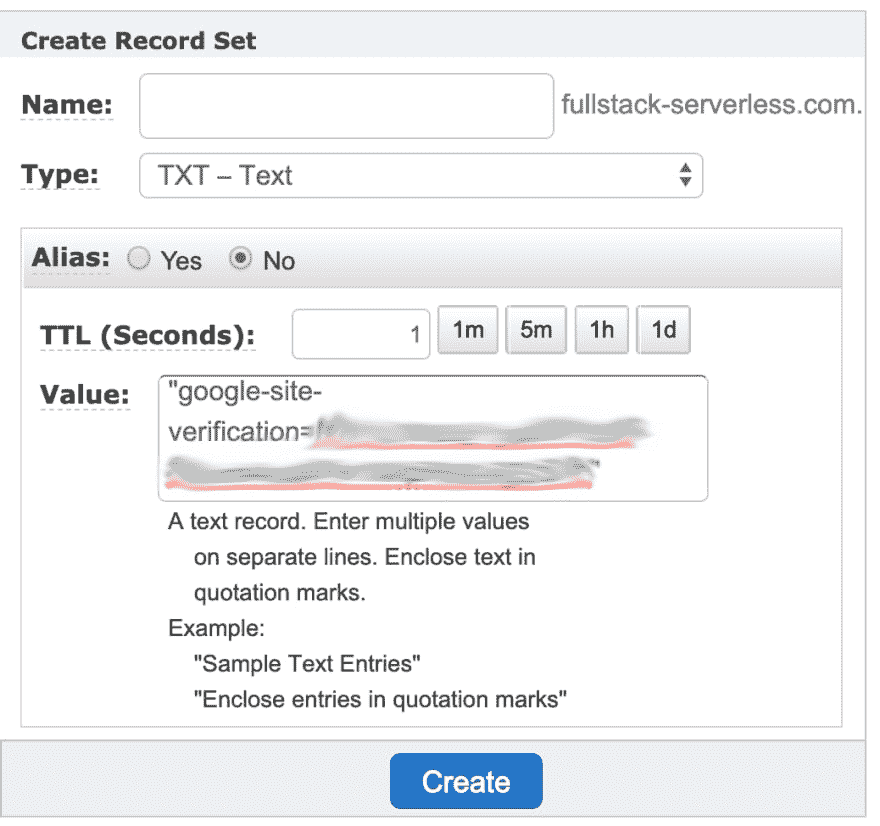
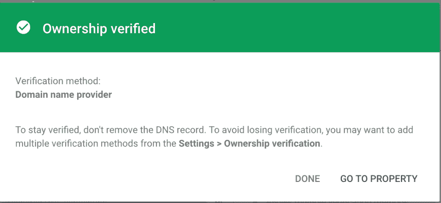
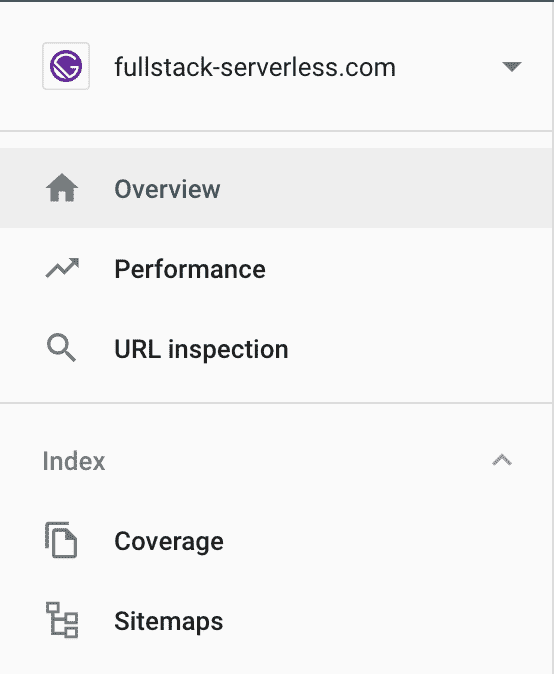

# 如何将站点地图添加到 React Gatsby 静态站点和 Google 搜索控制台

> 原文：<https://dev.to/codemochi/how-to-add-sitemaps-to-a-react-gatsby-static-site-and-google-search-console-5470>

在这篇文章中，我们将展示如何确保谷歌网络爬虫能够找到你的基于盖茨比的网站上的所有页面。

如果网站爬虫那么擅长寻找新网站，为什么我们不能在互联网上放一个新页面，然后等着谷歌去找呢？这个问题问得好！事实证明，即使 Google 知道你的域名，拥有一个 XML 站点地图也能让网络爬虫更容易找到你站点上的所有页面。没有它，如果你添加了一个新的页面，谷歌实际上不会知道它的存在，直到其他页面链接到它。

**如何给盖茨比添加网站地图**

向站点添加 sitemap 功能的第一步是向项目添加`gatsby-plugin-sitemap`包。导航到项目的根文件夹，在终端中输入以下内容:

```
npm install --save gatsby-plugin-sitemap 
```

然后我们需要将插件添加到项目根目录下的 gatsby-config.js 文件中。我们将`gatsby-plugin-sitemap`行添加到`plugins`数组中，并将站点 url 添加到`siteMetadata`部分:

```
module.exports = {
  siteMetadata: {
    title: `Gatsby Default Starter`,
    description: `Kick off your next, great Gatsby project with this default starter. This barebones starter ships with the main Gatsby configuration files you might need.`,
    author: `@gatsbyjs`,
    siteUrl: `https://www.fullstack-serverless.com`,
  },
  plugins: [
    `gatsby-plugin-sitemap`,
    `gatsby-plugin-react-helmet`,
    {
      resolve: `gatsby-source-filesystem`,
      options: {
        name: `images`,
        path: `${__dirname}/src/images`,
      },
    },
    `gatsby-transformer-sharp`,
    `gatsby-plugin-sharp`,
    {
      resolve: `gatsby-plugin-manifest`,
      options: {
        name: `gatsby-starter-default`,
        short_name: `starter`,
        start_url: `/`,
        background_color: `#663399`,
        theme_color: `#663399`,
        display: `minimal-ui`,
        icon: `simg/gatsby-icon.png`, // This path is relative to the root of the site.
      },
    },
  ],
} 
```

现在我们可以部署网站了。一个很好的方法是使用 AWS Amplify，因为它可以为您自动完成所有工作。我之前写了一篇教程展示了如何做到这一点，所以如果你想要一个好的样板文件，可以看看这篇文章，或者看看这篇文章的结尾是一个已经包含了这个站点地图代码的样板文件项目。

无论如何，一旦你更新了你的网站，你会看到在你的域名的根目录下有一个新的 xml 文件。你可以在[https://www.codemochi.com/sitemap.xml](https://www.codemochi.com/sitemap.xml)看看这个例子:

```
<urlset xmlns="http://www.sitemaps.org/schemas/sitemap/0.9" xmlns:news="http://www.google.com/schemas/sitemap-news/0.9" xmlns:xhtml="http://www.w3.org/1999/xhtml" xmlns:mobile="http://www.google.com/schemas/sitemap-mobile/1.0" xmlns:image="http://www.google.com/schemas/sitemap-image/1.1" xmlns:video="http://www.google.com/schemas/sitemap-video/1.1">
<!--Many more urls are omitted below for clarity-->
<url>
  <loc>https://codemochi.com/</loc>
  <changefreq>daily</changefreq>
  <priority>0.7</priority>
</url>
<url>
  <loc>https://codemochi.com/about/</loc>
  <changefreq>daily</changefreq>
  <priority>0.7</priority>
</url>
</urlset> 
```

我们可以看到，网站中的每个页面都会有一个`<url>`条目。Codemochi.com 在主页和“关于”页面上都有一个条目。将来当我们向 Gatsby 站点添加页面时，这个插件会自动添加更多的条目。

**如何将网站地图添加到谷歌搜索控制台**

现在我们有了一个站点地图，我们应该向 Google 搜索控制台注册我们的域名。在我们将在下面展示的过程中，总的想法是，我们需要将该域添加到 Google 搜索控制台，然后通过向 AWS Route 53 添加密钥来验证我们拥有它，这将向 Google 证明我们拥有我们在控制台中注册的域。如果您使用的是竞争对手的 DNS 注册商，如 name price、Google 或 GoDaddy，这个过程将是相同的。完成后，我们可以给它 sitemap.xml 文件的 url 路径，Google 会对它进行索引，并找出您的网站包含的所有网页。

首先，我们去谷歌搜索控制台，用我们的谷歌账户登录。如果我们单击“添加域”,屏幕会提示我们:

 [](https://res.cloudinary.com/practicaldev/image/fetch/s--h7ZzU29u--/c_limit%2Cf_auto%2Cfl_progressive%2Cq_auto%2Cw_880/https://www.codemochi.com/static/d8d9432e637eb38129e04561cba1c8d9/8b3dc/search-console-add-domain.png)

注册整个域名比注册一个 URL 前缀要容易得多，所以请将您的域名添加到左边的字段中，然后单击继续。接下来，我们必须使用 DNS 记录来验证域所有权。

 [](https://res.cloudinary.com/practicaldev/image/fetch/s--FWUSjsLa--/c_limit%2Cf_auto%2Cfl_progressive%2Cq_auto%2Cw_880/https://www.codemochi.com/static/879b1af3d33b6969274820016937e573/dd34b/search-console-verify-domain.png)

复制 TXT 记录然后前往 AWS 号公路。单击托管区域，然后单击您有兴趣注册的特定托管区域。

[](https://res.cloudinary.com/practicaldev/image/fetch/s--DOm9fSIk--/c_limit%2Cf_auto%2Cfl_progressive%2Cq_auto%2Cw_880/https://www.codemochi.com/static/4a3b0bc4a60c89a9b69bd424fe0d9dbe/36372/route53-domains.png)

现在我们必须创建一个新的记录集。您可以将名称留空，并将记录集类型更改为 TXT。然后，您需要将 TTL 更改为较低的值，比如 1 秒。TTL 是更新被推送到世界各地的域服务器的频率，因此我们希望将该值设置得较低，以便在我们做出更改后它会立即得到更新。(请确保在设置好一切后将此数字改回 1 天，因为一旦一切配置正确，就没有必要更新得这么快。)

[](https://res.cloudinary.com/practicaldev/image/fetch/s--hXy5K0J9--/c_limit%2Cf_auto%2Cfl_progressive%2Cq_auto%2Cw_880/https://www.codemochi.com/static/ef8b08da7d8f3cea21db19d683702055/56eb5/route53-create-record-set.png)

获取我们从 google 搜索控制台复制的文本片段，并将其添加到值字段。确保用双引号将字符串括起来，然后单击 Create 按钮。(如果在这一步出现错误，可能是因为您忘记了双引号——我第一次就犯了这个错误！)

现在你可以回到谷歌搜索控制台，点击验证。如果一切按计划进行，您应该会看到这个确认框:

[](https://res.cloudinary.com/practicaldev/image/fetch/s---hXQJgFj--/c_limit%2Cf_auto%2Cfl_progressive%2Cq_auto%2Cw_880/https://www.codemochi.com/static/aa1f241ddeee4c8a8188aa376d385d0c/88c1b/search-console-domain-verified.png)

现在我们可以将网站地图添加到 google 搜索控制台。在工具条上点击站点地图标签。

[](https://res.cloudinary.com/practicaldev/image/fetch/s--2Bvl8Vg1--/c_limit%2Cf_auto%2Cfl_progressive%2Cq_auto%2Cw_880/https://www.codemochi.com/static/d2f26698c22da6ec1acbb4000429e668/09465/search-console-side-bar.png)

然后输入站点地图的完整路径，点击提交。

[T3】T4】](https://res.cloudinary.com/practicaldev/image/fetch/s--yvK7Yf8N--/c_limit%2Cf_auto%2Cfl_progressive%2Cq_auto%2Cw_880/https://www.codemochi.com/static/94e6bece1ae5f49455ef4372c4c13592/75d8a/search-console-add-sitemap.png)

这应该是它，如果你等一会儿，你会看到谷歌索引你所有的网页。您应该看到它发现了您的站点地图中的所有页面。如果有任何缺页的错误，您也会收到通知。

[T3】T4】](https://res.cloudinary.com/practicaldev/image/fetch/s--N_G3b3mN--/c_limit%2Cf_auto%2Cfl_progressive%2Cq_auto%2Cw_880/https://www.codemochi.com/static/c6a221eb052683d71bc73fb141fa0376/71615/search-console-sitemap-coverage.png)

**示例项目**
签出[一个已经配置了站点地图插件的 starter Gatsby 项目](https://github.com/CaptainChemist/amplify-gatsby-sitemaps)。

从那里来的还有更多！
[点击这里给我们您的电子邮件，我们会在发布新内容时通知您。](https://gmail.us20.list-manage.com/subscribe?u=37f38485b2c7cff2f3d9935b5&id=e3bc056dde)我们尊重您的电子邮件隐私，我们绝不会向您发送垃圾邮件，您可以随时退订。

最初发布于 [Code Mochi](https://www.codemochi.com/blog/2019-06-19-add-sitemap-to-react-gatsby/) 。