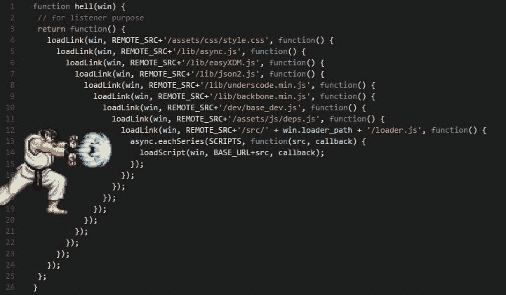

# 回电和承诺，简单解释

> 原文：<https://dev.to/taillogs/callbacks-and-promises-simply-explained-3dkd>

[封面图片致谢](http://codeatmorning.com/3-reasons-to-avoid-rails-callbacks/)

#### 回调？

```
// caller
function foo(callback) {
  callback('world');
}

// callback function
function myCallback(name) {
  console.log(`Hello ${name}`); // "hello world"
}

// pass callback to caller
foo(myCallback); 
```

为了理解回调，你首先需要理解一般情况下 [NodeJS](https://nodejs.org/en/about/) 如何运行你的代码。NodeJS 中的一切都由“事件循环”控制，因为 NodeJS 的核心是一个单一的、巨大的、非常复杂的循环。

在 NodeJS 中运行代码时，每一行都由底层 V8 (JavaScript 引擎)解释。基本的语言操作，如数学和字符串操作，会立即将结果返回给调用者。但其他操作(如网络请求、读写文件和访问系统硬件)不会立即执行，而是添加到事件循环的“调用堆栈”中。事件循环不断地以后进先出的顺序执行可用的任务。如果一个任务迫使事件循环在处理其他事件循环元素之前完成它的计算，我们说它“阻塞”了事件循环。此外，我们将阻塞直到完成的任务类型称为**同步任务**。

> 如果你想了解更多关于事件循环的知识，这是一篇非常棒的文章。说真的，太棒了！

还有另一种类型的任务可以注册到事件循环，一个**异步任务**。如您所料，异步任务与同步任务相反，不会阻塞事件循环。相反，异步任务应该提供一个它们可以“回调”的函数，该函数将处理异步事件完成后产生的任何结果。这解释了什么是回调，但是为什么需要回调？

#### 为什么要回调？

想象一下，如果网站必须在浏览器中一个接一个地加载它们所有的资源，并且直到所有的东西都被完全检索出来才能呈现。如果是这样的话，Gmail 要过 30 秒才会出现在我的电脑上。回调通过允许消耗很少 CPU 的任务长时间运行而不阻塞其他任务来解决这个问题。澄清一下，这不是并行，因为两件事不会同时发生(NodeJS 是单线程的)。

[](https://res.cloudinary.com/practicaldev/image/fetch/s--itAGae_O--/c_limit%2Cf_auto%2Cfl_progressive%2Cq_auto%2Cw_880/https://thepracticaldev.s3.amazonaws.com/i/x2n6rhv9rm0szzrnmej1.jpg) 
[来源](http://www.theimpulsedigital.com/blog/page-loading-speed-affects-ui/)

大多数核心 NodeJS API，比如[文件系统](https://nodejs.org/api/fs.html)，都是异步实现的，以允许最小的事件循环阻塞。如果还不清楚，我发现当你需要回调时，最好的概括方法是:

如果代码与另一个系统交互，而那个系统不能保证它的可靠性(文件系统、网络、gpu)，可能需要回调。

例如，如果您向 stripe.com 发送一个 POST 请求，您无法保证 stripe.com 的响应速度有多快。为了处理这种不可靠性，您以非阻塞方式发送 POST 请求，并注册一个回调，当 stripe.com 服务器响应时将调用该回调。因为 stripe.com 请求是异步的，所以您可以向 AWS S3 服务发出并发(而不是并行)请求(举例来说),从而大大减少应用程序的加载时间。

#### 为什么回调不好

[](https://res.cloudinary.com/practicaldev/image/fetch/s--c5SeU9EZ--/c_limit%2Cf_auto%2Cfl_progressive%2Cq_auto%2Cw_880/https://thepracticaldev.s3.amazonaws.com/i/63e129kuvt02m0b1vusc.jpeg)

[来源](http://www.theimpulsedigital.com/blog/page-loading-speed-affects-ui/)

随着时间的推移，人们开始对复试感到沮丧。理论上，回调是延迟代码执行的一个很好的解决方案。不幸的是，实际使用鼓励深度回调嵌套来处理嵌套事件(从另一个异步事件产生的异步事件)

> 显然，对于字符串操作这样的事情，你不需要回调。这只是一个人为的例子，以保持事情的干净和简单。

```
// caller
function foo(callback) {
  callback('world', myNestedCallback);
}

// inner inner callback
function myNestedNestedCallback(name, callback) {
  console.log(`Hello ${name}`);
  // Prints "Hello First Name: Mr. world"
}

// inner callback
function myNestedCallback(name, callback) {
  callback(`First Name: ${name}`);
}

// callback function
function myCallback(name, callback) {
  callback(`Mr. ${name}`, myNestedNestedCallback);
}

// pass callback to caller
foo(myCallback); 
```

这被称为“回调地狱”，因为当代码嵌套在许多回调中时，它会变得多么混乱。确定当前的范围和可用的变量通常变得非常具有挑战性。

[](https://res.cloudinary.com/practicaldev/image/fetch/s--HsYZ28yA--/c_limit%2Cf_auto%2Cfl_progressive%2Cq_auto%2Cw_880/https://thepracticaldev.s3.amazonaws.com/i/swuw0ixnu5xafgsxz7c0.jpeg)

[图像来源](https://medium.com/@quyetvv/async-flow-from-callback-hell-to-promise-to-async-await-2da3ecfff997)

当你需要加载多个东西并且不关心它们被处理的顺序时，回调是可以的，但是当你需要写有序的、连续的代码时，回调就不太好了。在大多数情况下，人们使用深度回调链作为人工序列代码。需要有一种解决方案，它不会阻塞事件循环，但允许代码在没有极端嵌套的情况下排序。

#### 承诺

不管你听说过什么，一个[承诺](https://developer.mozilla.org/en-US/docs/Web/JavaScript/Reference/Global_Objects/Promise)实际上只是一个花哨的回电。它实际上是一个带有定义良好的 API 的回调函数的包装器。Promise API 允许您查询底层异步事件的状态，并且具有允许您注册逻辑以处理从底层异步事件完成中生成的结果或错误的方法。承诺主要解决嵌套问题，因为他们把代码变成这样:

```
// caller
function foo(callback) {
  callback('world', myNestedCallback);
}

// inner inner callback
function myNestedNestedCallback(name, callback) {
  console.log(`Hello ${name}`);
  // Prints "Hello First Name: Mr. world"
}

// inner callback
function myNestedCallback(name, callback) {
  callback(`First Name: ${name}`);
}

// callback function
function myCallback(name, callback) {
  callback(`Mr. ${name}`, myNestedNestedCallback);
}

// pass callback to caller
foo(myCallback); 
```

成这样:

```
function myNestedNestedCallback(name) {
  return new Promise((resolve, reject) => {
    console.log(`Hello ${name}`); // Prints "Hello First Name: Mr. world"
  })
}

function myNestedCallback(name) {
  return new Promise((resolve, reject) => {
    resolve(`First Name: ${name}`);
  });
}

function myCallback(name) {
  return new Promise((resolve, reject) => {
    resolve(`Mr. ${name}`);
  });
}

myCallback('world').then(myNestedCallback).then(myNestedNestedCallback); 
```

如果您想将当前使用回调的代码转换成使用承诺的等价代码，这是一个很好的参考:

```
// callback way
function addCallback(a, b, callback) {
  callback(a + b);
}

// promise way
function addPromise(a, b) {
  return new Promise((resolve, reject) => {
    resolve(a + b);
  });
} 
```

如果你正在与一个基于回调的 API 交互，并且想要在外部将其转换成一个承诺，

```
// signature
function makeHTTPRequest(url, method, callback) {}

const convertedToPromise = new Promise((resolve, reject) => {
  makeHTTPRequest('google.com', 'GET', (body, err) => {
    if (err) {
      return reject(err);
    }
    return resolve(body);
  });
});

convertedToPromise.then((res) => console.log(res)); // prints response from google.com 
```

许多回调也可以通过 NodeJS 中的 [`util`包*自动*转换成它们的“promisified”版本。](https://nodejs.org/dist/latest-v8.x/docs/api/util.html#util_util_promisify_original) 

```
const { promisify } = require('util');

function addCallback(a, b, callback) {
  callback(a + b);
}

const asyncAdd = promisify(addCallback);
asyncAdd(3, 6).then((res) => console.log(res)); // "9" 
```

#### 异步等待

最后，我们有`async`和`await`。类似于承诺和回拨的关系，`async`和`await`实际上只是使用承诺的方式。`async` & `await`提供了一种语法来编写看起来像本地同步代码的 Promise 代码，这通常会产生可读性和可维护性更好的 JavaScript 代码。当您在函数上使用`async`标识符时，它相当于下面的 Promise 代码。

```
// async version
async function add(a, b) {
  return a + b; // really returns a Promise under the hood
}

// equivalent code but promise way
function addPromise(a, b) {
  return new Promise((resolve, reject) => {
    resolve(a + b);
  });
}

add(1, 2).then((res) => console.log(res)); // "3"
addPromise(1, 2).then((res) => console.log(res)); // "3" 
```

事实上，所有的`async`函数都返回一个完整的 Promise 对象。`await`为`async`方法提供额外的功能。当在调用异步函数之前使用 await 时，它意味着代码应该直接将异步结果返回到表达式的左侧，而不是使用显式的异步任务。这允许您编写有序的同步风格的代码，同时获得异步评估的所有好处。如果仍然没有意义，下面是承诺中相当于`await`的内容。

```
async function add(a, b) {
  return a + b;
}

async function main() {
  const sum = await add(6, 4);
  console.log(sum); // "10" 
} 
```

记住`await`只是对`.then()`的一种攻击，允许代码在没有嵌套的情况下进行样式化。上面的代码和下面的代码在功能上没有区别。

```
function addPromise(a, b) {
  return new Promise((resolve, reject) => {
    resolve(a + b);
  });
}

addPromise(6, 4).then((res => console.log(res))); // "10" 
```

#### 结论

我希望这能帮助那些仍在努力理解回电和承诺背后的核心机制的人。在很大程度上，这只是一堆语法上的甜言蜜语，并没有那么复杂。

如果您还在纠结于底层概念，如[并行、异步和并发，我推荐我最近写的关于这些主题的文章](https://dev.to/taillogs/parallel-computing-simplified-starring-gordon-ramsay-1epi)。

[我的博客](https://www.cdevn.com/callbacks-and-promises-simply-explained)