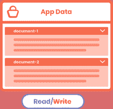
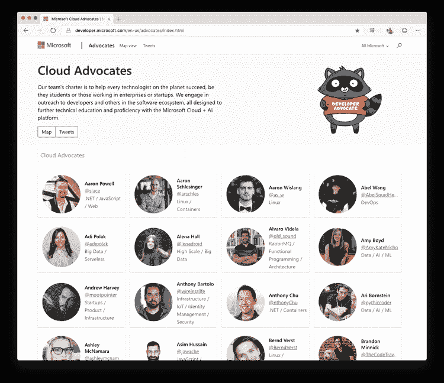
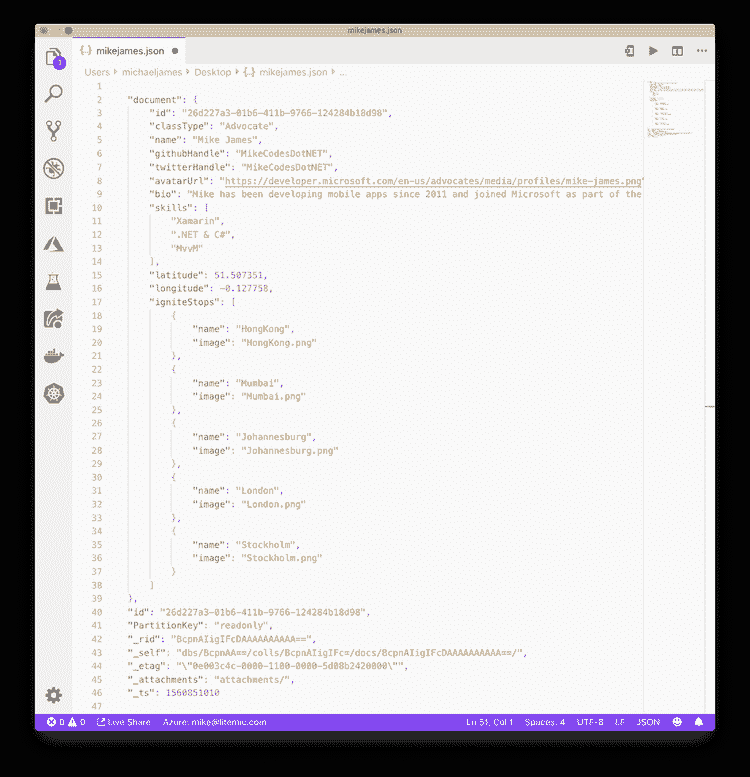
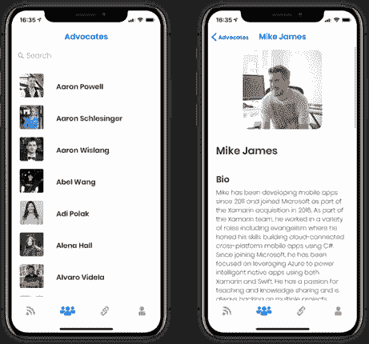

# 挖掘应用中心数据

> 原文：<https://dev.to/mikecodesdotnet/digging-into-app-center-data-1n5n>

我最近发表了一篇博客文章，讨论了向[应用中心](https://docs.microsoft.com/en-us/appcenter?WT.mc_id=appcenterdata-devto-mijam)引入身份验证和数据存储，这将它从一个 DevOps 焦点转变为一个成熟的移动后端即服务(MBaaS)解决方案。第一篇帖子在技术细节上有点轻，因为它是在度假时在 iPad 上写的，所以我想跟进一点更多的内容。在这篇博文中，我将展示我如何构建了一个无代码后端来支持一个用 [Xamarin 构建的移动应用。表格 4.0](https://docs.microsoft.com/en-us/xamarin/xamarin-forms/release-notes/4.0/4.0.0-sr2?WT.mc_id=appcenterdata-devto-mijam) 。

## App 中心数据

[应用中心](https://docs.microsoft.com/en-us/appcenter?WT.mc_id=appcenterdata-devto-mijam)数据使我们能够快速将数据功能添加到我们的移动应用中，使我们能够跨应用安装管理、保存和同步数据。它由令人难以置信的 [Azure Cosmos DB](https://docs.microsoft.com/en-us/azure/cosmos-db/introduction?WT.mc_id=appcenterdata-devto-mijam) 提供支持，这是微软的全球分布式、低延迟、高可用性云数据库。

[](https://res.cloudinary.com/practicaldev/image/fetch/s--zsShcqVx--/c_limit%2Cf_auto%2Cfl_progressive%2Cq_auto%2Cw_880/https://i2.wp.com/mikecodes.net/wp-content/uploads/2019/06/Screenshot-2019-06-18-at-13.40.20.png%3Fresize%3D750%252C519%26ssl%3D1)

通过使用 Cosmos DB 作为支持应用中心数据的底层技术，它打开了一个将我们的应用集成到 Azure 中的其他服务的机会世界，并为我们提供了一个清晰的迁移路径，如果我们发现应用中心不适合我们不断增长的需求。

### 集合和分区

为了让 Cosmos DB 满足我们的性能需求，我们必须将数据划分成不同的子集，称为 _ 逻辑分区。_ Logical partitions 是根据与集合中的每个项目相关联的 _ partition key _ 的值形成的。默认情况下，App Center 在 SDK 中提供了两个名为`AppDocuments`和`UserDocuments`的分区键。这些是在名为 [DefaultPartitions](https://github.com/microsoft/appcenter-sdk-dotnet/blob/36a5c54b06fba69d035d316bb5c14af3259c3efc/SDK/AppCenterData/Microsoft.AppCenter.Data.Shared/DefaultPartitions.cs#L9) 的静态类中定义的，可以在 AppCenter 中找到。数据命名空间。虽然我们提供了两个分区来开始，但并不要求我们对所有数据都使用内置的分区键。相反，我们能够提供一个字符串值来创建我们自己的分区键。

查看官方的 Cosmos DB 文档，了解更多关于数据分区的信息。

#### AppDocuments–只读

[](https://res.cloudinary.com/practicaldev/image/fetch/s--7sDrNPTB--/c_limit%2Cf_auto%2Cfl_progressive%2Cq_auto%2Cw_880/https://i2.wp.com/mikecodes.net/wp-content/uploads/2019/06/Group-15%403x.png%3Fresize%3D224%252C216%26ssl%3D1)`AppDocuments`分区是用于存储数据的只读分区，可以跨所有用户共享数据。试图写入`AppDocuments`分区会导致抛出异常，所以最好避免！相反，考虑建立辅助服务来管理你的`AppDocuments`。

#### user documents–Read&Write

[ ](https://res.cloudinary.com/practicaldev/image/fetch/s--e71_USHz--/c_limit%2Cf_auto%2Cfl_progressive%2Cq_auto%2Cw_880/https://i1.wp.com/mikecodes.net/wp-content/uploads/2019/06/Group-14%403x.png%3Fresize%3D193%252C243%26ssl%3D1) `UserDocuments`是由个人用户拥有的文档，因此只能由所有者阅读、更新和删除。为了启用`UserDocuments`，您必须首先配置应用中心认证。启用身份验证后，调用 CreateAsync 方法并提供`UserDocuments`分区键会将分区键设置为当前登录的用户 Id。这将类似于:

**" partition key ":**" user-e 831 F9 de-c35c-4139-ae9c-8 b 59 B3 fefc 02 "

### 崇尚 App 数据

我想让演示应用程序演示`AppDocuments`和`UserDocuments`，但最初我想不出哪些数据应该是只读的。经过一番考虑，我决定利用来自我们[云倡导者目录](https://developer.microsoft.com/en-us/advocates/index.html)的现有数据。

[](https://res.cloudinary.com/practicaldev/image/fetch/s--I8nm5u6L--/c_limit%2Cf_auto%2Cfl_progressive%2Cq_auto%2Cw_880/https://i0.wp.com/mikecodes.net/wp-content/uploads/2019/06/Screenshot-2019-06-18-at-14.16.09.png%3Fresize%3D750%252C648%26ssl%3D1)

这个目录有点像我们云倡导者的通行权，因为当我们加入团队时，我们每个人都必须写下自己。大多数倡导者的页面都遵循大致相同的格式，这意味着手动将我的同事添加到数据库中相当容易(不耗费时间)。

#### 定义数据模型

下面我定义了继承自基本模型的倡导者模型。BaseModel 类非常简单，只有一个 ID 的公共属性。App Center SDK [要求所有对象都包含 string 类型的 ID](https://docs.microsoft.com/en-us/appcenter/sdk/data/xamarin#defining-a-model?WT.mc_id=appcenter_data-personalblog-mijam) ，因此从 BaseModel 继承可以确保每个模型都是兼容的。

```
public class Advocate : BaseModel  
{  
public string Name { get; set; }  
public string GithubHandle { get; set; }  
    public string TwitterHandle { get; set; }  
    public string AvatarUrl { get; set; }  
    public string Bio { get; set; }  
    public List\<string\> Skills { get; set; }  
    //Used for location & timezone lookup  
public double Latitude { get; set; }  
public double Longitude { get; set; }  
 public List\<IgniteStop\> IgniteStops { get; set; }  

public Advocate()  
{  
Skills = new List\<string\>();  
 IgniteStops = new List\<IgniteStop\>();  
}  
 public string ClassType { get; set; }}  

public class IgniteStop  
{  
public string Name { get; set; }  
public string Image { get; set; }  
}  

//Base Model must have an ID Property of type string  
public class BaseModel  
{  
public BaseModel()  
    {  
     Id = Guid.NewGuid().ToString();  
    }  

public string Id { get; set; }  
} 
```

您会注意到我添加了一个`ClassType`属性，这是我后来在保存对象时设置的。当我试图从一个不同类型的分区中读取所有数据时，我添加了这个以使我的生活更容易。

如前所述，不可能用`AppDocuments`分区键创建文档，所以排除了使用 [Xamarin SDK](https://www.nuget.org/packages/Microsoft.AppCenter.Data?WT.mc_id=appcenterdata-devto-mijam) 创建这些文档。相反，我手动创建虚拟数据，并使用 Azure 门户将这些数据手动上传到 [Cosmos DB。第一条虚拟数据是我自己的信息，如下所示:](https://azure.microsoft.com/en-us/updates/documentdb-data-explorer-preview-now-available-in-the-azure-portal?WT.mc_id=appcenterdata-devto-mijam)

[](https://res.cloudinary.com/practicaldev/image/fetch/s--hu2ca2JB--/c_limit%2Cf_auto%2Cfl_progressive%2Cq_auto%2Cw_880/https://i1.wp.com/mikecodes.net/wp-content/uploads/2019/06/Screenshot-2019-06-18-at-14.20.24.png%3Fresize%3D750%252C777%26ssl%3D1)

#### 使用 Xamarin SDK 读取应用数据

在我们开始查看[应用中心 Xamarin SDK](https://www.nuget.org/packages/Microsoft.AppCenter.Data?WT.mc_id=appcenterdata-devto-mijam) 之前，值得注意的是这个示例使用了一个非常流行的 Mvvm 框架，叫做 [Prism。](https://prismlibrary.github.io/) Prism 是一个相当固执己见的框架，它规定我们应该在我们的 [Xamarin 的`App.cs`内注册服务。表单](https://docs.microsoft.com/en-us/xamarin/xamarin-forms/release-notes/4.0/4.0.0-sr2?WT.mc_id=appcenterdata-devto-mijam)应用程序，供以后在我们的应用程序中使用。通常对于演示来说，我会将我的数据访问代码直接放在 ViewModel 中，但是考虑到我正在尝试使用 Prism，我想我应该遵循推荐的体系结构并将该功能转移到一个单独的服务类中。下面是极其简单的' [AdvocatesDataService](https://github.com/MikeCodesDotNET/Microsoft-Cloud-Advocates-App/blob/c40d84c8a5052c8c9e52b1daf665072fffa0839a/dotNET/Advocates/Services/AdvocatesDataService.cs#L11) '类，它只包含一个方法。

```
public class AdvocatesDataService  
{  
public async Task\<IEnumerable\<Advocate\>\> GetAdvcoates()  
{  
try  
{  
var result = await Data.ListAsync\<Advocate\>(DefaultPartitions.AppDocuments);  
var unsorted = result.CurrentPage.Items.Select(a =\> a.DeserializedValue).Where(x =\> x.ClassType == "Advocate");  
 return new List\<Advocate\>(unsorted.OrderBy(x =\> x.Name));  
 }  
catch(Exception ex)  
{  
Crashes.TrackError(ex, null);  
return new List\<Advocate\>();  
}     }} 
```

##### 分页

正如您可能已经看到的，上面的响应实际上是分页的，尽管我现在只处理第一页。目前这是可行的，因为我还没有将我所有的同事都添加到数据库中！随着我着手添加更多的同事，我可能会希望正确地处理分页。`PaginatedDocuments`有以下方法和属性:

*   `HasNextPage`:指示额外页面是否可用的布尔属性。
*   `CurrentPage`:返回当前页面的属性，类型为`Page<T>`。
*   `GetNextPageAsync()`:异步获取下一页的方法(该方法返回一个类型为`Task<Page<T>>`的对象)。
*   IEnumerator<documentwrapper>`GetEnumerator()`:是分页单据的枚举器，可以遍历分页单据</documentwrapper>

> 在列出文档时，App Center 目前不支持脱机持久性。

##### 向 Prism 注册服务

我在`App.cs` [RegisterTypes](https://github.com/MikeCodesDotNET/Microsoft-Cloud-Advocates-App/blob/c40d84c8a5052c8c9e52b1daf665072fffa0839a/dotNET/Advocates/App.xaml.cs#L59) 方法中注册了这个服务，这样它就可以在我的整个应用程序中使用。

```
<tabbedpage><span style="font-family: Menlo;"><span style="color: #222222;"><span style="color: #009695;">protected</span> <span style="color: #009695;">override</span> <span style="color: #009695;">void</span> RegisterTypes(<span style="color: #3363a4;">IContainerRegistry</span> containerRegistry)<br>{<br> containerRegistry</span><span style="color: #222222;">.</span><span style="color: #222222;">Register</span><span style="color: #222222;">(</span><span style="color: #009695;">typeof</span><span style="color: #222222;">(</span><span style="color: #3363a4;">AdvocatesDataService</span><span style="color: #222222;">));<br><br> //And a whole lot more...<br></span></span>}</tabbedpage> 
```

下面展示了如何在视图模型中使用现在注册的`AdvocateDataService`。

```
//ViewModel Constructor  
public AdvocatesPageViewModel(INavigationService navigationService,   
AdvocatesDataService advocatesDataService)  
{  
this.navigationService = navigationService;  
this.advoatesDataService = advocatesDataService;  
} 
```

调用 AdvocatesDataService 类的`GetAdvocates`方法允许我们将结果绑定到 Xamarin。表单表格视图如下所示:

[](https://res.cloudinary.com/practicaldev/image/fetch/s--W46imGXv--/c_limit%2Cf_auto%2Cfl_progressive%2Cq_auto%2Cw_880/https://i2.wp.com/mikecodes.net/wp-content/uploads/2019/06/Group-2%402x.png%3Fresize%3D461%252C430%26ssl%3D1)

#### 创建&读取用户数据

现在我们已经看到了如何使用 Xamarin SDK 来读取`AppDocuments`的列表，让我们看看如何创建、更新、删除和读取`UserDocuments`。

为了演示`UserDocuments`，我决定增加记录我们与社区分享了哪些链接的功能。之所以要记录下来，是因为我们(微软云倡导者)是根据指向 Azure 文档的用户数量来衡量的。我们使用看起来有点像这样的跟踪链接来衡量这一点:

`"https://docs.microsoft.com/appcenter?WT.mc_id=app-center-mbaas-personalblog-mijam"`

跟踪元素被加粗，以便于查看。

##### 定义数据模型

```
public class TrackingLink : BaseModel  
{  
public string Url { get; set; }  
public string Event { get; set; }  
    public string Channel { get; set; }  
    public string Alias { get; set; }  
    public DateTime CreatedAt { get; set; }  
    public string ShareableLink { get; set; }  
} 
```

TrackingLink 数据模型像 Advocate 模型一样继承自 BaseModel，以确保它有一个 Id 属性字符串。

##### 跟踪链路数据服务

定义了数据模型后，我开始实现一个 [TrackingLinkDataService](https://github.com/MikeCodesDotNET/Microsoft-Cloud-Advocates-App/blob/c40d84c8a5052c8c9e52b1daf665072fffa0839a/dotNET/Advocates/Services/TrackingLinkDataService.cs#L13) 类，它像我们的 [AdvocateDataService](https://github.com/MikeCodesDotNET/Microsoft-Cloud-Advocates-App/blob/c40d84c8a5052c8c9e52b1daf665072fffa0839a/dotNET/Advocates/Services/AdvocatesDataService.cs#L11) 类一样负责与应用中心交互。

###### 阅读全部

```
public async Task\<IEnumerable\<TrackingLink\>\> GetTrackingLinks()  
{  
try  
{  
var result = await Data.ListAsync\<TrackingLink\>(DefaultPartitions.UserDocuments);  
var unsorted = result.CurrentPage.Items.Select(a =\> a.DeserializedValue).Where(x =\> x.ClassType == "TrackingLink");  

 return new List\<TrackingLink\>(unsorted.OrderBy(x =\> x.CreatedAt));  
}  
catch (Exception ex)  
{  
Crashes.TrackError(ex, null);  
return new List\<TrackingLink\>();     }  
} 
```

从 [GetTrackingLinks](https://github.com/MikeCodesDotNET/Microsoft-Cloud-Advocates-App/blob/c40d84c8a5052c8c9e52b1daf665072fffa0839a/dotNET/Advocates/Services/TrackingLinkDataService.cs#L15) 开始，该方法获取当前登录用户拥有的所有跟踪链接。幸运的是，App Center SDK 负责确保返回正确的数据，因此我们甚至不需要在方法调用中指定用户 ID。

###### 创建链接

```
public async Task\<bool\> SaveTrackingLink(TrackingLink trackingLink)  
{  
trackingLink.CreatedAt = DateTime.Now;    trackingLink.ClassType = "TrackingLink";  
 trackingLink.Alias = Xamarin.Essentials.Preferences.Get("Alias", "");  

 try  
{  
await Data.CreateAsync(trackingLink.Id.ToString(), trackingLink, DefaultPartitions.UserDocuments, new WriteOptions(TimeToLive.Infinite));  
return true;  
}  
catch(Exception ex)  
{  
Crashes.TrackError(ex, null);  
return false;  
}  
} 
```

在保存跟踪链接时，我添加了一些额外的属性，比如当前日期时间，设置 ClassType，然后使用 [Xamarin 获取别名。要领](https://docs.microsoft.com/en-us/xamarin/essentials?WT.mc_id=appcenter_data-personalblog-mijam)。添加可选的 WriteOptions 意味着，如果用户离线，我们的文档将存储在本地，一旦设备恢复连接，就会保存到云中。导致我们的跟踪链接对象被无限期缓存，而不是默认的一天不在线。

###### Cosmos DB 文档

使用 SDK 创建跟踪链接会在 [Cosmos DB](https://docs.microsoft.com/en-us/azure/cosmos-db/introduction?WT.mc_id=appcenterdata-devto-mijam) 中创建一个 JSON 文档，如下所示:

```
{ "document": { "CreatedAt": "2019-06-10T15:42:34.739151+01:00", "Id": "9a0f4e0e-545f-473e-ac6c-f44c2581c93a", "ClassType": "TrackingLink", "Alias": "Mijam", "Url": "https://test.co.uk", "Event": "Event", "Channel": "Channel", "ShareableLink": "https://test.co.uk?WT.mc\_id=Event-Channel-" }, "PartitionKey": "user-e831f9de-c35c-4039-ae9c-8b59b0fefc02", "id": "9a0f4e0e-545f-473e-ac6c-f44c2581c93a", "\_rid": "BcpnAIigIFdsAAAAAAAAAA==", "\_self": "dbs/BcpnAA==/colls/BcpnAIigIFc=/docs/BcpnAIigIFdsAAAAAAAAAA==/", "\_etag": "\"0000584b-0000-1100-0000-5cfe6c970000\"", "\_attachments": "attachments/", "\_ts": 1560177815 } 
```

需要注意的重要一点是 PartitionKey，因为它与作为身份验证过程的一部分返回的 UserId 相关。

###### 删除链接

```
public async Task\<bool\> DeleteTrackingLink(TrackingLink trackingLink)  
{  
try  
{  
await Data.DeleteAsync\<TrackingLink\>(trackingLink.Id, DefaultPartitions.UserDocuments);  
return true;  
 }  
 catch (Exception ex)  
 {  
Crashes.TrackError(ex, null);  
return false;  
}  
} 
```

使用 DeleteAsync 方法删除数据非常简单，它涵盖了使用 App Center SDK 进行 CRUD 操作的基本知识。

## 包装完毕

在这篇文章中，我解释了我是如何使用 [Visual Studio 应用中心](https://docs.microsoft.com/en-us/appcenter?WT.mc_id=appcenter_data-personalblog-mijam)的新预览功能来构建 [Xamarin 的。Forms 4.0](https://docs.microsoft.com/en-us/xamarin/xamarin-forms/release-notes/4.0/4.0.0-sr2?WT.mc_id=appcenterdata-devto-mijam) app 也使用了 [Prism](https://prismlibrary.github.io) 。你可以从[我的 Github 中抓取整个项目！](https://github.com/MikeCodesDotNET/Microsoft-Cloud-Advocates-App)

希望到目前为止，您已经看到开始使用[应用中心数据](https://www.nuget.org/packages/Microsoft.AppCenter.Data?WT.mc_id=appcenterdata-devto-mijam)是多么容易。它是一个非常不固执己见的 SDK，对如何定义模式没有任何要求，这使得它非常适合那些发现传统 SQL 数据库太死板和不灵活的开发人员。

如果您想了解更多关于应用中心数据的信息，请访问微软文档门户网站上的丰富文档。