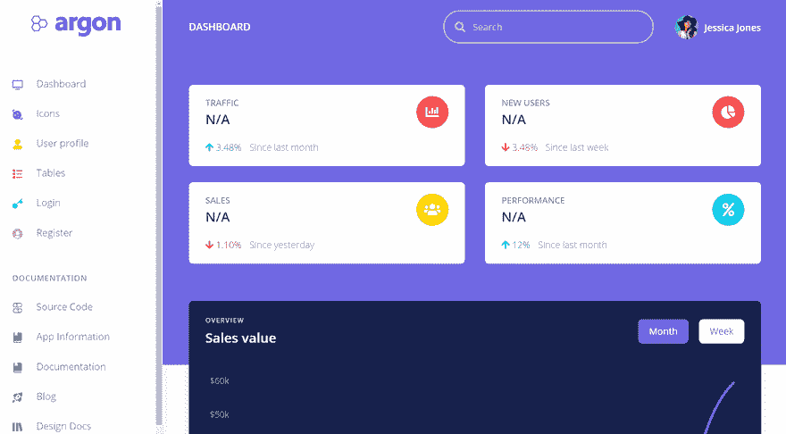
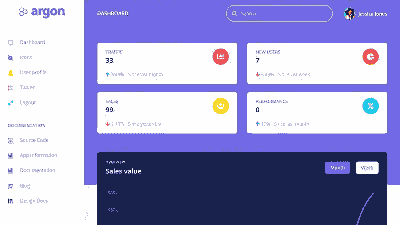

# 烧瓶仪表板氩-添加一个安全的 RESTfull 节点

> 原文：<https://dev.to/sm0ke/flask-dashboard-argon-adding-a-restfull-node-4i9j>

各位编码员好，

本文旨在帮助经验不足的程序员在现有的 **Flask dashboard** 应用程序的基础上使用 **Flask-RESTfull** 编写一个安全的 RESTfull 节点。

> *感谢阅读！* -内容由 **[App 生成器](https://appseed.us/)** 提供。

* * *

[](https://res.cloudinary.com/practicaldev/image/fetch/s--kmEbmPgO--/c_limit%2Cf_auto%2Cfl_progressive%2Cq_66%2Cw_880/https://raw.githubusercontent.com/app-generator/static/master/flask-argon-dashboard-tutorial/flask-dashboard-adding-rest-intro.gif)

> 其他两篇文章解释了添加数据库、认证和 Flask 应用程序的基本设置等主题:[通过编写代码学习 Flask](https://dev.to/sm0ke/flask-learn-by-coding-1o8o)和[向 Flask 添加数据库](https://dev.to/sm0ke/argon-dashboard-learn-flask-by-coding-2b27)。

## App 功能

*   [开源](https://github.com/app-generator/flask-argon-dashboard)，麻省理工学院许可
*   现场[演示](https://flask-argon-dashboard.appseed.us/)
*   后端- [烧瓶](http://flask.pocoo.org/)
*   RESTnode 编码在 [Flask-RESTful](https://flask-restful.readthedocs.io/en/latest/) 中，受认证保护
*   数据库- [SQLite](https://www.sqlite.org/index.html)
*   ORM - SQLAlchemy

## 实现步骤

为了将仪表板连接到真实数据，我们需要实现三项:

*   保存图表信息的新表，
*   REST API 节点提供数据服务，
*   消费者(客户机)，负责从 REST 服务中读取信息并更新图表。我们来编码吧！

### 添加新表

Stats 表有一个用键/值模式构建的简单结构。标识信息的键，可以在`val`字段中存储整数或者在`val_s`中存储字符串。

```
class Stats(db.Model):

    id    = db.Column(db.Integer,     primary_key=True)
    key   = db.Column(db.String(64),  unique=True)
    val   = db.Column(db.Integer)
    val_s = db.Column(db.String(256)) 
```

<svg width="20px" height="20px" viewBox="0 0 24 24" class="highlight-action crayons-icon highlight-action--fullscreen-on"><title>Enter fullscreen mode</title></svg> <svg width="20px" height="20px" viewBox="0 0 24 24" class="highlight-action crayons-icon highlight-action--fullscreen-off"><title>Exit fullscreen mode</title></svg>

要创建新表并查询内容，我们可以使用 Flask shell

```
$ flask shell
$ >>> 
$ >>> from app import db
$ >>> db.create_all()
$ >>>  
$ >>> from app.models import Stats
$ >>> Stats.query.all() 
[] 
```

<svg width="20px" height="20px" viewBox="0 0 24 24" class="highlight-action crayons-icon highlight-action--fullscreen-on"><title>Enter fullscreen mode</title></svg> <svg width="20px" height="20px" viewBox="0 0 24 24" class="highlight-action crayons-icon highlight-action--fullscreen-off"><title>Exit fullscreen mode</title></svg>

让我们在表上添加一个新行，供仪表板
使用

```
$ flask shell
$ >>> 
$ >>> from app.models import Stats
$ >>> traffic = Stats('traffic') # create a new counter 
$ >>> 
$ >>> traffic.val = 10 # set the value
$ >>> traffic.save() # save the new value in database 
$ >>> 
$ >>> Stats.query.all() 
[<Stats traffic / 10 /  >] 
```

<svg width="20px" height="20px" viewBox="0 0 24 24" class="highlight-action crayons-icon highlight-action--fullscreen-on"><title>Enter fullscreen mode</title></svg> <svg width="20px" height="20px" viewBox="0 0 24 24" class="highlight-action crayons-icon highlight-action--fullscreen-off"><title>Exit fullscreen mode</title></svg>

正如我们所看到的，最新的查询显示了一个已定义的计数器，值为 10。此时，我们的数据库中有了数据，让我们构建 REST 点，将其释放到野外。

### 休息 API 节点

Flask 提供了很多 REST 库，Flask-RESTful 只是其中之一。Flask-RESTPlus 看起来也很有前景。现在回到我们的休息点，相关的变化是:

> 处理统计请求的 ApiStats 类- [源](https://github.com/app-generator/flask-argon-dashboard/blob/master/app/restapi/stats.py)。端点将只为经过身份验证的用户提供信息，否则将返回 401(未授权)响应。

```
from flask_restful import Resource
from flask_login   import current_user

from app.models    import Stats

class ApiStats(Resource):

    def get(self,segment):

        if not current_user.is_authenticated:
            return {'err': 'auth'}, 401

        # See the model for details 
        val = Stats( segment ).val 

        if 'traffic' == segment:
            return { segment : val }, 200 
```

<svg width="20px" height="20px" viewBox="0 0 24 24" class="highlight-action crayons-icon highlight-action--fullscreen-on"><title>Enter fullscreen mode</title></svg> <svg width="20px" height="20px" viewBox="0 0 24 24" class="highlight-action crayons-icon highlight-action--fullscreen-off"><title>Exit fullscreen mode</title></svg>

### 激活端点

在 init 阶段，构建在 Flask-RESTful 之上的 ApiStats 类必须添加到应用程序的核心。如果我们查看 __init.py 文件的[源，我们的应用程序构造器，我们可以很容易地找到相关的行:](https://github.com/app-generator/flask-argon-dashboard/blob/master/app/__init__.py) 

```
from flask import Flask
from flask_restful import Api # <-- import the RESTfull magic

app = Flask(__name__)
api = Api(app) #  bind the RESTfull library to our application

# Define the routes resolved by the REST API
api.add_resource(ApiStats, '/api/stats/<string:segment>') 
```

<svg width="20px" height="20px" viewBox="0 0 24 24" class="highlight-action crayons-icon highlight-action--fullscreen-on"><title>Enter fullscreen mode</title></svg> <svg width="20px" height="20px" viewBox="0 0 24 24" class="highlight-action crayons-icon highlight-action--fullscreen-off"><title>Exit fullscreen mode</title></svg>

可以通过访问`http://localhost:5000/api/stats/traffic`直接在浏览器中测试 API

[](https://res.cloudinary.com/practicaldev/image/fetch/s--pEkTcW4L--/c_limit%2Cf_auto%2Cfl_progressive%2Cq_auto%2Cw_880/https://raw.githubusercontent.com/app-generator/static/master/flask-argon-dashboard-tutorial/flask-dashboard-argon-rest-browser-test.jpg)

此时，我们已经将信息保存在数据库中，发布了 RESTfull 端点，我们所需要的就是消费者将从 REST API 收集的信息注入到仪表板中。

### 用 RESTfull 数据更新仪表板

注入信息可以通过一个简单的 jQuery 调用通过`$.getJson()`助手来完成。API 消费者代码保存到 [app.js](https://github.com/app-generator/flask-argon-dashboard/blob/master/app/static/assets/js/app.js) Javascript 文件:

```
'use strict';

$(function() {

    // Update the Traffic cell
    $.getJSON('/api/stats/traffic', function( data ) { 
        //console.log( ' -> ' + data['traffic'] ) 
        $('#stats_traffic').html( data['traffic'] );
    });

}); 
```

<svg width="20px" height="20px" viewBox="0 0 24 24" class="highlight-action crayons-icon highlight-action--fullscreen-on"><title>Enter fullscreen mode</title></svg> <svg width="20px" height="20px" viewBox="0 0 24 24" class="highlight-action crayons-icon highlight-action--fullscreen-off"><title>Exit fullscreen mode</title></svg>

这个简单的 API 消费者从 API 端点请求信息，并在仪表板中注入值。让我们想象一下仪表板:

*   用户未经验证

[](https://res.cloudinary.com/practicaldev/image/fetch/s--TjiQBEyE--/c_limit%2Cf_auto%2Cfl_progressive%2Cq_auto%2Cw_880/https://raw.githubusercontent.com/app-generator/static/master/flask-argon-dashboard-tutorial/flask-dashboard-argon-rest-not-authorized.jpg)

*   用户已通过验证

[](https://res.cloudinary.com/practicaldev/image/fetch/s--QBl0lEU1--/c_limit%2Cf_auto%2Cfl_progressive%2Cq_auto%2Cw_880/https://raw.githubusercontent.com/app-generator/static/master/flask-argon-dashboard-tutorial/flask-dashboard-argon-rest-authorized.jpg)

如果我们更新数据库中流量计数器的值并刷新页面，新值将显示在流量卡中。

> **谢谢！**

## 资源

*   [烧瓶仪表盘氩气](https://appseed.us/admin-dashboards/flask-dashboard-argon) -应用信息
*   [管理仪表板](https://appseed.us/admin-dashboards) -由 AppSeed 提供的索引
*   [管理仪表板](https://admin-dashboards.com/)的管理列表——包含开发者提交的应用的开源项目