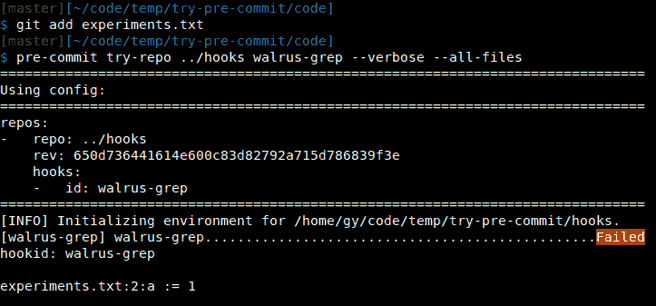
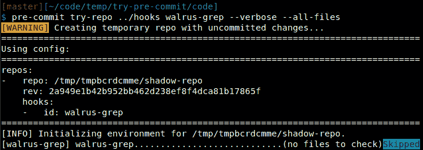
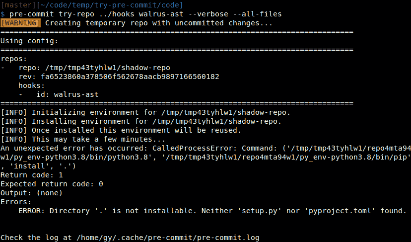
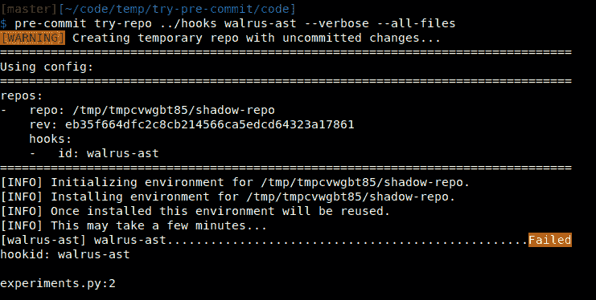
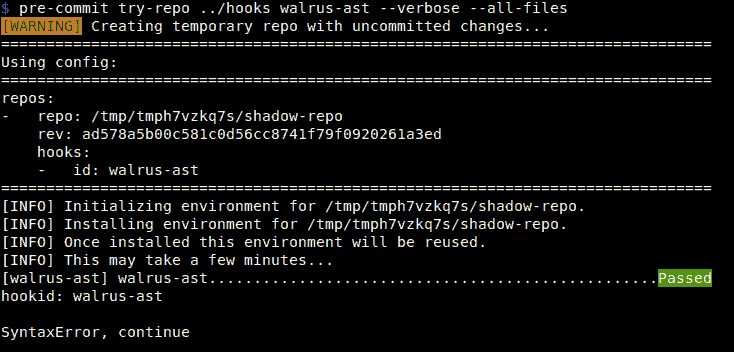
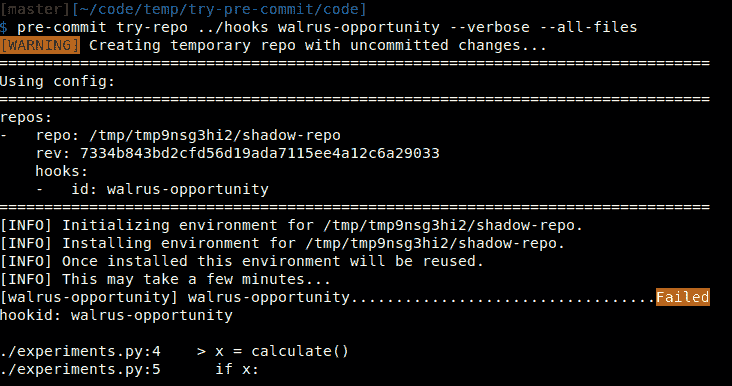

# 为“预提交”框架编写挂钩

> 原文：<https://dev.to/gyermolenko/writing-hooks-for-pre-commit-framework-5dpf>

周围已经有几百个很棒的[钩子](https://pre-commit.com/hooks.html)了。但是如果我们还想要一个呢？嗯，阅读[官方文件](https://pre-commit.com/#new-hooks)是一个很好的起点(也是未来的参考)。

我想要的是:

*   举例说明特定想法是如何形成的
*   描述最让我吃惊的陷阱(以及如何克服它们)
*   让人们注意到`pre-commit`是这样一个奇妙的工具

我选择的插图主题是赋值表达式(PEP572)。接下来我将为此创建三个不同的钩子。

## 制剂

对于已经存在的钩子的实验，你只需要一个 git 库。然后你可以配置它从其他地方安装/使用钩子。

但是要写你自己的，应该有两个独立的库。

我们开始吧。

*   如果你没有将*预提交*安装到系统/环境中——参见[文档](https://pre-commit.com/#install)了解如何安装。

*   从这样的基本结构开始(带有 git init 的两个文件夹)

```
[~/code/temp/try-pre-commit]
$ tree -a -L 2
.
├── code
│   └── .git
└── hooks
    └── .git 
```

*   创建虚拟*钩子/。预提交钩子. yaml*

```
$ touch hooks/.pre-commit-hooks.yaml 
```

*   创建虚拟*代码/实验. txt*

```
$ touch code/experiments.txt 
```

*   cd 进入 *code* 文件夹并初始化*预提交*(不要让第二次安装迷惑你，它不同于安装到系统/环境中。它的范围是存储库范围的，实际上是一个 git 钩子文件)

```
$ cd code
$ pre-commit install
pre-commit installed at .git/hooks/pre-commit 
```

这是它现在应该看起来的样子

```
[~/code/temp/try-pre-commit]
$ tree -a -L 2
.
├── code
│   ├── experiments.txt
│   └── .git
└── hooks
    ├── .git
    └── .pre-commit-hooks.yaml 
```

## 例 1: grep

第一个挂钩将非常基础，利用框架的现有可能性。我将称它为“海象-grep”。

更新*钩子/。预提交钩子. yaml*

```
- id: walrus-grep
  name: walrus-grep
  description: Warn about assignment expressions
  entry: ":="
  language: pygrep 
```

*pygrep* 是 *grep* 的跨平台版本。

条目获取你不想提交的东西的正则表达式。在我的例子中，我使用了“:=”模式，没有实际的正则表达式魔术或转义符号。

更新*code/experiments . txt*T2】

```
text file
a := 1 
```

最方便的实验方式是使用`try-repo`命令。它允许在不提交*的情况下测试挂钩。每次都要预提交 hooks.yaml* ，并且不会在*中锁定到以后的版本。预提交配置. yaml* 。

我们可以在每次运行检查之前暂存文件，或者使用带有`--all-files`标志的`try-repo`命令。

```
[master][~/code/temp/try-pre-commit/code]
$ pre-commit try-repo ../hooks walrus-grep --verbose --all-files 
```

[](https://res.cloudinary.com/practicaldev/image/fetch/s--SVratRHh--/c_limit%2Cf_auto%2Cfl_progressive%2Cq_auto%2Cw_880/https://thepracticaldev.s3.amazonaws.com/i/eki9gykp0uxgi4o5cn9h.png)

发生这种情况是因为 hooks repo 没有一个 commit -没有 HEAD 可以指向的东西。提交*。预提交-hooks.yaml* 并重复。

[](https://res.cloudinary.com/practicaldev/image/fetch/s--9vvQFkFB--/c_limit%2Cf_auto%2Cfl_progressive%2Cq_auto%2Cw_880/https://thepracticaldev.s3.amazonaws.com/i/dretzgniixfy34cnlbz6.png)

见“*(无文件可查)*”？这通常是正确的，检查可能有预定义的限制，例如文件扩展名、路径、忽略选项。但是我们有我们的 *experiments.txt* 文件，并不期待这些！

**Gotcha:** `--all-files` flag 更像是“所有**被跟踪的**，而不仅仅是登台档”。所以无论哪种方式，您都应该在运行检查之前向 git 添加文件。

[](https://res.cloudinary.com/practicaldev/image/fetch/s--FQSLgZaF--/c_limit%2Cf_auto%2Cfl_progressive%2Cq_auto%2Cw_880/https://thepracticaldev.s3.amazonaws.com/i/ak0vgvvmi7p30wbeuk2m.png)

终于来了！“Failed”是我们需要证明 grep hook 在某个随机暂存文件中捕获了“:=”。所以在这里失败是一件好事。

但仔细想想，情况远非理想:

*   首先，我们实际上不想在文本文件中捕捉“:=”，只在 python 代码中
*   第二，如果“:=”出现在注释、文档字符串、字符串内部怎么办？

对于“仅 python 代码”部分，有`types: [python]`选项，我将把它添加到*中。预提交钩子. YAML*T3】

```
- id: walrus-grep
  ...
  types: [python] 
```

[](https://res.cloudinary.com/practicaldev/image/fetch/s--fsw5AOvY--/c_limit%2Cf_auto%2Cfl_progressive%2Cq_auto%2Cw_880/https://thepracticaldev.s3.amazonaws.com/i/88lgfr687d0nv21chrpz.png)

我们看到“*(没有要检查的文件)又跳过了*，但现在是预期。

再次检查

```
$ mv experiments.txt experiments.py
$ git add experiments.py
$ pre-commit try-repo ../hooks walrus-grep --verbose --all-files 
```

我们又有了心爱的失败者。

至于第二个问题，注释或文档字符串中的“:=”，我们需要一些不同的东西。

## 例 2: AST

第二个钩子将分析语法树以找到确切的节点类型。我将称它为“海象-ast”。

**免责声明:**这个只能在 Python 3.8 环境下工作(beta1 目前可以测试)。

更新*钩子/。预提交钩子. yaml*

```
...
- id: walrus-ast
  name: walrus-ast
  description: Warn about assignment expressions
  entry: walrus-ast
  language: python
  types: [python] 
```

还有*experiments . py*T2】

```
# .py file with `:=` (Python3.8 syntax) (x := 123) 
```

钩子本身将位于 *hooks/walrus_ast.py*

```
import argparse
import ast

def check(filename):
    with open(filename) as f:
        contents = f.read()

    try:
        tree = ast.parse(contents)
    except SyntaxError:
        print('SyntaxError, continue')
        return

    for node in ast.walk(tree):
        if isinstance(node, ast.NamedExpr):
            return node.lineno

def main():
    parser = argparse.ArgumentParser()
    parser.add_argument('filenames', nargs='*')
    args = parser.parse_args()

    for filename in args.filenames:
        lineno = check(filename)
        if lineno:
            print(f"{filename}:{lineno}")
            return 1

    return 0

if __name__ == '__main__':
    exit(main()) 
```

我们在这里能做什么或不能做什么？每个文档的规则都很简单

> 钩子必须在失败时非零退出或者修改工作目录中的文件

需要注意的事项:

*   用一些代码(“0”表示一切正常)——将决定钩子是否失败
*   不需要像`if __name__ == '__main__':`这样的检查和像`main()`或`check()`这样的名字(也就是说，你可以拥有以`exit(1)`为唯一内容的无用文件)
*   如果您希望能够通过文件名进行限制，则需要解析文件名。不是必需的，但拥有它很好

现在用新的钩子名
运行`try-repo`

```
$ pre-commit try-repo ../hooks walrus-ast --verbose --all-files 
```

[](https://res.cloudinary.com/practicaldev/image/fetch/s--FmUbqfMy--/c_limit%2Cf_auto%2Cfl_progressive%2Cq_auto%2Cw_880/https://thepracticaldev.s3.amazonaws.com/i/xkm10jkhp9qkdhv2wk2v.png)

*“目录' .”不可安装。*怎么回事？

结果是(在 python 脚本的情况下)我们应该像往常一样用 *setup.py* 或 *pyproject.toml* 描述如何安装它。

创建*钩子/setup.py*

```
from setuptools import setup
setup(
    name="hooks",
    py_modules=["walrus_ast",],
    entry_points={
        'console_scripts': [
            "walrus-ast=walrus_ast:main",
        ],
    },
) 
```

**注意:**代替`py_modules`你可以使用类似`packages=find_packages(".")`的东西或者你在 *setup.py* 中习惯做的任何事情

在 git 中跟踪两个新文件

```
$ git add setup.py
$ git add walrus_ast.py 
```

现在工作目录应该是这样的

```
[master][~/code/temp/try-pre-commit/hooks]
$ tree -a -L 1
.
├── .git
├── .pre-commit-hooks.yaml
├── setup.py
└── walrus_ast.py 
```

尝试再次运行它

```
$ pre-commit try-repo ../hooks walrus-ast --verbose --all-files 
```

[](https://res.cloudinary.com/practicaldev/image/fetch/s--oo2C62Oo--/c_limit%2Cf_auto%2Cfl_progressive%2Cq_auto%2Cw_880/https://thepracticaldev.s3.amazonaws.com/i/31diiyfj2fcpe24czzs3.png)

关于 *experiments.py* 外观的提醒:

```
# .py file with `:=` (Python3.8 syntax) (x := 123) 
```

“:=”确实在第二行，来自 comments 的那个没有报告。谢谢 AST！

**注意:**如果你忘记了这是 Python3.8 中唯一的东西——你会(希望)得到一些提示。在这种情况下，hook 不起作用，但也不应该阻止其他人做他们的工作。

[](https://res.cloudinary.com/practicaldev/image/fetch/s--DzDCHkjH--/c_limit%2Cf_auto%2Cfl_progressive%2Cq_auto%2Cw_880/https://thepracticaldev.s3.amazonaws.com/i/8owrlgarvrdfkf5rolkz.png)

## 例 3:少一些消极，多一些机会！

我的目的不是阻止你使用赋值表达式，而是尝试新事物并描述这个过程。

让我们从相反的方向接近这个想法，找到一个海象可以适应的地方。多亏了 Chase Stevens 的这条推文和非常有趣的 T2 图书馆，我们才能找到这样的地方。

创建*钩子/海象 _ 机会. py*

```
import astpath

def main():
    search_path = "//Assign[targets/Name/@id = following-sibling::*[1][name(.) = 'If']/test/Name/@id]"
    found = astpath.search('.', search_path, print_matches=True, after_context=1)
    return len(found)

if __name__ == "__main__":
    exit(main()) 
```

这里 *astpath* 使用 *xpath* 来查找 AST 节点。

更新 *setup.py*

```
from setuptools import setup

setup(
    name="hooks",
    py_modules=["walrus_ast", "walrus_opportunity"],
    entry_points={
        'console_scripts': [
            "walrus-ast=walrus_ast:main",
            "walrus-opportunity=walrus_opportunity:main"
        ],
    },
    install_requires=[
        # Dep. for `walrus-opportunity`
        "astpath[xpath]",
    ],
) 
```

更新*钩子/。预提交钩子. yaml*

```
- id: walrus-opportunity
  name: walrus-opportunity
  description: Warn if you could have used ":=" somewhere
  entry: walrus-opportunity
  language: python
  types: [python] 
```

更新*code/experiments . py*T2】

```
# .py file with `:=` (Python3.8 syntax) (x := 123)

# missed chance to use `:=` x = calculate()
if x:
    print(f"found {x}") 
```

并运行它

```
$ pre-commit try-repo ../hooks walrus-opportunity --verbose --all-files 
```

[](https://res.cloudinary.com/practicaldev/image/fetch/s--qvLDAOXX--/c_limit%2Cf_auto%2Cfl_progressive%2Cq_auto%2Cw_880/https://thepracticaldev.s3.amazonaws.com/i/3pxiw8pxufflbol6wlw5.png)

## 包装完毕

如果你决定本地开发已经完成:
将*钩子*文件夹推到 *your-repo* (例如在 *github* 上)，创建*代码/。预提交配置. yaml*

```
repos:
- repo: https://github.com/<your-repo>/pre-commit-hooks
  rev: <commit-sha> or <tag>
  hooks:
  - id: walrus-grep
  - id: walrus-ast
  - id: walrus-opportunity 
```

现在你应该能够像往常一样使用 git from *code* repo:更改文件，暂存并提交它们。在每次提交之前，git 将从 *code/运行一个脚本。git/hooks/预提交*。并且*预提交*框架应该显示报告并允许提交，如果一切正常，或者显示报告并中止提交，如果一些检查返回非零值或文件被更改。

## 补遗

更多关于 AST 访客和圣诞树工作的信息请点击这里。
感谢 Anthony Sottile 提供了如此精彩的框架。