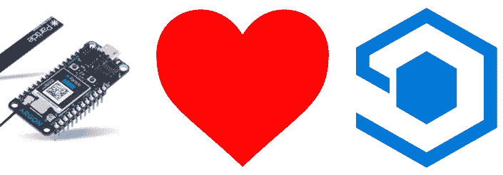
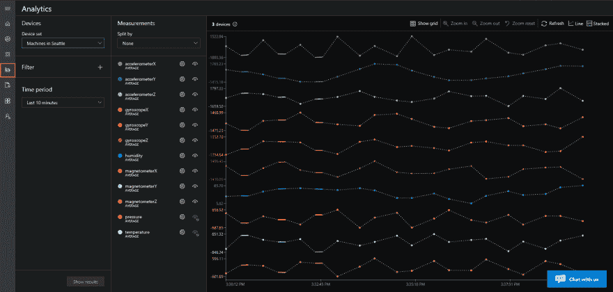
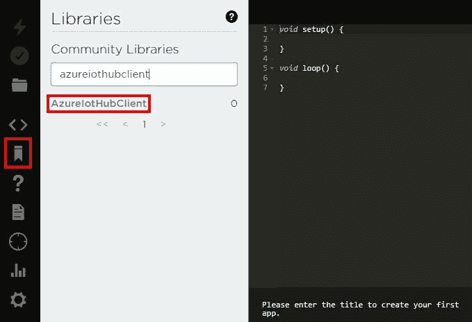
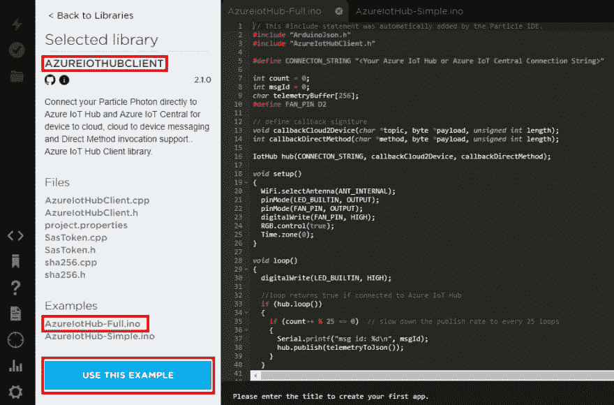
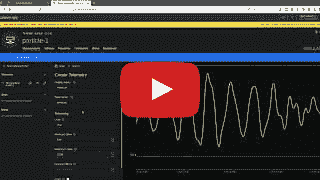
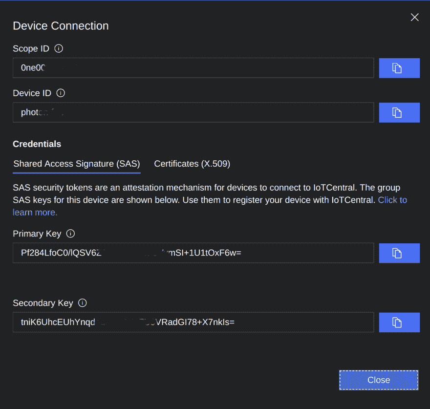
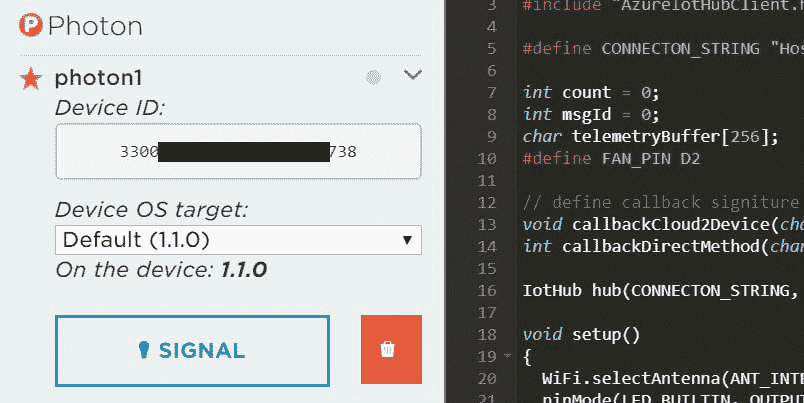
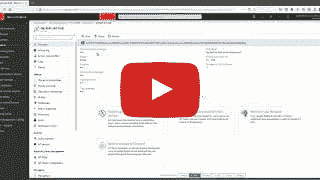

# 将您的粒子直接连接到 Azure IoT

> 原文：<https://dev.to/azure/connect-your-particle-directly-to-azure-iot-4epk>

[](https://res.cloudinary.com/practicaldev/image/fetch/s--76Z7I79F--/c_limit%2Cf_auto%2Cfl_progressive%2Cq_auto%2Cw_880/https://raw.githubusercontent.com/gloveboxes/Connecting-Particle-Photon-to-Azure-IoT-Hub/master/docs/particle-azure-iot-central-banner.png)

| 作者 | [戴夫·格洛弗](https://developer.microsoft.com/en-us/advocates/dave-glover?WT.mc_id=devto-blog-dglover)，微软云倡导者 |
| --- | --- |
| 证明文件 | [自述](https://gloveboxes.github.io/Connecting-Particle-Photon-to-Azure-IoT-Hub/) |
| 平台 | [粒子氩或光子](https://store.particle.io/collections/wifi)，[蔚蓝物联网中心](https://docs.microsoft.com/en-us/azure/iot-central/?WT.mc_id=devto-blog-dglover)，[蔚蓝物联网枢纽](https://docs.microsoft.com/en-au/azure/iot-hub/?WT.mc_id=devto-blog-dglover) |
| 视频培训 | [什么是 Azure IoT Central](https://docs.microsoft.com/en-us/azure/iot-central/overview-iot-central/?WT.mc_id=devto-blog-dglover) ，[Azure IoT Hub 简介](https://www.youtube.com/watch?v=smuZaZZXKsU) |
| 截屏 | [如何创建 Azure 物联网中心应用](https://youtu.be/D26rJmHyZcA)，[如何创建 Azure 物联网中心](https://youtu.be/lHpUu6wSX40) |
| 日期 | 截至 2019 年 6 月 |
| 承认 | 这个 Azure 物联网中心客户端库依赖于并建立在奇妙的 [MQTT-TLS](https://github.com/hirotakaster/MQTT-TLS) 库之上。 |

现在，您可以将您的粒子 Argon 或 Photon 直接连接到粒子云、Azure IoT Hub 和 Azure IoT Central。 **AzureIoTHubClient** 库支持双向消息传递、[直接方法](https://docs.microsoft.com/en-us/azure/iot-hub/iot-hub-devguide-direct-methods/?WT.mc_id=devto-blog-dglover)，以及即将推出的[设备双胞胎](https://docs.microsoft.com/en-us/azure/iot-hub/iot-hub-devguide-device-twins/?WT.mc_id=devto-blog-dglover)。

[](https://res.cloudinary.com/practicaldev/image/fetch/s--2YbrJTiP--/c_limit%2Cf_auto%2Cfl_progressive%2Cq_66%2Cw_880/https://raw.githubusercontent.com/gloveboxes/Connecting-Particle-Photon-to-Azure-IoT-Hub/master/docs/photon-animated.gif%3FWT.mc_id%3Ddevto-blog-dglover%26test%3Ddglover)

## 简介

**警告**:一个运行 **AzureIoTHubClient** 库的粒子每秒可以向 Azure IoT 发布超过 **50 条消息**。Azure 物联网中心的免费层将消息数量限制在每天 8000 条。以每秒 50 条消息的速度，您将在 3 分钟内达到 8000 条消息的限制。因此，一定要节流遥测公布率。

Azure IoT Central 是一种“无代码”服务，用于绘制和分析遥测数据，控制设备，并触发其他流程。在幕后，该服务使用了 [Azure 物联网中心](https://azure.microsoft.com/en-au/services/iot-hub/?WT.mc_id=devto-blog-dglover)、 [Azure 时序洞察](https://azure.microsoft.com/en-au/services/time-series-insights/?WT.mc_id=devto-blog-dglover)和 [Azure 物联网中心设备供应服务](https://docs.microsoft.com/en-us/azure/iot-dps/about-iot-dps/?WT.mc_id=devto-blog-dglover)。因此，这个库和文档应用了 Azure IoT Hub 和 Azure IoT Central。

### 你需要什么

1.  [粒子氩或光子](https://store.particle.io/collections/wifi)

2.  [粒子云账户](https://www.particle.io/)

3.  [Azure 物联网中央应用](https://azure.microsoft.com/en-au/services/iot-central?WT.mc_id=devto-blog-dglover)

    Azure IoT Central 提供 7 天免费试用或预付费(前 5 个设备免费)服务。

4.  或者，你可以建立一个 Azure 物联网中心。你可以创建一个[免费 Azure 账户](https://azure.microsoft.com/en-au/free?WT.mc_id=devto-blog-dglover)，如果你是学生，你可以创建一个[免费 Azure 学生账户](https://azure.microsoft.com/en-gb/free/students?WT.mc_id=devto-blog-dglover)，不需要信用卡。要了解更多信息，请阅读如何[创建一个免费的 Azure 物联网中心](#how-to-set-up-a-free-azure-iot-hub)。

## 为什么要将你的粒子光子连接到 Azure 服务

以下是将你的粒子光子直接连接到 Azure 的一些理由。

1.  如果你只有有限的开发技能、时间或预算来实现物联网项目，Azure IoT Central 是完美的选择。

    [](https://res.cloudinary.com/practicaldev/image/fetch/s--zg3ptHzf--/c_limit%2Cf_auto%2Cfl_progressive%2Cq_auto%2Cw_880/https://raw.githubusercontent.com/gloveboxes/Connecting-Particle-Photon-to-Azure-IoT-Hub/master/docs/iot-central.png)

2.  您希望从 Azure 获得双向消息传递和直接方法调用。

3.  您已经在使用 Azure，并且希望将您的设备与其他业务流程进行连接、控制和集成。

4.  您想学习如何利用遥测技术做有趣的事情，例如:

    *   [使用来自 Azure 机器学习中物联网中心的传感器数据进行天气预报](https://docs.microsoft.com/en-us/azure/iot-hub/iot-hub-weather-forecast-machine-learning/?WT.mc_id=devto-blog-dglover)，
    *   [通过使用 Azure 应用服务](https://docs.microsoft.com/en-us/azure/iot-hub/iot-hub-live-data-visualization-in-web-apps/?WT.mc_id=devto-blog-dglover)的 Web 应用功能，可视化来自 Azure 物联网中心的实时传感器数据，
    *   [通过 Azure Logic 应用连接您的物联网中心和邮箱，实现物联网远程监控和通知](https://docs.microsoft.com/en-us/azure/iot-hub/iot-hub-monitoring-notifications-with-azure-logic-apps/?WT.mc_id=devto-blog-dglover)。

## 如何将你的粒子光子连接到物联网中心或 Azure 物联网中心

1.  登录到[粒子 Web IDE](https://build.particle.io/build) 。

2.  单击库图标，并在社区库文本框中键入“ **AzureIotHubClient** ”。

    [](https://res.cloudinary.com/practicaldev/image/fetch/s--b9GYIf2J--/c_limit%2Cf_auto%2Cfl_progressive%2Cq_auto%2Cw_880/https://raw.githubusercontent.com/gloveboxes/Connecting-Particle-Photon-to-Azure-IoT-Hub/master/docs/new-particle-project-library.JPG)

3.  选择 **AzureIotHubClient** 库

4.  选择 **AzureIotHub-Full** 示例

5.  点击**使用本例**

    [](https://res.cloudinary.com/practicaldev/image/fetch/s--RolPV6oj--/c_limit%2Cf_auto%2Cfl_progressive%2Cq_auto%2Cw_880/https://raw.githubusercontent.com/gloveboxes/Connecting-Particle-Photon-to-Azure-IoT-Hub/master/docs/new-particle-project-select-library-use-example.JPG)

6.  Azure 物联网中心或 Azure 物联网中心

为简单起见，创建一个物联网中心应用程序。如果你想连接到 Azure 物联网中心，请阅读[如何设置 Azure 物联网中心(免费层)](#how-to-set-up-a-free-azure-iot-hub)并跳过下一步。

1.  创建 Azure 物联网中央应用程序

    观看这个 5 分钟的[截屏视频](https://youtu.be/D26rJmHyZcA)，了解如何创建 Azure IoT Central 应用程序来绘制遥测数据并向粒子光子发送命令。

    [](https://www.youtube.com/watch?v=D26rJmHyZcA&t=5s)

    总结一下截屏视频:

    1.  创建一个 [Azure IoT Central](https://azure.microsoft.com/en-au/services/iot-central?WT.mc_id=devto-blog-dglover) 应用。然后点击**开始**
    2.  选择试用，自定义应用程序，键入您的应用程序名称。然后点击**创建**
    3.  点击**创建设备模板**，给你的模板命名，例如“粒子”。然后点击**创建**
    4.  编辑模板，添加温度、湿度和压力遥测的**测量值**。

        | 显示名称 | 字段名 | 单位 | 最低限度 | 最高的 | 小数 |
        | --- | --- | --- | --- | --- | --- |
        | 湿度 | 湿度 | % | Zero | One hundred | Zero |
        | 温度 | 临时雇员 | degC | -10 | Sixty | Zero |
        | 压力 | 压力 | 高功率放大器（high-power amplifier 的缩写） | eight hundred | One thousand two hundred and sixty | Zero |

        然后点击**完成**。

    5.  点击**命令**选项卡，添加“点亮”、“熄灭”、“扇开”和“扇关”命令。然后点击**完成**。

    6.  点击侧边栏菜单上的**设备浏览器**，选择您创建的模板。然后再加一个**实器**
        [](https://res.cloudinary.com/practicaldev/image/fetch/s--GIucFrvA--/c_limit%2Cf_auto%2Cfl_progressive%2Cq_auto%2Cw_880/https://raw.githubusercontent.com/gloveboxes/Connecting-Particle-Photon-to-Azure-IoT-Hub/master/docs/iot-central-add-real-device.png)

    7.  创建完真实设备后，点击屏幕右上角的**连接**按钮，显示设备凭证。下一步您将需要这些凭据。

        [](https://res.cloudinary.com/practicaldev/image/fetch/s--ZLVGinrH--/c_limit%2Cf_auto%2Cfl_progressive%2Cq_auto%2Cw_880/https://raw.githubusercontent.com/gloveboxes/Connecting-Particle-Photon-to-Azure-IoT-Hub/master/docs/device-connection.png)

    8.  创建物联网中央设备连接字符串

        您需要为物联网中央设备生成一个连接字符串。您可以:

        1.  为 [Windows](https://github.com/Azure/dps-keygen/tree/master/bin/windows) 、 [macOS](https://github.com/Azure/dps-keygen/tree/master/bin/osx) 或 [Linux](https://github.com/Azure/dps-keygen/tree/master/bin/linux) 下载[连接字符串生成器](https://github.com/Azure/dps-keygen/tree/master/bin)。自述文件中有运行说明。
        2.  或者使用我非官方的基于 web 的[连接字符串生成器](https://dpsgen.z8.web.core.windows.net/)。

### 更新粒子项目连接 _ 字符串

1.  使用您在上一步中生成的连接字符串更新粒子光子项目中的 CONNECTION_STRING。

    [](https://res.cloudinary.com/practicaldev/image/fetch/s--vZ_GFjZz--/c_limit%2Cf_auto%2Cfl_progressive%2Cq_auto%2Cw_880/https://raw.githubusercontent.com/gloveboxes/Connecting-Particle-Photon-to-Azure-IoT-Hub/master/docs/new-particle-project-update-connection-string.jpg)

### 闪光粒子光子项目

1.  将粒子光子固件设置为 1.10

    参见[如何升级我的固件？](https://docs.particle.io/support/troubleshooting/firmware-upgrades/photon/)

    [](https://res.cloudinary.com/practicaldev/image/fetch/s--0UBSAAEn--/c_limit%2Cf_auto%2Cfl_progressive%2Cq_auto%2Cw_880/https://raw.githubusercontent.com/gloveboxes/Connecting-Particle-Photon-to-Azure-IoT-Hub/master/docs/particle-device-firmware-target.jpg)

2.  从 Particle IDE 中使用 Azure IoT Hub 客户端应用程序在您的设备上闪烁您的粒子光子。

## 了解 AzureIotHubClient 库

AzureIotHubClient 库包含了这些例子来帮助你理解它的用法。

### 例如:AzureIotHub-Simple

| 应用程序接口 | 描述 |
| --- | --- |
| **hub.loop** | 经常调用“loop ”,因为它处理入站消息和直接方法。如果有到 Azure IoT Hub 或 IoT Central 的活动连接，则返回 true。 |
| **hub.publish** | 将遥测数据发布到 Azure IoT Hub 或 IoT Central。如果成功，则返回 true。 |

```
#define CONNECTION_STRING "< your connection string >" 
IotHub hub(CONNECTION_STRING);
count = 0;

setup()
{}

loop()
{
  if (hub.loop())
  {
    if (count++ % 25 == 0)
    {
      hub.publish("\"temperature\":25");
    }
  }
  delay(200);
} 
```

### 示例:AzureIotHub-Full

| 回收 | 描述 |
| --- | --- |
| **回调 cloud 2 设备** | 调用此函数来处理云到设备的消息。 |
| **callbackDirectMethod** | 在云端调用直接方法(或 Azure IoT 中央命令)时调用该函数。它包括一个 JSON 有效负载。 |

```
// define callback signature
void callbackCloud2Device(char *topic, byte *payload, unsigned int length);
int callbackDirectMethod(char *method, byte *payload, unsigned int length);

IotHub hub(CONNECTION_STRING, callbackCloud2Device, callbackDirectMethod);
count = 0;

setup()
{
  RGB.control(true);
}

loop()
{
  if (hub.loop())
  {
    if (count++ % 25 == 0)  // slow down the publish rate to every 25 loops
    {
      hub.publish("\"temperature\":25");
    }
  }
  delay(200);
}

void callbackCloud2Device(char *topic, byte *payload, unsigned int length)
{
  char* msg = (char*)payload;
  if (strncmp(msg, "red", length) == 0)
  {
    RGB.color(255, 0, 0);
  }
}

int callbackDirectMethod(char *method, byte *payload, unsigned int payloadLength)
{
  if (strcmp(method, "lighton") == 0)
  {
    RGB.color(255, 255, 0);
  }
  else
  {
    return 400;
  }
  return 200;
} 
```

### 示例:调谐参数

| 参数 | 描述 |
| --- | --- |
| maxBufferSize | 默认为 500 字节。对于较大的消息增加。 |
| sasExpiryPeriodInSeconds | 默认为 3600 秒(60 分钟)。 |

```
int maxBufferSize = 500;
time_t sasExpiryPeriodInSeconds = 3600;

IotHub hub(CONNECTION_STRING, callbackCloud2Device, callbackDirectMethod, maxBufferSize, sasExpiryPeriodInSeconds); 
```

传入没有回调的调优参数。

```
// with no callbacks
IotHub hub(CONNECTION_STRING, NULL, NULL, maxBufferSize, sasExpiryPeriodInSeconds); 
```

## 如何建立一个免费的 Azure 物联网中心

1.  创建一个[免费 Azure 账户](https://azure.microsoft.com/en-au/free?WT.mc_id=devto-blog-dglover)。如果你是学生，你可以为学生创建一个[免费 Azure 账户](https://azure.microsoft.com/en-gb/free/students?WT.mc_id=devto-blog-dglover)，不需要信用卡

2.  观看此[截屏视频](https://youtu.be/lHpUu6wSX40)，了解创建 Azure 物联网中心和物联网设备的介绍。

    [](https://www.youtube.com/watch?v=lHpUu6wSX40)

3.  有关更多信息，请参见[使用 Azure 门户创建 Azure 物联网中心(免费层)](https://docs.microsoft.com/en-us/azure/iot-hub/iot-hub-create-through-portal/?WT.mc_id=devto-blog-dglover)