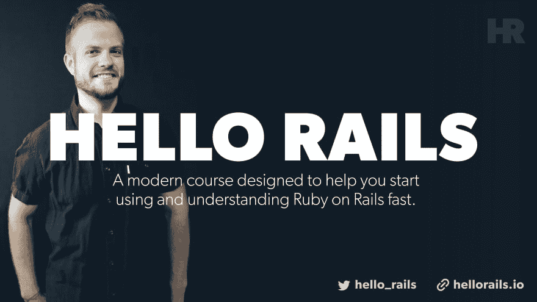

# 让我们构建:使用 Ruby on Rails——扩展 Devise 系列——添加定制字段

> 原文：<https://dev.to/justalever/let-s-build-with-ruby-on-rails-extending-devise-series-adding-custom-fields-22em>

Devise 是我在几乎所有 Rails 应用程序中使用的 ruby gem。认证是一个不容易掌握的概念，因此 Devise 是帮助 Ruby on Rails 应用程序解决这个重复性问题的最流行的方法之一。

这篇文章是许多文章中的第一篇，它将着眼于扩展 devise，使之与你一起工作，而不是与你作对。我的目标是从基础开始，然后进入更高级的定制，比如 OmniAuth、邀请用户、充当用户等等。随着新的部分完成，我将重新发布这篇文章，所以最终，将会有一个更大的收藏。

首先，我将向给定的设备安装添加自定义字段。我们将扩展它以包括两个新的字段，而不是遵循 gem 自带的缺省值。一个是条款和条件复选框，另一个是给定用户的位置。

首次注册时，所有这些字段都会显示给用户。我将扩展已经生成的 devise 视图，以包含新的字段。作为一个额外的奖励，我将添加一些地理位置(感谢另一个 gem)来在注册时精确定位用户的位置。

[https://www.youtube.com/embed/3nFXKRF3GH8](https://www.youtube.com/embed/3nFXKRF3GH8)

### 先决条件

在本教程中，我将使用我之前创建的名为`kickoff_tailwind`的模板。你可以在这里下载。它附带了一些一般的配置以及安装 Devise gem 本身。如果你是设计新手，我建议你先把[安装在自己的](https://github.com/plataformatec/devise)上，以了解它如何在你的 Rails 应用中挂钩到给定的模型。

### 我们开始吧

当我运行我的安装时，我传递了一个我之前提到过的模板，它来自我的[kick off _ tail wind Github repo](https://github.com/justalever/kickoff_tailwind)。如果您正在一步一步地进行操作，您应该在继续操作之前将它下载到您的系统中。

成功安装后，我们用 Devise 确定了我们的`User`模型。这样，默认情况下会生成新的字段。我们需要扩展它，添加两个新字段`terms`和`location`。

### 创建新的迁移

```
$ rails g migration addFieldsToUsers terms:boolean location:string 
```

<svg width="20px" height="20px" viewBox="0 0 24 24" class="highlight-action crayons-icon highlight-action--fullscreen-on"><title>Enter fullscreen mode</title></svg> <svg width="20px" height="20px" viewBox="0 0 24 24" class="highlight-action crayons-icon highlight-action--fullscreen-off"><title>Exit fullscreen mode</title></svg>

然后运行`rails db:migrate`来更新数据库模式。

#### 更新应用控制器

接下来，一旦用户提交注册表单，我们需要允许这些新字段进入数据库。Rails 使用表单允许参数的概念。你需要在提交过程中对你想要接受的字段进行分类，否则它们将不会进入数据库。这是一个很好的安全特性。

为了传递有效的新字段，我们需要将我们的`ApplicationController`更新为:

```
class ApplicationController < ActionController::Base
  protect_from_forgery with: :exception

  before_action :configure_permitted_parameters, if: :devise_controller?

  protected

    def configure_permitted_parameters
      devise_parameter_sanitizer.permit(:sign_up, keys: [:username, :name, :terms, :location])
      devise_parameter_sanitizer.permit(:account_update, keys: [:username, :name, :terms, :location])
    end
end 
```

<svg width="20px" height="20px" viewBox="0 0 24 24" class="highlight-action crayons-icon highlight-action--fullscreen-on"><title>Enter fullscreen mode</title></svg> <svg width="20px" height="20px" viewBox="0 0 24 24" class="highlight-action crayons-icon highlight-action--fullscreen-off"><title>Exit fullscreen mode</title></svg>

多亏了`kickoff_tailwind` Rails 模板，我们这里默认有`:username`和`:name`。如果您没有使用模板，您的里程可能会有所不同。

#### 更新视图以反映新字段

我们的视图需要反映添加的新字段。有两个特别需要注意:

```
<!-- app/views/devise/registrations/edit.html.erb -->
<% content_for :devise_form do %>
  <h2 class="heading text-4xl font-bold pt-4 mb-8">Edit <%= resource_name.to_s.humanize %></h2>

  <%= form_for(resource, as: resource_name, url: registration_path(resource_name), html: { method: :put }) do |f| %>

    <%= render "devise/shared/error_messages", resource: resource %>

    <div class="mb-6">
      <%= f.label :username, class:"label" %>
      <%= f.text_field :username, autofocus: true, class:"input" %>
    </div>

    <div class="mb-6">
      <%= f.label :name, class:"label" %>
      <%= f.text_field :name, class:"input" %>
    </div>

    <div class="mb-6">
      <%= f.label :email, class:"label" %>
      <%= f.email_field :email, autocomplete: "email", class:"input" %>
    </div>

    <div class="mb-6">
      <%= f.label :location, class:"label" %>
      <%= f.text_field :location, class:"input", value: city %>
    </div>

    <div class="mb-6">
      <% if devise_mapping.confirmable? && resource.pending_reconfirmation? %>
        <div>Currently waiting confirmation for: <%= resource.unconfirmed_email %></div>
      <% end %>
    </div>

    <div class="mb-6">
      <%= f.label :password, class:"label" %>
      <%= f.password_field :password, autocomplete: "new-password", class:"input" %>
      <p class="text-sm text-grey-dark pt-1 italic"> <% if @minimum_password_length %>
        <%= @minimum_password_length %> characters minimum <% end %> (leave blank if you don't want to change it) </p>

    </div>

    <div class="mb-6">
      <%= f.label :password_confirmation, class: "label" %>
      <%= f.password_field :password_confirmation, autocomplete: "new-password", class: "input" %>
    </div>

    <div class="mb-6">
      <%= f.label :current_password, class: "label" %>
      <%= f.password_field :current_password, autocomplete: "current-password", class: "input" %>
      <p class="text-sm text-grey-dark pt-2 italic">(we need your current password to confirm your changes)</p>
    </div>

    <div class="mb-6">
      <%= f.submit "Update", class: "btn btn-default" %>
    </div>
    <% end %>

    <hr class="border mt-6 mb-3" />

    <h3 class="heading text-xl font-bold mb-4">Cancel my account</h3>

    <div class="flex justify-between items-center">
      <div class="flex-1"><p class="py-4">Unhappy?</p></div>

      <%= button_to "Cancel my account", registration_path(resource_name), data: { confirm: "Are you sure?" }, method: :delete, class: "btn btn-default" %>
    </div>

<% end %>

<%= render 'devise/shared/form_wrap' %> 
```

<svg width="20px" height="20px" viewBox="0 0 24 24" class="highlight-action crayons-icon highlight-action--fullscreen-on"><title>Enter fullscreen mode</title></svg> <svg width="20px" height="20px" viewBox="0 0 24 24" class="highlight-action crayons-icon highlight-action--fullscreen-off"><title>Exit fullscreen mode</title></svg>

注意，由于我的`kickoff_tailwind` Rails 模板，这又一次被高度定制了。

```
<!-- app/views/devise/registrations/new.html.erb -->
<% content_for :devise_form do %>

  <h2 class="heading text-4xl font-bold pt-4 mb-8">Sign up</h2>

    <%= form_for(resource, as: resource_name, url: registration_path(resource_name)) do |f| %>
    <%= render "devise/shared/error_messages", resource: resource %>

    <div class="mb-6">
      <%= f.label :username, class:"label" %>
      <%= f.text_field :username, autofocus: true, class:"input" %>
    </div>

    <div class="mb-6">
      <%= f.label :name, class:"label" %>
      <%= f.text_field :name, class:"input" %>
    </div>

    <div class="mb-6">
      <%= f.label :email, class:"label" %>
      <%= f.email_field :email, autocomplete: "email", class:"input" %>
    </div>

    <div class="mb-6">
      <%= f.label :location, class:"label" %>
      <%= f.text_field :location, class:"input", value: city %>
    </div>

    <div class="mb-6">
      <div class="flex">
        <%= f.label :password, class: "label" %>
        <% if @minimum_password_length %>
        <span class="text-xs pl-1 text-grey-dark"><em>(<%= @minimum_password_length %> characters minimum)</em></span>
        <% end %>
      </div>
      <%= f.password_field :password, autocomplete: "new-password", class: "input" %>
    </div>

    <div class="mb-6">
      <%= f.label :password_confirmation, class:"label" %>
      <%= f.password_field :password_confirmation, autocomplete: "new-password", class: "input" %>
    </div>

    <div class="mb-6">
      <%= f.check_box :terms, class: "mr-2" %>
      <%= f.label :terms, "I agree to terms and conditions" %>
    </div>

    <div class="mb-6">
      <%= f.submit "Sign up", class: "btn btn-default block w-full text-center" %>
    </div>

    <hr class="border mt-6" />

  <% end %>

  <%= render "devise/shared/links" %>

<% end %>

<%= render "devise/shared/form_wrap" %> 
```

<svg width="20px" height="20px" viewBox="0 0 24 24" class="highlight-action crayons-icon highlight-action--fullscreen-on"><title>Enter fullscreen mode</title></svg> <svg width="20px" height="20px" viewBox="0 0 24 24" class="highlight-action crayons-icon highlight-action--fullscreen-off"><title>Exit fullscreen mode</title></svg>

#### 奖励:地理位置

不幸的是，在应用程序中添加地理位置并不容易。大多数这方面的尝试都需要你订阅某种服务。它的工作方式与给定的请求 IP 地址有关。从这个 IP 地址可以发现更多的数据，并映射到城市，国家，系统信息等。我们只是希望当用户注册帐户时，默认情况下城市名称显示在 location 字段中。这样做的时候，我会伸手去打服务电话[https://ipinfo.io/](https://ipinfo.io/)。他们正好有一个 Rails 宝石，我们可以利用它来快速运行—[在这里查看一下](https://github.com/ipinfo/rails)。

你需要将宝石添加到你的`Gemfile`中并运行`bundle install`。

```
 # Gemfile

gem 'ipinfo-rails' 
```

<svg width="20px" height="20px" viewBox="0 0 24 24" class="highlight-action crayons-icon highlight-action--fullscreen-on"><title>Enter fullscreen mode</title></svg> <svg width="20px" height="20px" viewBox="0 0 24 24" class="highlight-action crayons-icon highlight-action--fullscreen-off"><title>Exit fullscreen mode</title></svg>

你还需要一个在[https://ipinfo.io/](https://ipinfo.io/)的账户来访问 API。他们需要一个访问令牌来使用 gem。

在`config/environment`目录中打开您的`config/environment.rb`文件或您的首选文件。将以下代码添加到您选择的配置文件中。我通过例子选择了`config/environment/development.rb`。我建议只在生产环境中或在活动服务器上运行，因为您的本地环境不会有我们需要的相同数据。为了解决这个问题，我们将安装另一个叫做`ngrok`的工具。首先，我们需要配置`ipinfo`宝石。

```
# config/environment/development.rb
require 'ipinfo-rails'

Rails.application.configure do
  ...
  config.middleware.use(IPinfoMiddleware, {
     token: Rails.application.credentials.dig(:ipinfo_token) 
  })
  ...
end 
```

<svg width="20px" height="20px" viewBox="0 0 24 24" class="highlight-action crayons-icon highlight-action--fullscreen-on"><title>Enter fullscreen mode</title></svg> <svg width="20px" height="20px" viewBox="0 0 24 24" class="highlight-action crayons-icon highlight-action--fullscreen-off"><title>Exit fullscreen mode</title></svg>

注意:如果编辑`config/environment.rb`，这个需要在`Rails.application.initialize!`之前，并且`Rails.application.`在`config`之前，否则，你会得到运行时错误。

确保将您的访问令牌添加到您的加密凭据中。

```
$ rails credentials:edit 
```

<svg width="20px" height="20px" viewBox="0 0 24 24" class="highlight-action crayons-icon highlight-action--fullscreen-on"><title>Enter fullscreen mode</title></svg> <svg width="20px" height="20px" viewBox="0 0 24 24" class="highlight-action crayons-icon highlight-action--fullscreen-off"><title>Exit fullscreen mode</title></svg>

重新启动开发服务器。

#### 本地测试

为了进行本地测试，我们需要将我们的端口转发到 [ngrok](https://ngrok.com/download) 。您将需要一个身份验证令牌(创建一个免费帐户来获取一个)。

通过单击 bash 脚本安装 ngrok。它将安装在您的用户级帐户中。您可以通过`zsh`或`bash_profile`为其创建一个别名。我选择通过运行`yarn add ngrok`在全球范围内安装它。这将在机器内您的用户帐户的`.ngrok`文件夹中添加一个 zip 文件。您需要解压缩这个 zip 文件。

我使用`.zsh`为该目录创建了一个别名，以便快速访问。(可选)

运行`./ngrok http 3000`,同时在新的终端标签中让`rails server`在`localhost:3000`上运行。

在`development.rb`
中将 ngrok url 作为允许的主机传递

```
 config.hosts << "7c8b6b27.ngrok.io" # example url
 config.middleware.use(IPinfoMiddleware, {
   token: Rails.application.credentials.dig(:ipinfo)
 }) 
```

<svg width="20px" height="20px" viewBox="0 0 24 24" class="highlight-action crayons-icon highlight-action--fullscreen-on"><title>Enter fullscreen mode</title></svg> <svg width="20px" height="20px" viewBox="0 0 24 24" class="highlight-action crayons-icon highlight-action--fullscreen-off"><title>Exit fullscreen mode</title></svg>

#### 围绕逻辑创建一个助手

我们的助手利用我们从新宝石中得到的新的`request.env['ipinfo']`逻辑。我们可以把这个包起来，这样我们的观点就不会混乱。

在`application_helper.rb`
中添加一个新的`city`助手

```
# app/helpers/application_helper.rb

 def city
  request.env['ipinfo'].city if request.env['ipinfo'].city
 end 
```

<svg width="20px" height="20px" viewBox="0 0 24 24" class="highlight-action crayons-icon highlight-action--fullscreen-on"><title>Enter fullscreen mode</title></svg> <svg width="20px" height="20px" viewBox="0 0 24 24" class="highlight-action crayons-icon highlight-action--fullscreen-off"><title>Exit fullscreen mode</title></svg>

最后，我们可以使用新的助手
更新表单字段，使其具有预定义的值

```
<!-- update in both app/views/registrations/edit.html.erb and app/views/registrations/new.html.erb -->
 <div class="mb-6">
   <%= f.label :location, class:"label" %>
   <%= f.text_field :location, class:"input", value: city %>
</div> 
```

<svg width="20px" height="20px" viewBox="0 0 24 24" class="highlight-action crayons-icon highlight-action--fullscreen-on"><title>Enter fullscreen mode</title></svg> <svg width="20px" height="20px" viewBox="0 0 24 24" class="highlight-action crayons-icon highlight-action--fullscreen-off"><title>Exit fullscreen mode</title></svg>

### 不要脸的塞

[](http://hellorails.io)

我有一门新课程叫做 [Hello Rails](https://hellorails.io) 。Hello Rails 是一门现代课程，旨在帮助您快速开始使用和理解 Ruby on Rails。如果你是 Ruby 或 Ruby on Rails 的新手，我邀请你去看看这个网站。该课程将与这些构建非常相似，但是是一个超级深入的版本，具有更现实的目标和可交付成果。[带我去球场](https://hellorails.io/)！

在推特上关注 [@hello_rails](https://twitter.com/hello_rails) 和[本人@justalever](https://twitter.com/justalever) 。

帖子[让我们构建:使用 Ruby on Rails——扩展 Devise 系列——添加自定义字段](https://web-crunch.com/extending-devise-custom-fields/)最先出现在[的 Web-Crunch](https://web-crunch.com) 上。