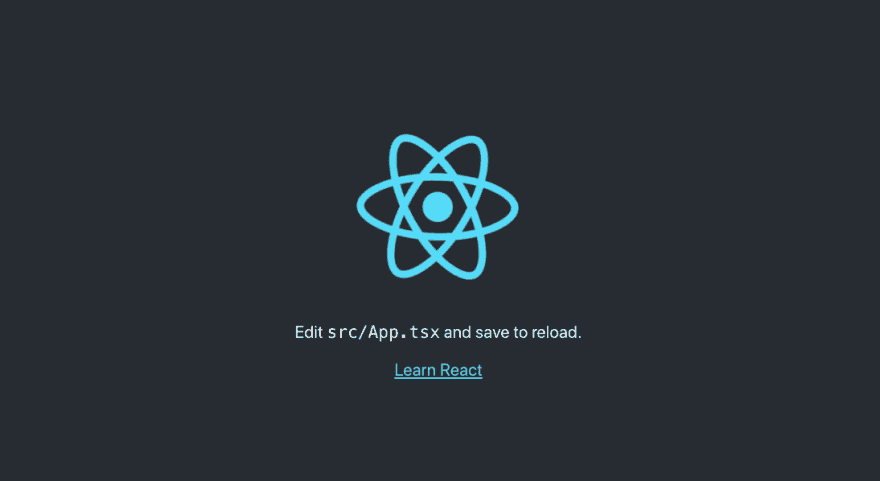
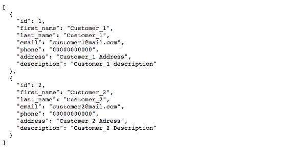
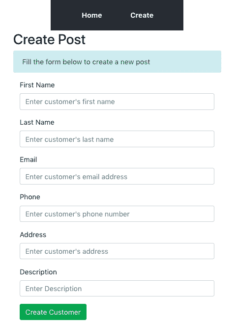
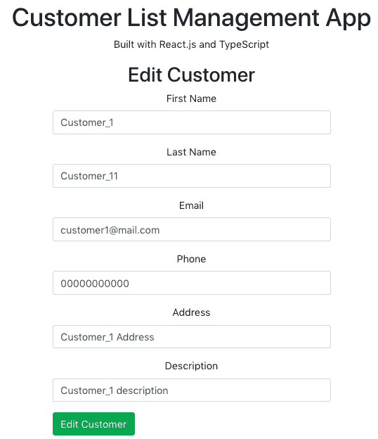

# 如何用 React 和 TypeScript 构建客户列表管理 App

> 原文：<https://dev.to/digitalocean/how-to-build-a-customer-list-management-app-with-react-and-typescript-39np>

作为[为捐赠而写](https://do.co/w4do-cta)计划的一部分，作者选择了[科技教育基金](https://www.brightfunds.org/funds/tech-education)接受捐赠。

### 简介

TypeScript 已经为 [JavaScript](https://www.javascript.com/) 开发者如何为应用程序，尤其是网络应用程序构建和编写代码带来了很多改进。TypeScript 被定义为 JavaScript 的超集，其行为与 JavaScript 完全相同，但具有额外的特性，旨在帮助开发人员构建更大、更复杂的程序，而不会出现错误。TypeScript 越来越受欢迎；被像 Google 这样的大公司用于 Angular web 框架。 [Nest.js](https://nestjs.com/) 后端框架也是用 TypeScript 搭建的。

作为一名开发人员，提高生产力的方法之一是尽可能快地实现新功能，而不用担心在生产中破坏现有的应用程序。为了实现这一点，编写静态类型代码是许多经验丰富的开发人员采用的一种风格。像 TypeScript 这样的静态类型编程语言强制每个变量与一个数据类型相关联；例如字符串、整数、布尔型等等。使用静态类型编程语言的主要好处之一是类型检查是在编译时完成的，因此开发人员可以在很早的阶段看到代码中的错误。

[React](https://reactjs.org/) 是一个开源的 JavaScript 库，开发者用它来为可伸缩的 web 应用创建高端用户界面。React 为单页面应用程序构建的出色性能和动态用户界面使其成为开发人员的热门选择。

在本教程中，您将创建一个客户列表管理应用程序，它有一个独立的 REST API 后端和一个用 React 和 TypeScript 构建的前端。您将使用一个名为 [`json-server`](https://github.com/typicode/json-server) 的假 REST API 来构建后端。您将使用它来快速设置 CRUD(创建、读取、更新和删除)后端。因此，您可以使用 React 和 TypeScript 专注于处理应用程序的前端逻辑。

## 先决条件

要完成本教程，您需要:

*   本地安装 [Node.js](https://nodejs.org/en/) (至少 v6)和 [`npm`](https://www.npmjs.com/) (至少 v5.2)。Node.js 是一个 JavaScript 运行时环境，允许您在浏览器之外运行代码。它附带了一个名为`npm`的预装包管理器，可以让你安装和更新包。要在 macOS 或 Ubuntu 18.04 上安装这些软件，请遵循[如何在 macOS 上安装 Node.js 并创建本地开发环境](https://www.digitalocean.com/community/tutorials/how-to-install-node-js-and-create-a-local-development-environment-on-macos)中的步骤或[如何在 Ubuntu 18.04 上安装 node . js](https://www.digitalocean.com/community/tutorials/how-to-install-node-js-on-ubuntu-18-04)中的“使用 PPA 安装”部分。

*   纱线的局部安装；[按照这些步骤](https://yarnpkg.com/en/docs/install#mac-stable)在你的操作系统上安装 Yarn。

*   基本了解 TypeScript 和 [JavaScript](https://www.digitalocean.com/community/tutorial_series/how-to-code-in-javascript) 。

*   安装了文本编辑器；如 [Visual Studio Code](https://code.visualstudio.com/) 、 [Atom](https://atom.io/) ，或者 [Sublime Text](https://www.sublimetext.com/) 。

## 步骤 1 —安装 TypeScript 并创建 React 应用程序

在这个步骤中，您将使用节点包管理器(`npm`)在您的机器上全局安装 TypeScript 包。之后，您还将安装 React 及其依赖项，并通过运行开发服务器来检查您的 React 应用程序是否正常工作。

首先，打开终端并运行以下命令来安装 TypeScript:

```
npm install -g typescript 
```

安装过程完成后，执行以下命令检查 TypeScript 的安装:

```
tsc -v 
```

您将看到计算机上安装的当前版本:

```
Output
Version 3.4.5 
```

接下来，您将使用 [`create-react-app`](https://github.com/facebook/create-react-app) 工具安装 React 应用程序，只需一个命令即可设置应用程序。您将使用`npx`命令，这是`npm` 5.2+附带的一个包运行器工具。`create-react-app`工具内置了对处理 TypeScript 的支持，不需要任何额外的配置。运行以下命令创建并安装一个名为`typescript-react-app`的 React 应用程序:

```
npx create-react-app typescript-react-app --typescript 
```

前面的命令将创建一个名为`typescript-react-app`的新 React 应用程序。`--typescript`标志将 React 组件的默认文件类型设置为`.tsx`。

在完成本部分之前，应用程序需要从一个端口移动到另一个端口。为此，您需要为名为 [React Router](https://www.npmjs.com/package/react-router) 的 React 应用程序安装一个路由库及其相应的 TypeScript 定义。您将使用`yarn`来安装这个项目的库和其他包。这是因为`yarn`更快，特别是对于安装 React 应用程序的依赖项。移动到新创建的项目文件夹，然后使用以下命令安装 React Router:

```
cd typescript-react-app
yarn add react-router-dom 
```

现在您已经有了 React 路由器包，它将在您的项目中提供路由功能。接下来，运行以下命令来安装 React 路由器的 TypeScript 定义:

```
yarn add @types/react-router-dom 
```

现在，您将安装 [`axios`](https://github.com/axios/axios) ，这是一个基于 promised 的浏览器 HTTP 客户端，帮助执行来自您将在应用程序中创建的不同组件的 HTTP 请求:

```
yarn add axios 
```

安装过程完成后，使用以下命令启动开发服务器:

```
yarn start 
```

您的应用程序将在`http://localhost:3000`运行。

[](https://res.cloudinary.com/practicaldev/image/fetch/s--bx3itt9K--/c_limit%2Cf_auto%2Cfl_progressive%2Cq_auto%2Cw_880/https://assets.digitalocean.com/articles/reacttypescript/step1.png)

您已经成功安装了 TypeScript，创建了一个新的 React 应用程序，并安装了 React Router，以便帮助从应用程序的一个页面导航到另一个页面。在下一节中，您将为应用程序设置后端服务器。

## 步骤 2 —创建 JSON 服务器

在这一步中，您将创建一个模拟服务器，您的 React 应用程序可以快速地与之连接，并使用其资源。需要注意的是，这种后端服务不适合生产中的应用程序。您可以使用 Nest.js、Express 或任何其他后端技术在生产中构建 RESTful API。当你需要创建一个原型和模拟一个后端服务器时,`json-server`是一个有用的工具。

您可以使用`npm`或`yarn`在您的机器上安装`json-server`。这将使您可以在任何需要的时候从项目的任何目录中使用它。打开一个新的终端窗口，在项目目录下运行这个命令来安装`json-server`:

```
yarn global add json-server 
```

接下来，您将创建一个 JSON 文件，其中包含将由 REST API 公开的数据。对于这个文件(您将创建)中指定的对象，将自动生成一个 CRUD 端点。首先，创建一个名为`server`的新文件夹，然后移入其中:

```
mkdir server
cd server 
```

现在，使用`nano`创建并打开一个名为`db.json`的新文件:

```
nano db.json 
```

将以下内容添加到文件中:

```
 {
        "customers": [
            {
                "id": 1,
                "first_name": "Customer_1",
                "last_name": "Customer_11",
                "email": "customer1@mail.com",
                "phone": "00000000000",
                "address": "Customer_1 Address",
                "description": "Customer_1 description"
            },
            {
                "id": 2,
                "first_name": "Customer_2",
                "last_name": "Customer_2",
                "email": "customer2@mail.com",
                "phone": "00000000000",
                "address": "Customer_2 Adress",
                "description": "Customer_2 Description"
            }
        ]
    } 
```

JSON 结构由一个 customer 对象组成，该对象分配了两个数据集。每个客户由七个属性组成:`id`、`description`、`first_name`、`last_name`、`email`、`phone`和`address`。

保存并退出文件。

默认情况下，`json-server`在端口`3000`上运行——这是 React 应用程序运行的同一端口。为了避免冲突，您可以更改`json-server`的默认端口。为此，请移至应用程序的根目录:

```
cd ~/typescript-react-app 
```

用您喜欢的文本编辑器打开应用程序，并创建一个名为`json-server.json`的新文件:

```
nano json-server.json 
```

现在插入以下内容来更新端口号:

```
{
    "port": 5000
} 
```

这将作为`json-server`的配置文件，它将确保服务器始终运行在它所指定的端口上。

保存并退出文件。

要运行服务器，请使用以下命令:

```
json-server --watch server/db.json 
```

这将启动端口`5000`上的`json-server`。如果您在浏览器中导航到`http://localhost:5000/customers`，您将看到服务器显示您的客户列表。

[](https://res.cloudinary.com/practicaldev/image/fetch/s--CQYNhFGx--/c_limit%2Cf_auto%2Cfl_progressive%2Cq_auto%2Cw_880/https://assets.digitalocean.com/articles/reacttypescript/step2.png)

为了简化运行`json-server`的过程，您可以用一个名为`server`的新属性来更新`package.json`到`scripts`对象，如下所示:

```
{
...
  "scripts": {
    "start": "react-scripts start",
    "build": "react-scripts build",
    "test": "react-scripts test",
    "eject": "react-scripts eject",
    "server": "json-server --watch server/db.json"
  },
...
} 
```

保存并退出文件。

现在，任何时候你想启动`json-server`，你所要做的就是从终端运行`yarn server`。

您已经创建了一个简单的 REST API，您将使用它作为这个应用程序的后端服务器。您还创建了一个 customer JSON 对象，它将用作 REST API 的默认数据。最后，您为由`json-server`支持的后端服务器配置了一个备用端口。接下来，您将为您的应用程序构建可重用的组件。

## 步骤 3 —创建可重用组件

在本节中，您将为应用程序创建所需的 React 组件。这将包括分别创建、显示和编辑数据库中特定客户的详细信息的组件。您还将为您的应用程序构建一些 TypeScript 接口。

首先，回到运行 React 应用程序的终端，用`CTRL + C`停止开发服务器。接下来，导航到`./src/`文件夹:

```
cd ./src/ 
```

然后，在其中创建一个名为`components`的新文件夹，并移动到新文件夹中:

```
mkdir components
cd components 
```

在新创建的文件夹中，创建一个`customer`文件夹，然后移入其中:

```
mkdir customer
cd customer 
```

现在创建两个名为`Create.tsx`和`Edit.tsx`的新文件:

```
touch Create.tsx Edit.tsx 
```

这些文件是 React 可重用的组件，它们将分别呈现表单和保存用于创建和编辑客户详细信息的所有业务逻辑。

在文本编辑器中打开`Create.tsx`文件，并添加以下代码:

```
 import * as React from 'react';
    import axios from 'axios';
    import { RouteComponentProps, withRouter } from 'react-router-dom';

    export interface IValues {
        first_name: string,
        last_name: string,
        email: string,
        phone: string,
        address: string,
        description: string,
    }
    export interface IFormState {
        [key: string]: any;
        values: IValues[];
        submitSuccess: boolean;
        loading: boolean;
    } 
```

在这里，您已经从 React 路由器包中导入了`React`、`axios`和其他路由所需的组件。在那之后，你创建了两个新的接口，命名为`IValues`和`IFormState`。 [TypeScript *接口*](https://www.typescriptlang.org/docs/handbook/interfaces.html) 帮助定义应该传递给对象的特定类型的值，并在整个应用程序中强制一致性。这确保了程序中不太可能出现 bug。

接下来，您将构建一个扩展了`React.Component`的`Create`组件。将下面的代码添加到`Create.tsx`文件中，紧跟在`IFormState`接口之后:

```
 class Create extends React.Component<RouteComponentProps, IFormState> {
        constructor(props: RouteComponentProps) {
            super(props);
            this.state = {
                first_name: '',
                last_name: '',
                email: '',
                phone: '',
                address: '',
                description: '',
                values: [],
                loading: false,
                submitSuccess: false,
            }
        }
    }
    export default withRouter(Create) 
```

这里，您已经在 Typescript 中定义了一个 React 组件。在这种情况下，`Create`类组件接受类型`RouteComponentProps`的`props`(属性的简称)，并使用类型`IFormState`的状态。然后，在构造函数中，您初始化了`state`对象，并定义了所有将为客户呈现值的变量。

接下来，将这些方法添加到`Create`类组件中，就在构造函数之后。您将使用这些方法来处理客户表单，并处理输入字段中的所有更改:

```
 values: [],
              loading: false,
              submitSuccess: false,
          }
      }

      private processFormSubmission = (e: React.FormEvent<HTMLFormElement>): void => {
              e.preventDefault();
              this.setState({ loading: true });
              const formData = {
                  first_name: this.state.first_name,
                  last_name: this.state.last_name,
                  email: this.state.email,
                  phone: this.state.phone,
                  address: this.state.address,
                  description: this.state.description,
              }
              this.setState({ submitSuccess: true, values: [...this.state.values, formData], loading: false });
              axios.post(`http://localhost:5000/customers`, formData).then(data => [
                  setTimeout(() => {
                      this.props.history.push('/');
                  }, 1500)
              ]);
          }

          private handleInputChanges = (e: React.FormEvent<HTMLInputElement>) => {
              e.preventDefault();
              this.setState({
                  [e.currentTarget.name]: e.currentTarget.value,
          })
      }

    ...
    export default withRouter(Create)
    ... 
```

`processFormSubmission()`方法从应用程序状态接收客户的详细信息，并使用`axios`将其发送到数据库。`handleInputChanges()`使用`React.FormEvent`来获取所有输入字段的值，并调用`this.setState()`来更新应用程序的状态。

接下来，在`Create`类组件中，在`handleInputchanges()`方法之后立即添加`render()`方法。这个`render()`方法将在应用程序中显示创建新客户的表单:

```
 public render() {
          const { submitSuccess, loading } = this.state;
          return (
              <div>
                  <div className={"col-md-12 form-wrapper"}>
                      <h2> Create Post </h2>
                      {!submitSuccess && (
                          <div className="alert alert-info" role="alert">
                              Fill the form below to create a new post
                      </div>
                      )}
                      {submitSuccess && (
                          <div className="alert alert-info" role="alert">
                              The form was successfully submitted!
                              </div>
                      )}
                      <form id={"create-post-form"} onSubmit={this.processFormSubmission} noValidate={true}>
                          <div className="form-group col-md-12">
                              <label htmlFor="first_name"> First Name </label>
                              <input type="text" id="first_name" onChange={(e) => this.handleInputChanges(e)} name="first_name" className="form-control" placeholder="Enter customer's first name" />
                          </div>
                          <div className="form-group col-md-12">
                              <label htmlFor="last_name"> Last Name </label>
                              <input type="text" id="last_name" onChange={(e) => this.handleInputChanges(e)} name="last_name" className="form-control" placeholder="Enter customer's last name" />
                          </div>
                          <div className="form-group col-md-12">
                              <label htmlFor="email"> Email </label>
                              <input type="email" id="email" onChange={(e) => this.handleInputChanges(e)} name="email" className="form-control" placeholder="Enter customer's email address" />
                          </div>
                          <div className="form-group col-md-12">
                              <label htmlFor="phone"> Phone </label>
                              <input type="text" id="phone" onChange={(e) => this.handleInputChanges(e)} name="phone" className="form-control" placeholder="Enter customer's phone number" />
                          </div>
                          <div className="form-group col-md-12">
                              <label htmlFor="address"> Address </label>
                              <input type="text" id="address" onChange={(e) => this.handleInputChanges(e)} name="address" className="form-control" placeholder="Enter customer's address" />
                          </div>
                          <div className="form-group col-md-12">
                              <label htmlFor="description"> Description </label>
                              <input type="text" id="description" onChange={(e) => this.handleInputChanges(e)} name="description" className="form-control" placeholder="Enter Description" />
                          </div>
                          <div className="form-group col-md-4 pull-right">
                              <button className="btn btn-success" type="submit">
                                  Create Customer
                              </button>
                              {loading &&
                                  <span className="fa fa-circle-o-notch fa-spin" />
                              }
                          </div>
                      </form>
                  </div>
              </div>
          )
      } 
```

在这里，您创建了一个带有输入字段的表单，用来保存客户的`first_name`、`last_name`、`email`、`phone`、`address`和`description`的值。每个输入字段都有一个在每次击键时运行的方法`handleInputChanges()`，用从输入字段获得的值更新 React `state`。此外，根据应用程序的状态，名为`submitSuccess`的布尔变量将控制应用程序在创建新客户前后显示的消息。

你可以在这个 [GitHub 库](https://github.com/yemiwebby/typescript-react-customer-app/blob/master/src/components/customer/Create.tsx)中看到这个文件的完整代码。

保存并退出`Create.tsx`。

现在您已经为应用程序的`Create`组件文件添加了适当的逻辑，您将继续为`Edit`组件文件添加内容。

在`customer`文件夹中打开你的`Edit.tsx`文件，开始添加以下内容导入`React`、`axios`，同时定义打字稿接口:

```
 import * as React from 'react';
    import { RouteComponentProps, withRouter } from 'react-router-dom';
    import axios from 'axios';

    export interface IValues {
        [key: string]: any;
    }
    export interface IFormState {
        id: number,
        customer: any;
        values: IValues[];
        submitSuccess: boolean;
        loading: boolean;
    } 
```

类似于`Create`组件，您导入所需的模块并分别创建`IValues`和`IFormState`接口。`IValues`接口定义了输入字段值的数据类型，而您将使用`IFormState`来声明应用程序状态对象的预期类型。

接下来，在`IFormState`接口块之后直接创建`EditCustomer`类组件，如下所示:

```
 ...
    class EditCustomer extends React.Component<RouteComponentProps<any>, IFormState> {
        constructor(props: RouteComponentProps) {
            super(props);
            this.state = {
                id: this.props.match.params.id,
                customer: {},
                values: [],
                loading: false,
                submitSuccess: false,
            }
        }
    }
    export default withRouter(EditCustomer) 
```

该组件将`RouteComponentProps<any>`和`IFormState`的一个接口作为参数。您在`RouteComponentProps`中添加了`<any>`，因为无论 React 路由器何时解析路径参数，它都不会进行任何类型转换来确定数据的类型是`number`还是`string`。因为您期待客户的参数`uniqueId`，所以使用`any`更安全。

现在在组件中添加以下方法:

```
``` 
```

...
public component did mount():void {
axios . get(`http://localhost:5000/customers/${this.state.id}`)。然后(data =>{
this . setstate({ customer:data . data })；
})
}

```
 private processFormSubmission = async (e: React.FormEvent<HTMLFormElement>): Promise<void> => {
        e.preventDefault();
        this.setState({ loading: true });
        axios.patch(`http://localhost:5000/customers/${this.state.id}`, this.state.values).then(data => {
            this.setState({ submitSuccess: true, loading: false })
            setTimeout(() => {
                this.props.history.push('/');
            }, 1500)
        })
    }

    private setValues = (values: IValues) => {
        this.setState({ values: { ...this.state.values, ...values } });
    }
    private handleInputChanges = (e: React.FormEvent<HTMLInputElement>) => {
        e.preventDefault();
        this.setValues({ [e.currentTarget.id]: e.currentTarget.value })
    }
...
}

export default withRouter(EditCustomer) 
```

```
 First, you add a `componentDidMount()` method, which is a lifecycle method that is being called when the component is created. The method takes the `id` obtained from the route parameter to identify a particular customer as a parameter, uses it to retrieve their details from the database and then populates the form with it. Furthermore, you add methods to process form submission and handle changes made to the values of the input fields.

Lastly, add the `render()` method for the `Edit` component:

    ```
   ...
        public render() {
            const { submitSuccess, loading } = this.state;
            return (
                <div className="App">
                    {this.state.customer &&
                        <div>
                            < h1 > Customer List Management App</h1>
                            <p> Built with React.js and TypeScript </p>

                            <div>
                                <div className={"col-md-12 form-wrapper"}>
                                    <h2> Edit Customer </h2>
                                    {submitSuccess && (
                                        <div className="alert alert-info" role="alert">
                                            Customer's details has been edited successfully </div>
                                    )}
                                    <form id={"create-post-form"} onSubmit={this.processFormSubmission} noValidate={true}>
                                        <div className="form-group col-md-12">
                                            <label htmlFor="first_name"> First Name </label>
                                            <input type="text" id="first_name" defaultValue={this.state.customer.first_name} onChange={(e) => this.handleInputChanges(e)} name="first_name" className="form-control" placeholder="Enter customer's first name" />
                                        </div>
                                        <div className="form-group col-md-12">
                                            <label htmlFor="last_name"> Last Name </label>
                                            <input type="text" id="last_name" defaultValue={this.state.customer.last_name} onChange={(e) => this.handleInputChanges(e)} name="last_name" className="form-control" placeholder="Enter customer's last name" />
                                        </div>
                                        <div className="form-group col-md-12">
                                            <label htmlFor="email"> Email </label>
                                            <input type="email" id="email" defaultValue={this.state.customer.email} onChange={(e) => this.handleInputChanges(e)} name="email" className="form-control" placeholder="Enter customer's email address" />
                                        </div>
                                        <div className="form-group col-md-12">
                                            <label htmlFor="phone"> Phone </label>
                                            <input type="text" id="phone" defaultValue={this.state.customer.phone} onChange={(e) => this.handleInputChanges(e)} name="phone" className="form-control" placeholder="Enter customer's phone number" />
                                        </div>
                                        <div className="form-group col-md-12">
                                            <label htmlFor="address"> Address </label>
                                            <input type="text" id="address" defaultValue={this.state.customer.address} onChange={(e) => this.handleInputChanges(e)} name="address" className="form-control" placeholder="Enter customer's address" />
                                        </div>
                                        <div className="form-group col-md-12">
                                            <label htmlFor="description"> Description </label>
                                            <input type="text" id="description" defaultValue={this.state.customer.description} onChange={(e) => this.handleInputChanges(e)} name="description" className="form-control" placeholder="Enter Description" />
                                        </div>
                                        <div className="form-group col-md-4 pull-right">
                                            <button className="btn btn-success" type="submit">
                                                Edit Customer </button>
                                            {loading &&
                                                <span className="fa fa-circle-o-notch fa-spin" />
                                            }
                                        </div>
                                    </form>
                                </div>
                            </div>
                        </div>
                    }
                </div>
            )
        } 
```

在这里，您创建了一个表单来编辑特定客户的详细信息，然后用应用程序状态获得的客户详细信息填充表单中的输入字段。类似于`Create`组件，对所有输入字段的更改将由`handleInputChanges()`方法处理。

你可以在这个 [GitHub 库](https://github.com/yemiwebby/typescript-react-customer-app/blob/master/src/components/customer/Edit.tsx)中看到这个文件的完整代码。

保存并退出`Edit.tsx`。

为了查看应用程序中创建的客户的完整列表，您将在`./src/components`文件夹中创建一个新组件，并将其命名为`Home.tsx`:

```
cd ./src/components
nano Home.tsx 
```

增加以下内容:

```
 import * as React from 'react';
    import { Link, RouteComponentProps } from 'react-router-dom';
    import axios from 'axios';

    interface IState {
        customers: any[];
    }

    export default class Home extends React.Component<RouteComponentProps, IState> {
        constructor(props: RouteComponentProps) {
            super(props);
            this.state = { customers: [] }
        }
        public componentDidMount(): void {
            axios.get(`http://localhost:5000/customers`).then(data => {
                this.setState({ customers: data.data })
            })
        }
        public deleteCustomer(id: number) {
            axios.delete(`http://localhost:5000/customers/${id}`).then(data => {
                const index = this.state.customers.findIndex(customer => customer.id === id);
                this.state.customers.splice(index, 1);
                this.props.history.push('/');
            })
        }
    } 
```

在这里，您已经从 React 路由器导入了`React`、`axios`和其他必需的组件。您在`Home`组件中创建了两个新方法:

*   `componentDidMount()`:应用程序在组件挂载后立即调用这个方法。它的职责是检索客户列表，并用它更新主页。
*   `deleteCustomer()`:这个方法将接受一个`id`作为参数，并将从数据库中删除用那个`id`标识的客户的详细信息。

现在添加`render()`方法来显示包含`Home`组件:
的客户列表的表

```
 public render() {
            const customers = this.state.customers;
            return (
                <div>
                    {customers.length === 0 && (
                        <div className="text-center">
                            <h2>No customer found at the moment</h2>
                        </div>
                    )}
                    <div className="container">
                        <div className="row">
                            <table className="table table-bordered">
                                <thead className="thead-light">
                                    <tr>
                                        <th scope="col">Firstname</th>
                                        <th scope="col">Lastname</th>
                                        <th scope="col">Email</th>
                                        <th scope="col">Phone</th>
                                        <th scope="col">Address</th>
                                        <th scope="col">Description</th>
                                        <th scope="col">Actions</th>
                                    </tr>
                                </thead>
                                <tbody>
                                    {customers && customers.map(customer =>
                                        <tr key={customer.id}>
                                            <td>{customer.first_name}</td>
                                            <td>{customer.last_name}</td>
                                            <td>{customer.email}</td>
                                            <td>{customer.phone}</td>
                                            <td>{customer.address}</td>
                                            <td>{customer.description}</td>
                                            <td>
                                                <div className="d-flex justify-content-between align-items-center">
                                                    <div className="btn-group" style={{ marginBottom: "20px" }}>
                                                        <Link to={`edit/${customer.id}`} className="btn btn-sm btn-outline-secondary">Edit Customer </Link>
                                                        <button className="btn btn-sm btn-outline-secondary" onClick={() => this.deleteCustomer(customer.id)}>Delete Customer</button>
                                                    </div>
                                                </div>
                                            </td>
                                        </tr>
                                    )}
                                </tbody>
                            </table>
                        </div>
                    </div>
                </div>
            )
        } 
```

在这个代码块中，您从应用程序的状态中检索客户列表作为一个数组，遍历它，并在一个 HTML 表中显示它。您还添加了`customer.id`参数，该方法使用该参数从列表中识别和删除特定客户的详细信息。

保存并退出`Home.tsx`。

通过使用接口为组件和道具定义类型，您已经为这个应用程序创建的所有组件采用了静态类型化原则。这是将 TypeScript 用于 React 应用程序的最佳方法之一。

至此，您已经完成了应用程序所需的所有可重用组件的创建。现在，您可以使用到目前为止创建的所有组件的链接来更新应用程序组件。

## 步骤 4 —设置路由并更新应用程序的入口点

在这一步中，您将从 React Router 包中导入必要的组件，并将`App`组件配置为根据加载的路由呈现不同的组件。这将允许您浏览应用程序的不同页面。一旦用户访问某个路由，例如`/create`，React Router 将使用指定的路径来呈现为处理此类路由而定义的适当组件中的内容和逻辑。

导航至`./src/App.tsx`:

```
nano App.tsx 
```

然后将其内容替换为以下内容:

```
 import * as React from 'react';
    import './App.css';
    import { Switch, Route, withRouter, RouteComponentProps, Link } from 'react-router-dom';
    import Home from './components/Home';
    import Create from './components/customer/Create';
    import EditCustomer from './components/customer/Edit';

    class App extends React.Component<RouteComponentProps<any>> {
      public render() {
        return (
          <div>
            <nav>
              <ul>
                <li>
                  <Link to={'/'}> Home </Link>
                </li>
                <li>
                  <Link to={'/create'}> Create Customer </Link>
                </li>
              </ul>
            </nav>
            <Switch>
              <Route path={'/'} exact component={Home} />
              <Route path={'/create'} exact component={Create} />
              <Route path={'/edit/:id'} exact component={EditCustomer} />
            </Switch>
          </div>
        );
      }
    }
    export default withRouter(App); 
```

您从 React 路由器包中导入了所有必需的组件，还导入了用于创建、编辑和查看客户详细信息的可重用组件。

保存并退出`App.tsx`。

`./src/index.tsx`文件是该应用程序的入口点，并呈现该应用程序。打开这个文件并将 React 路由器导入其中，然后将`App`组件包装在一个`BrowserRouter` :
中

```
 import React from 'react';
    import ReactDOM from 'react-dom';
    import './index.css';
    import App from './App';
    import { BrowserRouter } from 'react-router-dom'; 
    import * as serviceWorker from './serviceWorker';
    ReactDOM.render(
        <BrowserRouter>
            <App />
        </BrowserRouter>
        , document.getElementById('root')
    );
    serviceWorker.unregister(); 
```

React Router 使用`BrowserRouter`组件让您的应用程序知道导航，比如历史和当前路径。

完成编辑`Index.tsx`后，保存并退出。

最后，您将使用 Bootstrap 为您的应用程序添加一些样式。Bootstrap 是一个流行的 HTML、CSS 和 JavaScript 框架，用于在 web 上开发响应迅速、移动优先的项目。它允许开发者不用写太多的 CSS 就能构建一个吸引人的用户界面。它带有一个响应式网格系统，可以给网页一个完美的外观，适用于所有设备。

要包含应用程序的引导和样式，请用以下内容替换`./src/App.css`的内容:

```
 @import 'https://maxcdn.bootstrapcdn.com/bootstrap/4.0.0/css/bootstrap.min.css';

    .form-wrapper {
      width: 500px;
      margin: 0 auto;
    }
    .App {
      text-align: center;
      margin-top: 30px;
    }
    nav {
      width: 300px;
      margin: 0 auto;
      background: #282c34;
      height: 70px;
      line-height: 70px;
    }
    nav ul li {
      display: inline;
      list-style-type: none;
      text-align: center;
      padding: 30px;
    }
    nav ul li a {
      margin: 50px 0;
      font-weight: bold;
      color: white;
      text-decoration: none;
    }
    nav ul li a:hover {
      color: white;
      text-decoration: none;
    }
    table {
      margin-top: 50px;
    }
    .App-link {
      color: #61dafb;
    }
    @keyframes App-logo-spin {
      from {
        transform: rotate(0deg);
      }
      to {
        transform: rotate(360deg);
      }
    } 
```

您在这里使用了 Bootstrap，通过给它一个默认的布局、样式和颜色来增强应用程序的外观。您还添加了一些自定义样式，尤其是在导航栏中。

保存并退出`App.css`。

在本节中，您已经配置了 React Router 来根据用户访问的路线呈现适当的组件，还添加了一些样式来使应用程序对用户更有吸引力。接下来，您将测试为应用程序实现的所有功能。

## 步骤 5 —运行您的应用程序

现在，您已经通过创建几个可重用的组件用 React 和 TypeScript 设置了这个应用程序的前端，并且还用`json-server`构建了一个 REST API，您可以运行您的应用程序了。

导航回项目的根文件夹:

```
cd ~/typescript-react-app 
```

接下来运行以下命令启动您的应用程序:

```
yarn start 
```

**注意:**确保你的服务器还在另一个终端窗口中运行。否则，以:`yarn server`开始。

导航至`http://localhost:3000`从浏览器查看应用程序。然后点击**创建**按钮，填写客户的详细信息。

[](https://res.cloudinary.com/practicaldev/image/fetch/s--pVf7Yxbp--/c_limit%2Cf_auto%2Cfl_progressive%2Cq_auto%2Cw_880/https://assets.digitalocean.com/articles/reacttypescript/step5a.png)

在输入字段中输入适当的值后，点击**创建客户**按钮提交表单。创建完新客户后，应用程序会将您重定向回您的主页。

[](https://res.cloudinary.com/practicaldev/image/fetch/s--eagmSno3--/c_limit%2Cf_auto%2Cfl_progressive%2Cq_auto%2Cw_880/https://assets.digitalocean.com/articles/reacttypescript/step5b.png)

点击任意行的**编辑客户**按钮，您将被引导至该行相应客户的编辑功能所在的页面。

[](https://res.cloudinary.com/practicaldev/image/fetch/s--NbybWQZO--/c_limit%2Cf_auto%2Cfl_progressive%2Cq_auto%2Cw_880/https://assets.digitalocean.com/articles/reacttypescript/step5c.png)

编辑客户的详细信息，然后点击**编辑客户**以更新客户的详细信息。

您已经运行了您的应用程序，以确保所有组件都在工作。使用应用程序的不同页面，您已经创建并编辑了一个客户条目。

## 结论

在本教程中，你用 [React](https://reactjs.org/) 和 [TypeScript](https://www.typescriptlang.org/) 构建了一个客户列表管理应用。本教程中的过程偏离了使用 JavaScript 作为构造和构建 React 应用程序的传统方式。您已经利用了使用 TypeScript 的好处来完成这个前端重点教程。

为了继续开发这个项目，你可以将你的模拟后端服务器转移到一个生产就绪的后端技术上，如 [Express](https://expressjs.com/) 或 [Nest.js](https://nestjs.com/) 。此外，您可以通过添加更多特性来扩展您在本教程中构建的内容，例如使用不同的工具进行身份验证和授权，如 [Passport.js](http://www.passportjs.org/) 身份验证库。

你可以在 GitHub 上找到项目[的完整源代码。](https://github.com/yemiwebby/typescript-react-customer-app)

* * *

[](http://creativecommons.org/licenses/by-nc-sa/4.0/)

*本作品根据[知识共享署名-非商业性使用-类似共享 4.0 国际许可证](http://creativecommons.org/licenses/by-nc-sa/4.0/)* 进行许可