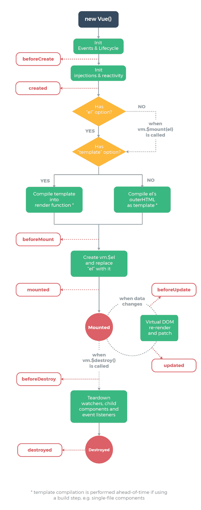
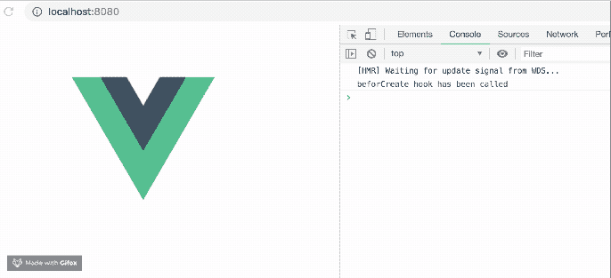
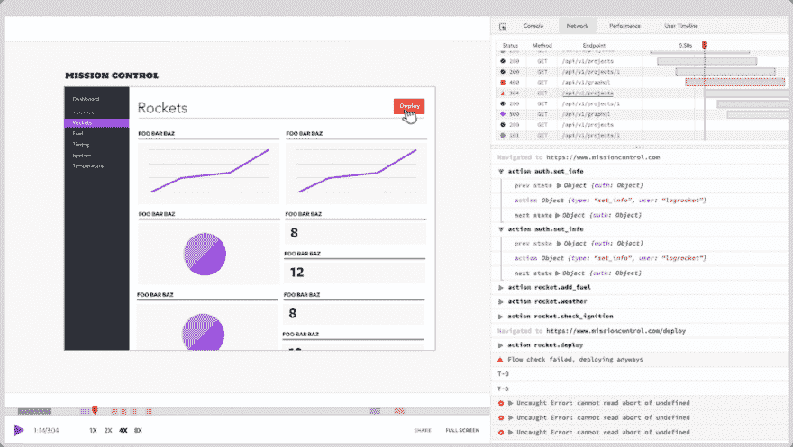

# Vue 生命周期挂钩简介

> 原文：<https://dev.to/bnevilleoneill/introduction-to-vue-lifecycle-hooks-hi9>

[](https://res.cloudinary.com/practicaldev/image/fetch/s--wC4Ed-4r--/c_limit%2Cf_auto%2Cfl_progressive%2Cq_auto%2Cw_880/https://thepracticaldev.s3.amazonaws.com/i/jwilyaeep47ncfb3n7zp.png)

在本帖中，我们将了解所有可用于 Vue JS 工作流的[钩子](https://vuejs.org/v2/guide/instance.html)。

## 视图

Vue JS 是一个非常进步的 JavaScript 框架，由和 Vue 核心团队以及 230 多名开源社区爱好者共同创建。超过 87 万人使用 Vue，并且[在 GitHub](https://github.com/vuejs/vue) 上被加星 14 万次。它由一个只关注视图层的可接近的核心库和一个支持库的生态系统组成，支持库可以帮助您处理大型单页面应用程序中的复杂性。在这篇文章中，你将了解到一个 Vue 实例从创建到销毁的整个生命周期。

[](https://logrocket.com/signup/)

## 开始前

这篇文章适合使用 Vue JS 的所有阶段的开发者，包括初学者。在阅读本文之前，您应该已经具备了一些先决条件。

你将需要以下:

*   [Node.js 版本 10.x](https://nodejs.org/) 及以上安装。您可以通过在终端/命令提示符下运行以下命令来验证您是否知道:

```
node -v 
```

Enter fullscreen mode Exit fullscreen mode

*   还安装了[节点包管理器 6.7 或更高版本(NPM)](https://nodejs.org/)
*   强烈建议使用代码编辑器: [Visual Studio 代码](https://code.visualstudio.com/)
*   [Vue 的最新版本](https://vuejs.org/)，全球安装在您的机器上
*   安装在您机器上的 Vue CLI 3.0 。为此，请先卸载旧版本的 CLI:

```
npm uninstall -g vue-cli 
```

Enter fullscreen mode Exit fullscreen mode

然后安装新的:

```
npm install -g @vue/cli 
```

Enter fullscreen mode Exit fullscreen mode

*   在这里下载一个 Vue Mixins starter 项目
*   解压缩下载的项目
*   导航到解压缩后的文件，并运行命令以保持所有依赖项最新:

```
npm install 
```

Enter fullscreen mode Exit fullscreen mode

## 视图实例

Vue 应用程序由一个用`new Vue`创建的根 Vue 实例组成，可选地组织成一个嵌套的、可重用的组件树。每当您创建一个新的 Vue 项目时，默认情况下，这个 Vue 实例在 main.js 文件中由下面的代码激活:

```
new Vue({
 render: h => h(App),
 }).$mount(‘#app’) 
```

Enter fullscreen mode Exit fullscreen mode

表示包含 app 组件的 Vue 实例，该语法与单文件应用程序等变体稍有不同。

## 生命周期挂钩

每个 Vue 实例都要经历一系列初始化步骤。从设置数据观察到编译模板，到将实例挂载到 DOM，最后到在数据更改期间更新 DOM。这个过程被称为 Vue 实例的生命周期，默认情况下，在创建和更新 DOM 的过程中，它们内部会运行一些函数。正是在它们内部，Vue 组件被创建和存在，这些功能被称为生命周期挂钩。

[](https://res.cloudinary.com/practicaldev/image/fetch/s--XaHjIcAx--/c_limit%2Cf_auto%2Cfl_progressive%2Cq_auto%2Cw_880/https://i2.wp.com/cdn-images-1.medium.com/max/1600/1%2AbyyX8EW6mIhRsCBWwByNYg.png%3Fssl%3D1)

有八种生命周期方法:

1.  创建前
2.  创造
3.  安装前
4.  安装好的
5.  更新前
6.  更新
7.  销毁前
8.  破坏

在这篇文章中，你将会被介绍到这些钩子中的每一个，以及在每一个阶段允许什么样的行为。如果您从一开始就阅读了本文，那么您应该已经有了一个 Vue starter 应用程序并正在运行。

对于这篇文章，我们将使用测试组件，它位于 src 文件夹内的 components 文件夹中。它应该是这样的:

```
// src/components/Test.vue
<template>
 <div>
 </div>
</template>
<script>
export default {
 name: ‘Test’,
 props: {
  msg: String
 }
}
</script>
<! — Add “scoped” attribute to limit CSS to this component only →
<style scoped>

h3 {
 margin: 40px 0 0;
}
ul {
 list-style-type: none;
 padding: 0;
}
li {
 display: inline-block;
 margin: 0 10px;
}
a {
 color: #42b983;
}
</style> 
```

Enter fullscreen mode Exit fullscreen mode

在本教程的整个过程中，脚本部分将单独用于各种钩子的说明。

## 创建之前()

这是 Vue JS 中调用的第一个生命周期钩子，它在 Vue 实例初始化后立即被调用。

```
<script>
export default {
name: 'Test',
beforeCreate() {
 alert('beforCreate hook has been called');
 console.log('beforCreate hook has been called');
 }
}
</script> 
```

Enter fullscreen mode Exit fullscreen mode

您可以通过在开发环境中运行您的应用程序来检查该接口。

```
npm run serve 
```

Enter fullscreen mode Exit fullscreen mode

这将输出如下界面:

[](https://res.cloudinary.com/practicaldev/image/fetch/s--osJ-CIgz--/c_limit%2Cf_auto%2Cfl_progressive%2Cq_66%2Cw_880/https://i1.wp.com/cdn-images-1.medium.com/max/1600/1%2ANzJVcSFCOVcMqoQJETEAOQ.gif%3Fssl%3D1)

请注意，编写在生命周期挂钩中的 alert 语句在组件加载之前首先执行。这正是函数:在 Vue 引擎创建 app 组件之前被调用。这样，在 beforeCreate 阶段，诸如计算属性、观察器、事件、数据属性和操作之类的东西还没有设置。

## 创建了()

正如您已经猜到的，这是紧接在 beforeCreated 钩子之后调用的第二个生命周期钩子。在这个阶段，Vue 实例已经被初始化，并且已经激活了诸如计算属性、观察器、事件、数据属性和随之而来的操作之类的东西。

```
<script>
export default {
name: 'Test',
data() {
return {
books: 0
}
},
created() {
 alert('Created hook has been called');
 console.log(`books is of type ${typeof this.books}`);
 }
}
</script> 
```

Enter fullscreen mode Exit fullscreen mode

如果您运行该应用程序，您会很快注意到现在可以显示的数据类型。这在 beforeCreated 阶段是不可能的，因为这里发生的激活当时还没有发生。但是，Vue 实例在这个阶段还没有挂载，所以您不能在这里操作 DOM，element 属性还不可用。

## 在挂载之前()

这是在调用创建的挂钩之后调用的下一个生命周期挂钩。这是将实例装载到 DOM 之前的时刻，模板和作用域样式都在这里编译，但是您仍然不能操作 DOM，元素属性仍然不可用。这里是你不希望在组件中出现的初始化应该出现的地方:

```
<script>
export default {
  beforeMount() {
    alert('beforeMount is called')
  }
}
</script> 
```

Enter fullscreen mode Exit fullscreen mode

## 挂载()

这是调用 beforeMounted 后要调用的下一个生命周期挂钩。在装载实例后立即调用它。在这里，app 组件或项目中的任何其他组件都可以使用了。数据被放入模板中，DOM 元素被替换为填充了数据的元素，现在可以在这里操作了，元素属性现在可以使用了。

```
<script>
export default {
  mounted() {
    alert('mounted has been called'); 
   }
}
</script> 
```

Enter fullscreen mode Exit fullscreen mode

这是用 Vue CLI 创建的任何项目的默认位置，因为正如我们在开始时看到的，已经在 main.js 文件中完成了挂载。这就是为什么您可能无法使用其他钩子，因为默认情况下已经为您挂载了实例。

## [预更新()](#beforeupdate)

这是在挂载钩子之后调用的生命周期钩子，每当对需要更新 DOM 的数据进行更改时。这个阶段对于数据更改前的任何逻辑都很有用，比如删除事件侦听器。

```
<template>
 <div> {{hello}}
 </div>
</template>
<script>
 export default {
  name: 'Test',
  data() {
   return {
    books: 0,
    hello: 'welcome to Vue JS'
   }
 },
beforeUpdate(){
 alert('beforeUpdate hook has been called');
},
mounted(){
 this.$data.hello= 'lalalalallalalalalaalal';
 }
}
</script> 
```

Enter fullscreen mode Exit fullscreen mode

这最初在 DOM 上有一个欢迎说明，但是在挂载阶段(可以操作 DOM 的地方)，数据发生了变化，因此 beforeUpdate 的警告就在它发生变化之前出现。

## 更新()

这个生命周期钩子在 DOM 更新发生之后被调用，所以这意味着在 beforeUpdate 钩子被调用之后。DOM 相关的操作可以在这里执行，尽管不建议在这个钩子内部改变状态，因为 Vue 已经专门为此提供了平台。

```
<template>
 <div> {{hello}}
 </div>
</template><script>
 export default {
  name: 'Test',
  data() {
   return {
    books: 0,
    hello: 'welcome to Vue JS'
   }
  },
beforeUpdate(){
 alert('beforeUpdate hook has been called');
},
updated(){
 alert('Updated hook has been called');
},
mounted(){
 this.$data.hello= 'lalalalallalalalalaalal';
 }
}
</script> 
```

Enter fullscreen mode Exit fullscreen mode

## 销毁前()

这个 Vue 生命周期钩子在 Vue 实例被销毁之前被调用，实例和所有功能仍然完好无损，并且在这里工作。这是您可以进行资源管理、删除变量和清理组件的阶段。

```
<script>
export default {
name: 'Test',
 data() {
    return {
      books: 0
    }
  },
  beforeDestroy() {
    this.books = null
    delete this.books
  }
}
</script> 
```

Enter fullscreen mode Exit fullscreen mode

## 毁灭()

这是 Vue 生命周期的最后一个阶段，所有的子 Vue 实例都被销毁，像事件监听器和所有指令都在这个阶段被解除绑定。在对象上运行 destroy 后调用它。

```
<script>
export default {
  destroyed() {
    this.$destroy() 
    console.log(this)
  }
}
</script> 
```

Enter fullscreen mode Exit fullscreen mode

当您运行应用程序并查看控制台时，您将什么也看不到。

## 结论

已经向您介绍了 Vue JS 中的八个生命周期挂钩，以及它们的用途和使用时间。现在，您可以使用生命周期挂钩在 Vue 实例生命周期的不同阶段添加我们的定制逻辑，控制从创建到销毁的流程。这将加深你对你在 Vue JS 中使用的日常功能背后的推理的理解。黑客快乐！

* * *

## Plug: [LogRocket](https://logrocket.com/signup/) ，一款适用于网络应用的 DVR

[](https://logrocket.com/signup/)

LogRocket 是一个前端日志工具，可以让你回放问题，就像它们发生在你自己的浏览器中一样。LogRocket 不需要猜测错误发生的原因，也不需要向用户询问截图和日志转储，而是让您重放会话以快速了解哪里出错了。它可以与任何应用程序完美配合，不管是什么框架，并且有插件可以记录来自 Redux、Vuex 和@ngrx/store 的额外上下文。

除了记录 Redux 操作和状态，LogRocket 还记录控制台日志、JavaScript 错误、堆栈跟踪、带有头+正文的网络请求/响应、浏览器元数据和自定义日志。它还使用 DOM 来记录页面上的 HTML 和 CSS，甚至为最复杂的单页面应用程序重新创建像素级完美视频。

[免费试用](https://logrocket.com/signup/)。

* * *

介绍 Vue 生命周期挂钩的帖子[首先出现在](https://blog.logrocket.com/introduction-to-vue-lifecycle-hooks/)[的博客](https://blog.logrocket.com)上。