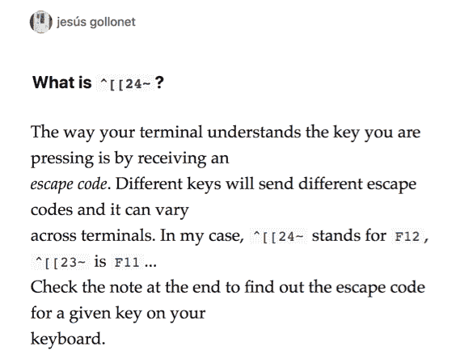

# 猛拉硬包装文本，或者如何将您的 vim markdown 粘贴到 dev.to 中

> 原文：<https://dev.to/jesusgollonet/yank-hard-wrapped-text-or-how-to-paste-your-vim-markdown-into-dev-to-4j8c>

这不应该是我在这里的第一篇文章。但是我在写这个的时候遇到了一个问题。

我在 vim 中写 markdown，并在 80 个字符处硬换行。

[](https://res.cloudinary.com/practicaldev/image/fetch/s--brfhgzvf--/c_limit%2Cf_auto%2Cfl_progressive%2Cq_auto%2Cw_880/https://thepracticaldev.s3.amazonaws.com/i/9nhjie04hssb5l05c9ep.png)

在我的本地预览中，一切看起来都很好，但是当我将我的帖子粘贴到 dev.to 编辑器中时，我看到了一堆断行:

[](https://res.cloudinary.com/practicaldev/image/fetch/s--4-fWaA8k--/c_limit%2Cf_auto%2Cfl_progressive%2Cq_auto%2Cw_880/https://thepracticaldev.s3.amazonaws.com/i/ppv37qqie5aiafor8sgh.png)

经过一些谷歌搜索，我发现有一个关于降价换行符的公开问题。

# [ 处理断行降价 #575](https://github.com/thepracticaldev/dev.to/issues/575) 

[](https://github.com/Defman21) **[Defman21](https://github.com/Defman21)** posted on [<time datetime="2018-09-01T17:53:06Z">Sep 01, 2018</time>](https://github.com/thepracticaldev/dev.to/issues/575)

## 功能请求或任务

功能请求。

### 用户故事/描述

我用代码编辑器写文章，手动换行 80 个字符，所以我可以在任何地方阅读它们，不用担心自动换行之类的问题。Markdown 不把这些换行符算作换行符，我见过的每个 markdown 解析器都自动连接它们，所以

```
Hello
world
```

Enter fullscreen mode Exit fullscreen mode

成为

```
Hello world
```

Enter fullscreen mode Exit fullscreen mode

然而，Dev.to 将它们作为换行符处理。

### 做过的定义

```
Hello
world
```

Enter fullscreen mode Exit fullscreen mode

在 dev.to 文章中呈现为

```
Hello world
```

Enter fullscreen mode Exit fullscreen mode[View on GitHub](https://github.com/thepracticaldev/dev.to/issues/575)

怎么办？我可以切换到软换行符，但是导航变得很麻烦。也许我可以尝试使用 dev.to API 来发布和预处理之前的降价...听起来比我想做的工作要多。什么是~~懒惰~~足够好的方法？

让维姆去做！

我可以用我通常的设置编辑文本，但是复制它就像它没有换行一样吗？你可以猜到那是肯定的。这是我想出来的小怪物

```
 :map ,r :let oldtw=&textwidth <cr> \|:set textwidth=10000 <cr> \| ggVGgqgvy \| :let &textwidth=oldtw <cr> \| :set textwidth? <cr> \| gvgq 
```

Enter fullscreen mode Exit fullscreen mode

让我们来分解一下(省略`\|`这是一个命令分隔符和`<cr>`这只是意味着键入命令后按 enter 键):

*   [T2`:map ,r`](#-raw-map-r-endraw-)
*   [T2`:let oldtw=&textwidth`](#-raw-let-oldtwamptextwidth-endraw-)
*   [T2`:set textwidth=10000`](#-raw-set-textwidth10000-endraw-)
*   [T2`ggvGgqgvy`](#-raw-ggvggqgvy-endraw-)
*   [T2`:let &textwidth=oldtw`](#-raw-let-amptextwidtholdtw-endraw-)
*   [T2`:set textwidth?`](#-raw-set-textwidth-endraw-)
*   [T2`gvgq`](#-raw-gvgq-endraw-)

#### `:map ,r`

按下快捷键时...

#### `:let oldtw=&textwidth`

储存你当前的`textwidth`(在我的例子中是 80)

#### `:set textwidth=10000`

将`textwidth`设置为一个大得离谱的值，这样你就不会在长段落上换行了

#### `ggvGgqgvy`

哈

*   `gg`:转到文件顶部，
*   `v`:开启视觉模式，
*   前往文件的底部(因为你在可视模式下，这将选择所有内容)
*   `gq`:重新格式化段落(因为`textwidth`现在是 10000，所以你所有的段落都没有换行)

#### `:let &textwidth=oldtw`

将`textwidth`属性恢复到这个旧值(警告！这还不够！，参见 vimscript 中的[选项值](http://learnvimscriptthehardway.stevelosh.com/chapters/19.html#options-as-variables)

#### `:set textwidth?`

价值现已完全恢复

#### `gvgq`

*   `gv`:从最后一次选择开始视觉模式(整个文档)
*   `gq`:用旧的`textwidth`重新格式化段落

就是这样！你的文章将会被放在你的剪贴板上，没有间断的段落，你的编辑器将会显示你包装好的文本。

诚然，它有一些极端的情况，是的，我应该把它变成一个函数，但用这种超级实用的方法解决问题是很有趣的。而且很快。而且我已经想贴点东西了！