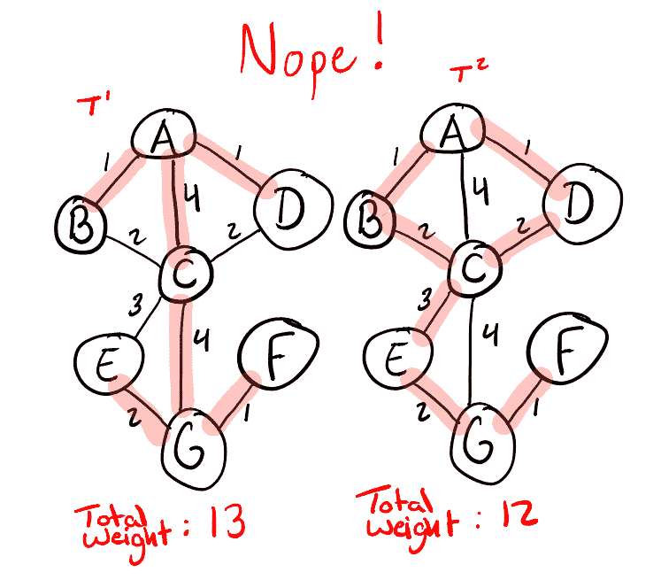
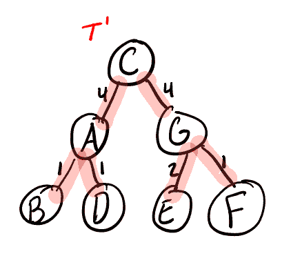
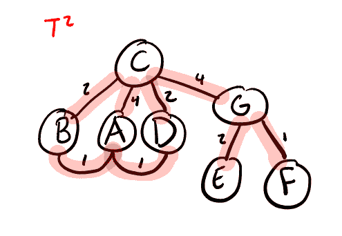
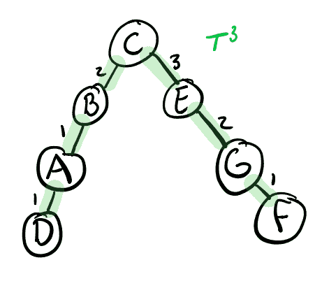
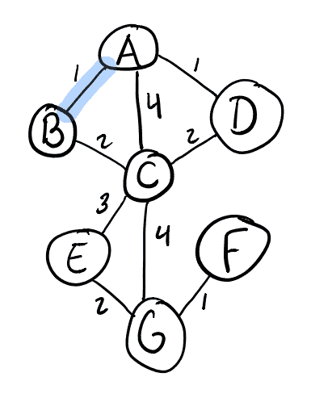
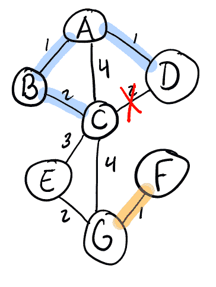
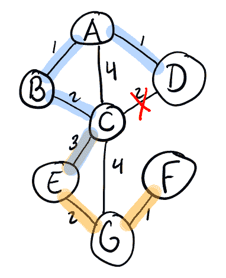

# 用 Kruskal 算法求最小生成树

> 原文：<https://dev.to/downey/finding-minimum-spanning-trees-with-kruskal-s-algorithm-4j21>

*封面图片由[丹尼尔·洛斯卡](https://unsplash.com/@magruder?utm_source=unsplash&utm_medium=referral&utm_content=creditCopyText)在[Unsplash](https://unsplash.com)T5 拍摄*

我写这篇文章是为了帮助巩固我对最小生成树和 Kruskal 算法的理解，这是我目前正在上的[算法课程](https://www.omscs.gatech.edu/cs-8803-ga-graduate-algorithms)的内容。用我自己的话解释事情有助于我学习，用不同于现有的方式解释可能有助于其他人。😌在这篇文章中，我将解释什么是最小生成树，包括一些例子，做一个 Kruskal 算法的演练，并尽力解释切割属性。最后，我会附上一些我认为有用的额外资源。

## 什么是最小生成树

加权无向图的[最小生成树](https://en.wikipedia.org/wiki/Minimum_spanning_tree)是满足以下性质的子图:

1.  图形的所有顶点都保持连接
2.  图中没有循环
3.  总边缘重量被最小化

让我们考虑下面的图表 *G* :

如你所见， *G* 是一个所有边都有权重的无向图。现在让我们看一些子图的例子，它们是**而不是**最小生成树。

首先让我们看看左边的 T 1 。这是生成树吗？是的，这是因为子图(用红色突出显示的线表示)不包含任何循环！想象你抓住顶点 C，让其他顶点自由悬挂。这可能如下所示:

看到它是如何形成树状结构的了吗？

相比之下，T 2 是**而不是**生成树，因为它包含顶点 A、B、C 和 D 之间的一个环。如果我们在这个环上抓住 C，请注意所有的边是如何绷紧的，除了将 B 和 D 连接到 A 的环边

所以 T 2 不是生成树，所以很明显它不是最小生成树。为什么 T 1 不是呢？这违反了我们的第三个属性，最小化总边重。当有更便宜的选择时，T 1 使用权重 4 中最昂贵的两条边来构建它的树。那么这个 *G* 的最小生成树实际上是什么样子的呢？

T 3 和 T 4 通过连接所有顶点，不包含任何循环，并最小化总边权重，满足我们的所有标准。我们可以像之前一样做同样的练习，提升 T 3 的 C 顶点，来可视化树形结构，如下所示:

太酷了。那么我们如何通过编程从一个图中找到最小生成树呢？一种方法是使用克鲁斯卡尔的算法。

## 求最小生成树的克鲁斯卡尔算法

克鲁斯卡尔的算法是一种[贪婪算法](https://en.wikipedia.org/wiki/Greedy_algorithm)，这意味着当我们努力为我们的图 *G* 寻找最小生成树时，我们将为每个子图做出局部最优选择。
我们将做以下工作:

1.  将 *G* 的边( *E* )按重量排序
2.  逐渐添加边，从最小的边开始，在不引入循环的情况下连接组件
3.  重复上面的过程，直到我们用完了所有的边或者只剩下一个连通的部分(最小生成树)。如果我们用完了边，那么这个图是不连通的，所以没有最小生成树。

听起来很简单，对吧？我认为最棘手的部分是这一部分:*连接组件而不引入循环*。我们可以通过使用一种叫做 [union-find 数据结构](https://www.youtube.com/watch?v=ibjEGG7ylHk)的东西来做到这一点。链接视频很好地解释了它是如何工作的，但本质上它将允许我们跟踪哪些顶点是哪些连接组件的成员。

我们首先将所有顶点添加到联合中，作为它们自己的组件，当我们添加边时，我们将逐渐合并(或联合)组件。其工作方式如下:

1.  当考虑一条边 *e* 时，首先在由 *e* 连接的两个顶点 *u* 和 *w* 上使用联合查找数据结构进行*查找*。如果 *find(u)* 和 *find(w)* 返回相同的结果，则两个顶点已经是同一组件的成员，添加这条边将引入一个循环。在这种情况下，我们不能添加 *e* 。
2.  如果 *find(u)* 和 *find(w)* 返回不同的结果，那么这两个顶点当前没有连接，并且 *e* 是有效的候选边。然后，我们对顶点执行 *union(u，v)* 以在 union-find 中联合它们的组件。下一次我们调用 *find(u)* 和 *find(w)* 时，我们将得到相同的结果，因为它们共享一个组件。

现在假设我们有一个好的联合发现，让我们为我们的图 *G* 走一遍克鲁斯卡尔的算法。

首先让我们按权重对我们的边进行排序:

*   A-B:1
*   A-D:1
*   女-男: 1
*   B-C: 2
*   D-C: 2
*   例如:2
*   英汉对照:3
*   **A-C:** 4
*   C-G: 4

现在我们将按顺序检查这些边，首先看 A-B。

这是我们的第一个优势，所以这里肯定不会有循环，但我们会检查我们的联合-查找只是为了确定。 *find(A)* 和 *find(B)* 证实了我们的猜测，即这些顶点还没有连接，因此我们可以 *union(A，B)* 并创建我们的第一个蓝色连通分量。

接下来我们来看看 A-D。我们运行 *find(A)* 和 *find(D)* ，看到这些是独立的组件，因此没有循环！让我们把 D 加到蓝色分量上。

接下来我们检查边 F-G 和 *find(F)* 和 *find(G)* 显示这两个顶点当前没有连接。我们运行 *union(F，G)* 来形成橙色组件。

现在我们没有权重 1 的边，让我们继续权重 2 的边。我们看一下边 B-C，并将其添加到蓝色组件中，B 是使用与之前相同的流程的成员。

现在让我们来看看华盛顿，这里的事情变得有点有趣。当我们运行 *find(D)* 和 *find(C)* 时，我们得到相同的结果，因为它们都已经是蓝色组件的成员。从 D-C 添加边将只是添加另一种方式来连接这些**已经连接的**顶点，并引入一个循环。因为生成树不能包含环，所以这是不行的。

继续看边 E-G，我们发现 E 和 C 已经不在同一个组件中，所以我们可以 *union(E，G)* 并将它们连接在一起作为橙色组件的一部分。

我们现在已经用完了权重 2 的边。是时候看看我们从 E-C 的权重 3 边了。如果我们运行 *find(E)* 和 *find(C)* 我们会看到这些顶点是不同组件(橙色和蓝色)的成员，所以我们可以包括 E-C 边来连接它们。我们现在已经加入了蓝色和橙色组件，只剩下一个组件了！这意味着我们已经找到了最小生成树 T 3 。

## 削减财产

图的割是将图分成两个组 s 和不在 s(s 的补)中的顶点集，S̅.下图显示了我们的图表 *G* 中这些切割的样子。

Cut 属性声明任何穿过一个割的最小权重边必须是图的某个最小生成树的一部分。对于我们的例子，你可以凭直觉理解。我们可以选择边 **B-C** 或 **D-C** (两者权重相等)，这将导致我们的最小生成树之一 T 3 或 T 4 。

Erik Demaine 的关于最小生成树的[讲座](https://youtu.be/tKwnms5iRBU?t=1765)在大约 30 分钟的标记处很好地证明了切割属性。

## 附加资源

希望你已经发现这个克鲁斯卡尔算法的演练是有帮助的。如果你想更深入，或者只是想用另外的方式解释，我个人觉得下面的讲座、视频和论文非常有用:

1.  [Erik Demaine 的最小生成树讲座](https://www.youtube.com/watch?v=tKwnms5iRBU)
2.  [Josh Hug 在被裁财产上的视频](https://www.youtube.com/watch?v=QYdZS4S-FyU)
3.  [William Fiset 关于 Union-Find 数据结构的视频](https://www.youtube.com/watch?v=ibjEGG7ylHk)
4.  [威廉·费塞特为克鲁斯卡尔的算法所做的沃尔瑟夫](https://www.youtube.com/watch?v=JZBQLXgSGfs)
5.  [托罗诺特大学削减财产讲义](http://www.cs.toronto.edu/~vassos/teaching/c73/handouts/cut-property.pdf)