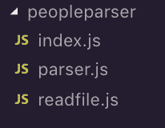

# 函数式编程与面向对象编程中的代码组织

> 原文：<https://dev.to/jesterxl/code-organization-in-functional-programming-vs-object-oriented-programming-79i>

## 简介

一位同事问及函数式编程中的代码组织。他和一群 Java 开发人员在 Node 中为一个 AWS Lambda 工作，他们使用相同风格的类、不同的设计模式和其他面向对象的编程方式来组织代码。他想知道如果他们仅仅通过纯函数使用函数式编程，他们将如何组织它？

## OOP 方式

如果说我从代码组织中学到了什么，那就是每个人的做法都不一样。唯一被接受的跨语言的实践是拥有一个用于测试的公共接口。公共接口是抽象出大量处理内部细节的代码的任何东西。它可以是类的公共方法、外观或工厂设计模式，或者模块中的函数。所有 3 个都将利用内部的许多函数，但将只公开一个函数来使用它们。这有时可以确保当您添加东西和修复 bug 时，消费者在更新到您的最新代码时不必更改他们的代码。副作用仍然会对此产生负面影响。

### 单类模块

可以说，OOP 方式，至少在 Node 中，通常由两种基本方式组成。第一种方法是创建一个类，然后将其公开为默认导出:

```
// CommonJS
class SomeThing { ... }

module.exports = SomeThing

// ES6
class SomeThing { ... }
export default SomeThing
Export Multiple Things 
```

Enter fullscreen mode Exit fullscreen mode

### 一个模块中的多个类/事物

二是从同一个模块中暴露很多东西，包括类、函数、事件变量:

```
// CommonJS
class SomeThing { ... }

const utilFunction = () => ...

const CONFIGURATION_VAR = ...

module.exports = {
    SomeThing,
    utilFunction,
    CONFIGURATION_VAR
}

// ES6
export class SomeThing { ... }

export const utilFunction = () => ...

export const CONFIGURATION_VAR = ... 
```

Enter fullscreen mode Exit fullscreen mode

一旦你通过了这两种导出代码的基本方法，项目与项目之间，团队与团队之间的事情看起来就不再一样了。有些使用不同的框架，如 Express，这与您使用 Nest 的方式不同。在这些框架内，两个团队将以不同的方式进行表达。这些团队中的一个有时会在新的项目中以不同于过去的方式组织一个 Express 项目。

## FP 方式

组织代码(至少在节点中)的函数式编程方式遵循两种方式。

### 导出单功能

第一个从模块中导出一个函数:

```
// CommonJS
const utilFunction = () => ...

module.exports = utilFunction

// ES6
const utilFunction = () => ...
export default utilFunction
Export Multiple Functions 
```

Enter fullscreen mode Exit fullscreen mode

第二种方式是从一个模块中导出多个函数:

```
// CommonJS
const utilFunction = () => ...
const anotherHelper = () => ...

module.exports = {
    utilFunction,
    anotherHelper
}

// ES6
export const utilFunction = () => ...
export const anotherHelper = () => ... 
```

Enter fullscreen mode Exit fullscreen mode

### 变量？

有时你会看到他们将变量和函数一起导出，而另一些更纯粹的人想要促进惰性求值，他们将只导出函数:

```
// pragmatic
export CONFIGURATION_THING = 'some value'

// purist
export configurationThing = () => 'some value' 
```

Enter fullscreen mode Exit fullscreen mode

## 例子

我们将创建一些上面的例子来展示如何使用单个和多个导出。我们将为 OOP 和 FP 示例构建一个公共接口，并暂时忽略两者的副作用(即 HTTP 调用),假设单元测试将使用公共接口来调用内部私有方法。两者都将加载相同的文本文件并解析它。

这两个例子都将解析下面的 JSON 字符串:

```
[  {  "firstName":  "jesse",  "lastName":  "warden",  "type":  "Human"  },  {  "firstName":  "albus",  "lastName":  "dumbledog",  "type":  "Dog"  },  {  "firstName":  "brandy",  "lastName":  "fortune",  "type":  "Human"  }  ] 
```

Enter fullscreen mode Exit fullscreen mode

### 举例:OOP

我们需要三样东西:一个用默认编码读取文件的类，一个解析文件的类，一个将它们放入一个公共接口的 Singleton。

#### [读取文件. js](#readfilejs)

首先，读者将通过可选编码将阅读内容抽象成`Promise` :

```
// readfile.js
import fs from 'fs'
import { EventEmitter } from 'events'

class ReadFile {

    readFile(filename, encoding=DEFAULT_ENCODING) {
        return new Promise(function (success, failure) {
            fs.readFile(filename, encoding, function(error, data) {
                if(error) {
                    failure(error)
                    return
                }
                success(data)
            })
        })
    }
}

export DEFAULT_ENCODING = 'utf8'
export ReadFile 
```

Enter fullscreen mode Exit fullscreen mode

#### parser.js

接下来，我们需要一个解析器类从读取的文件中获取原始字符串数据，并将其解析为一个数组中的格式化名称:

```
// parser.js
import { startCase } from 'lodash'

class ParseFile {

    #fileData
    #names

    get names() { 
        return this.#names
    }

    constructor(data) {
        this.#fileData = data
    }

    parseFileContents() {
        let people = JSON.parse(this.#fileData)
        this.#names = []
        let p
        for(p = 0; p < people.length; p++) {
            const person = people[p]
            if(person.type === 'Human') {
                const name = this._personToName(person)
                names.push(name)
            }
        }
    }

    _personToName(person) {
        const name = `${person.firstName}  ${person.lastName}` 
        return startCase(name)
    }
}

export default ParseFile 
```

Enter fullscreen mode Exit fullscreen mode

#### index.js

最后，我们需要一个 Singleton 将它们整合到一个单一的静态方法中:

```
// index.js
import ParseFile from './parsefile'
import { ReadFile, DEFAULT_ENCODING } from './readfile'

class PeopleParser {

    static async getPeople() {
        try {
            const reader = new ReadFile()
            const fileData = await reader.readFile('people.txt', DEFAULT_ENCODING)
            const parser = new ParseFile(data)
            parser.parseFileContents()
            return parser.names
        } catch(error) {
            console.error(error)
        }
    }

}

export default PeopleParser 
```

Enter fullscreen mode Exit fullscreen mode

### 使用 PeopleParser 的静态方法

要使用它:

```
import PeopleParser from './peopleparser'
PeopleParser.getPeople()
.then(console.log)
.catch(console.error) 
```

Enter fullscreen mode Exit fullscreen mode

您的文件夹结构将如下所示:

[](https://res.cloudinary.com/practicaldev/image/fetch/s--XspjsysZ--/c_limit%2Cf_auto%2Cfl_progressive%2Cq_auto%2Cw_880/https://thepracticaldev.s3.amazonaws.com/i/h09n0d87xjqjj58ea8jx.png)

然后用一个针对文件系统的**模拟**对 PeopleParser 进行单元测试。

## 举例:FP

对于我们的函数式编程示例，我们将需要[本文](http://jessewarden.com/2019/01/four-ways-to-compose-synchronous-functions-in-javascript.html)中的所有内容，嘿！说真的，纯函数列表:

### 功能为默认编码

```
export const getDefaultEncoding = () =>
    'utf8' 
```

Enter fullscreen mode Exit fullscreen mode

### 功能读取文件

```
const readFile = fsModule => encoding => filename =>
    new Promise((success, failure) =>
        fsModule.readFile(filename, encoding, (error, data) =>
            error
            ? failure(error)
            : success(data)
        ) 
```

Enter fullscreen mode Exit fullscreen mode

### 功能解析文件

```
const parseFile = data =>
    new Promise((success, failure) => {
        try {
            const result = JSON.parse(data)
            return result
        } catch(error) {
            return error
        }
    }) 
```

Enter fullscreen mode Exit fullscreen mode

### 函数从人物对象数组中过滤人物

```
const filterHumans = peeps =>
    peeps.filter(
        person =>
            person.type === 'Human'
    ) 
```

Enter fullscreen mode Exit fullscreen mode

### 函数用于格式化来自人类的字符串名称列表

```
const formatNames = humans =>
    humans.map(
        human =>
            `${human.firstName}  ${human.lastName}`
    ) 
```

Enter fullscreen mode Exit fullscreen mode

### 从列表中固定名称大小写和映射的功能

```
const startCaseNames = names =>
    names.map(startCase) 
```

Enter fullscreen mode Exit fullscreen mode

### 功能提供公共接口

```
export const getPeople = fsModule => encoding => filename =>
    readFile(fsModule)(encoding)(filename)
        .then(parseFile)
        .then(filterHumans)
        .then(formatNames)
        .then(startCaseNames) 
```

Enter fullscreen mode Exit fullscreen mode

### 使用 getPeople

使用功能:

```
import fs from 'fs'
import { getPeople, getDefaultEncoding } from './peopleparser'

getPeople(fs)(getDefaultEncoding())('people.txt')
.then(console.log)
.catch(console.error) 
```

Enter fullscreen mode Exit fullscreen mode

您的文件夹结构应该如下所示:

[](https://res.cloudinary.com/practicaldev/image/fetch/s--4hUwIWGk--/c_limit%2Cf_auto%2Cfl_progressive%2Cq_auto%2Cw_880/https://thepracticaldev.s3.amazonaws.com/i/dwejyj9d2rtxtk4huzvo.png)

然后使用文件系统的存根对 getPeople 进行单元测试。

## 结论

如您所见，对于 OOP 和 FP 代码库，您可以使用 CommonJS 和 ES6 中的基本默认模块导出或多重导出选项。只要您导出的是隐藏实现细节的公共接口，那么您就可以确保在更新代码时不会破坏使用您的代码的人，并且确保当您更改私有类方法/函数中的实现细节时，您不必重构一堆单元测试。

虽然上面的 FP 例子比 OOP 例子小，但是不要搞错，你也可以得到很多函数，而且你用同样的方式对待它；只需从另一个模块/文件中导出一个函数，或一系列函数。通常，您将文件夹中的 index.js 视为决定将什么实际导出为公共接口的人。