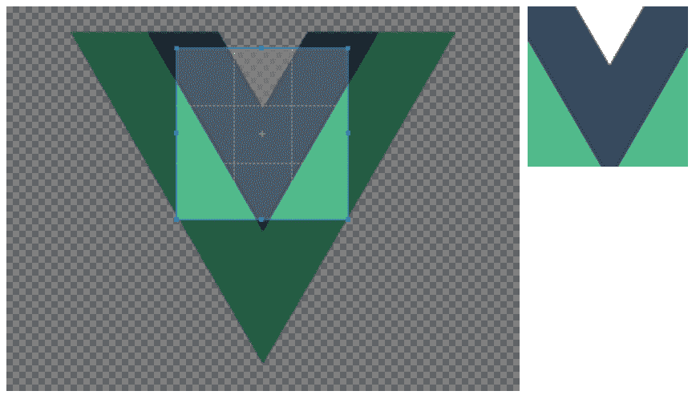

# 使用 Vue.js 在浏览器中裁剪图像

> 原文：<https://dev.to/bnevilleoneill/cropping-images-in-the-browser-with-vue-js-1lg5>

[](https://res.cloudinary.com/practicaldev/image/fetch/s--rYqEVOOG--/c_limit%2Cf_auto%2Cfl_progressive%2Cq_auto%2Cw_880/https://thepracticaldev.s3.amazonaws.com/i/r2f6k8s3aauk8lfvxo2a.png)

你有没有创建过一个 web 应用程序，它需要从用户那里接受图像，后来发现用户倾向于提供各种形状和大小的图像，打破了你的网站主题？在网络上处理图像很容易成为一件痛苦的事情——当然，除非你使用了正确的工具。

在本教程中，我们将探讨如何在浏览器中使用 JavaScript 库来操作图像，以便存储在服务器上并在 web 应用程序中使用。我们将使用 [Vue.js](https://vuejs.org/) 来代替普通的 JavaScript。

为了了解我们想要实现的目标，请看上面的图片。左边是原始图像，右边是新图像的预览。我们可以移动裁剪框并调整其大小，预览图像也会随之改变。如果用户愿意，他们可以下载预览图像。

繁重的工作由一个名为 [Cropper.js](https://fengyuanchen.github.io/cropperjs/) 的库来完成。

[](https://logrocket.com/signup/)

## 使用图像裁剪依赖创建新的 Vue.js 项目

本例成功的第一步是创建一个新项目并安装必要的依赖项。假设您已经安装并配置了 [Vue CLI](https://fengyuanchen.github.io/cropperjs/) 。

从命令行执行以下命令:

```
vue create cropper-project 
```

<svg width="20px" height="20px" viewBox="0 0 24 24" class="highlight-action crayons-icon highlight-action--fullscreen-on"><title>Enter fullscreen mode</title></svg> <svg width="20px" height="20px" viewBox="0 0 24 24" class="highlight-action crayons-icon highlight-action--fullscreen-off"><title>Exit fullscreen mode</title></svg>

出现提示时，选择默认选项。这将是一个简单的项目，所以没有必要担心路由和所有那些好的 Vue.js 的东西。

导航到您的新项目并执行以下命令:

```
npm install cropperjs --save 
```

<svg width="20px" height="20px" viewBox="0 0 24 24" class="highlight-action crayons-icon highlight-action--fullscreen-on"><title>Enter fullscreen mode</title></svg> <svg width="20px" height="20px" viewBox="0 0 24 24" class="highlight-action crayons-icon highlight-action--fullscreen-off"><title>Exit fullscreen mode</title></svg>

上面的命令会将 Cropper.js 安装到我们的项目中。我们可以很容易地为此使用 CDN，但是因为我们使用的是利用 webpack 的框架，所以 npm 途径最有意义。

当我们的依赖项被安装后，我们还需要做一件事。因为我们使用 npm，所以不包括 CSS 信息——只包括 JavaScript 信息。我们需要在本地或通过 CDN 包含 CSS 信息。我们将使用 CDN。

打开项目的`public/index.html`文件，并包含以下 HTML 标记:

```
<!DOCTYPE html>
<html lang="en">
    <head>
        <meta charset="utf-8">
        <meta http-equiv="X-UA-Compatible" content="IE=edge">
        <meta name="viewport" content="width=device-width,initial-scale=1.0">
        <link rel="icon" href="<%= BASE_URL %>favicon.ico">
        <title>image-cropping</title>
        <link rel="stylesheet" href="https://cdnjs.cloudflare.com/ajax/libs/cropperjs/1.5.1/cropper.min.css">
    </head>
    <body>
        <noscript>
            <strong>We're sorry but image-cropping doesn't work properly without JavaScript enabled. Please enable it to continue.</strong>
        </noscript>
        <div id="app"></div>
        <!-- built files will be auto injected -->
    </body>
</html> 
```

<svg width="20px" height="20px" viewBox="0 0 24 24" class="highlight-action crayons-icon highlight-action--fullscreen-on"><title>Enter fullscreen mode</title></svg> <svg width="20px" height="20px" viewBox="0 0 24 24" class="highlight-action crayons-icon highlight-action--fullscreen-off"><title>Exit fullscreen mode</title></svg>

注意，在`<head>`标签中，我们包含了`cropper.min.css`文件。还是那句话，只要你得到了 CSS 信息，你如何得到它并不重要。没有 CSS 信息，我们就不会有漂亮的图片裁剪框。

## 在 Vue.js 项目中用 JavaScript 裁剪图像

此时，项目应该差不多配置好了，可以在 web 上裁剪图像了。为了保持项目的整洁，我们将创建一个新的 Vue.js 组件来处理所有的图像操作。

在您的项目中创建一个`src/components/ImageCropper.vue`文件，并包含以下样板代码:

```
<template>
    <div>
        <div class="img-container">
            
        </div>
        
    </div>
</template>

<script>
    import Cropper from "cropperjs";
    export default {
        name: "ImageCropper",
        data() {
            return {
                cropper: {},
                destination: {},
                image: {}
            }
        },
        props: {
            src: String
        },
        mounted() { }
    }
</script>

<style scoped>
    .img-container {
        width: 640px;
        height: 480px;
        float: left;
    }
    .img-preview {
        width: 200px;
        height: 200px;
        float: left;
        margin-left: 10px;
    }
</style> 
```

<svg width="20px" height="20px" viewBox="0 0 24 24" class="highlight-action crayons-icon highlight-action--fullscreen-on"><title>Enter fullscreen mode</title></svg> <svg width="20px" height="20px" viewBox="0 0 24 24" class="highlight-action crayons-icon highlight-action--fullscreen-off"><title>Exit fullscreen mode</title></svg>

对于这个例子来说,`<style>`标签信息并不太重要；它只是清理了页面，并没有从库中获得任何实际效果。

注意出现在`<template>`模块中的`src`和`destination`变量。这些变量代表用户通过`props`对象定义的源图像，以及已经被操作的目标图像。我们将能够通过`ref`变量直接访问源图像，这类似于在 DOM 对象上使用`querySelector`。

虽然我们已经为我们的图像奠定了基础，但实际上我们还没有对它们做任何事情。我们将在视图初始化后触发的`mounted`方法中配置裁剪工具和事件。

`mounted`方法可能看起来像这样:

```
mounted() {
    this.image = this.$refs.image;
    this.cropper = new Cropper(this.image, {
        zoomable: false,
        scalable: false,
        aspectRatio: 1,
        crop: () => {
            const canvas = this.cropper.getCroppedCanvas();
            this.destination = canvas.toDataURL("image/png");
        }
    });
} 
```

<svg width="20px" height="20px" viewBox="0 0 24 24" class="highlight-action crayons-icon highlight-action--fullscreen-on"><title>Enter fullscreen mode</title></svg> <svg width="20px" height="20px" viewBox="0 0 24 24" class="highlight-action crayons-icon highlight-action--fullscreen-off"><title>Exit fullscreen mode</title></svg>

当该方法被调用时，我们获得对我们的图像的引用，在`<template>`块中找到。然后，我们在初始化裁剪实用程序时使用该图像，同时定义一些配置，这些配置都不是强制性的。

方法是魔法发生的地方。每当我们的图像发生问题时，就会调用这个`crop`方法。当执行`crop`方法时，我们应该得到裁剪、缩放等。信息，并根据它创建一个新的图像——也就是目标图像。

此时，我们已经创建了组件，但是还没有使用它。

打开项目的`src/App.vue`文件，包括以下内容:

```
<template>
    <div id="app">
        <ImageCropper src="/logo.png" />
    </div>
</template>

<script>
    import ImageCropper from "./components/ImageCropper.vue"
    export default {
        name: "app",
        components: {
            ImageCropper
        }
    }
</script>

<style></style> 
```

<svg width="20px" height="20px" viewBox="0 0 24 24" class="highlight-action crayons-icon highlight-action--fullscreen-on"><title>Enter fullscreen mode</title></svg> <svg width="20px" height="20px" viewBox="0 0 24 24" class="highlight-action crayons-icon highlight-action--fullscreen-off"><title>Exit fullscreen mode</title></svg>

注意，我们已经导入了`ImageCropper`组件，并在`<template>`块中使用它。记住，`src`属性是 JavaScript 中的`props`之一。在我的例子中，有一个`public/logo.png`文件，但是你可以随意修改它。在更真实的场景中，您可能会使用用户计划上传的图像。

如果你想学习如何上传文件，比如裁剪过的图像，你可以看看我之前的教程“通过 Vue.js Web 应用程序上传文件到远程 Web 服务”

## 结论

您刚刚看到了如何在 Vue.js web 应用程序中使用 Cropper.js 库操作图像。如果你需要接受来自用户的图片作为他们个人资料的一部分，这是很有用的，因为你想要一致的大小，这样你的主题就不会中断。

使用图像裁剪库与在普通 JavaScript 中使用它没有太大区别，但是需要做一些事情来与 Vue.js 中的 HTML 组件进行交互。

* * *

## Plug: [LogRocket](https://logrocket.com/signup/) ，一款适用于网络应用的 DVR

[](https://logrocket.com/signup/)

LogRocket 是一个前端日志工具，可以让你回放问题，就像它们发生在你自己的浏览器中一样。LogRocket 不需要猜测错误发生的原因，也不需要向用户询问截图和日志转储，而是让您重放会话以快速了解哪里出错了。它可以与任何应用程序完美配合，不管是什么框架，并且有插件可以记录来自 Redux、Vuex 和@ngrx/store 的额外上下文。

除了记录 Redux 操作和状态，LogRocket 还记录控制台日志、JavaScript 错误、堆栈跟踪、带有头+正文的网络请求/响应、浏览器元数据和自定义日志。它还使用 DOM 来记录页面上的 HTML 和 CSS，甚至为最复杂的单页面应用程序重新创建像素级完美视频。

[免费试用](https://logrocket.com/signup/)。

* * *

用 Vue.js 在浏览器中裁剪图像的帖子[最先出现在](https://blog.logrocket.com/cropping-images-in-the-browser-with-vue-js/)[博客](https://blog.logrocket.com)上。