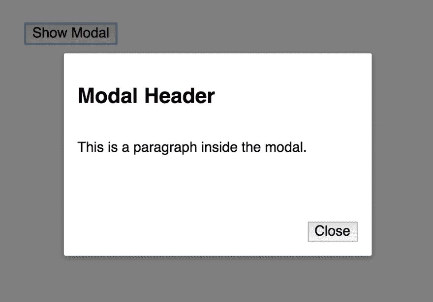
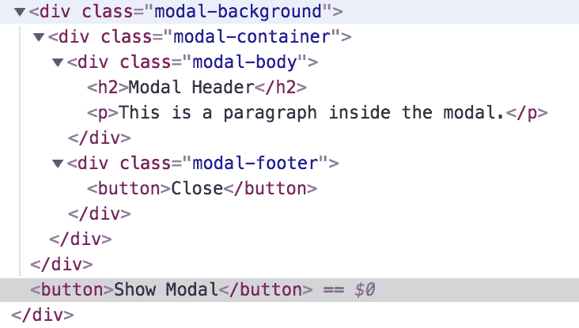

# 带插槽的 Vue.js 组件组合

> 原文：<https://dev.to/fdietz/vue-js-component-composition-with-slots-36mf>

在[之前的帖子](https://dev.to/fdietz/introduction-to-components-with-vue-js-2p6n)中，我们介绍了 Vue.js 组件模型，并看到了如何通过`props`将数据传递给子组件，以及组件如何向其父组件发出事件。

在这一章中，我们将重点放在插槽上，通过将内容注入到子组件中，插槽给了你的组件更多的灵活性。

在这一章中，我们以模态对话框为例。

[](https://res.cloudinary.com/practicaldev/image/fetch/s--_zffsiee--/c_limit%2Cf_auto%2Cfl_progressive%2Cq_auto%2Cw_880/https://thepracticaldev.s3.amazonaws.com/i/a1e641ki4sjg112q15nl.png)

作为内容占位符的插槽

我们从最小可能的模态对话框实现开始，其中模态的呈现是使用带有`showModal`变量的`v-if`指令来完成的。

```
new Vue({
  el: "#demo",
  data: {
    showModal: false
  }
}); 
```

点击
按钮时，`showModal`值被设置为`true`

```
<div id="demo">
  <modal v-if="showModal" @close="showModal = false">
    <h2>Modal Header</h2>
    <p>This is a paragraph inside the modal.</p>
  </modal>
  <button @click="showModal = true">Show Modal</button>
</div> 
```

我们的`modal`组件子组件由一些我们希望在模态对话框中显示的 HTML 标题和段落组成。

此外，如果用户按下关闭按钮关闭模态对话框，我们将监听`@close`事件。

我们来看看组件:

```
<template id="template-modal">
  <div class="modal-background" @click.self="$emit('close')">
    <div class="modal-container">
      <div class="modal-body">
        <slot></slot>
      </div>
      <div class="modal-footer">
        <button @click="$emit('close')">Close</button>
      </div>
    </div>
  </div>
</template> 
```

`modal-body`包含一个`slot`组件，作为我们上面传递的内容的占位符。它在浏览器 DOM 中不可见，将被替换为我们的内容。

[](https://res.cloudinary.com/practicaldev/image/fetch/s--GPrgMe1j--/c_limit%2Cf_auto%2Cfl_progressive%2Cq_auto%2Cw_880/https://thepracticaldev.s3.amazonaws.com/i/6ak385vne4p9a1p39taw.png)

<figure>

<figcaption>Chrome Devtools 元素选项卡截图</figcaption>

</figure>

这个`modal-background`类用于在模态对话框下渲染一个暗的覆盖图。此外，它发出一个`click`事件来关闭对话框。`self` [事件修饰符](https://vuejs.org/v2/guide/events.html#Event-Modifiers)用于确保事件只在单击背景时发出，而不是在单击模态对话框本身时发出。

## 命名插槽

在前面的例子中，我们使用“默认槽”将所有内容传递给我们的模态组件。在下一个例子中，我们通过使用“命名槽”进一步改进了模式对话框组件，它使组件的用户能够在多个地方插入内容。

为了变得更加灵活，我们为页眉、正文和页脚引入了命名槽。下面是我们的标记的定义:

```
<template id="template-modal">
  <div class="modal-background" @click.self="$emit('close')">
    <div class="modal-container">
      <div class="modal-header">
        <slot name="header"></slot>
      </div>
      <div class="modal-body">
        <slot name="body"></slot>
      </div>
      <div class="modal-footer">
        <slot name="footer">
          <button @click="$emit('close')">Close</button>
        </slot>
      </div>
    </div>
  </div>
</template> 
```

请注意每个插槽的`name`属性的用法，以及每个`slot`如何包装在另一个`div`元素中。该组件通过使用特定的 CSS 类`modal-header`、`modal-body`和`modal-footer`来完全控制样式。并且组件的用户可以只关注内容。

这些命名槽的用法与默认槽非常相似:

```
<modal v-if="showModal" @close="showModal = false">
  <h2 slot="header">Modal Header</h2>
  <div slot="body">Modal Body</div>
</modal> 
```

我们可以为我们的内容使用任何我们想要的 HTML 元素，并使用`slot`属性来选择我们想要使用的适当位置。这不仅包括 HTML 元素，还包括其他 Vue.js 组件。

注意，在这个例子中没有使用`footer`槽。默认情况下，将使用现有的槽内容。在我们的例子中，`footer`槽是这样定义的:

```
<slot name="footer">
  <button @click="$emit('close')">Close</button>
</slot> 
```

所以，我们仍然有我们的关闭按钮。

## 总结

在这一章中，我们研究了槽和命名槽，以一种非常灵活的方式来组成我们的组件和内容。请继续关注我即将发布的关于作用域插槽的帖子！

如果你喜欢这篇文章，也可以看看我的新课程 [Vue.js 组件模式课程](https://fdietz.github.io/vue-component-patterns-course.html)。