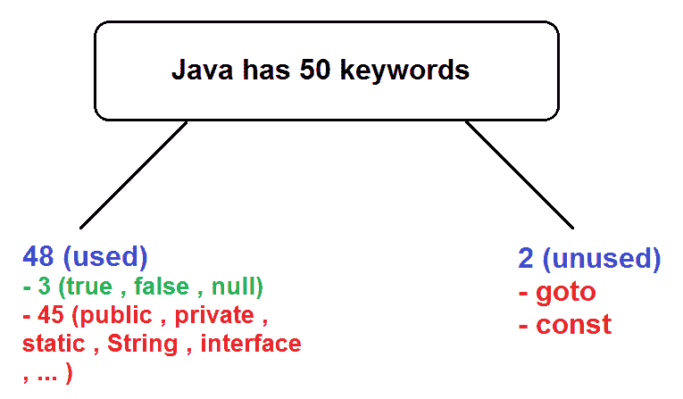

# 第 6 课:文字、关键字和标识符

> 原文：<https://dev.to/hamid842/lesson-6-literals-keywords-and-identifiers-o64>

*文字*是赋给变量的值:

 
**文字类别:**

*-整数文字量*

*-字符串文字*

*-布尔文字*

*-字符字面量*

*-浮点文字量*

*-空文字*

# **关键词:**

*关键字*是具有任何特定含义的预定义单词:

# **标识符:**

*标识符*可以是任何名称，可以是变量名、类名或方法名:

**标识符规则:**

**1-不能使用空格:**

int emp no = 10-> int EMP _ no = 10；

**2-只能使用下划线(_)和美元($):**

int emp _ no = 10

**3-不能使用保留字:**

int public = 10-> int a = 10；

**4-整数值不能用在第一个位置，但可以用在第一个字符之后:**

int 1abc = 10-> int a1bc = 10；int abc1 = 10

# **命名约定:**

**变量- >我的，我的 _java，我的 _java_demo**

**方法- > my()，myJava()，my java demo()**

**类/接口- > My，MyJava，MyJavaDemo**