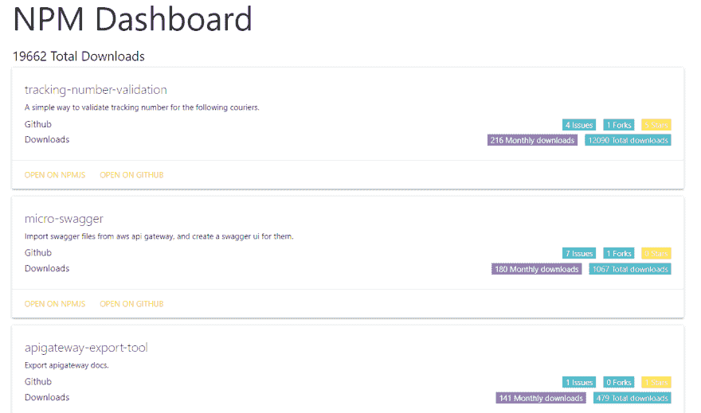

# 开源仪表板(针对 js 开发人员)

> 原文：<https://dev.to/niradler/open-source-dashboard-for-js-developers-1kme>

Javascript 开源维护者经常很难跟踪他们的 npm 包状态。

> 直到最近，我一直使用 npm-stats.com 来获取关于我的包的 npm 信息，最近该网站停止工作，所以作为一名编码人员，开始克隆工作是一个容易的决定。

我创建的包名为 npmdash。(npm 仪表板的简称)

[](https://res.cloudinary.com/practicaldev/image/fetch/s--1L_SsqWy--/c_limit%2Cf_auto%2Cfl_progressive%2Cq_auto%2Cw_880/https://cdn.hashnode.com/res/hashnode/image/upload/v1642373588890/GV9w3XVCL.png)

主页是一个非常简单的输入框，用于输入 npm 用户名。(耐心点，这可能需要一段时间。)

[](https://res.cloudinary.com/practicaldev/image/fetch/s--t3HQTGpy--/c_limit%2Cf_auto%2Cfl_progressive%2Cq_auto%2Cw_880/https://cdn.hashnode.com/res/hashnode/image/upload/v1642373591036/qeCe_nRex.png)

这是软件包视图，它是按月下载排序的软件包列表，包括软件包上的数据，可以帮助您更深入地了解软件包，将来会添加更多相关数据。

可以使用[托管的](http://npm.devresources.site/)版本，docker 版本或者开源的 CLI 选项。

托管版本使用 AWS fargate，如果需要，您可以克隆 repo 并构建您的 docker 版本，并将其部署到您自己的容器解决方案中。

CLI 用法

```
npm i -g npmdash
npmdash // will open the homepage
npmdash -u <username> // will open the packafes view for this username 
```

Enter fullscreen mode Exit fullscreen mode

码头用途〔t0〕

```
docker pull niradler/npmdash
docker container run -p 8989:8989 npmdash 
```

Enter fullscreen mode Exit fullscreen mode

对于未来的改进，我想改善 GitHub 的集成，改善用户界面，并获得报告，也许？还在考虑。

好好享受，让我知道你的想法:)