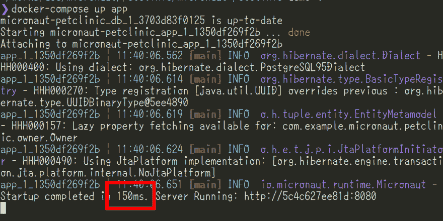

# GraalVM > 19 的 Micronaut 宠物诊所

> 原文：<https://dev.to/bufferings/micronaut-petclinic-with-graalvm-19-2dih>

现在，您可以使用最新的 GraalVM 本机映像运行 Micronaut PetClinic。后面我会解释意思。

## 建造&运行

```
$ git clone https://github.com/bufferings/micronaut-petclinic.git
$ cd micronaut-petclinic

# Build Native Image. Please wait for 10-15 minutes.
$ ./mvnw package && docker build -t micronaut-petclinic .

# Start Database
$ docker-compose up -d db

# Run separately to see the log easily
$ docker-compose up app 
```

Enter fullscreen mode Exit fullscreen mode

## 启动时间

它在几百毫秒后开始。

[](https://res.cloudinary.com/practicaldev/image/fetch/s--RUn5pnxR--/c_limit%2Cf_auto%2Cfl_progressive%2Cq_auto%2Cw_880/https://thepracticaldev.s3.amazonaws.com/i/qn4zxe51bsy9i4niufl8.png)

## 码头工人信息

图像大小为 130MB。

```
❯ docker images micronaut-petclinic
REPOSITORY            TAG                 IMAGE ID            CREATED             SIZE
micronaut-petclinic   latest              40834e227e19        About an hour ago   130MB 
```

Enter fullscreen mode Exit fullscreen mode

并且使用一段时间后内存使用量为 125MB】

```
❯ docker ps -f name=micronaut-petclinic_app* -q | xargs docker stats --no-stream
CONTAINER ID        NAME                                     CPU %               MEM USAGE / LIMIT    MEM %               NET I/O             BLOCK I/O           PIDS
5c4c627ee81d        micronaut-petclinic_app_1_1350df269f2b   0.07%               124.3MiB / 15.4GiB   0.79%               158kB / 121kB       0B / 0B             11 
```

Enter fullscreen mode Exit fullscreen mode

## 背景

上个月我创建了 Micronaut PetClinic，它作为 GraalVM 1.0 RC16 的原生映像，在几百毫秒内以惊人的速度启动。

[](/bufferings) [## Micronaut 宠物诊所

### 米茨 5 月 6 日 191 分钟阅读

#micronautfw #graalvm #java](/bufferings/micronaut-petclinic-58id)

几天后，GraalVM 发布了生产版本 19.0.0。
[https://medium . com/graalvm/announcing-graalvm-19-4590 cf 354 df 8](https://medium.com/graalvm/announcing-graalvm-19-4590cf354df8)

但不幸的是，我的 PetClinic 不能与 GraalVM 19 原生映像一起使用。( ・ω・`)

起因是这个问题:
[https://github.com/oracle/graal/issues/1295](https://github.com/oracle/graal/issues/1295)

而我们需要这个提交:
[https://github . com/Oracle/graal/commit/c 6237d 219 a 91 c 82 b 1954 DFB fa 0898 ed 917 db 09 EB](https://github.com/oracle/graal/commit/c6237d219a91c82b1954dfbfa0898ed917db09eb)

昨天发布的最新版本 19.0.2 中没有包含提交。

## 最新 GraalVM 的 Docker 镜像

然后，当我从它的主分支构建 GraalVM 时，我发现它是有效的。于是我用主分支创造了一个码头工人形象:
[https://hub.docker.com/r/bufferings/build-graalvm-docker](https://hub.docker.com/r/bufferings/build-graalvm-docker)

我想使用它一段时间，直到提交包含在 GraalVM 正式发行版中。

有了 Micronaut，创建原生图像的应用程序是如此容易，但我想在另一个时间谈论它(๑•̀ㅂ•́)و✧