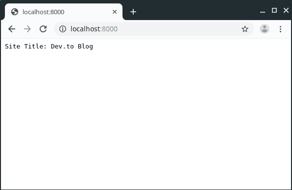

# 用 Bocadillo - Settings 创建博客

> 原文：<https://dev.to/itachiuchiha/building-blog-with-bocadillo-settings-d70>

**该系列的 GitHub 库**:【https://github.com/aligoren/bocadillo_blog T2】

* * *

使用 Bocadillo，您可能需要配置一些东西。例如，您希望为 API 调用设置允许的主机。`.env`文件是保存凭据的好地方。

这是一个`.env`文件；

```
DEBUG=True
DATABASE_URL=postgresql://localhost/myproject
SECRET_KEY=43n080musdfjt54t-09sdgr
ALLOWED_HOSTS=127.0.0.1, localhost 
```

<svg width="20px" height="20px" viewBox="0 0 24 24" class="highlight-action crayons-icon highlight-action--fullscreen-on"><title>Enter fullscreen mode</title></svg> <svg width="20px" height="20px" viewBox="0 0 24 24" class="highlight-action crayons-icon highlight-action--fullscreen-off"><title>Exit fullscreen mode</title></svg>

不要将`.env`文件提交给你的 git 项目。

## settings.py 文件

其实名字并不重要。但是我们选择这个名字是为了容易理解。您将像 MailChimp 密钥一样存储您的常量。

例如，我们为这个博客设置了一个默认标题，并获得了它。

我们将在根文件夹下创建 **settings.py** 。

```
from starlette.config import Config

config = Config(".env")

REDIRECT_TRAILING_SLASH = True 
```

<svg width="20px" height="20px" viewBox="0 0 24 24" class="highlight-action crayons-icon highlight-action--fullscreen-on"><title>Enter fullscreen mode</title></svg> <svg width="20px" height="20px" viewBox="0 0 24 24" class="highlight-action crayons-icon highlight-action--fullscreen-off"><title>Exit fullscreen mode</title></svg>

我们还将创建一个**。env** 文件。

```
Title="Dev.to Blog" 
```

<svg width="20px" height="20px" viewBox="0 0 24 24" class="highlight-action crayons-icon highlight-action--fullscreen-on"><title>Enter fullscreen mode</title></svg> <svg width="20px" height="20px" viewBox="0 0 24 24" class="highlight-action crayons-icon highlight-action--fullscreen-off"><title>Exit fullscreen mode</title></svg>

例如，我们想从 app.py 文件中访问设置。我们需要导入它。

```
from bocadillo import App

import settings 
```

<svg width="20px" height="20px" viewBox="0 0 24 24" class="highlight-action crayons-icon highlight-action--fullscreen-on"><title>Enter fullscreen mode</title></svg> <svg width="20px" height="20px" viewBox="0 0 24 24" class="highlight-action crayons-icon highlight-action--fullscreen-off"><title>Exit fullscreen mode</title></svg>

现在我们的应用程序会像那样改变；

**asgi.py** 文件

```
from bocadillo import configure
from blog.app import app

import settings

configure(app, settings) 
```

<svg width="20px" height="20px" viewBox="0 0 24 24" class="highlight-action crayons-icon highlight-action--fullscreen-on"><title>Enter fullscreen mode</title></svg> <svg width="20px" height="20px" viewBox="0 0 24 24" class="highlight-action crayons-icon highlight-action--fullscreen-off"><title>Exit fullscreen mode</title></svg>

**blog/app.py** 文件

```
from bocadillo import App

import settings

app = App()

@app.route("/")
async def index(req, res):
    title = settings.config.get("Title")
    res.text = f"Site Title: {title}" 
```

<svg width="20px" height="20px" viewBox="0 0 24 24" class="highlight-action crayons-icon highlight-action--fullscreen-on"><title>Enter fullscreen mode</title></svg> <svg width="20px" height="20px" viewBox="0 0 24 24" class="highlight-action crayons-icon highlight-action--fullscreen-off"><title>Exit fullscreen mode</title></svg>

我们现在可以运行我们的项目了。

[](https://res.cloudinary.com/practicaldev/image/fetch/s--hbjogXP8--/c_limit%2Cf_auto%2Cfl_progressive%2Cq_auto%2Cw_880/https://thepracticaldev.s3.amazonaws.com/i/6fln4846sse0zuwqe6y3.png)

这还不重要。但是我们需要使用设置。因为我们想编写可重用的组件。我们的理念应该是“一次编写，随处使用”。

您可能想要分离项目的层。比如数据、实体、表示等。

您可以跳过此说明。