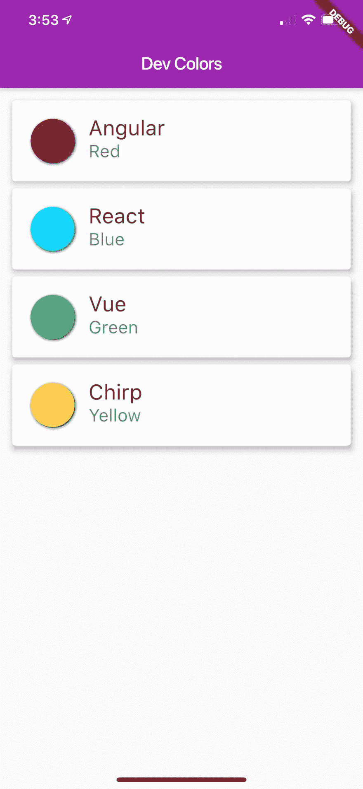
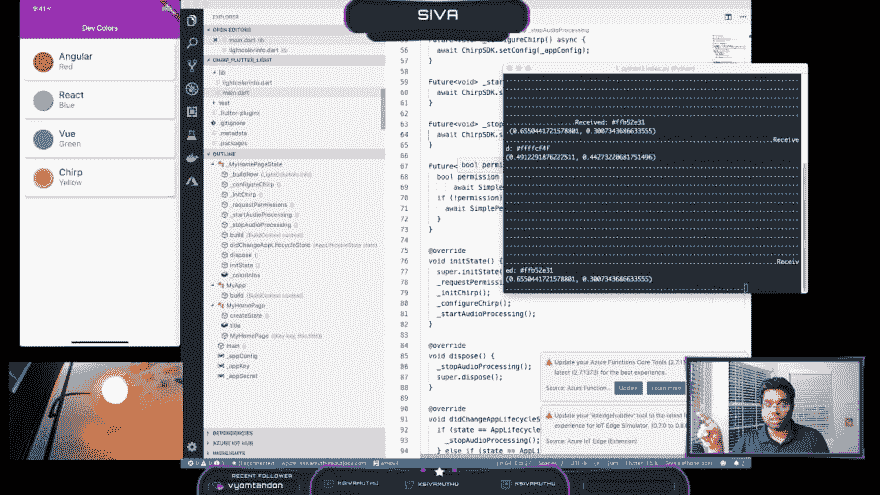
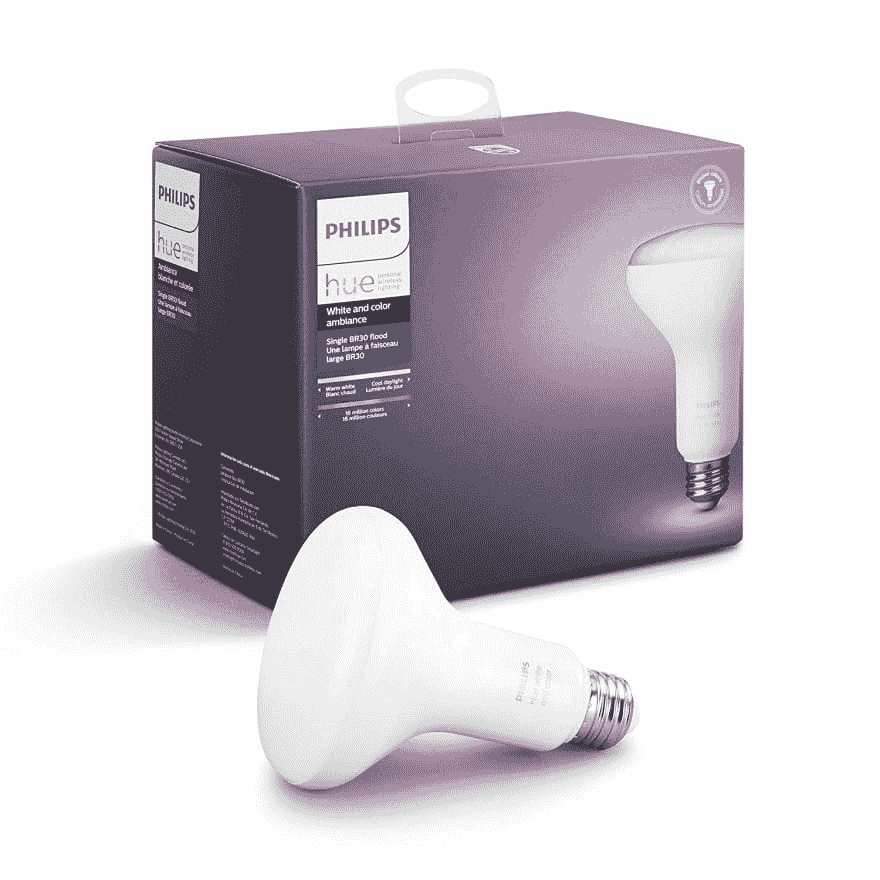

# 探索 Chirp SDK 在音频数据传输中的应用

> 原文：<https://dev.to/ksivamuthu/exploring-chirp-sdk-in-flutter-data-over-audio-30oe>

封面图片由:[unsplash-logoKai Pilger](https://unsplash.com/@kaip?utm_medium=referral&utm_campaign=photographer-credit&utm_content=creditBadge "Download free do whatever you want high-resolution photos from Kai Pilger")

## 概述

我最近开始探索通过音频传输数据的 ChirpSDK - SDK，当时我正在探索一种非互联网或成本更低的物联网解决方案硬件选项来传输数据。

Chirp 使您的应用程序能够使用声音发送和接收信息。“chirp”将一组字节编码为音频信号，可以由任何带扬声器的设备传输，也可以由任何带麦克风和 Chirp SDK 的设备接收。它被设计为在几米的距离内，以及在嘈杂的日常环境中保持稳定。

由于传输完全通过音频信号进行，因此不需要互联网连接或事先配对，任何听力范围内的设备都可以接收数据。

为了保持简单和有趣，这个演示项目是在我的 [twitch streams](https://twitch/tv/ksivamuthu) 中用这个解决方案开发的。

## 这个演示 app 是做什么的？

该项目的想法是，我们将通过音频将数据从手机发送到另一个设备。

我构建了这个 Flutter 应用程序，它有一个 dev 品牌主色列表。例如

*   棱角分明的红色
*   反应蓝色
*   绿色视野
*   唧唧黄色

当你点击其中一个列表项时，应用程序会通过音频发送颜色的十六进制值。然后，在我的机器上运行的 python 应用程序通过麦克风接收音频，解码十六进制值。然后它调用 Philips HUE Bridge API 来设置灯光的颜色。

如果你点击“有角度的红色”列表项，你可以听到音频，python 程序接收并设置灯泡颜色为红色。

*   项目库:[啁啾颤振开发颜色](https://github.com/ksivamuthu/chirp-flutter-dev-colors)

> Siva[@ ksivamuthu](https://dev.to/ksivamuthu)来看看这个包含 [@chirp](https://twitter.com/chirp) 和 [@FlutterDev](https://twitter.com/FlutterDev) 的资源库——通过音频发送数据来设置灯泡颜色的演示应用程序。加入我的 twitch stream，探索我们可以在其上构建的物联网用例以及这个 flutter 项目的 [@codemagicio](https://twitter.com/codemagicio) 设置。[github.com/ksivamuthu/chi…](https://t.co/14XQNGo9YF)2019 年 6 月 14 日 20 点 48 分[](https://twitter.com/intent/tweet?in_reply_to=1139635690143133696)[](https://twitter.com/intent/retweet?tweet_id=1139635690143133696)[](https://twitter.com/intent/like?tweet_id=1139635690143133696)

*   应用程序截图:

[ ](https://res.cloudinary.com/practicaldev/image/fetch/s--OS4QzutG--/c_limit%2Cf_auto%2Cfl_progressive%2Cq_auto%2Cw_880/https://raw.githubusercontent.com/ksivamuthu/chirp-flutter-dev-colors/master/docs/screenshot.jpg)  

*   我指着光的颜色是如何变化的:

[ ](https://res.cloudinary.com/practicaldev/image/fetch/s--dyV2-L2H--/c_limit%2Cf_auto%2Cfl_progressive%2Cq_auto%2Cw_880/https://img.youtube.com/vi/XvyMYcOwpY8/maxresdefault.jpg)  

## 先决条件

*   [颤动](https://flutter.dev/docs)
*   [啁啾 SDK](https://developers.chirp.io)
*   [VSCode](https://code.visualstudio.com) & [VSCode 颤振扩展](https://marketplace.visualstudio.com/items?itemName=Dart-Code.flutter)
*   [Python](https://www.python.org/downloads/)
*   [飞利浦色相灯泡&色相智能桥](https://www2.meethue.com/en-us) **
*   移动设备——iOS 或 Android

> **您可以使用其他灯泡或型号。您可能需要更新代码来调用您正在使用的灯光的 API。

## 入门

### 配置您的啁啾应用程序。

注册/登录到 [Chirp SDK 开发者门户](https://developers.chirp.io)。要配置您的 chirp 应用程序，请导航至[应用程序](https://developers.chirp.io/applications)页面并选择一个协议。记下密钥、密码和配置字符串。我们需要这个来配置应用程序中的 chirp SDK。

### 配置你的无线灯泡

我这里用过飞利浦 Hue 灯泡和飞利浦智能桥。

[ ](https://res.cloudinary.com/practicaldev/image/fetch/s--I9zuWm-H--/c_limit%2Cf_auto%2Cfl_progressive%2Cq_auto%2Cw_880/https://thepracticaldev.s3.amazonaws.com/i/dk5ugts6c3e8hjl56os3.jpg) [ ](https://res.cloudinary.com/practicaldev/image/fetch/s--R6RhupSV--/c_limit%2Cf_auto%2Cfl_progressive%2Cq_auto%2Cw_880/https://thepracticaldev.s3.amazonaws.com/i/txr43txo6jo4wwxcsukl.jpg)

请按照 [meethue 开发者页面](https://developers.meethue.com/develop/get-started-2/)中的说明来设置你的网桥，并在你的本地 WiFi 网络中连接你的灯泡。

### 颤振项目

#### 新建一个颤振 app

*   创建一个颤振项目。

```
flutter create chirp_fluter_light 
```

Enter fullscreen mode Exit fullscreen mode

*   浏览 chirp_flutter_light 目录并运行“flutter run”或使用 VSCode 运行 flutter 应用程序。

```
cd chirp_flutter_light
flutter run ios 
```

Enter fullscreen mode Exit fullscreen mode

#### 在 pubspec.yaml 中添加 ChirpSDK

*   要在你自己的 Flutter 应用中开始使用 Chirp，只需将插件添加到你的 pubspec.yaml 中。

```
dependencies:
  flutter:
    sdk: flutter
  chirpsdk: ^0.1.0 
```

Enter fullscreen mode Exit fullscreen mode

#### 配置 ChirpSDK

*   要配置 SDK，您需要从应用程序页面复制 app_key、app_secret 和 app_config，并在 main.dart 文件中进行设置

```
String _appKey = '<Chirp_App_Key>';
String _appSecret = '<Chirp_App_Secret>';
String _appConfig = '<Chirp_App_Config>'; 
```

Enter fullscreen mode Exit fullscreen mode

#### 实现 ChirpSDK

*   创建一些异步函数来调用 SDK。Flutter 的 ChirpSDK 使用平台通道将消息传递给原生 iOS/Android SDK。

```
 Future<void> _initChirp() async {
    await ChirpSDK.init(_appKey, _appSecret);
  }

  Future<void> _configureChirp() async {
    await ChirpSDK.setConfig(_appConfig);
  }

  Future<void> _startAudioProcessing() async {
    await ChirpSDK.start();
  }

  Future<void> _stopAudioProcessing() async {
    await ChirpSDK.stop();
  } 
```

Enter fullscreen mode Exit fullscreen mode

*   要通过音频发送数据，请在 ListViewItem Tap 中实现以下逻辑。

```
onTap: () async {
        String identifier = '#${info.lightColor.value.toRadixString(16)}';
        var payload = new Uint8List.fromList(identifier.codeUnits);
        await ChirpSDK.send(payload);
  } 
```

Enter fullscreen mode Exit fullscreen mode

#### 权限:

ChirpSDK 需要获得许可才能使用设备的麦克风接收数据。使用`simple_permissions`插件列出并请求权限

```
dependencies:
  flutter:
    sdk: flutter
  chirpsdk: ^0.1.0
  simple_permissions: ^0.1.9 
```

Enter fullscreen mode Exit fullscreen mode

然后创建一个函数来请求州内的麦克风权限。这应该在初始化 SDK 之前调用。

```
Future<void> _requestPermissions() async {
  bool permission = await SimplePermissions.checkPermission(Permission.RecordAudio);
  if (!permission) {
    await SimplePermissions.requestPermission(Permission.RecordAudio);
  }
} 
```

Enter fullscreen mode Exit fullscreen mode

请随意参考 Github 资源库，了解如何在该应用程序中构建 UI。

### Python 程序-听音频

*   要配置 python SDK，您需要从应用程序页面复制 app_key、app_secret 和 app_config，并粘贴到您的~/中。chirprc 文件。

```
[default]
app_key = xXxXXxxxXXXxxXXXxXxXXxXxx
app_secret = xxXxXXXxXxxXXXxXXXXxXxXxxxXxxxXXxXxXxxxXXxXxXXxXxX
app_config = XxXXXXxXxXxxxXxxxXXxXxXxxxXXxXxXXxXxXxxXxXXXxXxxXXXxXXXXxXxXxxxXxxxXXxXxXxxxXXxXxXXxXxX 
```

Enter fullscreen mode Exit fullscreen mode

*   安装 Chirp Python SDK 及其依赖项。请参考本[文档](https://developers.chirp.io/docs/getting-started/python)

```
brew install portaudio libsndfile //macOS
pip3 install sounddevice.whl //Windows

pip3 install chirpsdk 
```

Enter fullscreen mode Exit fullscreen mode

*   连接 SDK 开始音频处理。当数据被接收时，数据在回调中被接收。你可以调用色相桥 API 在这里设置颜色。我已经使用了 [qhue](https://github.com/quentinsf/qhue) 来调用 Philips Hue Bridge API。

```
class Callbacks(CallbackSet):
    def on_received(self, payload, channel):
        if payload is not None:
            hex = payload.decode('utf-8')
            print('Received: ' + hex)
            // Call the Hue Bridge API here to set the color.
        else:
            print('Decode failed')

chirp = ChirpConnect()
chirp.start(send=True, receive=True)
chirp.set_callbacks(Callbacks()) 
```

Enter fullscreen mode Exit fullscreen mode

*   运行 python 程序来听音频

```
python3 index.py 
```

Enter fullscreen mode Exit fullscreen mode

## 演示

你可以在下面的视频中看到演示。

[https://www.youtube.com/embed/XvyMYcOwpY8](https://www.youtube.com/embed/XvyMYcOwpY8)

## 给你的行动事项

*   学习颤振和探索啁啾 SDK

*   善待他人，传播你的魅力

*   并在下面评论或创建一期[github](https://github.com/ksivamuthu/chirp-flutter-dev-colors/issues)来添加您最喜欢的开发品牌及其主要颜色(例如 Android、Go 等)。

当我在 [Twitch](https://twitch.tv/ksivamuthu) 上直播时，请关注并加入我，一起娱乐和学习。通常，我在我的直播流中直播代码移动和物联网解决方案。